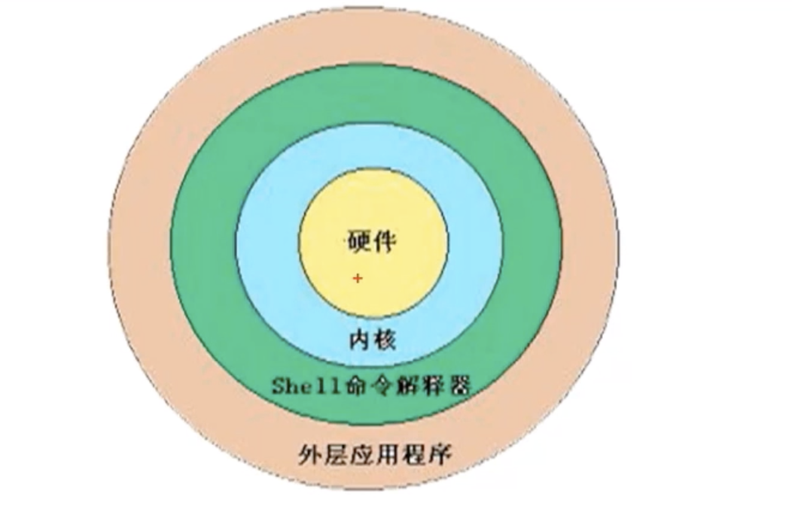

# 01-shell概述


## shell是什么


shell是一个命令解释器，它为用户提供了一个向linux内核发送请求以便运行程序的界面系统级别程序，用户可以用shell来启动、挂起、停止甚至是编写一些程序。




shell还是一个功能相当强大的编程语言，易编写，易调试，灵活性较强。shell是解释执行的脚本语言，在shell中可以直接调用linux系统命令。


## shell的分类


- Bourne Shell：从1979起Unix就开始使用，Bourne Shell的主文件名为sh。
- C Shell： C Shell主要在BSD版的Unix系统中使用，其语法和C语言相类似而得名。
- Shell的两种主要语法类型有Bourne家族主要包括sh、ksh、Bash、psh、zsh；C家族主要包括：csh、tcsh。
- Bash：Bash与sh兼容，现在使用的linux就是用Bash作为用户的基本Shell。


## linux支持的shell


在linux系统中，可以查看文件/etc/shells文件获取支持的shell种类，如下

```
[root@iZ2vcdckpocdm8z7a36gl1Z ~]# cat /etc/shells 
/bin/sh
/bin/bash
/usr/bin/sh
/usr/bin/bash
[root@iZ2vcdckpocdm8z7a36gl1Z ~]# 
```


## shell脚本执行方式


### echo输出命令


```
语法： echo [选项] [输出内容]
选项：
      -e： 支持反斜杠控制的字符转换
```

| 控制字符 |                        作用                         |
| ------- | -------------------------------------------------- |
| \a      | 输出告警音                                           |
| \b      | 退格键，也就是向左删除键                               |
| \c      | 取消输出行末的换行符，和“-n”选项一致                    |
| \e      | ESCAPE键                                           |
| \f      | 换页符                                              |
| \n      | 换行符                                              |
| \r      | 回车键                                              |
| \t      | 制表符，也就是Tab键                                   |
| \v      | 垂直制表符                                           |
| \0nnn   | 按照八进制ASCII输出字符。其中0为数字零，nnn是三位八进制数 |
| \xhh    | 按照十六进制ASCII输出字符。其中hh是两位十六进制数        |


案例一：

```
[root@iZ2vcdckpocdm8z7a36gl1Z ~]# echo -e 'a\nbdc\tjkljkl'
a
bdc     jkljkl
```

案例二：

```
[root@iZ2vcdckpocdm8z7a36gl1Z ~]# echo -e "\e[1;31m abcd\e[0m"
# \e[1表示开启颜色输出，\e[0m表示结束颜色输出，固定的格式
```


输出颜色：
```
30m=黑色，31m=红色，32m=绿色，33m=黄色
34m=蓝色，35m=洋红，36m=青色，37m=白色
```


### 编写第一个脚本

```
[root@iZ2vcdckpocdm8z7a36gl1Z sh]# vi hello.sh
#!/bin/bash
#The first program
#Author:longyu
echo -e "hello world"
```

第一行是标识这个文件是shell脚本，2、3行是注释，4行是脚本内容


然后给脚本添加执行权限：

```
chmod 755 hello.sh 
```

执行脚本：可以使用绝对路径和相对路径方式都可以：如下使用相对路径

```
[root@iZ2vcdckpocdm8z7a36gl1Z sh]# ./hello.sh 
hello world
```

### 执行脚本

- 赋予执行权限，直接运行

```
[root@iZ2vcdckpocdm8z7a36gl1Z sh]# chmod 755 hello.sh 
[root@iZ2vcdckpocdm8z7a36gl1Z sh]# ./hello.sh 
hello world
```

- 通过Bash调用执行脚本

```
[root@iZ2vcdckpocdm8z7a36gl1Z sh]# bash hello.sh 
hello world
```

