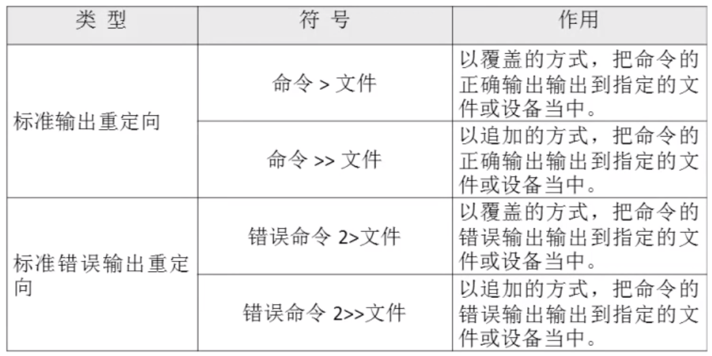
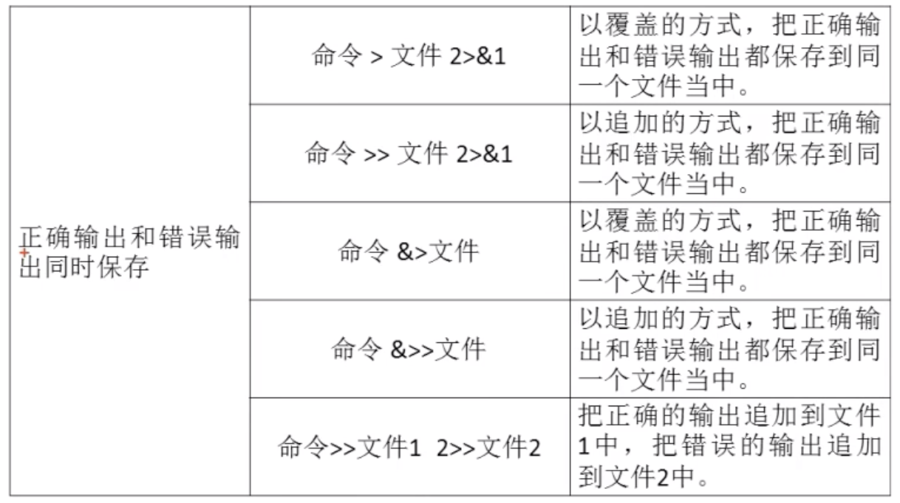
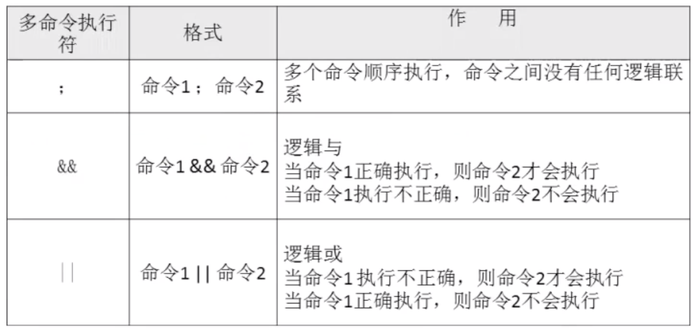
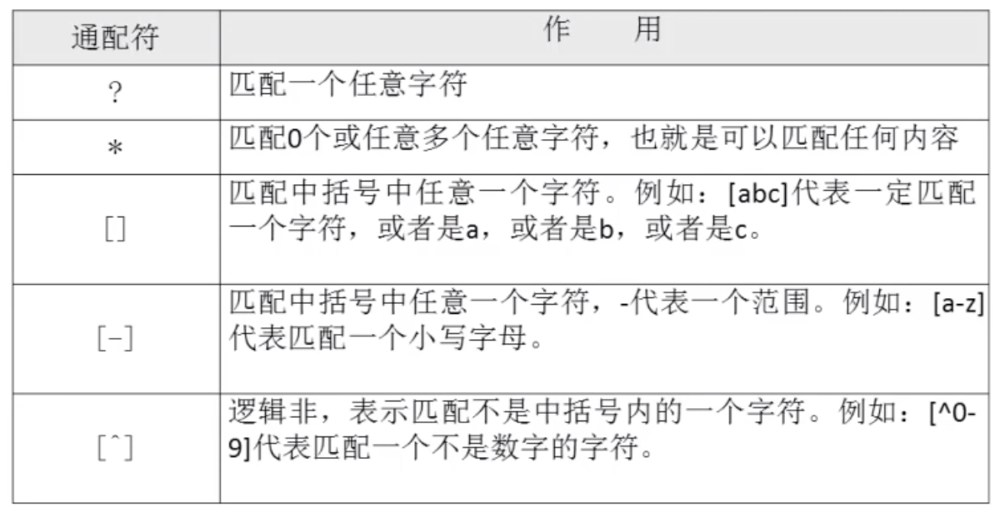
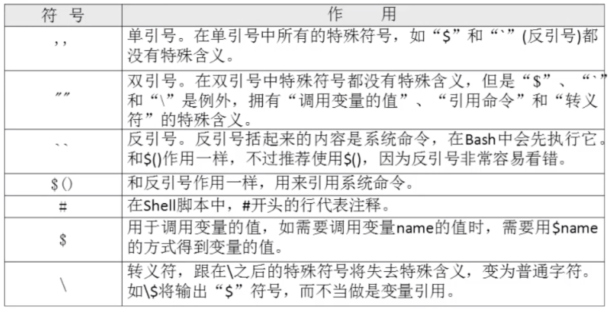

# 02-bash的基本功能


## 历史命令

```
语法： history [选项] [历史命令保存文件]
选项：
      -c 清空历史命令
      -w 把缓存中的历史命令写入烈士命令保存文件：～/.bash_history
```


历史默认命令默认会保存1000条，可以在环境变量配置文件/etc/profile中进行修改


**历史命令的调用**

- 使用上、下箭头调用以前的历史命令
- 使用“!n”重复执行第n条历史命令
- 使用“!!”重复执行上一条命令
- 使用“!字串”重复执行最后一条以该字串开头的命令


## 命令与文件补全


- 在bash中，命令与文件补全是非常方便与常用的功能，我们只要在输入命令或文件时，按“tab”键就会自动进行补全。

按以下tab没反映，代表有多个内容，再按一次会显示具体的内容。


## 命令别名


```
语法： alias 别名=‘原命令’

使用 alias查询别名
```

案例：
```
[root@iZ2vcdckpocdm8z7a36gl1Z ~]# alias 
alias cp='cp -i'
alias egrep='egrep --color=auto'
alias fgrep='fgrep --color=auto'
alias grep='grep --color=auto'
alias l.='ls -d .* --color=auto'
alias ll='ls -l --color=auto'
alias ls='ls --color=auto'
alias mv='mv -i'
alias rm='rm -i'
alias which='alias | /usr/bin/which --tty-only --read-alias --show-dot --show-tilde'
```

**命令执行时顺序**

1、第一顺位执行用绝对路径或相对路径执行的命令
2、第二顺位执行别名
3、第三顺位执行Bash的内部命令
4、第四顺位执行按照$PATH环境变量定义第目录查找顺序找到第第一个命令


让别名永久生效： 
```
vi /root/.bashrc
```

**删除别名**

```
unalias 别名
```


## Bash常用快捷键

| 快捷键  |                                             作用                                              |
| ------ | --------------------------------------------------------------------------------------------- |
| crtl+A | 把光标移动到命令行开头，如果我们输入的命令过长，想要把光标移动到命令行开头时使用                         |
| crtl+E | 把光标移动到命令行结尾                                                                           |
| crtl+C | 强制终止当前到命令                                                                              |
| crtl+L | 清屏，相当于clear命令                                                                           |
| crtl+U | 删除或剪切光标之前的命令。我输入了一行很长的命令，不用使用退格键一个一个字符的删除，使用这个快捷键会更加方便 |
| crtl+K | 删除或剪切光标之后的内容                                                                         |
| crtl+Y | 粘贴crtl+U或crtl+K剪切的内容                                                                    |
| crtl+R | 在历史命令中搜索，按下crtl+R之后，就会出现搜索界面，只要输入搜索内容，就会从历史命令中搜索               |
| crtl+D | 退出当前终端                                                                                   |
| crtl+Z | 暂停，并放入后台，这个快捷键牵扯工作管理的内容，我们在系统管理章节详细学习                              |
| crtl+S | 暂停屏幕输出                                                                                   |
| crtl+Q | 恢复屏幕输出                                                                                   |


## 输入输出重定向


标准输入输出：

|  设备  |  设备文件名  | 文件描述符 |  类型   |
| ----- | ----------- | --------- | ------- |
| 键盘   | /dev/stdin  | 0         | 标准输入 |
| 显示器 | /dev/sdtout | 1         | 标准输出 |
| 显示器 | /dev/sdterr | 2         | 标准错误输出        |


### 输出重定向




可以发现上面需要人为判断命令是否正确错误，使用不同的命令进行重定向到文件。那么其实有更合理的方式，如下表格：




案例： 将ls输出重定向到abc文件中

```
[root@iZ2vcdckpocdm8z7a36gl1Z tmp]# ls &>>abc
```

### 输入重定向

```
语法： wc [选项] [文件名]
选项：
      -c  统计字节数
      -w  统计单词数
      -l  统计行数
```

案例：

```
[root@iZ2vcdckpocdm8z7a36gl1Z tmp]# wc
djakljfklj
daljdljb
cbadj
      3       3      26
```

按crtl + d结束输入


输入重定向用法：

- 命令<文件


## 多命令顺序执行




## 管道符

```
命令格式：命令1 | 命令2
命令1多正确输出作为命令2的操作对象
```


grep使用

```
语法： grep [选项] “搜索内容” 文件名
选项：
      -i 忽略大小写
      -n 输出行号
      -v 反向查找
      --clolor=auto 搜索出的关键字用颜色显示
```


## 通配符与其他特殊符号


### 通配符




### bash中其他特殊符号




案例一：单引号和双引号

```
[root@iZ2vcdckpocdm8z7a36gl1Z tmp]# name=lol
[root@iZ2vcdckpocdm8z7a36gl1Z tmp]# echo $name
lol
[root@iZ2vcdckpocdm8z7a36gl1Z tmp]# echo '$name'
$name
[root@iZ2vcdckpocdm8z7a36gl1Z tmp]# echo "$name"
lol
```

案例二：反引号用来引用命令，可以赋值给变量，那么变量就是一个动态的值，如下：

```
[root@iZ2vcdckpocdm8z7a36gl1Z tmp]# abc=`date`
[root@iZ2vcdckpocdm8z7a36gl1Z tmp]# echo $abc
Mon Dec 21 21:53:19 CST 2020
[root@iZ2vcdckpocdm8z7a36gl1Z tmp]# echo "$abc"
Mon Dec 21 21:53:19 CST 2020
```

反引号等加于$(命令)，如下：
```
[root@iZ2vcdckpocdm8z7a36gl1Z tmp]# abc=$(date)
[root@iZ2vcdckpocdm8z7a36gl1Z tmp]# echo $abc
Mon Dec 21 21:56:31 CST 2020
```
