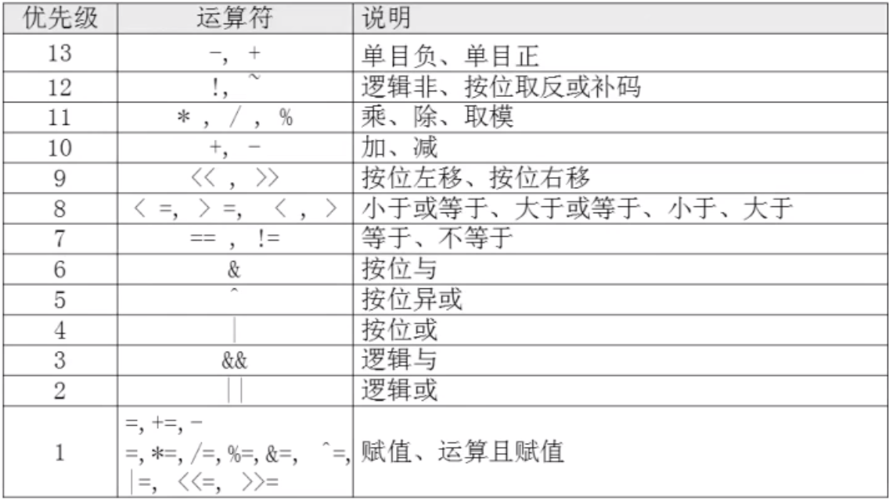
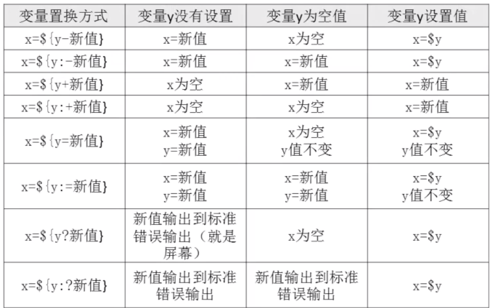

# 04-bash的运算符


## 数值运算


1、declare申明变量类型

```
语法： declare [+/-] [选项] 变量名
选项：
      -：    给变量设定类型属性
      +：    取消变量的类型属性
     -i：    将变量申明为整数型（integer）
     -x：    将变量申明为环境变量
     -p：    显示指定变量的被申明的类型
```

案例：
```
[root@iZ2vcdckpocdm8z7a36gl1Z ~]# aa=11
[root@iZ2vcdckpocdm8z7a36gl1Z ~]# bb=22
[root@iZ2vcdckpocdm8z7a36gl1Z ~]# declare -i cc=$aa+$bb
[root@iZ2vcdckpocdm8z7a36gl1Z ~]# echo $cc
33
```


2、expr或let数值运算工具

```
aa=11
bb=22
dd=$(expr $aa + $bb) 注意：+号左右两侧必须有空格
```

运行结果：


3、“$((运算式))”或“$[运算式]”

案例：
```
[root@iZ2vcdckpocdm8z7a36gl1Z ~]# ee=$(($aa+$bb))
[root@iZ2vcdckpocdm8z7a36gl1Z ~]# echo $ee
33
[root@iZ2vcdckpocdm8z7a36gl1Z ~]# ff=$[$aa+$bb]
[root@iZ2vcdckpocdm8z7a36gl1Z ~]# echo $ff
33
```


## 运算符




案例：

```
[root@iZ2vcdckpocdm8z7a36gl1Z ~]# cc=$((1&&0))
[root@iZ2vcdckpocdm8z7a36gl1Z ~]# echo $cc
0
```

逻辑与运算只有两边的值都是1，与的结果才是1，否则与的结果是0.而逻辑或只有有一边是1，结果将是1.

案例：
```
[root@iZ2vcdckpocdm8z7a36gl1Z ~]# ff=$((0||1))
[root@iZ2vcdckpocdm8z7a36gl1Z ~]# echo $ff
1
```


## 变量测试




