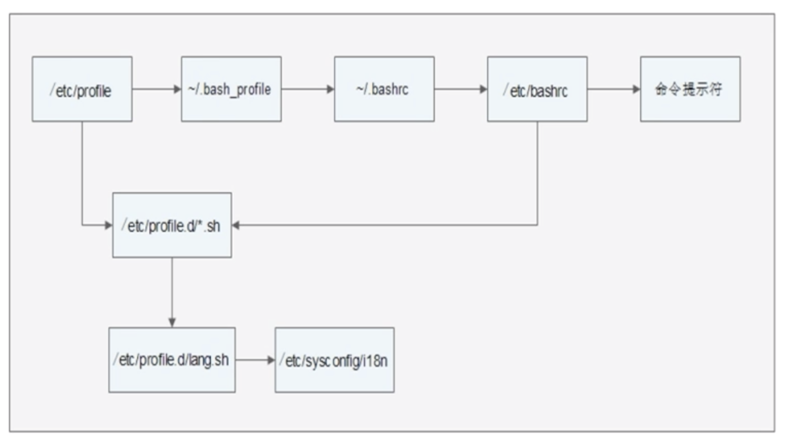

# 05-环境变量配置文件


## 环境变量配置文件简介

只有将环境变量写入配置文件，系统才会一直生效。shell中设置的环境变量，一旦退出就失效了。


### source命令

```
source 配置文件   #刷新配置文件，立即生效
或 . 配置文件  
```


环境变量配置文件中主要是定义对系统的操作环境生效的系统的默认环境变量，比如PATH、HISTSIZE、PSI、HOSTNAME等默认环境变量


系统环境变量配置文件：

-     /etc/profile
-     /etc/profile.d/*.sh  # 是一组文件
-     ~/.bash_profile
-     ~/.bashrc
-     /etc/bashrc


以etc开头的配置文件，对所有登录linux系统的用户都生效。而～开头的配置文件代表当前用户家目录，只会对当前用户生效。以点开头的文件是隐藏文件！


### 环境变量配置文件作用




**/etc/profile的作用**

- USER变量
- LOGNAME变量：
- MAIL变量：
- PATH变量：
- HOSTNAME变量
- HISTSIZE变量
- umask
- 调用/etc/profile.d/*.sh文件


## 其他配置文件和登录信息


1、注销时生效的环境变量配置文件

- ～/.bash_logout


2、其它配置文件

- ～/.bash_history


### shell登录信息

- 本地终端欢迎信息：/etc/issue


- 远程终端欢迎信息：/etc/issue.net
  - 转义符在/etc/issue.net文件中不能使用
  - 是否显示此欢迎信息，由ssh的配置文件/etc/ssh/sshd_config决定，加入“Banner /etc/issue.net”行才能显示（需要重启SSH服务）


- 登录后欢迎信息：/etc/motd

不管是本地登录，还是远程登录，都可以显示此欢迎信息


如下：

```
[root@iZ2vcdckpocdm8z7a36gl1Z ~]# cat /etc/motd 

Welcome to Alibaba Cloud Elastic Compute Service !

```
