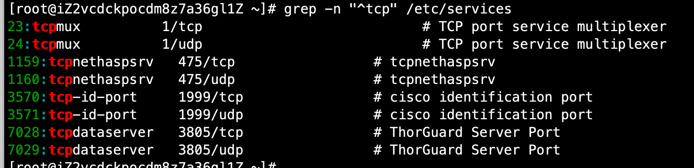
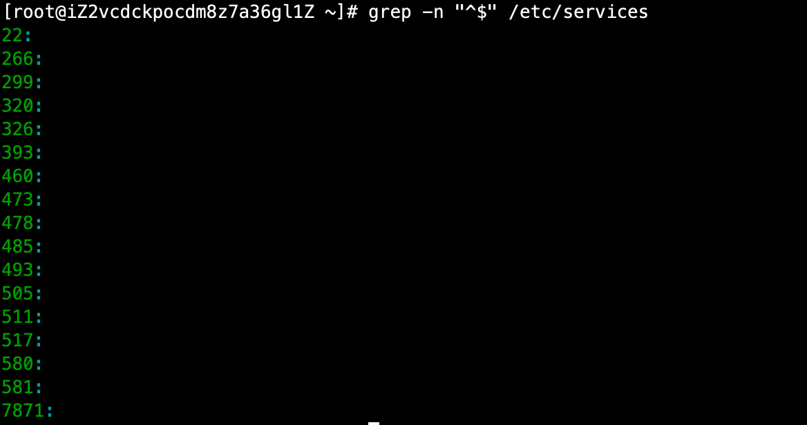

# 01-正则表达式


## 正则表达式与通配符


- 正则表达式用来在文件中匹配符号条件的字符串，正则是包含匹配。grep、awk、sed等命令可以支持正则表达式。

- 通配符用来匹配符合条件的文件名，通配符是完全匹配。ls、find、cp这些命令不支持正则表达式，所以只能使用shell自己的通配符来进行匹配了。


**基础正则表达式**

| 元字符  |                   作用                   |
| ------ | --------------------------------------- |
| *      | 前一个字符匹配0次或任意多次                 |
| .      | 匹配除了换行符外任意一个字符                |
| ^      | 匹配行首                                  |
| $      | 匹配行尾                                  |
| [ ]    | 匹配中括号中指定的任意一个字符，只匹配一个字符 |
| [ ^]   | 匹配除中括号的字符以外的任意一个字符          |
| \      | 转义符                                   |
| \{n\}  | 表示前面的字符恰好出现n次                   |
| \{n,\} | 表示其前面的字符出现不小于n次               |
| \{n,m} | 表示其前面的字符至少出现n次，最多出现m次      |


案例 一： 使用*号匹配

```
# 匹配所有的行,
grep "a*" text.txt  *号可以匹配前一个字符出现0个或任意多个

# 匹配至少包含有一个a的行
grep "aa*"  text.txt

# 匹配最少包含有2个连续a的字符串行
grep "aaa*"  text.txt
```


案例二： 使用.匹配

```
# 's..d'会匹配在s和d这两个字母之间一定有两个字符的单词
grep "s..d" text.txt

# 匹配在s和d字母之间有任意字符
grep "s.*d"  text.txt

# 匹配所有内容
grep ".*" text.txt
```


案例三：匹配行首和行尾

```
[root@iZ2vcdckpocdm8z7a36gl1Z ~]# grep "^tcp" /etc/services 
tcpmux          1/tcp                           # TCP port service multiplexer
tcpmux          1/udp                           # TCP port service multiplexer
tcpnethaspsrv   475/tcp                 # tcpnethaspsrv
tcpnethaspsrv   475/udp                 # tcpnethaspsrv
tcp-id-port     1999/tcp                # cisco identification port
tcp-id-port     1999/udp                # cisco identification port
tcpdataserver   3805/tcp                # ThorGuard Server Port
tcpdataserver   3805/udp                # ThorGuard Server Port

[root@iZ2vcdckpocdm8z7a36gl1Z ~]# grep "port$" /etc/services 
```

使用 -n参数显示行号




匹配空行：

```
[root@iZ2vcdckpocdm8z7a36gl1Z ~]# grep -n "^$" /etc/services 
```



使用-v 参数取反：

```
# 匹配不为空的行
grep -n -v "^$" /etc/services 
```


案例：匹配[]号中指定的任意一个字符

```
grep -n "p[sr]s" /etc/services 
```

匹配0-9的任意数字
```
 grep "[0-9]" /etc/services 
```

匹配非大小写字母开头的行
```
 grep "^[^a-zA-Z]" /etc/services 
```

