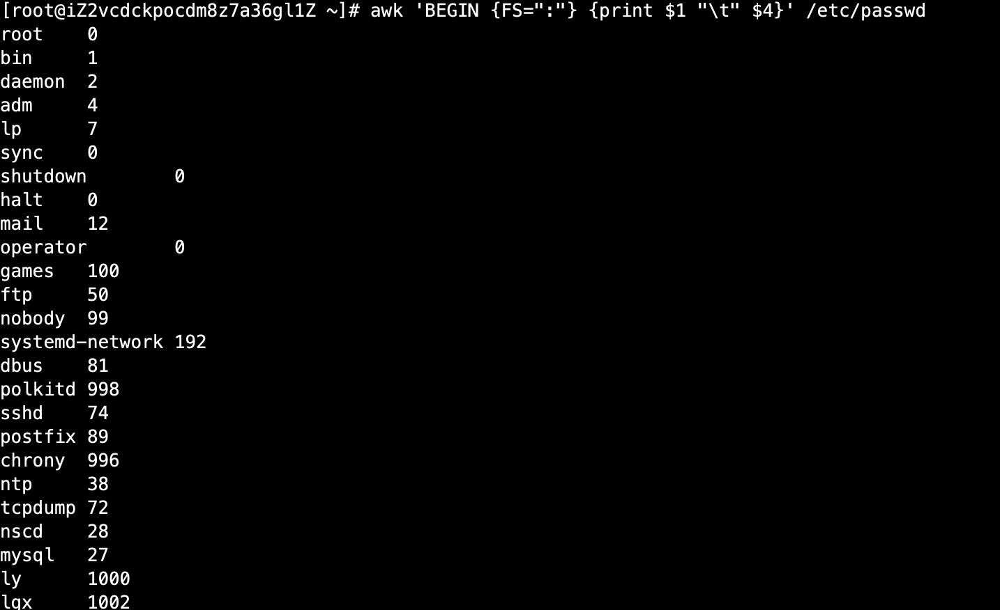
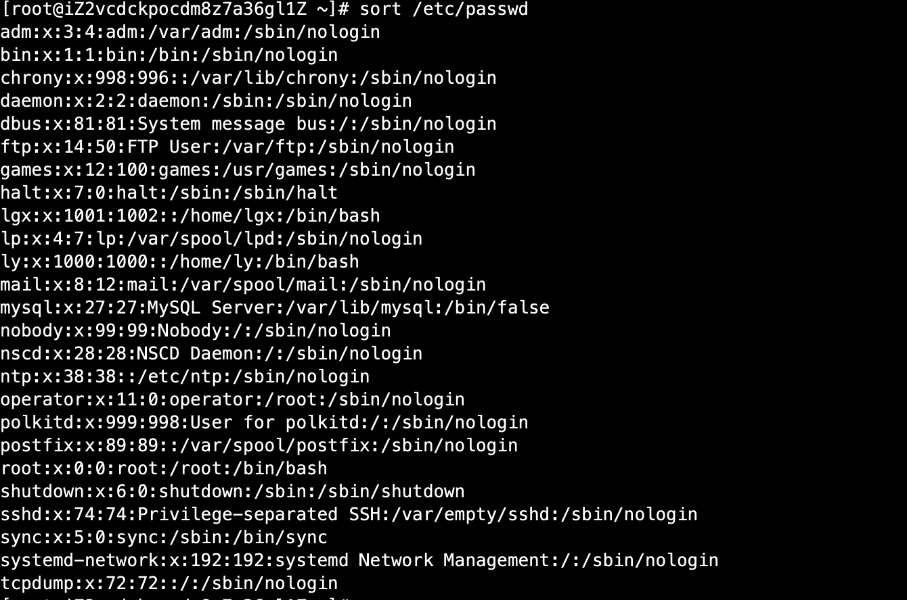
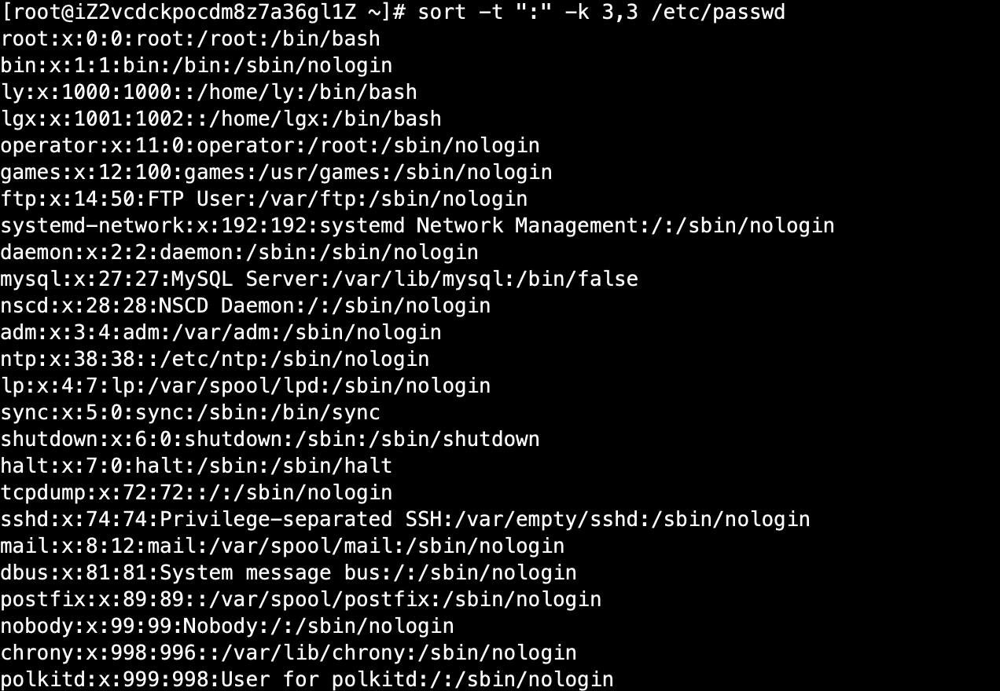

# 02-字符截取命令


## cut字段提取命令

```
语法： cut [选项] 文件名  #也可以使用管道符接收上一个命令结果
选项：
      -f 列号：提取第几列
      -d 分割符： 按照指定分割符分割列,默认使用制表符号进行分割
```


案例：提取/etc/passwd文件第1和第3列，按：号分割

```
[root@iZ2vcdckpocdm8z7a36gl1Z ~]# cut -f 1,3  -d ":" /etc/passwd
```


cut不能按照特殊个数的空格进行风割，所以有局限性。


## printf命令


printf是格式化输出命令

```
printf '输出类型输出格式' 输出内容
输出类型：
    %ns：    输出字符串。n数字指代输出几个字符
    %ni：    输出整数。n是数字指代输出几个数字
    %m.nf    输出浮点数。m和n是数字，指代输出的整数位数和小数位数。如%8.2f代表共输出8位数，其中2位是小数，6位是整数。

输出格式：
    \a:     输出警告声音
    \b:     输出退格键，也就是Backspace键
    \f：    清除屏幕
    \n：    换行
    \r：    回车,也就是enter键
    \t:    水平输出退格键，也就是tab键
    \v：    垂直输出退格键
```


案例：

```
[root@iZ2vcdckpocdm8z7a36gl1Z ~]# printf %s 1 2 3 4 5 6  #会把后面当成1个字符来输出
123456[root@iZ2vcdckpocdm8z7a36gl1Z ~]# 
[root@iZ2vcdckpocdm8z7a36gl1Z ~]# printf %s %s %s 1 2 3 4 5 6
%s%s123456[root@iZ2vcdckpocdm8z7a36gl1Z ~]# printf '%s %s %s' 1 2 3 4 5 6
1 2 34 5 6[root@iZ2vcdckpocdm8z7a36gl1Z ~]# printf '%s %s %s\n' 1 2 3 4 5 6
1 2 3
4 5 6
```

注意要输出类型或格式，需要使用单引号或双引号将其引起来。

使用printf输出命令结果，不能使用管道符：
```
[root@iZ2vcdckpocdm8z7a36gl1Z ~]# printf '%s\t%s\t%s\t%s\t%s\t%s\t\n' $(df -h)
Filesystem      Size    Used    Avail   Use%    Mounted
on      /dev/vda1       99G     4.8G    90G     6%
/       devtmpfs        1.8G    0       1.8G    0%
/dev    tmpfs   1.8G    0       1.8G    0%
/dev/shm        tmpfs   1.8G    524K    1.8G    1%
/run    tmpfs   1.8G    0       1.8G    0%
/sys/fs/cgroup  overlay 99G     4.8G    90G     6%
/var/lib/docker/overlay2/b5ec29425116e58b1c43d333a27f826919625a18062810fcdea5471776824578/merged        tmpfs   365M    0       365M    0%
/run/user/0
```


**printf命令主要用于和awk命令结合格式化输出！**


在awk命令的输出中支持print和printf命令：

- print：    print会在每个输出之后自动加入一个换行符（Linux默认没有ptint命令）
- printf：   printf是标准格式输出命令，并不会自动加入换行符，如果需要换行，需要手工加入换行符


## awk命令


awk功能非常强大，我们主要学习awk来提取想要的列的字段，利用awk进行分割。

```
awk '条件1{动作1} 条件2 {动作2]...' 文件名
条件（pattern）：
一般使用关系表达式作为条件
    x>10  判断变量x是否大于10
    x>=10 大于等于
    x<=10 小于等于
动作：
    格式化输出
    流程控制语句
```

**BEGIN命令**


BEGIN命令结合awk使用，是在命令执行之前，先执行BEGIN的条件内容


**FS内置变量**

FS用于指定分割符


```
awk 'BEGIN {FS=":"} {print $1 "\t" $4}' /etc/passwd
```

结果如下：



不加BEGIN的结果：

```
[root@iZ2vcdckpocdm8z7a36gl1Z ~]# awk ' {FS=":"} {print $1 "\t" $4}' /etc/passwd
root:x:0:0:root:/root:/bin/bash
bin     1
daemon  2
adm     4
lp      7
sync    0
shutdown        0
halt    0
mail    12
operator        0
games   100
ftp     50
nobody  99
systemd-network 192
dbus    81
polkitd 998
sshd    74
postfix 89
chrony  996
ntp     38
tcpdump 72
nscd    28
mysql   27
ly      1000
lgx     1002
```

可以发现不加BEGIN，第一行没有处理。这是因为awk处理先读取一行数据，然后再执行条件，如果加入BEGIN就是先执行BEGIN的条件。而不是先读取第一行数据！


**END命令**

和BEGIN相反，在执行完所有条件之后，最后执行end的条件。


```
test end[root@iZ2vcdckpocdm8z7a36gl1Z ~]# awk 'END{printf "test end"} {FS=":"} {print $1 "\t" $4}' /etc/passwd
root:x:0:0:root:/root:/bin/bash
bin     1
daemon  2
adm     4
lp      7
sync    0
shutdown        0
halt    0
mail    12
operator        0
games   100
ftp     50
nobody  99
systemd-network 192
dbus    81
polkitd 998
sshd    74
postfix 89
chrony  996
ntp     38
tcpdump 72
nscd    28
mysql   27
ly      1000
lgx     1002
test end
```

## sed命令


sed是一种几乎包括在所以UNIX平台（包括Linux）的轻量级流编辑器。sed主要是用来将数据进行选取、替换、删除、新增的命令。

```
sed [选项] '[动作]' 文件名  # 也可以接收管道符传递的内容
选项：
    -n： 一般sed命令会把所有数据都输出到屏幕，如果加入此选择，则只会把经过sed命令处理的行输出到屏幕
    -e： 允许对输入数据应用多条sed命令编辑
    -i： 用sed的修改结果直接修改读取数据的文件，而不是由屏幕输出
动作：
    a \: 追加，在当前行后加一行或多行。添加多行时，除最后一行外，每行末尾需要用"\"代表数据未完结
    c \: 行替换，用c后面的字符串替换原数据行，替换多行时，除最后一行外，每行末尾需要用“\”代表数据未完结
    i \: 插入，在当前行前插入一行或多行。插入多行时，除最后一行外，每行末尾需要用“\”代表数据未完结
    d：  删除，删除指定的行
    p：  打印，输出指定的行
    s：  字符替换，用一个字符串替换另外一个字符串，格式为“行范围s/旧字符串/新字符串/g” 
```


案例：输出第二行

```
[root@iZ2vcdckpocdm8z7a36gl1Z ~]# df -h |sed '2p'
Filesystem      Size  Used Avail Use% Mounted on
/dev/vda1        99G  4.8G   90G   6% /
/dev/vda1        99G  4.8G   90G   6% /
devtmpfs        1.8G     0  1.8G   0% /dev
tmpfs           1.8G     0  1.8G   0% /dev/shm
tmpfs           1.8G  524K  1.8G   1% /run
tmpfs           1.8G     0  1.8G   0% /sys/fs/cgroup
overlay          99G  4.8G   90G   6% /var/lib/docker/overlay2/b5ec29425116e58b1c43d333a27f826919625a18062810fcdea5471776824578/merged
tmpfs           365M     0  365M   0% /run/user/0
```

可以发现第二行内容输出2遍，如果我们只想看第二行内容，需要加-n选项

```
[root@iZ2vcdckpocdm8z7a36gl1Z ~]# df -h |sed -n '2p'
/dev/vda1        99G  4.8G   90G   6% /
```


案例二：删除2-6行的数据不显示

```
[root@iZ2vcdckpocdm8z7a36gl1Z ~]# df -h |sed  '2,6d'
Filesystem      Size  Used Avail Use% Mounted on
overlay          99G  4.8G   90G   6% /var/lib/docker/overlay2/b5ec29425116e58b1c43d333a27f826919625a18062810fcdea5471776824578/merged
tmpfs           365M     0  365M   0% /run/user/0
```

案例3: 在第2行后加入内容

```
[root@iZ2vcdckpocdm8z7a36gl1Z ~]# df -h |sed  '2a hello'
Filesystem      Size  Used Avail Use% Mounted on
/dev/vda1        99G  4.8G   90G   6% /
hello
devtmpfs        1.8G     0  1.8G   0% /dev
tmpfs           1.8G     0  1.8G   0% /dev/shm
tmpfs           1.8G  524K  1.8G   1% /run
tmpfs           1.8G     0  1.8G   0% /sys/fs/cgroup
overlay          99G  4.8G   90G   6% /var/lib/docker/overlay2/b5ec29425116e58b1c43d333a27f826919625a18062810fcdea5471776824578/merged
tmpfs           365M     0  365M   0% /run/user/0
```

案例4：在第2行前插入内容

```
[root@iZ2vcdckpocdm8z7a36gl1Z ~]# df -h |sed  '2i hello'
Filesystem      Size  Used Avail Use% Mounted on
hello
/dev/vda1        99G  4.8G   90G   6% /
devtmpfs        1.8G     0  1.8G   0% /dev
tmpfs           1.8G     0  1.8G   0% /dev/shm
tmpfs           1.8G  524K  1.8G   1% /run
tmpfs           1.8G     0  1.8G   0% /sys/fs/cgroup
overlay          99G  4.8G   90G   6% /var/lib/docker/overlay2/b5ec29425116e58b1c43d333a27f826919625a18062810fcdea5471776824578/merged
tmpfs           365M     0  365M   0% /run/user/0
```

案例5: 数据替换将第2行内容替换成hello world

```
[root@iZ2vcdckpocdm8z7a36gl1Z ~]# df -h |sed  '2c hello world'
Filesystem      Size  Used Avail Use% Mounted on
hello world
devtmpfs        1.8G     0  1.8G   0% /dev
tmpfs           1.8G     0  1.8G   0% /dev/shm
tmpfs           1.8G  524K  1.8G   1% /run
tmpfs           1.8G     0  1.8G   0% /sys/fs/cgroup
overlay          99G  4.8G   90G   6% /var/lib/docker/overlay2/b5ec29425116e58b1c43d333a27f826919625a18062810fcdea5471776824578/merged
tmpfs           365M     0  365M   0% /run/user/0
```

**c选项是替换整行。**


字符串替换案例：将0%的都替换为10%

```
[root@iZ2vcdckpocdm8z7a36gl1Z ~]# df -h|sed 's/0%/10%/g'
Filesystem      Size  Used Avail Use% Mounted on
/dev/vda1        99G  4.8G   90G   6% /
devtmpfs        1.8G     0  1.8G   10% /dev
tmpfs           1.8G     0  1.8G   10% /dev/shm
tmpfs           1.8G  524K  1.8G   1% /run
tmpfs           1.8G     0  1.8G   10% /sys/fs/cgroup
overlay          99G  4.8G   90G   6% /var/lib/docker/overlay2/b5ec29425116e58b1c43d333a27f826919625a18062810fcdea5471776824578/merged
tmpfs           365M     0  365M   10% /run/user/0
```

案例：替换某行的数据，以下只替换第3行

```
[root@iZ2vcdckpocdm8z7a36gl1Z ~]# df -h|sed '3s/0%/10%/g'
Filesystem      Size  Used Avail Use% Mounted on
/dev/vda1        99G  4.8G   90G   6% /
devtmpfs        1.8G     0  1.8G   10% /dev
tmpfs           1.8G     0  1.8G   0% /dev/shm
tmpfs           1.8G  524K  1.8G   1% /run
tmpfs           1.8G     0  1.8G   0% /sys/fs/cgroup
overlay          99G  4.8G   90G   6% /var/lib/docker/overlay2/b5ec29425116e58b1c43d333a27f826919625a18062810fcdea5471776824578/merged
tmpfs           365M     0  365M   0% /run/user/0
```

**-i 操作可以直接修改文件，具备一定的风险。**


使用-e选项，可以执行多个条件，如下：将第三行和第6行都进行替换

```
[root@iZ2vcdckpocdm8z7a36gl1Z ~]# df -h|sed -e '3s/0%/10%/g;6s/0%/8%/g'
Filesystem      Size  Used Avail Use% Mounted on
/dev/vda1        99G  4.8G   90G   6% /
devtmpfs        1.8G     0  1.8G   10% /dev
tmpfs           1.8G     0  1.8G   0% /dev/shm
tmpfs           1.8G  524K  1.8G   1% /run
tmpfs           1.8G     0  1.8G   8% /sys/fs/cgroup
overlay          99G  4.8G   90G   6% /var/lib/docker/overlay2/b5ec29425116e58b1c43d333a27f826919625a18062810fcdea5471776824578/merged
tmpfs           365M     0  365M   0% /run/user/0
```

**注意：执行多个命令需要使用-e参数，同时多个条件直接用；号隔开即可。**


## 字符处理命令


### 排序命令sort

```
sort [选项] 文件名
选项：
    -f： 忽略大小写
    -n： 以数值型进行排序，默认使用字符串型排序
    -r： 反向排序
    -t： 指定分割符，默认分隔符是制表符
    -k n[,m]： 按照指定的字段范围排序，从第n字段开始，m字段结束
    
```


案例：将/etc/passwd按默认排序进行排列

```
[root@iZ2vcdckpocdm8z7a36gl1Z ~]# sort /etc/passwd
```
结果：


可以发现第一个字母都是按照a、b、c、d的顺序进行展示


案例：指定分隔符是“：”用第三字段开头，第三字段结尾排序，就是只用第三字段排序

```
 sort -t ":" -k 3,3 /etc/passwd
```

结果：



可以发现第三那个字段的1开头的都排列在前面，并不是我们想要的。因为默认是按字符串进行排列，1当成字符串，我们要按数值进行排列，使用-n按数值进行排序，如下：

```
[root@iZ2vcdckpocdm8z7a36gl1Z ~]# sort -n  -t ":" -k 3,3 /etc/passwd
root:x:0:0:root:/root:/bin/bash
bin:x:1:1:bin:/bin:/sbin/nologin
daemon:x:2:2:daemon:/sbin:/sbin/nologin
adm:x:3:4:adm:/var/adm:/sbin/nologin
lp:x:4:7:lp:/var/spool/lpd:/sbin/nologin
sync:x:5:0:sync:/sbin:/bin/sync
shutdown:x:6:0:shutdown:/sbin:/sbin/shutdown
halt:x:7:0:halt:/sbin:/sbin/halt
mail:x:8:12:mail:/var/spool/mail:/sbin/nologin
operator:x:11:0:operator:/root:/sbin/nologin
games:x:12:100:games:/usr/games:/sbin/nologin
ftp:x:14:50:FTP User:/var/ftp:/sbin/nologin
mysql:x:27:27:MySQL Server:/var/lib/mysql:/bin/false
nscd:x:28:28:NSCD Daemon:/:/sbin/nologin
ntp:x:38:38::/etc/ntp:/sbin/nologin
tcpdump:x:72:72::/:/sbin/nologin
sshd:x:74:74:Privilege-separated SSH:/var/empty/sshd:/sbin/nologin
dbus:x:81:81:System message bus:/:/sbin/nologin
postfix:x:89:89::/var/spool/postfix:/sbin/nologin
nobody:x:99:99:Nobody:/:/sbin/nologin
systemd-network:x:192:192:systemd Network Management:/:/sbin/nologin
chrony:x:998:996::/var/lib/chrony:/sbin/nologin
polkitd:x:999:998:User for polkitd:/:/sbin/nologin
ly:x:1000:1000::/home/ly:/bin/bash
lgx:x:1001:1002::/home/lgx:/bin/bash
```

可以发现第三位都是按照数值大小进行排序。如果按照倒序可以使用-r参数

```
[root@iZ2vcdckpocdm8z7a36gl1Z ~]# sort -n -r -t ":" -k 3,3 /etc/passwd
```

结果如下：


### 统计命令wc

```
wc [选项] 文件名 # 也可以接收管道符传递的结果
选项：
    -l：只统计行数
    -w：只统计单词数
    -m：只统计字符数
```

案例：不加选项默认展示行数、单词数、字符数

```
[root@iZ2vcdckpocdm8z7a36gl1Z ~]# df -h |wc
      8      49     460
```


只统计行数：
```
[root@iZ2vcdckpocdm8z7a36gl1Z ~]# df -h |wc -l
8
```

