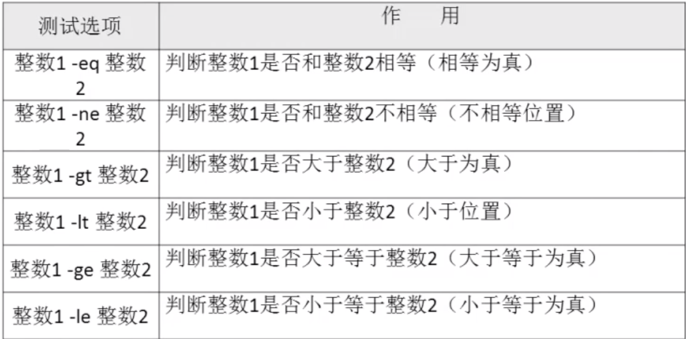

# 03-条件判断

1、按照文件类型进行判断


常用的就是： -d、-e、-f


## 两种判断格式


1、使用test命令

```
test -e /root/install.log
```

2、使用[ ]

```
[ -e /root/install.log ] #注意[]里面前后，必须有空格
```


案例一：
```
[root@iZ2vcdckpocdm8z7a36gl1Z ~]# test -e /etc/passwd
[root@iZ2vcdckpocdm8z7a36gl1Z ~]# echo $?
0
[root@iZ2vcdckpocdm8z7a36gl1Z ~]# test -e /etc/passwded
[root@iZ2vcdckpocdm8z7a36gl1Z ~]# echo $?
1
```

0代表未真，非0代表为假。


案例二：

```
[root@iZ2vcdckpocdm8z7a36gl1Z ~]# [-e /etc/passwded]
-bash: [-e: command not found
[root@iZ2vcdckpocdm8z7a36gl1Z ~]# [ -e /etc/passwded ]
[root@iZ2vcdckpocdm8z7a36gl1Z ~]# echo $?
1
```
可以发现不加空格，命令未被识别。


```
[root@iZ2vcdckpocdm8z7a36gl1Z ~]# [ -e /etc/passwd ]
[root@iZ2vcdckpocdm8z7a36gl1Z ~]# echo $?
0
```

使用判断结合逻辑与和非，如果判断条件为真输出yes，如果条件非真输出no，如下：

```
[root@iZ2vcdckpocdm8z7a36gl1Z ~]# [ -e /etc/passwd ] && echo yes || echo no
yes
[root@iZ2vcdckpocdm8z7a36gl1Z ~]# [ -e /etc/passwdsss ] && echo yes || echo no
no
```


2、按照文件权限进行判断

| 测试选项 |                            作用                            |
| ------- | ------------------------------------------------------- |
| -r 文件 | 判断该文件是否存在，并且是否该文件拥有读权限（有读权限为真）      |
| -w 文件 | 判断该文件是否存在，并且是否该文件拥有写权限（有写权限为真）      |
| -x 文件 | 判断该文件是否存在，并且是否该文件拥有执行权限（有执行权限为真）   |
| -u 文件 | 判断该文件是否存在，并且是否该文件拥有SUID权限（有SUID权限为真）  |
| -g 文件 | 判断该文件是否存在，并且是否该文件拥有SGID权限 （有SGID权限为真） |
| -k 文件 | 判断该文件是否存在，并且是否该文件拥有SBit权限（有SBit权限为真）  |


3、两个文件之间进行比较


4、两个整数之间的比较




5、字符串的判断

|     测试选项     |                   作用                   |
| --------------- | ---------------------------------------- |
| -z 字符串        | 判断字符串是否为空（为空返回真）             |
| -n 字符串        | 判断字符串是否为空（非空返回真）             |
| 字符串1==字符串2  | 判断字符串1是否和字符串2相等（相等返回真）    |
| 字符串1 !=字符串2 | 判断字符串1是否和字符串2不相等（不相等返回真） |


6、多重条件判断

|    测试选项    |                    作用                    |
| ------------- | ----------------------------------------- |
| 判断1 -a 判断2 | 逻辑与，判断1和判断2都成立，最终结果才为真      |
| 判断1 -o 判断2 | 逻辑或，判断1和判断2有一个成立，最终的结果就为真 |
| ！判断         | 逻辑非，使原始的判断取反                      |

