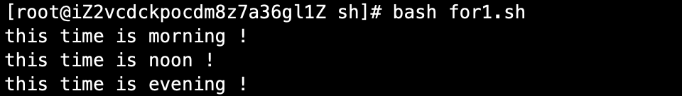

# 06-循环


## for循环


**语法一：**
```
for 变量 in 值1 值2 值3...
    do
      程序
    done

```

案例：

```
#!/bin/bash
for time in morning noon evening
        do 
                echo "this time is $time !"
        done
```

执行结果：




案例二、批量解压缩脚本

```
#!/bin/bash
#批量解压缩脚本

cd /tmp
ls *.tar.gz>ls.log
for i in $(cat ls.log)
        do 
                tar -zxf $i>/tmp/null.log
        done
rm -rf /tmp/ls.log
```


**语法二**

```
for ((初始值；循环控制条件；变量变化))
    do
        程序体
    done
```


案例：求1-100的累加和

```
#!/bin/bash
# 从1加到100求和

s=0
for((i=1;i<=100;i=i+1))
        do
                s=$(($s+$i))
        done
echo "the sum of 1+2+3....+100is: $s"
```


结果：


## while循环


while循环是不定循环，也称条件循环。只要条件判断式成立，循环就会一直继续，直到条件判断式不成立，循环才会停止。这就和for的固定循环不太一样了。


语法：

```
while [ 条件判断式 ]
    do
        程序
    done
```

案例：执行100的求和

```
#!/bin/bash

# 计算1-100的累加和

i=1
s=0
while [ $i -le 100 ]
        do
                s=$(($s+$i))
                i=$(($i+1))
        done
echo "the sum is : $s"
```

执行结果：


## until循环


until循环和while循环相反，until循环时只要条件判断式不成立则进行循环，并执行循环程序，一旦循环条件成立，则终止循环。


案例：使用until循环计算1-100累加和

```
#!/bin/bash
# 使用until循环执行1-100累加和

i=1
s=0
until [ $i -gt 100 ]
        do 
                s=$(($s+$i))
                i=$(($i+1))
        done
echo "the sum is :$s"
```

执行结果：
