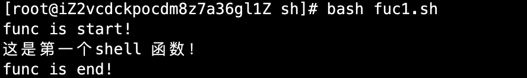
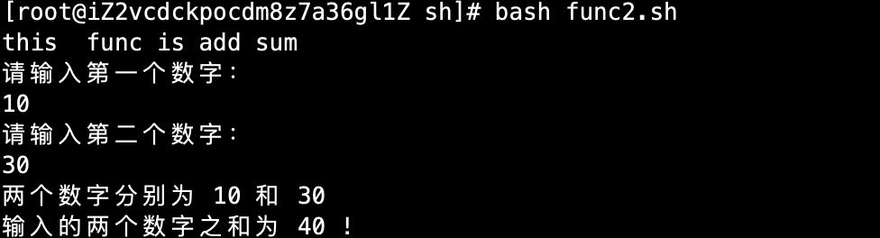
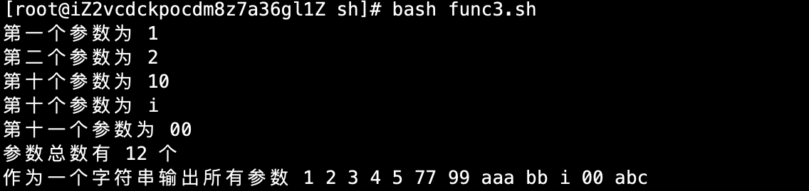

# 07-函数

linux中，可以用户自定义函数，然后在shell脚本中可以随便调用

## 函数定义与返回

语法格式：

```
[ function ] funname [()]{
    action
    [return int]
}

```

说明：

- 可以带function fun()定义，也可以直接fun()定义，不带任何参数
- 参数返回，可以显示加：return返回，如果不加，将以最后一条命令运行结果，作为返回值。return后跟数值（0-255）


案例一：定义一个函数

```
#!/bin/bash
# 定义一个函数

demo_fun(){
        echo "这是第一个shell 函数！"
}
echo "func is start!"
demo_fun
echo "func is end!"
```

运行结果：




案例二：带有return值的函数

```
#!/bin/bash
# test func has return

fun_with_return(){
        echo "this  func is add sum"
        echo "请输入第一个数字："
        read aNum
        echo "请输入第二个数字："
        read bNum
        echo "两个数字分别为 $aNum 和 $bNum"
        return $(($aNum+$bNum))
}
fun_with_return
echo "输入的两个数字之和为 $? !"
```

运行结果如下：




函数返回值在调用该函数后通过 $?来获得。因为$?是获取上一条命令执行的结果。

注意：所有函数在使用前必须定义，这意味着必须将函数放在脚本开始部分，直到shell解释器首次发现它时，才可以调用。调用函数仅使用其函数名即可。


## 函数参数

在shell 中，调用函数可以向其传递参数。在函数体内部，通过$n的形式来获取参数的值，例如 $1表示第一个参数，$2表示第二个参数.....


案例：测试函数参数


```
#!/bin/bash
# test func has a params

fun_with_params(){
        echo "第一个参数为 $1"
        echo "第二个参数为 $2"
        echo "第十个参数为 $10"
        echo "第十个参数为 ${10}"
        echo "第十一个参数为 ${11}"
        echo "参数总数有 $# 个"
        echo "作为一个字符串输出所有参数 $*"

}
fun_with_params 1 2 3 4 5 77 99 aaa bb i 00 abc
```

运行结果：




注意：$10不能获取第十个参数，获取第十个参数需要${10}。当n>=10时，需要使用${n}来获取参数，另外，还有几个特殊字符用来处理参数。


| 参数处理 |                        说明                         |
| ------- | --------------------------------------------------- |
| $#      | 传递到脚本或函数到参数个数                             |
| $*      | 以一个单字符串显示所有向脚本传递的参数                   |
| $$      | 脚本运行的当前进程ID号                                 |
| $!      | 后台运行的最后一个进程ID号                             |
| $@      | 与$*相同，但是使用时加引号，并在引号中返回每个参数。       |
| $-      | 显示shell使用的当前选项，与set命令功能相同              |
| $?      | 显示最后命令的退出状态。0表示没有错误，其它任何值表明有错误 |


案例：定义一个函数求和，使用shell命令进行传参

```
#!/bin/bash
# test func 

func_add(){
 echo "该功能函数用于求和，需要输入2个数字："
 sum=$(($1+$2))
 return $sum
}

func_add $1 $2
echo "求和结果：$?"
```

执行结果如下：


