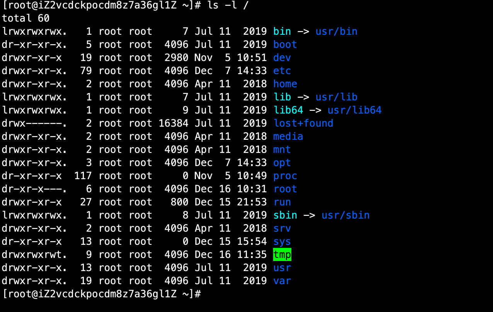
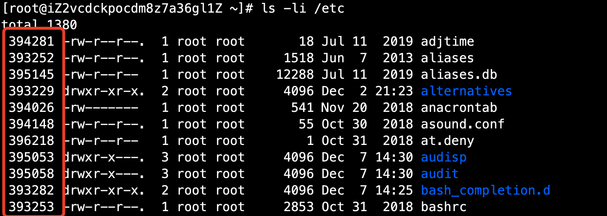
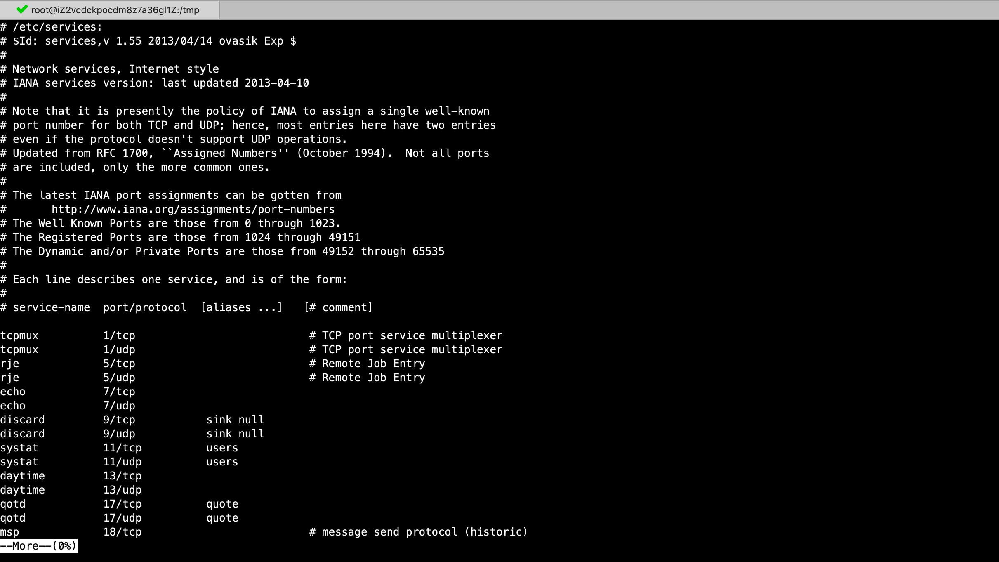
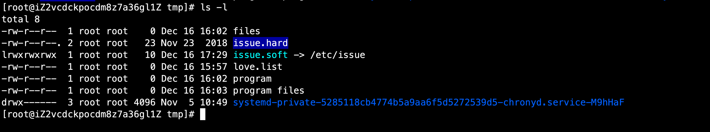

# 01-linux文件处理命令


## 一、文件命令ls

```
命令格式： 命令 [-选项] [参数]
例： ls -a /etc
参数：指命令操作的对象, 中括号代表可选。
```

说明：

- 个别命令使用不遵循此格式
- 当有多个选项时，可以写在一起
- 简化选项与完整选项
  - -a 等于 --all


### ls命令详细说明


命令名称：ls ，英文：list ，显示目录文件。

命令所在路径：/bin/ls

执行权限：所有用户

```
语法： ls  选项[-ald] [文件或目录]
      -a 显示所有文件，包括隐藏文件
      -l 详细信息显示 （l-long，显示长信息）
      -d 查看目录属性
```


操作案例：

首先来查看ls命令的所在目录信息：

```
[root@iZ2vcdckpocdm8z7a36gl1Z ~]# ls /bin/ls
/bin/ls
```

ls命令不带参数，默认显示当前文件下面的文件信息：

```
[root@iZ2vcdckpocdm8z7a36gl1Z tmp]# ls
systemd-private-5285118cb4774b5a9aa6f5d5272539d5-chronyd.service-M9hHaF  test
```

显示文件的详细信息，使用-l参数：
```
[root@iZ2vcdckpocdm8z7a36gl1Z tmp]# ls -l
total 8
drwx------ 3 root root 4096 Nov  5 10:49 systemd-private-5285118cb4774b5a9aa6f5d5272539d5-chronyd.service-M9hHaF
drwxr-xr-x 2 root root 4096 Dec 16 11:35 test
```

只查看目录属性，使用-d参数，不展示目录下面的文件信息：

```
[root@iZ2vcdckpocdm8z7a36gl1Z tmp]# ls -ld /tmp
drwxrwxrwt. 9 root root 4096 Dec 16 11:35 /tmp
```

想让文件信息更人性化展示，使用-h 参数
```
[root@iZ2vcdckpocdm8z7a36gl1Z ~]# ls -dlh /tmp
drwxrwxrwt. 9 root root 4.0K Dec 16 11:35 /tmp
```
可以发现使用h参数后，文件大小变成了4.0k，更可以看懂。


查看所有文件信息，使用-a参数，如下：

```
[root@iZ2vcdckpocdm8z7a36gl1Z ~]# ls -a
.  ..  .bash_history  .bash_logout  .bash_profile  .bashrc  .cache  .cshrc  .mysql_history  .pip  .pki  .pydistutils.cfg  .ssh  .tcshrc
```

可以发现展示了.开头的文件，这些都属于系统级别的文件，是隐藏文件。建议不要修改变动。


我们来看下根目录下的详细文件信息：
```
ls -l /
```



从上面的结果中可以看出ls -l 展示的信息包含了几组信息。总共是7组。


- 第一部分我们后面重点解释，先看后6组的信息及含义。
- 第二部分是文件计数（代表文件被调用了多少次），也就是上面的数字1、5、19等
- 第三部分是文件的所属者，user的意思，这里的文件所属者是root用户。
- 第四部分是文件的所属组，group的意思，这里的文件所属组是root用户组。
- 第五部分是文件大小，可以使用-h参数，展示具体的大小信息，人类可看懂的k、M、T等单位
- 第六部分是文件的最后修改时间，也就是三列月、日、年
- 第七部分是文件的名称信息


接下来我们重点看下第一部分信息：
```
lrwxrwxrwx
dr-xr-xr-x
```

可以分成2大部分：

- 第1部分是指文件类型
  - -指一个文件，d指目录，l代表一个软链接

- 第二部分，是后9位，代表文件的权限
  - 每三位代表一个组，第一个三位代表所有者（u）、第二个三位代表所属组（g）、第三个三位代表其它人（o）
  - r代表读、w代表写、x代表可执行
  - 有权限就会写上对应值（r、w、x），无权限用-代替


在linux系统中，每个文件都有自己对应的一个编号，可以使用-i显示，就像人的身份证一样，用于具体标识文件独一性。linux表示文件i节点。

```
ls -li /etc
```




## 二、目录文件处理命令


### 创建目录命令mkdir


mkdir：创建目录，英文名称：make directories。

命令所在路径：/bin/mkdir ，执行权限：所有用户

语法格式：
```
mkdir -p [目录名]  创建新目录， -p递归创建（可创建多目录）
```

案例：在tmp目录下创建mv目录

```
[root@iZ2vcdckpocdm8z7a36gl1Z tmp]# mkdir mv
[root@iZ2vcdckpocdm8z7a36gl1Z tmp]# ls
mv  systemd-private-5285118cb4774b5a9aa6f5d5272539d5-chronyd.service-M9hHaF  test
```

创建多级目录，本身目录不存在，或报错如下：
```
# mkdir /test_dir/test
mkdir: cannot create directory ‘/test_dir/test’: No such file or directory
```


这时候只需要加 -p参数即可。

```
[root@iZ2vcdckpocdm8z7a36gl1Z tmp]# mkdir -p /test_dir/test
[root@iZ2vcdckpocdm8z7a36gl1Z tmp]# ls
mv  systemd-private-5285118cb4774b5a9aa6f5d5272539d5-chronyd.service-M9hHaF  test
```

可以发现创建成功，没有报错。


linux在执行命令时，可以同时创建多个目录，只需要写多个目录即可，如下：

```
[root@iZ2vcdckpocdm8z7a36gl1Z tmp]# mkdir /test_dir/test1  /test_dir/test2
[root@iZ2vcdckpocdm8z7a36gl1Z tmp]# ls /test_dir/
test  test1  test2
```


### 目录切换命令cd


cd：切换目录，英文：change directory  ，执行权限，所有用户。

```
语法：cd [目录] ，切换目录
```

案例：

从/tmp目录切换至/etc目录

```
[root@iZ2vcdckpocdm8z7a36gl1Z tmp]# cd /etc
[root@iZ2vcdckpocdm8z7a36gl1Z etc]#
```

cd 可以切换到任意一个文件路径，只要cd后面跟具体的文件路径即可。


### 显示当前目录pwd


pwd：显示当前目录，英文：print working directory

命令所在路径：/bin/pwd，执行权限：所有用户

```
语法： pwd
```

案例：显示当前目录绝对路径

```
[root@iZ2vcdckpocdm8z7a36gl1Z test]# pwd
/tmp/test
```

注意：

```
. 表示当前目录
.. 表示当前目录的上级目录
```

案例：返回上一级目录

```
[root@iZ2vcdckpocdm8z7a36gl1Z tmp]# cd /tmp/test/
[root@iZ2vcdckpocdm8z7a36gl1Z test]# cd ..
[root@iZ2vcdckpocdm8z7a36gl1Z tmp]# pwd
/tmp
```


### 删除目录命令rmdir


rmdir：删除空目录，英文：remove empty directories

命令所在路径：/bin/rmdir  执行权限：所有用户

```
语法：rmdir [目录名]
```

案例：删除空目录：/tmp/mv

```
[root@iZ2vcdckpocdm8z7a36gl1Z tmp]# rmdir mv
[root@iZ2vcdckpocdm8z7a36gl1Z tmp]# ls
systemd-private-5285118cb4774b5a9aa6f5d5272539d5-chronyd.service-M9hHaF  test
```


如果删除的不是空目录，会是怎样的结果呢？

```
[root@iZ2vcdckpocdm8z7a36gl1Z tmp]# rmdir test
rmdir: failed to remove ‘test’: Directory not empty
```
可以发现删除报错，提示目录不为空。实际工作中用得比较少，该命令。


### 目录复制cp


cp：复制目录或文件，英文：copy。

命令所在路径：/bin/cp ， 执行权限：所有用户。
```
语法： cp -rp [原文件或目录] [目标目录]
      -r 复制目录
      -p 保留文件属性
```

案例：将/etc/yum.conf文件复制到 /tmp/test/下

```
[root@iZ2vcdckpocdm8z7a36gl1Z tmp]# cp /etc/yum.conf /tmp/test/
[root@iZ2vcdckpocdm8z7a36gl1Z tmp]# ls /tmp/test/
test1  yum.conf
```

将文件目/root/test_copy/录复制到/tmp/test下

```
[root@iZ2vcdckpocdm8z7a36gl1Z ~]# cp -r /root/test_copy/  /tmp/test/
[root@iZ2vcdckpocdm8z7a36gl1Z ~]# ls /tmp/test/
test1  test_copy  yum.conf
```

**cp可以同时复制多个文件。**


在复制文件时，文件的时间属性会发生变化，如果想让复制后的文件和原文件信息保持一致，可以使用-p参数。如下：
```
[root@iZ2vcdckpocdm8z7a36gl1Z ~]# cp -p /etc/nscd.conf  /tmp/test/
[root@iZ2vcdckpocdm8z7a36gl1Z ~]# ls -l /tmp/test/nscd.conf 
-rw-r--r-- 1 root root 2384 Jul  3  2019 /tmp/test/nscd.conf
[root@iZ2vcdckpocdm8z7a36gl1Z ~]# ls -l /etc/nscd.conf 
-rw-r--r-- 1 root root 2384 Jul  3  2019 /etc/nscd.conf
```
可以发现文件属性 完全一致。


在复制文件的同时，可以对文件进行重命名将my.cnf更名为：test.cnf，如下：

```
[root@iZ2vcdckpocdm8z7a36gl1Z ~]# cp /etc/my.cnf /tmp/test.cnf
[root@iZ2vcdckpocdm8z7a36gl1Z ~]# ls /tmp
systemd-private-5285118cb4774b5a9aa6f5d5272539d5-chronyd.service-M9hHaF  test  test.cnf
```


### 文件目录剪切或更名mv


mv：剪切文件、改名。 英文：move

命令所在路径：/bin/mv ，执行权限：所有用户。

```
语法： mv [原文件或目录] [目标目录]
```

案例：将/tmp下的test目录剪切至root下
```
[root@iZ2vcdckpocdm8z7a36gl1Z ~]# mv /tmp/test /root
[root@iZ2vcdckpocdm8z7a36gl1Z ~]# ls /root/
test  test_copy
[root@iZ2vcdckpocdm8z7a36gl1Z ~]# ls /tmp/
systemd-private-5285118cb4774b5a9aa6f5d5272539d5-chronyd.service-M9hHaF  test.cnf
```

更名：在同一路径下将test.cnf 更名为test1.cnf

```
[root@iZ2vcdckpocdm8z7a36gl1Z tmp]# ls
systemd-private-5285118cb4774b5a9aa6f5d5272539d5-chronyd.service-M9hHaF  test.cnf
[root@iZ2vcdckpocdm8z7a36gl1Z tmp]# mv test.cnf  test1.cnf
[root@iZ2vcdckpocdm8z7a36gl1Z tmp]# ls
systemd-private-5285118cb4774b5a9aa6f5d5272539d5-chronyd.service-M9hHaF  test1.cnf
```


### 删除文件rm

rm： remove ，删除文件

命令所在路径：/bin/rm，执行权限：所有用户。

```
语法： rm -rf [文件或目录]
      -r 删除目录
      -f 强制执行，没有提示
```

案例：删除文件
```
[root@iZ2vcdckpocdm8z7a36gl1Z tmp]# rm test1.cnf 
rm: remove regular file ‘test1.cnf’? y
[root@iZ2vcdckpocdm8z7a36gl1Z tmp]# 
```
删除命令删除文件时，会进行提示。需要输入y，进行删除，输入n撤销删除。


如果我们要删除目录，使用rm如何删除呢？
```
[root@iZ2vcdckpocdm8z7a36gl1Z tmp]# rm test
rm: cannot remove ‘test’: Is a directory
```

这时需求，加上r参数。
```
[root@iZ2vcdckpocdm8z7a36gl1Z tmp]# rm test
rm: cannot remove ‘test’: Is a directory
[root@iZ2vcdckpocdm8z7a36gl1Z tmp]# rm -r test
rm: descend into directory ‘test’? y
rm: remove directory ‘test/test1’? y
rm: remove directory ‘test’? y
```

可以发现，删除目录下面所有文件时，会进行多次提醒，如果不想提醒该怎么办呢？ 加上-f参数即可，强制执行。

```
[root@iZ2vcdckpocdm8z7a36gl1Z tmp]# ls
systemd-private-5285118cb4774b5a9aa6f5d5272539d5-chronyd.service-M9hHaF  test2
[root@iZ2vcdckpocdm8z7a36gl1Z tmp]# rm -rf test2
[root@iZ2vcdckpocdm8z7a36gl1Z tmp]# ls
systemd-private-5285118cb4774b5a9aa6f5d5272539d5-chronyd.service-M9hHaF
```

从上面结果可以看出，没有任何提醒，**使用rm -rf 一定要注意，慎重。因为会删除该文件下的所有内容，并且不会有提示。**


## 三、文件创建、查看


### 创建空文件 touch

touch： 创建空文件

命令所在路径：/bin/touch， 执行权限：所有用户

```
语法： touch [文件名]
```

案例：
```
[root@iZ2vcdckpocdm8z7a36gl1Z tmp]# touch love.list
[root@iZ2vcdckpocdm8z7a36gl1Z tmp]# ls
love.list  systemd-private-5285118cb4774b5a9aa6f5d5272539d5-chronyd.service-M9hHaF
```

linux上文件可以是任何后缀名。


如果创建的名称带有空格，需要使用“”将文件名引起来，不引将创建多个文件。如下：

```
[root@iZ2vcdckpocdm8z7a36gl1Z tmp]# touch program files
[root@iZ2vcdckpocdm8z7a36gl1Z tmp]# ls
files  love.list  program  systemd-private-5285118cb4774b5a9aa6f5d5272539d5-chronyd.service-M9hHaF
[root@iZ2vcdckpocdm8z7a36gl1Z tmp]# touch "program files"
[root@iZ2vcdckpocdm8z7a36gl1Z tmp]# ls
files  love.list  program  program files  systemd-private-5285118cb4774b5a9aa6f5d5272539d5-chronyd.service-M9hHaF
```

但是一般不建议使用空格。


### 文件内容查看命令 cat

cat：显示文件内容 

所在路径：/bin/cat，执行权限：所有用户

```
语法： cat [文件名]
      -n 显示行号
```

案例：查看/etc/issue文件内容

```
[root@iZ2vcdckpocdm8z7a36gl1Z tmp]# cat /etc/issue
\S
Kernel \r on an \m
```

显示内容行号：加上-n参数

```
[root@iZ2vcdckpocdm8z7a36gl1Z tmp]# cat -n /etc/issue
     1  \S
     2  Kernel \r on an \m
     3
```

注意：**cat查看长文件内容，会一直滚动直到最后一页进行显示。所以cat命令不太适合查看长文件内容。**


这里还有个命令和cat名字相反，叫tac。它是将文件内容倒着显示。如下

```
[root@iZ2vcdckpocdm8z7a36gl1Z tmp]# tac /etc/issue

Kernel \r on an \m
\S
```

可以发现，和上面的内容是顺序是相反的，这就是tac的作用。


### 文件内容查看分页显示 more

more：分页显示文件内容

文件所在路径：/bin/more，执行权限：所有用户。

```
语法： more  [文件名]
     （空格）或f  翻页
      Enter 换行
      q或Q  退出
```

案例：使用more命令查看 /etc/services 文件内容：




- 可以使用空格或f进行向下翻页。  
- 使用Enter 向下一行
- q或Q退出文件

注意：**more命令不能往回翻页，也就是上一页。只能向下翻页**


### 文件内容分页查看 less


less：分页显示文件内容（可向上翻页，也可以向下）
命令所在路径： /usr/bin/less，执行权限：所有用户。

```
语法： less [文件名]
```

使用less命令，more相关属性，less同样具备。

- q或Q退出
- f或空格，向下翻页
- enter 下一行。 下箭头也是下一行
- 上箭头，上一行
- /       使用/+内容，进行关键字搜索，使用n进行向下寻找关键字内容，b可以回到关键字内容最前。
- pageup 向上翻页


### 文件内容查看前部分内容 head

head ：显示文件前面几行

命令所在路径：/usr/bin/head，执行权限：所有用户

```
语法：head [文件名]
     -n 指定行数
```

案例：使用head查看 /etc/services 文件内容

```
[root@iZ2vcdckpocdm8z7a36gl1Z tmp]# head /etc/services 
# /etc/services:
# $Id: services,v 1.55 2013/04/14 ovasik Exp $
#
# Network services, Internet style
# IANA services version: last updated 2013-04-10
#
# Note that it is presently the policy of IANA to assign a single well-known
# port number for both TCP and UDP; hence, most entries here have two entries
# even if the protocol doesn't support UDP operations.
# Updated from RFC 1700, ``Assigned Numbers'' (October 1994).  Not all ports
```

head不加选项，默认展示文件前10行内容。


展示文件前20行内容，使用-n命令加上行数：
```
[root@iZ2vcdckpocdm8z7a36gl1Z tmp]# head -n 20 /etc/services 
# /etc/services:
# $Id: services,v 1.55 2013/04/14 ovasik Exp $
#
# Network services, Internet style
# IANA services version: last updated 2013-04-10
#
# Note that it is presently the policy of IANA to assign a single well-known
# port number for both TCP and UDP; hence, most entries here have two entries
# even if the protocol doesn't support UDP operations.
# Updated from RFC 1700, ``Assigned Numbers'' (October 1994).  Not all ports
# are included, only the more common ones.
#
# The latest IANA port assignments can be gotten from
#       http://www.iana.org/assignments/port-numbers
# The Well Known Ports are those from 0 through 1023.
# The Registered Ports are those from 1024 through 49151
# The Dynamic and/or Private Ports are those from 49152 through 65535
#
# Each line describes one service, and is of the form:
#
```

### 文件内容查看末尾 tail

tail：显示文件末尾内容。

命令所在路径：/usr/bin/tail，执行权限：所有用户

```
语法： tail [文件名]
      -n 指定行数
      -f 动态显示文件末尾内容
```

案例：使用tail命令查看文件/etc/services 末尾内容
```
[root@iZ2vcdckpocdm8z7a36gl1Z tmp]# tail /etc/services 
3gpp-cbsp       48049/tcp               # 3GPP Cell Broadcast Service Protocol
isnetserv       48128/tcp               # Image Systems Network Services
isnetserv       48128/udp               # Image Systems Network Services
blp5            48129/tcp               # Bloomberg locator
blp5            48129/udp               # Bloomberg locator
com-bardac-dw   48556/tcp               # com-bardac-dw
com-bardac-dw   48556/udp               # com-bardac-dw
iqobject        48619/tcp               # iqobject
iqobject        48619/udp               # iqobject
matahari        49000/tcp               # Matahari Broker
```

可以发现，tail命令和head命令一样，没加参数时，默认展示10行内容。

使用-n参数，如下，显示末尾3行内容：

```
[root@iZ2vcdckpocdm8z7a36gl1Z tmp]# tail -n 3 /etc/services 
iqobject        48619/tcp               # iqobject
iqobject        48619/udp               # iqobject
matahari        49000/tcp               # Matahari Broker
```

如果要动态实时显示文件末尾内容，可以使用-f参数，这个在查看接口请求日志时，特别有用。


## 四、链接命令

ln: 生成链接文件，英文：link。

命令所在路径：/bin/ln ，执行权限：所有用户。

```
语法：ln -s [原文件] [目标文件]
        -s 创建软链接
```


案例：生成软链接

```
 ln -s /etc/issue /tmp/issue.soft
```

生成硬链接
```
 ln /etc/issue /tmp/issue.hard
```

生成完结果如下：



**软链接：**

特征：类似Windows快捷方式

- lrwxrwxrwx     l软链接，软链接文件权限都为rwxrwx
- 文件大小，比较小，只是符号链接
- /tmp/issue.soft -> /etc/issue  箭头指向源文件


**硬链接特征：**

- 拷贝cp -p + 同步更新
- 通过i节点识别，i节点会指向源文件以及硬链接文件
- 不能跨分区
- 不能针对目录使用


