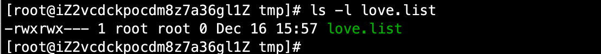

# 02-权限管理命令


## 权限管理命令chmod

chmod：改变文件或目录权限，英文：change the permissions mode of a file 

命令所在路径：/bin/chmod  ，执行权限：所有用户

```
语法： chmod [{ugoa} {+-=} {rwx}] [文件或目录]  a表示所有人，+增加权限，-减少权限 =赋予等号后面内容的权限
            [mode=421] [文件或目录]
            -R 递归修改
```

文件的权限，只有文件的所有者和root用户可以进行更改。


案例：我们对/tmp目录下对love.list进行权限操作，首先看下现在对权限：

```
[root@iZ2vcdckpocdm8z7a36gl1Z tmp]# ls -l love.list 
-rw-r--r-- 1 root root 0 Dec 16 15:57 love.list
```

首先，我们给所有者，加上执行权限。如下：chmod u+x love.list 
```
[root@iZ2vcdckpocdm8z7a36gl1Z tmp]# chmod u+x love.list 
[root@iZ2vcdckpocdm8z7a36gl1Z tmp]# ls -l love.list 
-rwxr--r-- 1 root root 0 Dec 16 15:57 love.list
```

接下来，我们给所属组增加w权限，如下：chmod g+w love.list
```
[root@iZ2vcdckpocdm8z7a36gl1Z tmp]# chmod g+w love.list 
[root@iZ2vcdckpocdm8z7a36gl1Z tmp]# ls -l love.list 
-rwxrw-r-- 1 root root 0 Dec 16 15:57 love.list
```

我们将其它人的r权限去掉，如下：
```
[root@iZ2vcdckpocdm8z7a36gl1Z tmp]# chmod o-r love.list 
[root@iZ2vcdckpocdm8z7a36gl1Z tmp]# ls -l love.list 
-rwxrw---- 1 root root 0 Dec 16 15:57 love.list
```

我们将用户组赋予权限rwx，如下：

```
[root@iZ2vcdckpocdm8z7a36gl1Z tmp]# chmod g=rwx love.list 
[root@iZ2vcdckpocdm8z7a36gl1Z tmp]# ls -l love.list 
-rwxrwx--- 1 root root 0 Dec 16 15:57 love.list
```

一般linux操作权限用数字来表示，具体的数字含义如下：

**权限的数字表示**

- r ---------4
- w --------2
- x----------1

例如：权限位是rwxrw-r--,对应的数字就是 7 6 4

我们显示使用数字对现有love.list进行修改，首先我们来看下现在的权限：



假设我们要修改成：rw-r-----, 对应的数字位是：640

```
[root@iZ2vcdckpocdm8z7a36gl1Z tmp]# chmod 640 love.list 
[root@iZ2vcdckpocdm8z7a36gl1Z tmp]# ls -l love.list 
-rw-r----- 1 root root 0 Dec 16 15:57 love.list
```


**R参数使用**

首先，我们来创建一个多级目录。如下：
```
[root@iZ2vcdckpocdm8z7a36gl1Z tmp]# mkdir -p /tmp/a/b
[root@iZ2vcdckpocdm8z7a36gl1Z tmp]# ls -ld /tmp/a
drwxr-xr-x 3 root root 4096 Dec 16 21:15 /tmp/a
[root@iZ2vcdckpocdm8z7a36gl1Z tmp]# ls -ld /tmp/a/b
drwxr-xr-x 2 root root 4096 Dec 16 21:15 /tmp/a/b
```
可以发现，a目录和a/b目录权限是一样的。接下来我们修改a目录的权限为777.如下：

```
[root@iZ2vcdckpocdm8z7a36gl1Z tmp]# chmod 777 /tmp/a
```
然后我们看下a目录现在的权限：
```
[root@iZ2vcdckpocdm8z7a36gl1Z tmp]# ls -dl /tmp/a
drwxrwxrwx 3 root root 4096 Dec 16 21:15 /tmp/a
```

我们再看下a/b目的权限，：
```
[root@iZ2vcdckpocdm8z7a36gl1Z tmp]# ls -dl /tmp/a/b
drwxr-xr-x 2 root root 4096 Dec 16 21:15 /tmp/a/b
```

可以发现，我们的目录b并没有改变。如果要想b目录也需要对应改变，我们可以使用-R参数，递归修改。就是文件子目录都会跟随修改，接下来我们来操作下：

```
[root@iZ2vcdckpocdm8z7a36gl1Z tmp]# chmod 777 -R /tmp/a
[root@iZ2vcdckpocdm8z7a36gl1Z tmp]# ls -dl /tmp/a
drwxrwxrwx 3 root root 4096 Dec 16 21:15 /tmp/a
[root@iZ2vcdckpocdm8z7a36gl1Z tmp]# ls -dl /tmp/a/b
drwxrwxrwx 2 root root 4096 Dec 16 21:15 /tmp/a/b
```

可以发现子目录已经跟随修改。


接下来，我们来做个实验：


文件目录权限总结：

| 代表字符 |  权限   |  对文件对含义   |       对目录的含义       |
| ------- | ------- | -------------- | ---------------------- |
| r       | 读权限   | 可以查看文件内容 | 可以列出目录的内容        |
| w       | 写权限   | 可以修改文件内容 | 可以在目录中创建、删除文件 |
| x       | 执行权限 | 可以执行文件    | 可以进入目录             |


所以，要对目录下面的文件内容具备权限，首先目录权限非常重要。如果目录下的文件没有w权限，普通用户可以删除，那说明文件之上的目录权限是对普通用户开放了w权限。也就是记住上面对这个表格。


## 其它权限管理命令


### chwon

chown：改变文件或目录的所有者，英文：change file ownership。

命令所在路径：/bin/chown，执行权限：所有用户。

```
语法： chown [用户] [文件或目录]
```

**改变文件的所有者，只有root用户可以操作。**


案例：我们在tmp目录下创建文件fengjie

```
[root@iZ2vcdckpocdm8z7a36gl1Z tmp]# mkdir fengjie
[root@iZ2vcdckpocdm8z7a36gl1Z tmp]# ls -dl fengjie/
drwxr-xr-x 2 root root 4096 Dec 16 22:03 fengjie/
```

然后我们修改所属组为ly用户。

```
[root@iZ2vcdckpocdm8z7a36gl1Z tmp]# chown ly fengjie/
[root@iZ2vcdckpocdm8z7a36gl1Z tmp]# ls -dl fengjie/
drwxr-xr-x 2 ly root 4096 Dec 16 22:03 fengjie/
```

可以发现已经修改成功。


### chgrp

chgrp: 改变文件或目录所属组，英文：change file group ownership

命令所在路径：/bin/chgrp，执行权限：所有用户。

```
语法： chgrp  [用户组] [文件或目录]
```

案例：将fengjie目录修改所属组为test，如下：
```
[root@iZ2vcdckpocdm8z7a36gl1Z tmp]# ls -dl fengjie/
drwxr-xr-x 2 ly root 4096 Dec 16 22:03 fengjie/
[root@iZ2vcdckpocdm8z7a36gl1Z tmp]# groupadd test
[root@iZ2vcdckpocdm8z7a36gl1Z tmp]# chgrp test fengjie/
[root@iZ2vcdckpocdm8z7a36gl1Z tmp]# ls -dl fengjie/
drwxr-xr-x 2 ly test 4096 Dec 16 22:03 fengjie/
```

groupadd 添加一个组。


### umask

umask: 显示、设置文件的缺省权限。英文：the user file-creation mask
命令所在路径：shell 内置命令，执行权限，所有用户。

```
语法：umask[-S]
     -S 以rwx形式显示新建文件缺省权限
```

案例：
```
[root@iZ2vcdckpocdm8z7a36gl1Z tmp]# umask -S
u=rwx,g=rx,o=rx
```

使用umask -S查看新建文件默认权限，如上。

我们来创建一个目录和文件来对比是否是默认值，首先创建目录如下：
```
[root@iZ2vcdckpocdm8z7a36gl1Z tmp]# mkdir dd
[root@iZ2vcdckpocdm8z7a36gl1Z tmp]# ls -dl dd
drwxr-xr-x 2 root root 4096 Dec 16 22:24 dd
```

可以fax和默认权限一致。接下来我们创建个文件：
```
[root@iZ2vcdckpocdm8z7a36gl1Z tmp]# touch fanbinbin
[root@iZ2vcdckpocdm8z7a36gl1Z tmp]# ls -l fanbinbin 
-rw-r--r-- 1 root root 0 Dec 16 22:25 fanbinbin
```
可以发现和默认值有点不一样，每一个位置都少了个x权限。因为linux默认创建的文件都不会添加执行权限x，请大家记住。这个是基于安全性考虑。

可以使用umask修改缺省创建默认值，但是不推荐

```
umask 077
```

