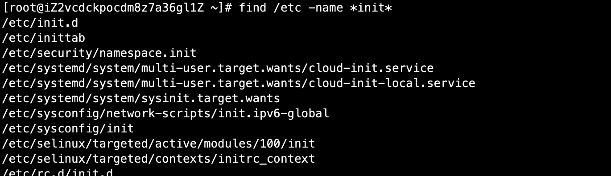
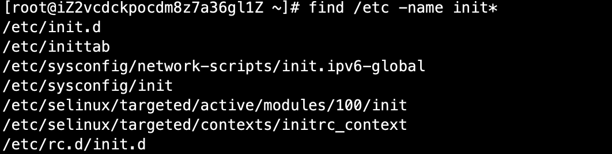
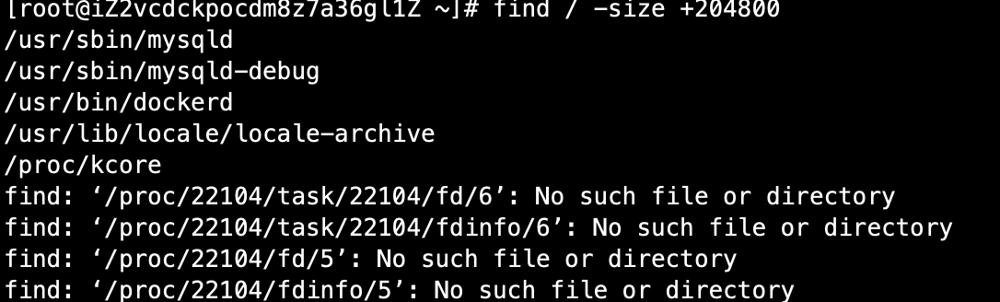
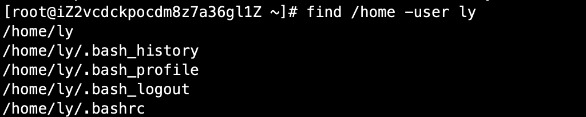

# 03-文件搜索命令


## find命令


find：文件搜索，命令所在路径：/bin/find。执行权限：所有用户。

```
语法：find [搜索范围] [匹配条件]
```

**- name 参数** 根据文件名进行搜索

案例：在/etc目录下搜索名称为init的文件
```
root@iZ2vcdckpocdm8z7a36gl1Z ~]# find /etc -name init
```
结果如下：


从结果中可以发现，这个是绝对匹配。这种方式是精准搜索。


如果想实现模糊搜索，怎么办呢？可以使用通配符*

```
[root@iZ2vcdckpocdm8z7a36gl1Z ~]# find /etc -name *init*
```
这种方式是，只有文件名包含init都会被匹配，结果如下：



如果要查找名称为init开头的文件，如下：

```
[root@iZ2vcdckpocdm8z7a36gl1Z ~]# find /etc -name init*
```
结果如下：



如果要想查找init开头，并且后面只有3位其它字符名称的文件，如下：

```
[root@iZ2vcdckpocdm8z7a36gl1Z ~]# find /etc -name init???
```
结果如下：


如果想文件名不区分大小写，使用-iname 即可

```
[root@iZ2vcdckpocdm8z7a36gl1Z ~]# find /etc -iname init
```

**- size参数** 根据文件大小进行搜索

有三个参数选项： +n（大于n） - n（小于n） n 等于n

案例：在根目录小查找大于100M的文件

```
[root@iZ2vcdckpocdm8z7a36gl1Z ~]# find / -size +204800
```

注意：在linux中文件大小，是以数据块区分的。1数据块=512字节=0.5k  100M=102400k=204800数据块

结果如下：



根据所有者来查找文件，比如查找所有者为ly的文件。

```
[root@iZ2vcdckpocdm8z7a36gl1Z ~]# find /home -user ly
```
结果如下：




**根据时间属性来查找**

```
- amin 访问时间 access
- cmin 文件属性 change
- mmin 文件内容 modify
```


案例：在/etc下查找5分钟内被修改过属性的文件和目录

```  
[root@iZ2vcdckpocdm8z7a36gl1Z ~]# find /etc -cmin -5
```

如果是超过时间，则 用 + 号。


**使用-a 或 -o连接多个条件**

```
-a 两个条件同时满足，and的意思
-o 两个条件满足任意一个即可
```

案例：在/etc下查找大于80M小于100M的文件
```
[root@iZ2vcdckpocdm8z7a36gl1Z ~]# find /etc -size +163840 -a -size -204800
```


**- type参数根据文件类型查找** 

```
f 文件 d 目录 l 软连接文件
```

案例：查找/etc目录下名为init开头并且类型为文件
```
[root@iZ2vcdckpocdm8z7a36gl1Z ~]# find /etc -name init* -a -type f 
```

查找/etc目录下名为init开头并且类型为目录

```
[root@iZ2vcdckpocdm8z7a36gl1Z ~]# find /etc -name init* -a -type d
```

**-exec/-ok 命令 {}\\;**  对搜索结果执行操作


案例：在/etc下查找inittab文件并显示其详细信息

```
[root@iZ2vcdckpocdm8z7a36gl1Z ~]# find /etc -name init??? -exec ls -l {} \;
-rw-r--r--. 1 root root 511 Oct 31  2018 /etc/inittab
```

那么使用/ok呢，如下：
```
[root@iZ2vcdckpocdm8z7a36gl1Z ~]# find /etc -name init??? -ok ls -l {} \;
< ls ... /etc/inittab > ? y
-rw-r--r--. 1 root root 511 Oct 31  2018 /etc/inittab
```

其实就是多了一个询问操作。


**- inum** 根据文件i节点查找

案例：查找i节点为1056199 文件
```
find -inum 1056199
./temp
```

## locate命令


locate：在文件资料库中查找文件。

命令所在路径：/usr/bin/locate，执行权限：所有用户。

```
语法： locate 文件名
```

locate和find的区别：

- find是在指定路径下进行文件遍历搜索，速度较慢，影响性能
- locate是建立文件资料库，从资料库中进行查找，速度较快，并且定期更新资料库


在centos7中，使用locate，发现没有此命令：
```
[root@iZ2vcdckpocdm8z7a36gl1Z ~]# locate 
-bash: locate: command not found
```

接下来我们安装下：

```
yum install mlocate 
```

安装成功使用updatedb，手动更新下资料库。


**注意：**  使用locate可能出现新建文件查找失败的情况，因为资料库不是实时更新的，这时可以使用手动更新的方式。


案例：我们在/tmp目录下创建个test_locate文件,然后使用locate进行搜索：

```
[root@iZ2vcdckpocdm8z7a36gl1Z ~]# touch /tmp/test_locate
[root@iZ2vcdckpocdm8z7a36gl1Z ~]# ls -l /tmp
total 24104
drwxrwxrwx  3 root root     4096 Dec 16 21:15 a
drwxr-xr-x  3 root root     4096 Dec 17 21:25 aliyun_assist_23a759887ac16456dabdec7243a8119c
-rw-r--r--  1 root root 24651138 Dec 17 21:25 aliyun_assist_23a759887ac16456dabdec7243a8119c.zip
-rw-------  1 root root        0 Dec 17 21:25 AliyunAssistClientSingleLock.lock
drwxr-xr-x  2 root root     4096 Dec 16 22:24 dd
-rw-r--r--  1 root root        0 Dec 16 22:25 fanbinbin
drwxr-xr-x  2 ly   test     4096 Dec 16 22:03 fengjie
-rw-r--r--  1 root root        0 Dec 16 16:02 files
-rw-r--r--. 2 root root       23 Nov 23  2018 issue.hard
lrwxrwxrwx  1 root root       10 Dec 16 17:29 issue.soft -> /etc/issue
-rw-r--r--  1 root root        0 Dec 16 22:15 liuyifei
-rw-r-----  1 root root        0 Dec 16 15:57 love.list
drwxr-xr-x  2 root root     4096 Dec 16 22:15 meinv
-rw-r--r--  1 root root        0 Dec 16 16:02 program
-rw-r--r--  1 root root        0 Dec 16 16:03 program files
drwx------  3 root root     4096 Nov  5 10:49 systemd-private-5285118cb4774b5a9aa6f5d5272539d5-chronyd.service-M9hHaF
-rw-r--r--  1 root root        0 Dec 18 11:05 test_locate
[root@iZ2vcdckpocdm8z7a36gl1Z ~]# updatedb
[root@iZ2vcdckpocdm8z7a36gl1Z ~]# locate test_locate
```

可以发现更新之后，并没有查找成功。这是因为tmp是个临时目录，并不在locate资料更新的范畴，请注意！


**如果要不区分大小写，使用-i参数。**


## which命令


which：搜索命令所在目录及别名信息。

命令所在路径：/usr/bin/which，执行权限：所有用户。

```
语法： which 命令
```

案例：查找ls命令位置

```
[root@iZ2vcdckpocdm8z7a36gl1Z ~]# which ls
alias ls='ls --color=auto'
        /usr/bin/ls
```

同时还能查看命令是否使用别名：，比如我们查看rm命令位置

```
[root@iZ2vcdckpocdm8z7a36gl1Z ~]# which rm
alias rm='rm -i'
        /usr/bin/rm
```

rm-i 就是别名，使用别名。使用rm命令会出现询问的操作，实际linux本身没有这个操作，是因为加了别名。


## whereis命令

whereis：搜索命令所在目录及帮助文档路径。

命令所在路径：/usr/bin/whereis ，执行权限：所有用户。


案例：
```
[root@iZ2vcdckpocdm8z7a36gl1Z ~]# whereis useradd
useradd: /usr/sbin/useradd /usr/share/man/man8/useradd.8.gz
```

man命令可以查看命令帮助文档。


## grep命令


grep：在文件中搜寻字符串匹配的行并输出

命令所在路径：/bin/grep ，执行权限：所有用户。

```
语法： grep -iv [指定字串] [文件]
      -i 不区分大小写
      -v 排除指定字串
```

案例：查找/etc/inittab 内容有multi-user的行

```
[root@iZ2vcdckpocdm8z7a36gl1Z ~]# grep multi-user /etc/inittab 
# multi-user.target: analogous to runlevel 3
```

**如果要忽略大小写，使用-i参数。**


**-v参数** 排除相关内容行


案例：排除以#开头的注释行内容

```
grep -v ^# /etc/inittab 
```


