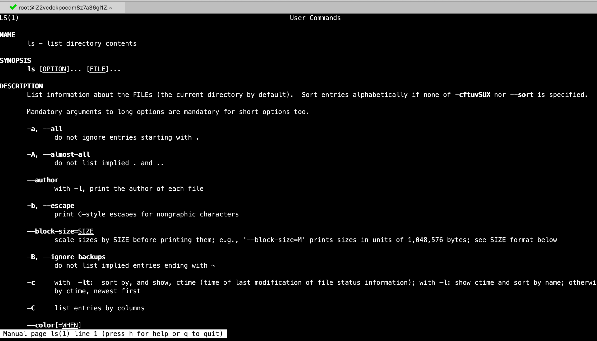
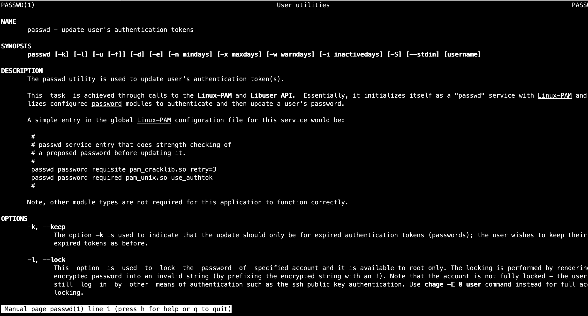
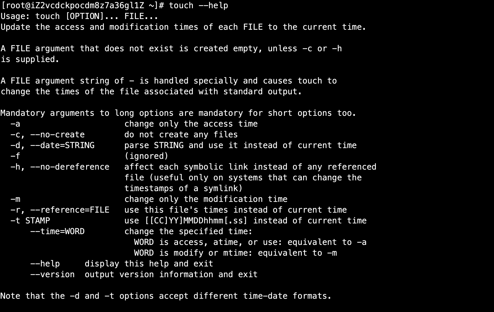

# 04-帮助命令


## man命令

man：获得帮助信息，英文：manual。

命令所在路径：/usr/bin/man，执行权限：所有用户。

```
语法： man [命令或配置文件]
```

案例：查看ls命令的帮助信息

```
man ls
```




显示结果如下，可以使用more和less命令相关综合方法进行查看内容。如上帮助信息内容十分多，怎样方便快速查看内容，一般来讲man命令第一行内容就是介绍命令是干什么的，如果要看命令的选项参数，可以翻到参数的位置进行查看。


**使用man查看配置文件名称，只需要跟文件名称，不能加绝对路径**

案例：查看/etc/services配置文件信息

```
man services 
```

查看passwd 配置文件信息：

```
man passwd
```

如下结果：



结果是进入了passwd命令的内容了，我们要看的是passwd配置文件信息。

我们使用whereis命令查看passwd相关信息：

```
[root@iZ2vcdckpocdm8z7a36gl1Z ~]# whereis passwd
passwd: /usr/bin/passwd /etc/passwd /usr/share/man/man1/passwd.1.gz
```

可以发现有两个，一个是命令，一个是配置文件，默认展示的命令相关的信息。如果要查看文件配置信息怎么办呢？ 1是命令的帮助，5是配置文件的帮助。

```
man 5 passwd
```


## whatis命令

从上面可以看出，使用man命令查看内容非常多，如果我们只想查看命令相关name部分多内容，可以使用wtahis，展示命令是干什么的。

```
[root@iZ2vcdckpocdm8z7a36gl1Z ~]# whatis ls
ls (1)               - list directory contents
```


## apropos命令

使用apropos命令查看配置文件简短信息

```
apropos 命令
```

## --help 选项

用于查看命令具备的所有选项

案例：

```
ls --help
```

例如：touch 选项




## help命令

help：获得shell内置命令的帮助信息。

命令所在路径：Shell内置命令，执行权限：所有用户。


shell是指命令解释器，通过sell传递给linux内核，linux内核执行完结果返回给shell，然后将结果展示出来。


shell内置命令：

```
 bash,  :,  .,  [,  alias, bg, bind, break, builtin, caller, cd, command, compgen, complete, compopt, continue, declare, dirs, disown, echo, enable, eval,
       exec, exit, export, false, fc, fg, getopts, hash, help, history, jobs, kill, let, local, logout, mapfile,  popd,  printf,  pushd,  pwd,  read,  readonly,
       return,  set,  shift,  shopt,  source, suspend, test, times, trap, true, type, typeset, ulimit, umask, unalias, unset, wait - bash built-in commands, see
       bash(1)
```

shell内置命令不能使用man查看帮助文档，需要使用help。


案例：查看shell内置命令cd帮助文档

```
[root@iZ2vcdckpocdm8z7a36gl1Z ~]# help cd 
cd: cd [-L|[-P [-e]]] [dir]
    Change the shell working directory.
    
    Change the current directory to DIR.  The default DIR is the value of the
    HOME shell variable.
    
    The variable CDPATH defines the search path for the directory containing
    DIR.  Alternative directory names in CDPATH are separated by a colon (:).
    A null directory name is the same as the current directory.  If DIR begins
    with a slash (/), then CDPATH is not used.
    
    If the directory is not found, and the shell option `cdable_vars' is set,
    the word is assumed to be  a variable name.  If that variable has a value,
    its value is used for DIR.
    
    Options:
        -L      force symbolic links to be followed
        -P      use the physical directory structure without following symbolic
        links
        -e      if the -P option is supplied, and the current working directory
        cannot be determined successfully, exit with a non-zero status
    
    The default is to follow symbolic links, as if `-L' were specified.
    
    Exit Status:
    Returns 0 if the directory is changed, and if $PWD is set successfully when
    -P is used; non-zero otherwise.
```