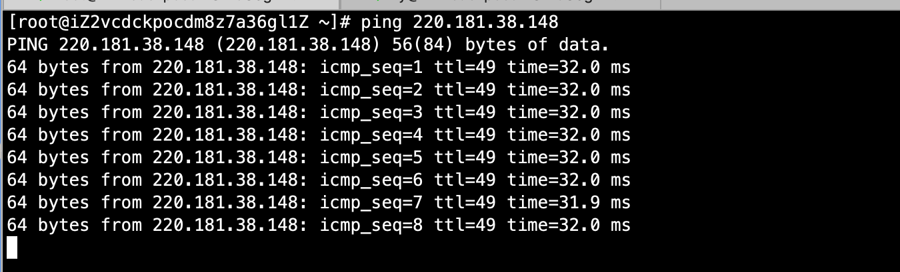

# 07-网络命令


## write命令

write：给用户发信息，以Crtl+D保存结束

指令所在路径：/usr/bin/write  执行权限：所有用户

```
语法： write <用户名> 
```

案例：给ly用户发送信息

```
[root@iZ2vcdckpocdm8z7a36gl1Z ~]# write ly
hello ly testing fkjll^H^H^H
```

按下Crtl+D保存结束，然后用ly用户查看


## wall命令

wall：发广播信息，英文：write all

命令所在路径：/usr/bin/wall，执行权限：所有用户

```
语法：wall [message]
```

案例：给所有在线用户发广播

```
[root@iZ2vcdckpocdm8z7a36gl1Z ~]# wall hello

Broadcast message from root@iZ2vcdckpocdm8z7a36gl1Z (pts/0) (Sun Dec 20 15:17:32 2020):

hello
```


## ping命令

ping：测试网络连通性

命令所在路径：/bin/ping，执行权限：所有用户

```
语法：ping 选项 IP地址
     -c 指定发送次数
```

案例：ping百度
```
ping 220.181.38.148
```




这个会一直发送请求，按crtl+c结束。time越短说明网络越好


我们还可以ping指定次数，使用-c参数，如下：

```
[root@iZ2vcdckpocdm8z7a36gl1Z ~]# ping -c 4 220.181.38.148
PING 220.181.38.148 (220.181.38.148) 56(84) bytes of data.
64 bytes from 220.181.38.148: icmp_seq=1 ttl=49 time=32.0 ms
64 bytes from 220.181.38.148: icmp_seq=2 ttl=49 time=32.0 ms
64 bytes from 220.181.38.148: icmp_seq=3 ttl=49 time=32.0 ms
64 bytes from 220.181.38.148: icmp_seq=4 ttl=49 time=31.9 ms

--- 220.181.38.148 ping statistics ---
4 packets transmitted, 4 received, 0% packet loss, time 3002ms
rtt min/avg/max/mdev = 31.981/32.011/32.034/0.219 ms
```


需要重点看丢包率，0% packet loss代表丢包率，如果丢包严重，说明网络非常差。这里是%0，也就是无丢包。


## ifconfig命令

ifconfig：查看和设置网卡信息，英文：interface configure。

命令所在路径：/sbin/ifconfig，执行权限：root

```
语法： ifconfig 网卡名称 IP地址
```

案例：查看网卡信息

```
[root@iZ2vcdckpocdm8z7a36gl1Z ~]# ifconfig
docker0: flags=4163<UP,BROADCAST,RUNNING,MULTICAST>  mtu 1500
        inet 172.17.0.1  netmask 255.255.0.0  broadcast 172.17.255.255
        ether 02:42:7b:84:12:be  txqueuelen 0  (Ethernet)
        RX packets 6642  bytes 9576617 (9.1 MiB)
        RX errors 0  dropped 0  overruns 0  frame 0
        TX packets 7682  bytes 654979 (639.6 KiB)
        TX errors 0  dropped 0 overruns 0  carrier 0  collisions 0

eth0: flags=4163<UP,BROADCAST,RUNNING,MULTICAST>  mtu 1500
        inet 172.19.177.154  netmask 255.255.240.0  broadcast 172.19.191.255
        ether 00:16:3e:01:fe:6c  txqueuelen 1000  (Ethernet)
        RX packets 5341372  bytes 1519412364 (1.4 GiB)
        RX errors 0  dropped 0  overruns 0  frame 0
        TX packets 3779570  bytes 2666194440 (2.4 GiB)
        TX errors 0  dropped 0 overruns 0  carrier 0  collisions 0

lo: flags=73<UP,LOOPBACK,RUNNING>  mtu 65536
        inet 127.0.0.1  netmask 255.0.0.0
        loop  txqueuelen 1000  (Local Loopback)
        RX packets 0  bytes 0 (0.0 B)
        RX errors 0  dropped 0  overruns 0  frame 0
        TX packets 0  bytes 0 (0.0 B)
        TX errors 0  dropped 0 overruns 0  carrier 0  collisions 0

veth26d2fd1: flags=4163<UP,BROADCAST,RUNNING,MULTICAST>  mtu 1500
        ether aa:7b:30:2a:89:8c  txqueuelen 0  (Ethernet)
        RX packets 5414  bytes 9400881 (8.9 MiB)
        RX errors 0  dropped 0  overruns 0  frame 0
        TX packets 6200  bytes 480932 (469.6 KiB)
        TX errors 0  dropped 0 overruns 0  carrier 0  collisions 0
```

lo代表本地回环网卡127.0.0.1，eth0本地真实网卡。

ifconfig 主要用来查看Ip地址，也就是： inet 172.19.177.154  


## mail命令

mail：查看发送电子邮件

命令所在路径：/bin/mail，执行权限：所有用户

```
语法：mail [用户名]
```


## last命令

last：列出目前与过去登入系统的用户信息

命令所在路径：/usr/bin/last ，命令执行权限：所有用户

```
语法：last
```

案例：

```
[root@iZ2vcdckpocdm8z7a36gl1Z ~]# last
ly       pts/1        182.148.58.182   Sun Dec 20 15:10   still logged in   
root     pts/0        182.148.58.182   Sun Dec 20 15:10   still logged in   
root     pts/0        171.223.206.218  Sat Dec 19 14:53 - 18:42  (03:49)    
root     pts/0        171.223.206.218  Sat Dec 19 14:44 - 14:52  (00:07)    
root     pts/0        171.223.206.218  Fri Dec 18 18:06 - 18:51  (00:45)    
ly       pts/1        171.223.206.218  Fri Dec 18 14:55 - 15:59  (01:04)    
root     pts/1        171.223.206.218  Fri Dec 18 14:53 - 14:53  (00:00)    
root     pts/0        171.223.206.218  Fri Dec 18 09:23 - 15:59  (06:36)    
root     pts/0        171.223.206.218  Thu Dec 17 16:35 - 22:15  (05:40)    
ly       pts/0        182.148.58.182   Wed Dec 16 21:42 - 00:46  (03:03)    
root     pts/1        182.148.58.182   Wed Dec 16 20:48 - 00:46  (03:57)    
root     pts/0        171.223.206.218  Wed Dec 16 14:50 - 21:19  (06:29)    
root     pts/0        171.223.206.218  Wed Dec 16 14:09 - 14:40  (00:30)    
root     pts/10       171.223.206.218  Wed Dec 16 12:01 - 16:07  (04:05)    
root     pts/9        171.223.206.218  Wed Dec 16 11:58 - 13:59  (02:00)    
root     pts/8        171.223.206.218  Wed Dec 16 11:40 - 13:41  (02:01)    
root     pts/7        171.223.206.218  Wed Dec 16 11:34 - 13:37  (02:02)    
root     pts/6        171.223.206.218  Wed Dec 16 11:26 - 13:32  (02:06)    
root     pts/5        171.223.206.218  Wed Dec 16 11:10 - 13:10  (02:00)    
root     pts/4        171.223.206.218  Wed Dec 16 11:01 - 13:01  (02:00)    
root     pts/3        171.223.206.218  Wed Dec 16 10:56 - 12:56  (02:00)    
root     pts/2        171.223.206.218  Wed Dec 16 10:48 - 12:51  (02:03)    
root     pts/1        171.223.206.218  Wed Dec 16 10:40 - 12:41  (02:00)    
root     pts/0        171.223.206.218  Wed Dec 16 10:22 - 12:32  (02:10)    
root     pts/0        171.223.206.218  Tue Dec 15 18:19 - 18:29  (00:09)    
root     pts/0        171.223.206.218  Tue Dec 15 18:18 - 18:19  (00:00)    
root     pts/2        171.223.206.218  Tue Dec 15 18:15 - 18:18  (00:03)    
root     pts/1        171.223.206.218  Tue Dec 15 18:11 - 18:15  (00:03)    
root     pts/0        171.223.206.218  Tue Dec 15 18:02 - 18:15  (00:12)    
root     pts/0        171.223.206.218  Tue Dec 15 17:03 - 17:15  (00:12)    
root     pts/5        171.223.206.218  Tue Dec 15 16:34 - 17:02  (00:27)    
root     pts/4        171.223.206.218  Tue Dec 15 16:19 - 18:27  (02:07)    
root     pts/3        171.223.206.218  Tue Dec 15 16:06 - 18:11  (02:04)    
root     pts/2        171.223.206.218  Tue Dec 15 15:51 - 18:01  (02:09)    
root     pts/1        171.223.206.218  Tue Dec 15 15:41 - 17:46  (02:05)    
root     pts/0        171.223.206.218  Tue Dec 15 14:54 - 17:01  (02:07)    
root     pts/0        125.70.77.30     Sun Dec 13 15:34 - 16:13  (00:38)    
root     pts/0        125.70.77.30     Sun Dec 13 15:33 - 15:34  (00:01)    
root     pts/0        125.70.77.30     Sun Dec 13 15:27 - 15:33  (00:05)    
root     pts/0        125.70.77.30     Sun Dec 13 15:12 - 15:27  (00:14)    
root     pts/0        171.223.206.218  Mon Dec  7 16:16 - 18:28  (02:12)    
root     pts/4        171.223.206.218  Mon Dec  7 15:35 - 17:47  (02:12)    
root     pts/3        171.223.206.218  Mon Dec  7 14:48 - 17:27  (02:38)    
root     pts/2        171.223.206.218  Mon Dec  7 14:24 - 16:39  (02:15)    
root     pts/1        171.223.206.218  Mon Dec  7 14:16 - 16:19  (02:02)    
root     pts/0        171.223.206.218  Mon Dec  7 14:10 - 16:13  (02:03)    
root     pts/0        171.223.206.218  Mon Dec  7 13:54 - 14:05  (00:10)    
root     pts/1        171.223.206.218  Fri Dec  4 16:46 - 18:50  (02:03)    
root     pts/0        171.223.206.218  Fri Dec  4 15:10 - 17:13  (02:03)    
root     pts/1        171.223.206.218  Thu Dec  3 20:04 - 20:08  (00:03)    
root     pts/4        171.223.206.218  Thu Dec  3 19:19 - 21:47  (02:28)    
root     pts/3        171.223.206.218  Thu Dec  3 19:04 - 21:12  (02:08)    
root     pts/0        171.223.206.218  Thu Dec  3 18:33 - 20:56  (02:22)    
root     pts/2        171.223.206.218  Thu Dec  3 17:51 - 20:29  (02:38)    
root     pts/1        171.223.206.218  Thu Dec  3 17:10 - 19:38  (02:28)    
root     pts/0        171.223.206.218  Thu Dec  3 16:21 - 18:32  (02:10)    
root     pts/2        171.223.206.218  Thu Dec  3 11:24 - 13:41  (02:16)    
root     pts/1        171.223.206.218  Thu Dec  3 10:53 - 13:19  (02:25)    
root     pts/0        171.223.206.218  Thu Dec  3 09:12 - 12:47  (03:34)    
root     pts/0        118.112.56.79    Wed Dec  2 21:03 - 22:34  (01:31)    
root     pts/0        171.223.206.218  Tue Dec  1 12:09 - 14:10  (02:01)    
root     pts/0        171.223.206.218  Fri Nov 20 18:36 - 18:38  (00:01)    
root     pts/1        171.223.206.218  Thu Nov  5 11:29 - 11:30  (00:00)    
root     pts/0        171.223.206.218  Thu Nov  5 11:09 - 13:10  (02:00)    
root     pts/0        47.96.60.212     Thu Nov  5 10:52 - 10:55  (00:03)    
root     pts/0        47.96.60.218     Thu Nov  5 10:52 - 10:52  (00:00)    
reboot   system boot  3.10.0-957.21.3. Thu Nov  5 18:49 - 15:43 (44+20:54)  
reboot   system boot  3.10.0-957.21.3. Thu Nov  5 18:32 - 10:48  (-7:-43)   
```

可以查看系统所有用户的登录，以及系统的重启信息。

## lastlog命令

lastlog：检查某特定用户最后一次登录的时间

命令所在路径：/usr/bin/lastlog，执行权限：所有用户

```
语法：lastlog  
     -u  指用户id
```


案例：使用lastlog命令，查看用户最后一次登录信息

```
[root@iZ2vcdckpocdm8z7a36gl1Z ~]# lastlog
Username         Port     From             Latest
root             pts/0    182.148.58.182   Sun Dec 20 15:10:24 +0800 2020
bin                                        **Never logged in**
daemon                                     **Never logged in**
adm                                        **Never logged in**
lp                                         **Never logged in**
sync                                       **Never logged in**
shutdown                                   **Never logged in**
halt                                       **Never logged in**
mail                                       **Never logged in**
operator                                   **Never logged in**
games                                      **Never logged in**
ftp                                        **Never logged in**
nobody                                     **Never logged in**
systemd-network                            **Never logged in**
dbus                                       **Never logged in**
polkitd                                    **Never logged in**
sshd                                       **Never logged in**
postfix                                    **Never logged in**
chrony                                     **Never logged in**
ntp                                        **Never logged in**
tcpdump                                    **Never logged in**
nscd                                       **Never logged in**
mysql                                      **Never logged in**
ly               pts/1    182.148.58.182   Sun Dec 20 15:10:44 +0800 2020
lgx                                        **Never logged in**
```


## traceroute

traceroute：显示数据包到主机间的路径

命令所在路径：/bin/traceroute，执行权限：所有用户

```
语法：traceroute
```

案例：查看到百度服务器的数据传递信息

```
[root@iZ2vcdckpocdm8z7a36gl1Z ~]# traceroute www.baidu.com
traceroute to www.baidu.com (180.101.49.12), 30 hops max, 60 byte packets
 1  * * *
 2  * * *
 3  11.205.0.34 (11.205.0.34)  4.633 ms *  4.744 ms
 4  11.142.211.34 (11.142.211.34)  0.709 ms 11.142.211.50 (11.142.211.50)  0.702 ms 11.142.211.34 (11.142.211.34)  0.721 ms
 5  116.251.118.130 (116.251.118.130)  15.810 ms 116.251.118.122 (116.251.118.122)  0.552 ms 116.251.118.130 (116.251.118.130)  15.966 ms
 6  117.49.47.153 (117.49.47.153)  42.618 ms  42.106 ms  42.004 ms
 7  10.54.254.169 (10.54.254.169)  41.227 ms 117.49.37.41 (117.49.37.41)  35.259 ms 42.120.239.185 (42.120.239.185)  36.611 ms
 8  42.120.247.98 (42.120.247.98)  34.467 ms 42.120.247.74 (42.120.247.74)  38.124 ms 45.112.223.50 (45.112.223.50)  36.523 ms
 9  115.238.21.118 (115.238.21.118)  41.087 ms 122.224.214.77 (122.224.214.77)  35.165 ms 122.224.214.73 (122.224.214.73)  43.357 ms
10  220.191.200.57 (220.191.200.57)  45.592 ms 220.191.200.223 (220.191.200.223)  34.029 ms 220.191.200.189 (220.191.200.189)  34.749 ms
11  202.97.101.118 (202.97.101.118)  38.154 ms 202.97.76.14 (202.97.76.14)  37.627 ms 202.97.101.142 (202.97.101.142)  37.336 ms
12  58.213.94.114 (58.213.94.114)  41.539 ms 58.213.95.2 (58.213.95.2)  37.533 ms 58.213.94.106 (58.213.94.106)  40.511 ms
13  * * 58.213.95.90 (58.213.95.90)  39.748 ms
14  58.213.96.58 (58.213.96.58)  46.354 ms 58.213.96.98 (58.213.96.98)  51.195 ms 58.213.96.54 (58.213.96.54)  44.116 ms
15  * * *
16  * * *
17  * * *
18  * * *
19  * * *
20  * * *
21  * * *
22  * * *
23  * * *
24  * * *
25  * * *
26  * * *
27  * * *
28  * * *
```


## netstat 命令

netstat：显示网络相关信息

命令所在路径：/bin/netstat，执行权限：所有用户

```
语法： netstat [选项]

常用选项：
-t： TCP协议
-u:  UDP协议
-l： 监听
-r： 路由
-n： 显示IP地址和端口号
-p: 进程ID和进程名

# netstat -tlun  查看本季监听的端口
# netstat -an    查看本机所有的网络链接
# netstat -rn    查看本机路由表
```


## mount挂载命令

```
语法： mount [-t 文件系统] 设备文件名 挂载点
# mount -t iso9660 /dev/sr0  /mnt/cdrom
```

使用umount进行挂载卸载

```
umount /dev/sr0
```

