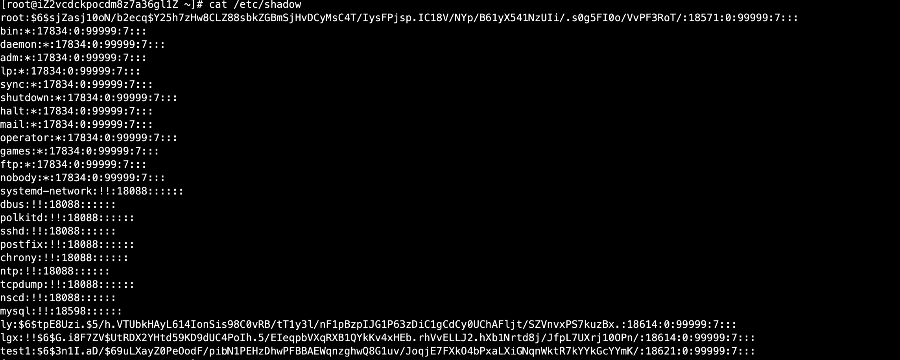
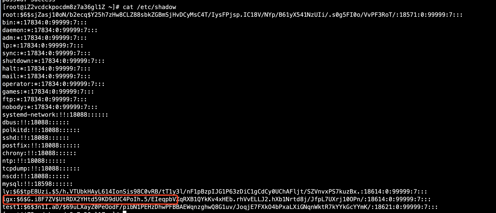
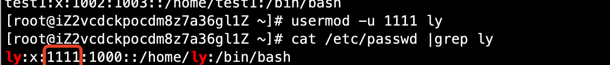
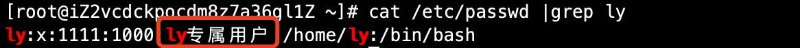
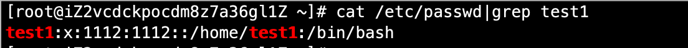

# 03-用户管理命令

## useradd命令


```
useradd [选项] 用户名
选项：
-u UID： 手工指定用户的UID号
-d 家目录： 手工指定用户的家目录
-c 用户说明：  手工指定用户的说明
-g 组名：    手工指定用户的初始组
-G 组名：    指定用户的附加组
-s shell：  手工指定用户的登录shell。默认是/bin/bash
```

2、添加默认用户

```
usreadd test1
```

可以发现以下文件都自动添加test1用户相关信息
```
[root@iZ2vcdckpocdm8z7a36gl1Z sh]# grep test1 /etc/passwd
test1:x:1002:1003::/home/test1:/bin/bash
[root@iZ2vcdckpocdm8z7a36gl1Z sh]# grep test1 /etc/shadow
test1:$6$3n1I.aD/$69uLXayZ0PeOodF/pibN1PEHzDhwPFBBAEWqnzghwQ8G1uv/JoqjE7FXkO4bPxaLXiGNqnWktR7kYYkGcYYmK/:18621:0:99999:7:::
[root@iZ2vcdckpocdm8z7a36gl1Z sh]# grep test1 /etc/group
test1:x:1003:
[root@iZ2vcdckpocdm8z7a36gl1Z sh]# grep test1 /etc/gshadow
test1:!::
[root@iZ2vcdckpocdm8z7a36gl1Z sh]# ll -d /home/test1/
drwx------ 2 test1 test1 4096 Dec 25 15:01 /home/test1/
[root@iZ2vcdckpocdm8z7a36gl1Z sh]# ll -s /var/spool/mail/
total 0
0 -rw-rw---- 1 lgx   mail 0 Dec 18 14:41 lgx
0 -rw-rw---- 1 ly    mail 0 Dec 16 21:39 ly
0 -rw-rw---- 1 test1 mail 0 Dec 25 15:01 test1
```

3、用户默认值文件

- /etc/default/useradd  

```
[root@iZ2vcdckpocdm8z7a36gl1Z sh]# cat /etc/default/useradd 
# useradd defaults file
GROUP=100              # 用户默认组 
HOME=/home             # 用户家目录
INACTIVE=-1            # 密码过期宽限天数
EXPIRE=                # 密码失效时间
SHELL=/bin/bash        # 默认shell
SKEL=/etc/skel         # 模板目录
CREATE_MAIL_SPOOL=yes  # 是否建立邮箱
```


-  /etc/login.defs 

```
MAIL_DIR        /var/spool/mail
#MAIL_FILE      .mail


PASS_MAX_DAYS   99999     # 密码有效期
PASS_MIN_DAYS   0         # 密码修改间隔
PASS_MIN_LEN    5         # 密码最小长度
PASS_WARN_AGE   7         # 密码到期警告

#
# Min/max values for automatic uid selection in useradd
#
UID_MIN                  1000    # 最小和UID
UID_MAX                 60000    # 最大UID
# System accounts
SYS_UID_MIN               201
SYS_UID_MAX               999

#
# Min/max values for automatic gid selection in groupadd
#
GID_MIN                  1000
GID_MAX                 60000
# System accounts
SYS_GID_MIN               201
SYS_GID_MAX               999

#
CREATE_HOME     yes

# the permission mask will be initialized to 022.
UMASK           077

#
USERGROUPS_ENAB yes
ENCRYPT_METHOD SHA512  # 加密模式
```

## passwd命令


设置和修改密码

```
语法：
passwd [选项] 用户名
选项：
    -S        查询用户密码的密码状态，仅root用户可用
    -l        暂时锁定用户，仅root可用
    -u        解锁用户，仅root可用
    --stdin   可以通过管道符输出的数据作为用户的密码
```

案例一：查询ly用户的密码状态

```
[root@iZ2vcdckpocdm8z7a36gl1Z ~]# passwd -S ly
ly PS 2020-12-18 0 99999 7 -1 (Password set, SHA512 crypt.)
```

案例二：锁定lgx用户

```
[root@iZ2vcdckpocdm8z7a36gl1Z ~]# passwd -l lgx
Locking password for user lgx.
passwd: Success
```

结果如下：



案例三：解锁用户

```
[root@iZ2vcdckpocdm8z7a36gl1Z ~]# passwd -u lgx
Unlocking password for user lgx.
passwd: Success
```

结果如下：




从上面结果可以看出，锁定和解锁都是对/etc/shadow文件的密码串进行操作，锁定在密码串前加了两个！，解锁去除！。


**使用字符串作为用户的密码**

```
echo "123" |passwd --stdin test2
```

## usermod命令


```
语法：
usermod [选项] 用户名
选项：
    -u UID： 修改用户的UID号
    -c 用户说明： 修改用户的说明信息
    -G 组名：    修改用户的附加组
    —L：        临时锁定用户
    -U：        解除用户锁定

```

案例一：修改用户UID信息

```
[root@iZ2vcdckpocdm8z7a36gl1Z ~]# usermod -u 1111 ly
```
结果如下：




案例二：修改用户说明信息

```
[root@iZ2vcdckpocdm8z7a36gl1Z ~]# usermod -c "ly专属用户" ly
```

结果：




## charge 命令

charge：修改用户密码状态

```
语法：
charge [选项] 用户名
选项：
    -l：    列出用户的详细密码状态
    -d 日期：   修改密码最后一次修改日期
    -m 天数：    两次密码修改间隔
    -M 天数：    密码有效期
    —W 天数：    密码过期前警告天数
    -I 天数：    密码过后宽限天数
    -E 日期：    账号失效时间
```

案例 一：列出用户密码相关信息

```
[root@iZ2vcdckpocdm8z7a36gl1Z ~]# chage -l ly
Last password change                                    : Dec 18, 2020
Password expires                                        : never
Password inactive                                       : never
Account expires                                         : never
Minimum number of days between password change          : 0
Maximum number of days between password change          : 99999
Number of days of warning before password expires       : 7
```

为什么要学习这个命令。这个命令-d参数有个非常重要的作用，


```
chage -d 0 ly
```

**这个命令的作用是将密码修改日期归0了，这样用户一登录就需要修改密码，非常有用！**


## userdel命令

userdel：删除用户

```
语法：
userdel [-r] 用户名
选项：
    -r 删除用户的同时删除用户家目录
```

案例：删除test1用户和家目录以及mail目录

```
[root@iZ2vcdckpocdm8z7a36gl1Z ~]# userdel -r test1
```

## su命令

su：切换用户身份

```
语法：
su [选项] 用户名
选项：
    -： 选项只使用-代表连带用户的环境变量一起切换
    -c： 仅执行一次命令，而不切换用户身份
```

案例一：切换成root用户

```
[ly@iZ2vcdckpocdm8z7a36gl1Z ~]$ su - root
Password: 
Last login: Mon Dec 28 09:46:46 CST 2020 from 171.223.206.218 on pts/0
Last failed login: Mon Dec 28 10:36:45 CST 2020 on pts/1
There were 2 failed login attempts since the last successful login.
[root@iZ2vcdckpocdm8z7a36gl1Z ~]# 
```

切换成root，输入密码验证过后即可切换成功。root切换成普通用户，不需要输入密码。


案例二：普通用户不切换成root，调用root权限执行useradd命令添加test1用户

```
[ly@iZ2vcdckpocdm8z7a36gl1Z ~]$ su - root -c "useradd test1"
Password: 
[ly@iZ2vcdckpocdm8z7a36gl1Z ~]$ 
```

结果如下：


