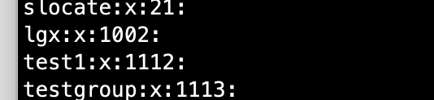

# 04-用户组管理命令


## 添加用户组groupadd

```
语法：
groupadd [选项] 组名
选项：
    -g GID： 指定组ID
```

案例：添加组
```
[root@iZ2vcdckpocdm8z7a36gl1Z ~]# groupadd testgroup
```

查看组文件信息如下：



## 修改用户组groupmod

```
语法：
groupmod [选项] 组名
选项：
        -g GID： 修改组ID
        -n 新组名： 修改组名
```

修改组名：

```
[root@iZ2vcdckpocdm8z7a36gl1Z ~]# groupmod -n  tgroup testgroup  # 新组名在前
```

结果如下：


## 删除用户组groupdel

```
语法：
groupdel 组名
```


案例：删除用户组
```
[root@iZ2vcdckpocdm8z7a36gl1Z ~]# groupdel tgroup
```


案例：将已添加的用户添加至组，本身组发生改变
```
[root@iZ2vcdckpocdm8z7a36gl1Z ~]# usermod -g tg test2
[root@iZ2vcdckpocdm8z7a36gl1Z ~]# usermod -g tg test3
```

案例二：将已添加用户添加至附加组

```
[root@iZ2vcdckpocdm8z7a36gl1Z ~]# usermod -G tg test1
```

## 把用户添加入组或从组中删除

```
语法：
gpasswd 选项 组名
选项：
    -a 用户名： 把用户加入组
    -d 用户名： 把用户从组中删除
```

案例一：将test1用户添加至组tgroup
```
[root@iZ2vcdckpocdm8z7a36gl1Z ~]# gpasswd -a test1 tgroup
Adding user test1 to group tgroup
```

案例二：从组tgroup中删除test1用户

```
[root@iZ2vcdckpocdm8z7a36gl1Z ~]# gpasswd -d test1 tgroup
Removing user test1 from group tgroup
```


**注意：在/etc/group文件中看到组信息后面的具体用户，都是以附加组的形式。**