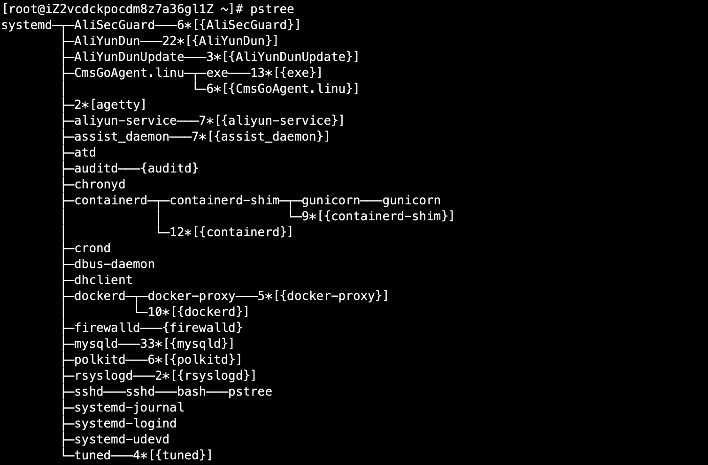

# 01-进程管理


## 进程信息查看


1、进程简介


- 进程是正在执行的一个程序或命令，每一个进程都是一个运行的实体，都有自己的地址空间。并且占用一定的系统资源。


2、进程管理的作用

- 判断服务器健康状态
- 查看系统中所有进程
- 杀死进程


3、查看系统中所有进程

使用ps命令

```
ps aux # 查看系统中所有进程，使用BSD操作系统格式
ps -le # 查看系统中所有进程，使用Linux标准命令格式
```


案例：查看系统所有进程

```
[root@iZ2vcdckpocdm8z7a36gl1Z ~]# ps aux
USER       PID %CPU %MEM    VSZ   RSS TTY      STAT START   TIME COMMAND
root         1  0.0  0.1  51728  3940 ?        Ss   Nov05   6:06 /usr/lib/systemd/systemd --switched-root --system --deserialize 22
root         2  0.0  0.0      0     0 ?        S    Nov05   0:00 [kthreadd]
root         3  0.0  0.0      0     0 ?        S    Nov05   0:05 [ksoftirqd/0]
root         5  0.0  0.0      0     0 ?        S<   Nov05   0:00 [kworker/0:0H]
root         7  0.0  0.0      0     0 ?        S    Nov05   0:00 [migration/0]
root         8  0.0  0.0      0     0 ?        S    Nov05   0:00 [rcu_bh]
root         9  0.0  0.0      0     0 ?        S    Nov05   8:53 [rcu_sched]
root        10  0.0  0.0      0     0 ?        S<   Nov05   0:00 [lru-add-drain]
root        11  0.0  0.0      0     0 ?        S    Nov05   0:12 [watchdog/0]
root        12  0.0  0.0      0     0 ?        S    Nov05   0:10 [watchdog/1]
root        13  0.0  0.0      0     0 ?        S    Nov05   0:00 [migration/1]
root        14  0.0  0.0      0     0 ?        S    Nov05   0:03 [ksoftirqd/1]
root        16  0.0  0.0      0     0 ?        S<   Nov05   0:00 [kworker/1:0H]
root        18  0.0  0.0      0     0 ?        S    Nov05   0:00 [kdevtmpfs]
root        19  0.0  0.0      0     0 ?        S<   Nov05   0:00 [netns]
root        20  0.0  0.0      0     0 ?        S    Nov05   0:01 [khungtaskd]
root        21  0.0  0.0      0     0 ?        S<   Nov05   0:00 [writeback]
root        22  0.0  0.0      0     0 ?        S<   Nov05   0:00 [kintegrityd]
root        23  0.0  0.0      0     0 ?        S<   Nov05   0:00 [bioset]
root        24  0.0  0.0      0     0 ?        S<   Nov05   0:00 [bioset]
root        25  0.0  0.0      0     0 ?        S<   Nov05   0:00 [bioset]
root        26  0.0  0.0      0     0 ?        S<   Nov05   0:00 [kblockd]
root        27  0.0  0.0      0     0 ?        S<   Nov05   0:00 [md]
root        28  0.0  0.0      0     0 ?        S<   Nov05   0:00 [edac-poller]
root        29  0.0  0.0      0     0 ?        S<   Nov05   0:00 [watchdogd]
root        36  0.0  0.0      0     0 ?        S    Nov05   0:00 [kswapd0]
root        37  0.0  0.0      0     0 ?        SN   Nov05   0:00 [ksmd]
root        38  0.0  0.0      0     0 ?        SN   Nov05   0:08 [khugepaged]
root        39  0.0  0.0      0     0 ?        S<   Nov05   0:00 [crypto]
root        47  0.0  0.0      0     0 ?        S<   Nov05   0:00 [kthrotld]
root        49  0.0  0.0      0     0 ?        S<   Nov05   0:00 [kmpath_rdacd]
root        50  0.0  0.0      0     0 ?        S<   Nov05   0:00 [kaluad]
root        51  0.0  0.0      0     0 ?        S<   Nov05   0:00 [kpsmoused]
root        52  0.0  0.0      0     0 ?        S<   Nov05   0:00 [ipv6_addrconf]
root        65  0.0  0.0      0     0 ?        S<   Nov05   0:00 [deferwq]
root        96  0.0  0.0      0     0 ?        S    Nov05   0:00 [kauditd]
root       246  0.0  0.0      0     0 ?        S<   Nov05   0:00 [ata_sff]
root       273  0.0  0.0      0     0 ?        S    Nov05   0:00 [scsi_eh_0]
root       278  0.0  0.0      0     0 ?        S<   Nov05   0:00 [scsi_tmf_0]
root       281  0.0  0.0      0     0 ?        S    Nov05   0:00 [scsi_eh_1]
root       290  0.0  0.0      0     0 ?        S<   Nov05   0:00 [scsi_tmf_1]
root       307  0.0  0.0      0     0 ?        S<   Nov05   0:01 [kworker/0:1H]
root       308  0.0  0.0      0     0 ?        S<   Nov05   0:00 [ttm_swap]
root       325  0.0  0.0      0     0 ?        S    Nov05   0:43 [jbd2/vda1-8]
root       326  0.0  0.0      0     0 ?        S<   Nov05   0:00 [ext4-rsv-conver]
root       333  0.0  0.0      0     0 ?        S<   Nov05   0:10 [kworker/1:1H]
root       393  0.0  0.0  17812  1844 ?        Ssl  Dec17   2:41 /usr/local/share/assist-daemon/assist_daemon
root       395  0.0  0.9  88292 36924 ?        Ss   Nov05   0:15 /usr/lib/systemd/systemd-journald
root       419  0.0  0.0  44600  2004 ?        Ss   Nov05   0:00 /usr/lib/systemd/systemd-udevd
root       568  0.0  0.0      0     0 ?        S<   Nov05   0:00 [nfit]
root       593  0.0  0.2 170456 11108 ?        Ssl  Nov05   0:02 /usr/local/cloudmonitor/CmsGoAgent.linux-amd64
dbus       595  0.0  0.0  58260  2516 ?        Ss   Nov05   0:29 /usr/bin/dbus-daemon --system --address=systemd: --nofork --nopidfile --systemd-activation
polkitd    604  0.0  0.3 612996 14256 ?        Ssl  Nov05   0:09 /usr/lib/polkit-1/polkitd --no-debug
root       608  0.0  0.0  26376  1772 ?        Ss   Nov05   0:15 /usr/lib/systemd/systemd-logind
root       612  0.0  0.0  25904   952 ?        Ss   Nov05   0:00 /usr/sbin/atd -f
root       614  0.0  0.0 126288  1628 ?        Ss   Nov05   0:06 /usr/sbin/crond -n
chrony     620  0.0  0.0 117784  1872 ?        S    Nov05   0:10 /usr/sbin/chronyd
root       627  0.0  0.0 110104   872 ttyS0    Ss+  Nov05   0:00 /sbin/agetty --keep-baud 115200,38400,9600 ttyS0 vt220
root       628  0.0  0.0 110104   864 tty1     Ss+  Nov05   0:00 /sbin/agetty --noclear tty1 linux
root       677  0.1  0.6 982588 25044 ?        Sl   Nov05 107:00 CmsGoAgent-Worker start
root       845  0.0  0.0 107464  2292 ?        Ss   Nov05   0:00 /sbin/dhclient -1 -q -lf /var/lib/dhclient/dhclient--eth0.lease -pf /var/run/dhclient-eth0.pid -H iZ
root       906  0.0  0.4 573920 17080 ?        Ssl  Nov05   5:45 /usr/bin/python2 -Es /usr/sbin/tuned -l -P
root       911  0.0  0.1 298568  6776 ?        Ssl  Nov05   2:26 /usr/sbin/rsyslogd -n
root      1131  0.0  0.1 112864  4340 ?        Ss   Nov05   0:00 /usr/sbin/sshd -D
root      7802  0.0  0.0  55524  1124 ?        S<sl Dec07   0:01 /sbin/auditd
root      8021  0.2  1.2 463092 45976 ?        Ssl  Dec07  65:51 /usr/bin/containerd
root      8389  0.0  0.0      0     0 ?        R    05:50   0:00 [kworker/1:1]
root      9325  0.0  1.9 594924 73664 ?        Ssl  Dec07   3:24 /usr/bin/dockerd -H fd:// --containerd=/run/containerd/containerd.sock
root     10565  0.0  0.2 218444  9116 ?        Sl   Dec07   0:00 /usr/bin/docker-proxy -proto tcp -host-ip 0.0.0.0 -host-port 6001 -container-ip 172.17.0.2 -containe
root     10571  0.0  0.2 110120  9352 ?        Sl   Dec07   0:41 containerd-shim -namespace moby -workdir /var/lib/containerd/io.containerd.runtime.v1.linux/moby/5ce
root     10588  0.0  0.5  85964 20368 ?        Ss   Dec07   3:19 /usr/bin/python3 /usr/local/bin/gunicorn -b 0.0.0.0:80 httpbin:app -k gevent
root     10617  0.0  0.8 131692 31748 ?        S    Dec07   5:29 /usr/bin/python3 /usr/local/bin/gunicorn -b 0.0.0.0:80 httpbin:app -k gevent
root     10891  0.0  0.0 436896  2796 ?        S<l  Dec28   0:21 /usr/local/aegis/AliSecGuard/AliSecGuard
root     12376  0.0  0.0      0     0 ?        R    07:10   0:00 [kworker/0:1]
root     17760  0.0  0.0      0     0 ?        S    09:00   0:00 [kworker/1:2]
root     18265  0.0  0.0      0     0 ?        S    09:10   0:00 [kworker/0:2]
root     18539  0.0  0.1 157260  5904 ?        Ds   09:15   0:00 sshd: root@pts/0
root     18542  0.0  0.0 115572  2216 pts/0    Ss   09:15   0:00 -bash
root     20860  0.0  0.0      0     0 ?        S    Dec13   0:04 [kworker/u4:1]
root     22705  0.0  0.0 155360  1884 pts/0    R+   10:39   0:00 ps aux
mysql    27648  0.0  6.1 1605260 230408 ?      Sl   Dec02  15:59 /usr/sbin/mysqld --daemonize --pid-file=/var/run/mysqld/mysqld.pid
root     27664  0.0  0.1  32532  4208 ?        S<sl Nov14  21:44 /usr/local/aegis/aegis_update/AliYunDunUpdate
root     27720  0.4  0.5 139032 19652 ?        S<sl Nov14 277:53 /usr/local/aegis/aegis_client/aegis_10_89/AliYunDun
root     30290  0.0  0.8 361948 32840 ?        Ssl  Dec02   0:03 /usr/bin/python -Es /usr/sbin/firewalld --nofork --nopid
root     32002  0.0  0.0      0     0 ?        S    Dec24   0:01 [kworker/u4:0]
root     32764  0.0  0.2 802928  8912 ?        Ssl  Dec17  15:34 /usr/local/share/aliyun-assist/2.2.0.69/aliyun-service
```


说明：

- USER：             该进程是由哪个用户产生的
- PID：                进程的ID号
- %CPU：           该进程占用CPU资源的百分比，占用越高，进程越消耗资源
- %MEM：          该进程占用物理内存的百分比，占用越高，进程越耗费资源
- VSZ：              该进程占用虚拟内存的大小，单位KB
-  RSS：             该进程占用实际物理内存的大小，单位KB
- TTY：              该进程是在哪个终端运行的。其中tty1-tty7代表本地控制台终端，tty1-tty6是本地的字符界面终端，tty7是图形终端。pts/0-255代表虚拟终端
- STAT：            进程状态。常见的状态有：R运行，S睡眠，T停止状态，  s包含子进程， +位于后台
- START：          该进程的启动时间
- TIME：             该进程占用CPU的运算时间，注意不是系统时间
- COMMAND：    产生此进程的命令名


4、查看系统健康状态

top命令能够查看系统状况，最关键的信息是头5行。

```
top [选项]
选项：
   -d： 指定top命令每隔几秒更新。默认是3秒
   
top命令的交互模式当中可以执行的命令：
    ?或h：    显示交互模式的帮助
    P：       以CPU使用率排序，默认就是此项
    M：       以内存的使用率排序
    N：       以PID排序
    q：       退出top
```


案例：
```
[root@iZ2vcdckpocdm8z7a36gl1Z ~]# top
top - 10:52:45 up 54 days, 3 min,  1 user,  load average: 0.00, 0.01, 0.05
Tasks:  86 total,   1 running,  85 sleeping,   0 stopped,   0 zombie
%Cpu(s):  0.0 us,  0.0 sy,  0.0 ni,100.0 id,  0.0 wa,  0.0 hi,  0.0 si,  0.0 st
KiB Mem :  3733780 total,   198472 free,   513632 used,  3021676 buff/cache
KiB Swap:        0 total,        0 free,        0 used.  2911712 avail Mem 

  PID USER      PR  NI    VIRT    RES    SHR S  %CPU %MEM     TIME+ COMMAND                                                                                         
    1 root      20   0   51728   3940   2608 S   0.0  0.1   6:06.83 systemd                                                                                         
    2 root      20   0       0      0      0 S   0.0  0.0   0:00.13 kthreadd                                                                                        
    3 root      20   0       0      0      0 S   0.0  0.0   0:05.64 ksoftirqd/0                                                                                     
    5 root       0 -20       0      0      0 S   0.0  0.0   0:00.00 kworker/0:0H                                                                                    
    7 root      rt   0       0      0      0 S   0.0  0.0   0:00.21 migration/0                                                                                     
    8 root      20   0       0      0      0 S   0.0  0.0   0:00.00 rcu_bh                                                                                          
    9 root      20   0       0      0      0 S   0.0  0.0   8:53.81 rcu_sched                                                                                       
   10 root       0 -20       0      0      0 S   0.0  0.0   0:00.00 lru-add-drain                                                                                   
   11 root      rt   0       0      0      0 S   0.0  0.0   0:12.41 watchdog/0                                                                                      
   12 root      rt   0       0      0      0 S   0.0  0.0   0:10.26 watchdog/1                                                                                      
   13 root      rt   0       0      0      0 S   0.0  0.0   0:00.22 migration/1                                                                                     
   14 root      20   0       0      0      0 S   0.0  0.0   0:03.91 ksoftirqd/1                                                                                     
   16 root       0 -20       0      0      0 S   0.0  0.0   0:00.00 kworker/1:0H                                                                                    
   18 root      20   0       0      0      0 S   0.0  0.0   0:00.00 kdevtmpfs                                                                                       
   19 root       0 -20       0      0      0 S   0.0  0.0   0:00.00 netns                                                                                           
   20 root      20   0       0      0      0 S   0.0  0.0   0:01.08 khungtaskd                                                                                      
   21 root       0 -20       0      0      0 S   0.0  0.0   0:00.00 writeback                                                                                       
   22 root       0 -20       0      0      0 S   0.0  0.0   0:00.00 kintegrityd                                                                                     
   23 root       0 -20       0      0      0 S   0.0  0.0   0:00.00 bioset                                                                                          
   24 root       0 -20       0      0      0 S   0.0  0.0   0:00.00 bioset                                                                                          
   25 root       0 -20       0      0      0 S   0.0  0.0   0:00.00 bioset                                                                                          
   26 root       0 -20       0      0      0 S   0.0  0.0   0:00.00 kblockd                                                                                         
   27 root       0 -20       0      0      0 S   0.0  0.0   0:00.00 md                                                                                              
   28 root       0 -20       0      0      0 S   0.0  0.0   0:00.00 edac-poller                                                                                     
   29 root       0 -20       0      0      0 S   0.0  0.0   0:00.00 watchdogd                                                                                       
   36 root      20   0       0      0      0 S   0.0  0.0   0:00.25 kswapd0                                                                                         
   37 root      25   5       0      0      0 S   0.0  0.0   0:00.00 ksmd                                                                                            
   38 root      39  19       0      0      0 S   0.0  0.0   0:08.34 khugepaged                                                                                      
   39 root       0 -20       0      0      0 S   0.0  0.0   0:00.00 crypto            
```

说明：

- 第1行信息为任务队列信息

|              内容               |                       说明                        |
| ------------------------------- | ------------------------------------------------ |
| 10:52:45                        | 系统当前时间                                       |
| up 54 days, 3 min              | 系统的运行时间，本机已经运行54天3min                 |
| 1 user                          | 当前登录的用户数                                    |
| load average: 0.00, 0.01, 0.05 | 系统在之前1分钟，5分钟，15分钟的平均负载。如果是单核CPU，一般认为小于1时，负载较小，如果大于1，系统已经超出负荷 |


- 第2行内容为进程信息

|       内容        |                             说明                             |
| ---------------- | ----------------------------------------------------------- |
| Tasks:  86 total | 系统中的进程总数                                               |
| 1 running        | 正在运行的进程数                                               |
| 85 sleeping      | 睡眠的进程                                                    |
| 0 stopped        | 正在停止的进程                                                |
| 0 zombie         | 僵尸进程。如果不是0，需要手工查看僵尸进程。僵尸进程指未停止完毕的进程 |


- 第3行为CPU信息

|       内容        |                                  说明                                   |
| ---------------- | ---------------------------------------------------------------------- |
| %Cpu(s):  0.0 us | 用户模式占用的CPU百分比                                                   |
| 0.0 sy           | 系统模式占用的CPU百分比                                                   |
| 0.0 ni           | 改变过优先级的用户进程占用的CPU百分比                                       |
| 100.0 id         | 空闲CPU的CPU百分比                                                       |
| 0.0 wa           | 等待输入/输出的进程占用CPU百分比                                           |
| 0.0 hi           | 硬中断请求服务占用CPU的百分比                                              |
| 0.0 si           | 软中断请求服务占用的CPU百分比                                              |
| 0.0 st           | st(Steal time)虚拟时间百分比。就是当有虚拟机时，虚拟CPU等待实际CPU的时间百分比 |


- 第4行为物理内存信息

|           内容            |         说明         |
| ------------------------- | ------------------- |
| KiB Mem :  3733780 total | 物理内存的总量，单位KB |
| 198472 free              | 空闲的物理内存数量     |
| 513632 used              | 已经使用的物理内存数量 |
| 3021676 buff/cache       | 作为缓冲的内存数量     |


- 第5行为交换分区（swap）信息

|           内容            |           说明            |
| ------------------------- | ------------------------ |
| KiB Swap:        0 total | 交换分区（虚拟内存）的总大小 |
| 0 free                   | 空闲交换分区的大小          |
| 0 used                   | 已经使用的交换分区的大小    |
| 2911712 avail Mem        |       作为缓存的交换分区大小                   |


## 终止进程


1、kill 命令

```
kill -l  # 查看可用的进程信号
```

案例：查看可用进程信号
```
[root@iZ2vcdckpocdm8z7a36gl1Z ~]# kill -l
 1) SIGHUP       2) SIGINT       3) SIGQUIT      4) SIGILL       5) SIGTRAP
 6) SIGABRT      7) SIGBUS       8) SIGFPE       9) SIGKILL     10) SIGUSR1
11) SIGSEGV     12) SIGUSR2     13) SIGPIPE     14) SIGALRM     15) SIGTERM
16) SIGSTKFLT   17) SIGCHLD     18) SIGCONT     19) SIGSTOP     20) SIGTSTP
21) SIGTTIN     22) SIGTTOU     23) SIGURG      24) SIGXCPU     25) SIGXFSZ
26) SIGVTALRM   27) SIGPROF     28) SIGWINCH    29) SIGIO       30) SIGPWR
31) SIGSYS      34) SIGRTMIN    35) SIGRTMIN+1  36) SIGRTMIN+2  37) SIGRTMIN+3
38) SIGRTMIN+4  39) SIGRTMIN+5  40) SIGRTMIN+6  41) SIGRTMIN+7  42) SIGRTMIN+8
43) SIGRTMIN+9  44) SIGRTMIN+10 45) SIGRTMIN+11 46) SIGRTMIN+12 47) SIGRTMIN+13
48) SIGRTMIN+14 49) SIGRTMIN+15 50) SIGRTMAX-14 51) SIGRTMAX-13 52) SIGRTMAX-12
53) SIGRTMAX-11 54) SIGRTMAX-10 55) SIGRTMAX-9  56) SIGRTMAX-8  57) SIGRTMAX-7
58) SIGRTMAX-6  59) SIGRTMAX-5  60) SIGRTMAX-4  61) SIGRTMAX-3  62) SIGRTMAX-2
63) SIGRTMAX-1  64) SIGRTMAX
```


说明：我们来学习几个常用的信号


| 信号代号 | 信号名称 |                                        说明                                         |
| ------- | ------- | ---------------------------------------------------------------------------------- |
| 1       | SIGHUP  | 该信号让进程立即关闭，然后重新读取配置文件之后重启                                        |
| 2       | SIGINIT | 程序终止信号，用于终止前台进程。相当于输出crtl+c快捷键                                   |
| 8       | SIGFPE  | 在发生致命的算术运算错误时发出，不仅包括浮点运算错误，还包括溢出及除数为0等其它所有等算术等错误 |
| 9       | SIGKILL | 用来立即结束程序的运行，本信号不能被阻塞、处理和忽略，一般用于强制终止进程                   |
| 14      | SIGALRM | 时钟定时信号，计算的是实际的时间或时钟时间                                               |
| 15      | SIGTERM | 正常结束进程的信号， kill命令的默认信号，有时如果进程已经发生问题，这个信号是无法正常终止进程的 |
| 18      | SIGCONT | 该信号可以让暂停的进程恢复执行，本信号不能被阻断                                          |
| 19      | SIGSTOP | 该信号可以暂停前台进程，相当与crtl+z快捷键。本信号不能被阻断                               |


```
# 重启进程
kill -1 进程ID
# 强制杀死进程
kill -9 进程ID
```

使用pstree命令可以查看进程树，也就是可以查看进程中的子进程关系信息




2、killall命令

作用：按照进程名杀死进程

```
语法：
killall [选项] [信号] 进程名

选项：
      -i： 交互式，询问是否要杀死某个进程
      -I： 忽略进程名的大小写
```


3、pkill命令

按照进程名终止进程

```
语法：
pkill [选项] [信号] 进程名

选项：
    -t 终端号： 按照终端号踢出用户
```

案例：按照终端号踢出用户
```
# 使用w命令查询本机已登录的用户
w
# 强制杀死pts/1虚拟终端登录的进程
pkill -t -9 /pts/1
```

