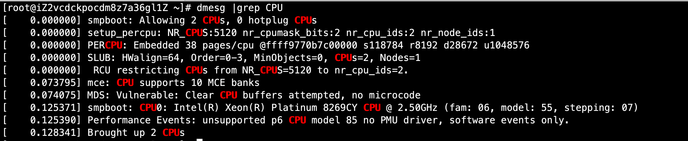

# 03-系统资源查看


1、vmstat命令监控系统资源

```
语法：
vmstat [刷新延时  刷新次数]
```

案例：
```
[root@iZ2vcdckpocdm8z7a36gl1Z ~]# vmstat 1 3
procs -----------memory---------- ---swap-- -----io---- -system-- ------cpu-----
 r  b   swpd   free   buff  cache   si   so    bi    bo   in   cs us sy id wa st
 1  0      0 197092 221188 2802376    0    0     0     3    2    5  0  0 100  0  0
 0  0      0 197108 221188 2802408    0    0     0     0  503  919  0  0 99  0  0
 0  0      0 197108 221188 2802408    0    0     0    56  412  851  0  0 100  0  0
```


2、demesg开机时内核检测信息

```
demesg
demesg |grep CPU
```




3、free 命令查看内存使用状态

```
free [-b|-k|-m-g]
选项：
-b： 以字节单位显示
-k： 以KB单位显示，默认就是以kb为单位
-m： 以MB为单位显示
-g： 以GB为单位显示
```

案例：
```
[root@iZ2vcdckpocdm8z7a36gl1Z ~]# free -m
              total        used        free      shared  buff/cache   available
Mem:           3646         500         192           0        2952        2844
Swap:             0           0           0
```


缓存和缓冲的区别：

- 简单来说缓存（cache）是用来加速数据从硬盘中“读取”的，而缓冲（buffer）是用来加速数据“写入”硬盘的。


**查看cpu详细信息，也可以查看/proc/cpuinfo文件**

proc是内挂载的文件，一旦断电就会消失，里面的文件。


4、uptime命令

```
uptime 
显示系统的启动时间和平均负载，也就是top命令的第一行，w命令也可以看到这个数据
```


5、查看系统内核信息

```
uname [选项]
选项：
    -a： 查看系统所有相关信息
    -r： 查看内核版本
    -s： 查看内核名称
```

案例：
```
[root@iZ2vcdckpocdm8z7a36gl1Z ~]# uname -r
3.10.0-957.21.3.el7.x86_64
```

判断当前系统的位数：

```
file 系统命令
```

案例：
```
[root@iZ2vcdckpocdm8z7a36gl1Z ~]# file /bin/ls
/bin/ls: ELF 64-bit LSB executable, x86-64, version 1 (SYSV), dynamically linked (uses shared libs), for GNU/Linux 2.6.32, BuildID[sha1]=ceaf496f3aec08afced234f4f36330d3d13a657b, stripped
```
可以发现是64位系统


查询当前Linux系统的发行版本
```
[root@iZ2vcdckpocdm8z7a36gl1Z ~]# lsb_release -a
LSB Version:    :core-4.1-amd64:core-4.1-noarch
Distributor ID: CentOS
Description:    CentOS Linux release 7.6.1810 (Core) 
Release:        7.6.1810
Codename:       Core
```

6、列出进程打开或使用的文件信息

```
lsof [选项]
选项：
    -c 字符串： 只列出以字符串开头的进程打开的文件
    -u 用户名： 只列出某个用户的进程打开的文件
    -p pid：   列出某个PID进程打开的文件
```

