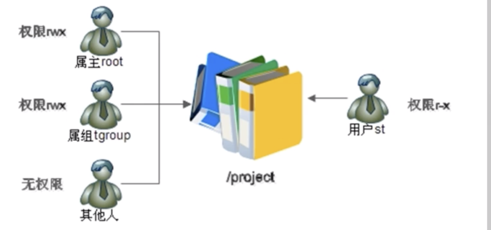
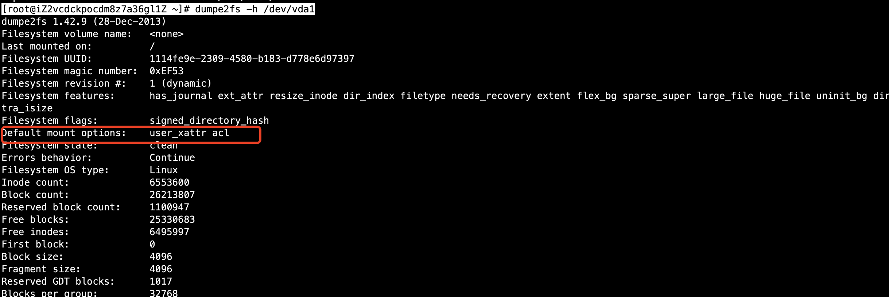
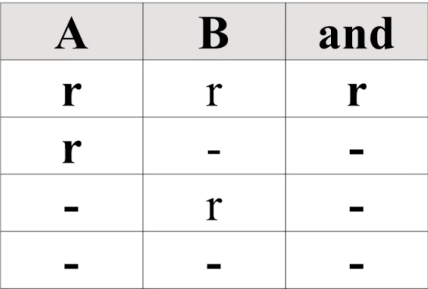

# 01-ACL权限


## ACL权限简介




ACL权限是解决系统默认的所属者、所属组、其它人都不能满足用户权限时，而给特定用户增加的权限。

要使用ACL权限，需要查看分区ACL权限是否开启。

```
语法：
dumpe2fs -h /dev/vda1
选项：
-h 仅显示超级块中信息，而不显示磁盘块组的详细信息
```

案例：



可以发现，acl权限已默认开启。


**dumpe2fs命令是查询指定分区详细文件系统信息的命令**


临时开启分区ACL权限

```
mount -o remount，acl/
重新挂载跟分区，并挂载加入acl权限
```

永久开启分区ACL权限

```
vi /etc/fstab
UUID=1114fe9e-2309-4580-b183-d778e6d97397 /                       ext4    defaults,acl        1 1
```
在defaults后面加入acl 即可。然后重新挂载文件（mount -o remount /）或系统或重启，生效。


## ACL权限查看与设定


1、查看ACL命令

```
语法： getfacl  文件名
# 查看acl权限
```


案例：查看ACL权限
```
[root@iZ2vcdckpocdm8z7a36gl1Z ~]# getfacl /tmp/project/
getfacl: Removing leading '/' from absolute path names
# file: tmp/project/
# owner: root
# group: tgroup
user::rwx
user:st:r-x
group::rwx
mask::rwx
other::---
```


2、设定ACL权限

```
语法： setfacl 选项 文件名
选项：
      -m   设定ACL权限
      -x   删除指定的ACL权限
      -b   删除所有的ACL权限
      -d   设定默认ACL权限
      -k   删除默认ACL权限
      -R   递归设定ACL权限
```


案例：/tmp/project目录给用户st添加acl权限rx
```
[root@iZ2vcdckpocdm8z7a36gl1Z ~]# useradd test3
[root@iZ2vcdckpocdm8z7a36gl1Z ~]# gpasswd -a test2 tgroup
Adding user test2 to group tgroup
[root@iZ2vcdckpocdm8z7a36gl1Z ~]# gpasswd -a test3 tgroup
Adding user test3 to group tgroup
[root@iZ2vcdckpocdm8z7a36gl1Z ~]# chown root:tgroup /tmp/project/
[root@iZ2vcdckpocdm8z7a36gl1Z ~]# ll -d /tmp/project/
drwxr-xr-x 2 root tgroup 4096 Dec 28 14:37 /tmp/project/
[root@iZ2vcdckpocdm8z7a36gl1Z ~]# chmod 770 /tmp/project/
[root@iZ2vcdckpocdm8z7a36gl1Z ~]# ll -d /tmp/project/
drwxrwx--- 2 root tgroup 4096 Dec 28 14:37 /tmp/project/
[root@iZ2vcdckpocdm8z7a36gl1Z ~]# useradd st
[root@iZ2vcdckpocdm8z7a36gl1Z ~]# setf
setfacl   setfiles  setfont   
[root@iZ2vcdckpocdm8z7a36gl1Z ~]# setfacl -m u:st:rx /tmp/project/
[root@iZ2vcdckpocdm8z7a36gl1Z ~]# ll -d /tmp/project/
drwxrwx---+ 2 root tgroup 4096 Dec 28 14:37 /tmp/project/
```

可以发现设定ACL权限后面多了个+号

然后我们用st用户进行如下测试，：

```
[root@iZ2vcdckpocdm8z7a36gl1Z ~]# su - st
[st@iZ2vcdckpocdm8z7a36gl1Z ~]$ cd /tmp/project/
[st@iZ2vcdckpocdm8z7a36gl1Z project]$ ls
[st@iZ2vcdckpocdm8z7a36gl1Z project]$ touch abc
touch: cannot touch ‘abc’: Permission denied
```
可以发现，权限已经生效，不能添加文件，无w权限


3、给用户组设定ACL权限

案例：给tgroup2组增加ACL权限

```
# 增加ACL权限
[root@iZ2vcdckpocdm8z7a36gl1Z ~]# setfacl -m g:tgroup2:rwx /tmp/project/
# 查看ACL权限
[root@iZ2vcdckpocdm8z7a36gl1Z ~]# getfacl /tmp/project/
getfacl: Removing leading '/' from absolute path names
# file: tmp/project/
# owner: root
# group: tgroup
user::rwx
user:st:r-x
group::rwx
group:tgroup2:rwx
mask::rwx
other::---
```


## 最大有效权限mask


- mask： 是用来指定最大有效权限的，如果我给用户赋予了ACL权限，是需要和mask的权限“相与”才能得到用户的真正权限


与结果如下图：




设置mask最大权限为rx，如下：

```
[root@iZ2vcdckpocdm8z7a36gl1Z ~]# setfacl -m m:rx /tmp/project/
```

然后我们查看下 /tmp/project/的ACL权限：

```
[root@iZ2vcdckpocdm8z7a36gl1Z ~]# getfacl  /tmp/project/
getfacl: Removing leading '/' from absolute path names
# file: tmp/project/
# owner: root
# group: tgroup
user::rwx
user:st:r-x
group::rwx                      #effective:r-x
group:tgroup2:rwx               #effective:r-x
mask::r-x
other::---
```

可以发现，文件的最大权限就被调整了。


## 删除ACL权限

```
语法：
# 删除指定用户的ACL权限
seffacl -x u:用户名 文件名

# 删除指定用户组的ACL权限
setfacl -x g：组名  文件名
```

案例：删除tgroup2的ACL权限

```
[root@iZ2vcdckpocdm8z7a36gl1Z ~]# setfacl -x g:tgroup2 /tmp/project/
# 查看文件的ACL权限，发现tgroup2已经被删除
[root@iZ2vcdckpocdm8z7a36gl1Z ~]# getfacl  /tmp/project/
getfacl: Removing leading '/' from absolute path names
# file: tmp/project/
# owner: root
# group: tgroup
user::rwx
user:st:r-x
group::rwx
mask::rwx
other::---

```


## 递归ACL权限


- 递归是父目录在设定ACL权限时，所有的子文件和子目录也会拥有相同的ACL权限

```
setfacl -m u:用户名：权限 -R 文件名
```

使用递归设置ACL权限时会存在一个问题，就是设置完权限之后，新创建的文件，不具备ACL权限，因为这个是在执行命令后创建文件的。如何解决这个问题就需要使用默认ACL权限


## 默认ACL权限


默认ACL权限的作用是如果给父目录设定了默认ACL权限，那么父目录中所有新建的子文件都会继承父目录的ACL权限。

```
setfacl -m d:u:用户名:权限 文件名
```

案例：
```
[root@iZ2vcdckpocdm8z7a36gl1Z project]# setfacl -m d:u:st:rx -R /tmp/project/
```

