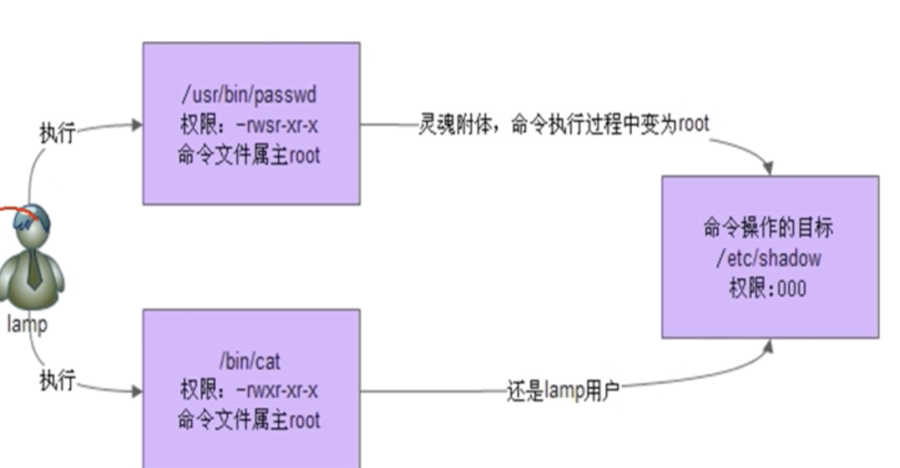

# 02-文件特殊权限


## SetUID


1、SetUID的功能

- 只有可以执行的二进制程序才能设定SUID权限
- 命令执行者要对该程序拥有x执行权限
- 命令执行者在执行该程序时获得该程序文件属主的身份（在执行程序的过程中灵魂附体为文件的属主）
- SetUID权限只在该程序执行过程中有效，也就是说身份改变只在程序执行的过程中有效


passwd命令拥有SetUID权限，所以普通用户可以修改自己的密码。

```
[root@iZ2vcdckpocdm8z7a36gl1Z project]# ll /bin/passwd 
-rwsr-xr-x. 1 root root 27832 Jun 10  2014 /bin/passwd
```

可以发现在所属者权限位里面多了一个s权限。


cat命令没有SetUID权限，所以普通用户不能查看/etc/shadow文件内容




2、设定SetUID的方法

- 4代表SUID

```
chmod 4755 文件名  4代表SUID  2代表组SGID  1代表SBIT，其它人
chmod u+s 文件名
两种方式都行
```


3、危险的SetUID

- 关键目录应严格控制写权限。比如“/”、 “/usr”等
- 用户的密码设置要严格遵守密码三原则
- 对系统中默认应该具有SetUID权限的文件作一列表，定时检查有没有这之外被设置了SetUID权限


## SetGID


1、SetGID针对文件的作用

- 只有可执行的二进制程序才能设置SGID权限
- 命令执行者要对该程序拥有x执行权限
- 命令在执行程序对时候，组身份升级为该程序文件的属组
- SetGID权限同样只在该程序执行过程中有效，也就是说组身份改变只在程序执行过程中有效


```
[root@iZ2vcdckpocdm8z7a36gl1Z project]# ll /usr/bin/locate 
-rwx--s--x 1 root slocate 40520 Apr 11  2018 /usr/bin/locate
```

可以发现locate命令具备SGID权限


2、SetGID针对目录的作用

- 普通用户必须对此目录拥有r和x权限，才能进入此目录
- 普通用户在此目录中的有效组会变成此目录的属组
- 若普通用户对此目录拥有w权限时，新建对文件的默认属组是这个目录的属组


3、设定SetGID

- 2代表SGID

```
chmod 2755 文件名
chmod g+s 文件名
```


4、取消SetGID

- chmod 755 文件名
- chmod g-s 文件名


## Sticky BIT


1、SBIT粘着位作用

- 粘着位目前只对目录有效
- 普通用户对该目录拥有w和x权限，即普通用户可以在此目录拥有写入权限
- 如果没有粘着位，因为普通用户拥有w权限，所以可以删除此目录下所有文件，包括其它用户建立文件。一但赋予了粘着位，除了root可以删除所有文件，普通用户就算拥有w权限，也只能删除自己建立的文件，但是不能删除其它用户建立的文件


我们来看下/tmp目录，其实就是粘着位目录

```
[root@iZ2vcdckpocdm8z7a36gl1Z ~]# ll -d /tmp
drwxrwxrwt. 10 root root 4096 Dec 28 16:21 /tmp
```
可以发现其它人里面有个t标志。代表SBIT权限。有SBIT权限的目录，其它用户只能删除自己创建的文件，不能删除其它人创建的文件，即使你对文件有读写执行权限。


2、 设置与取消粘着位

```
# 设置粘着位
chmod 1755 目录名， 755可以是rwx的任意组合数字
chmod o+t 目录名
# 取消粘着位
chmod 777 目录名
chmod o-t 目录名
```

