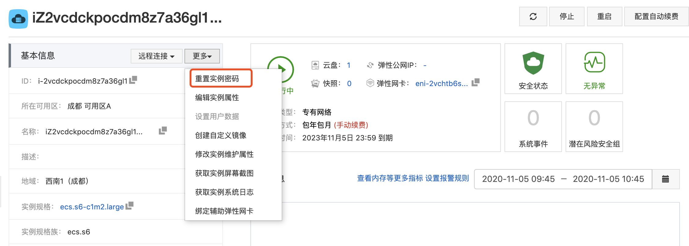
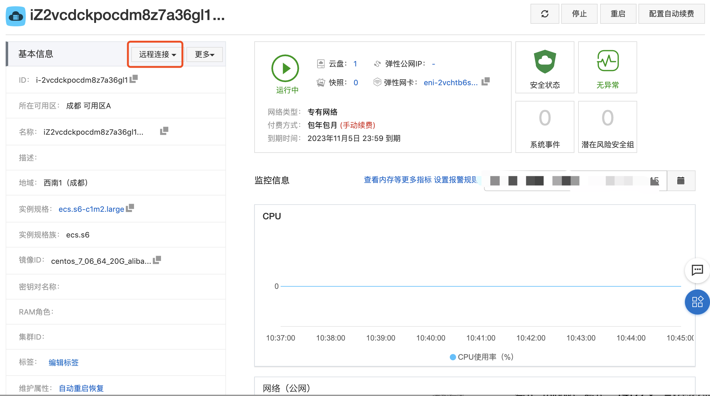
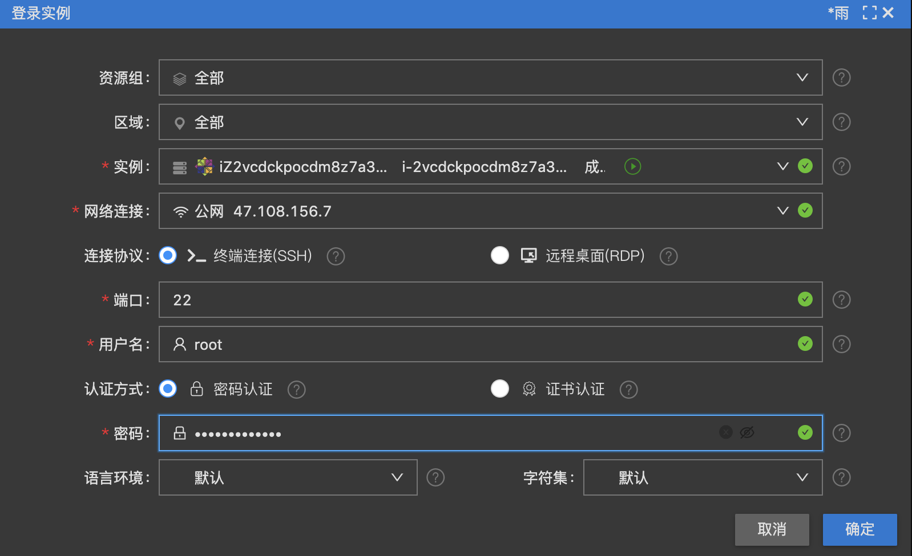
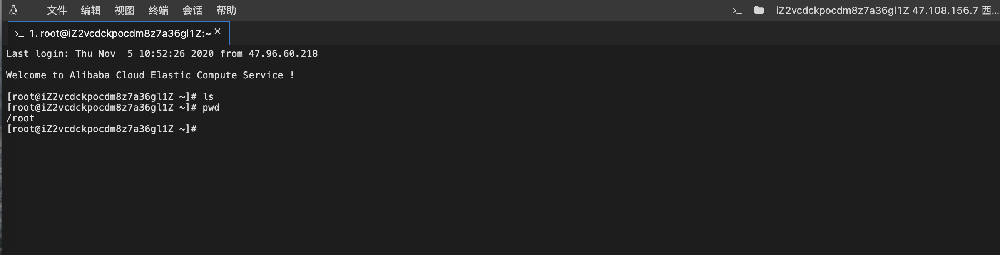
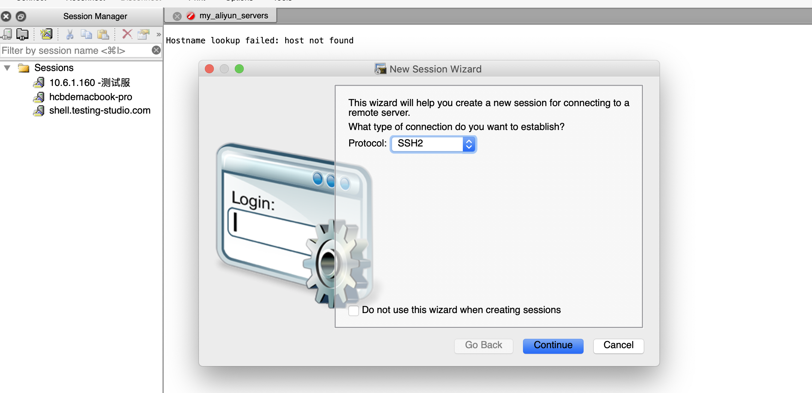
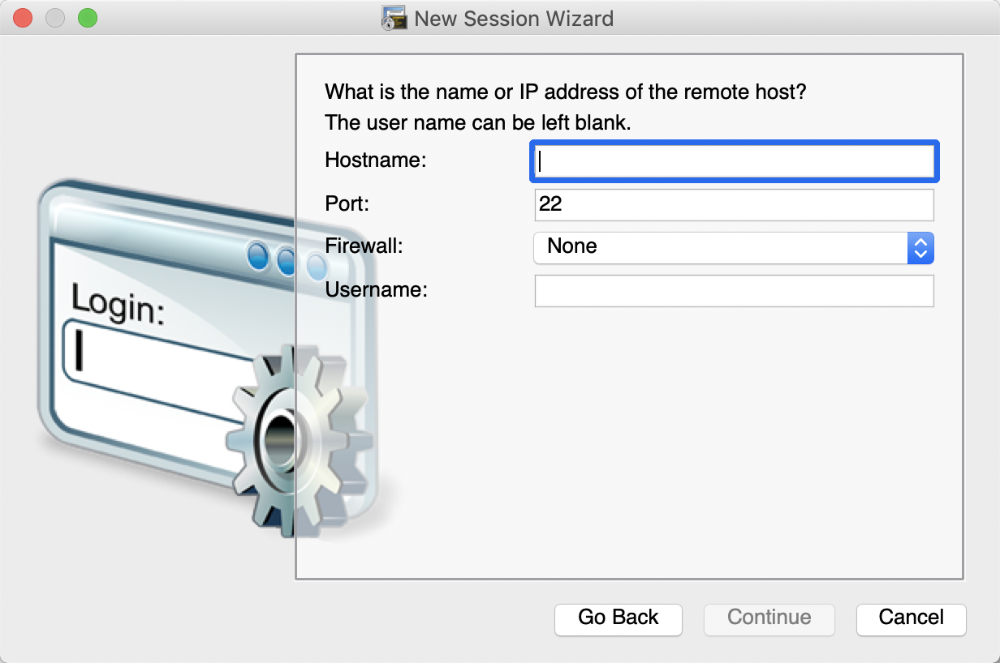
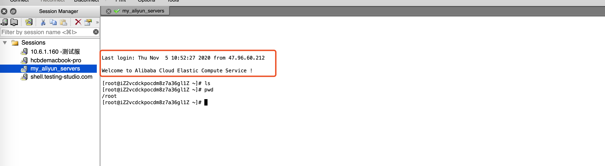

# 01-阿里云服务器搭建

## 云服务器ECS

首先进入阿里云购买服务器：
 
 购买地址：https://www.aliyun.com/1111/home?userCode=0yrd0roz

购买成功之后，会分配一个实例ID，也就是ECS的实例。

首次实例创建后，建议先修改实例密码。

**远程连接**

进入阿里云实例页面，点击远程连接：

然后进入远程连接确认页面

连接成功：

### SecureCRT 连接

首先打开工具SecureCRT，创建新的session

点击continue：
 
 - 输入阿里云实例的IP，端口22
 
实例IP可以在配置信息查看，购买成功之后短信也会通知！

输入信息后，输入密码即可连接至服务器。

当页面上出现，Welcome to Alibaba Cloud Elastic Compute Service ! 就算连接成功啦。