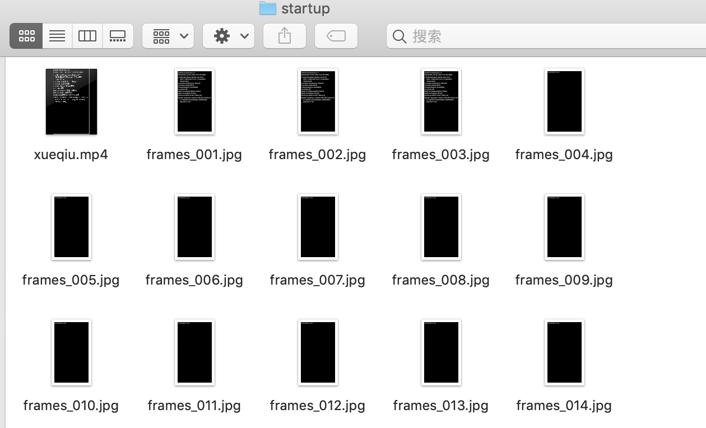

# 01-移动端性能测试


## 什么是专项测试

首先我们来看一下测试行业基本的测试checklist和手段


- 业务测试：主要是面向新需求，采用人工测试和接口测试等方法
- 回归测试：主要面向已交付需求，采用接口自动化、UI自动化、自动遍历回归测试等方法
- 非功能测试：（针对专项质量问题的测试）
  - 聚焦于业务与具体平台结合时产生的问题
  - 移动端性能问题（硬件相关，比如cpu、mem、disk、network、gpu）
  - 移动端场景问题（场景相关、比如呀弱网测试、兼容性测试、国际化、跨地区）

**非功能测试解决的是用户体验类问题，更关注的是用户体验而不是功能层面，通常也把这一领域称之为专项测试**


而移动端专项测试，可以把它分为2部分内容：（性能测试和场景测试）

 - 性能测试：重点关注耗电量、卡顿、h5性能
 - 场景测试：重点关注兼容性、健壮性、弱网、安全测试


## 专项测试维度


主要分为2个维度，从用户维度以及技术维度来剖析：

**用户维度：**

- 崩溃   （crash、弱网）
- 卡顿   （掉帧、gc、cpu）
- 响应慢（启动时间、交互响应、H5加载）
- 发热   （cpu、mem、io、network、gps等硬件使用）
- 掉电快  (硬件占用)
- 兼容性问题（机型覆盖、回归）


**技术维度**

- 崩溃
  - 自动遍历、monkey测试、横竖屏切换、快速进退
- 卡顿(掉帧、gc、cpu)
  - 卡顿测试、内存泄漏测试、method profile
- 响应慢(启动时间、交互响应、H5加载)
  - 冷热启动、界面切换、h5性能测试
- 发热(cpu，mem、io、network、gps等硬件使用)
  - method profile、gc统计、io统计、流量统计、硬件使用统计、耗电量分析
- 兼容性问题（机型覆盖、回归）
  - 兼容性测试、自动化测试、自动遍历、monkey测试


## app性能


**acitivity启动流程**


app启动主要流程分析：

- Application OnCreate
  - 加载第三方的SDK

- Activity OnCreate
  - 加载自身的逻辑
  - 发送远程数据请求
  - 渲染界面 List


根据这个流程，我们关注的响应时间如下：

- app启动：首次安装启动（一般不测）、冷启动、暖启动、热启动
- app交互：事件响应、内部加载速度、首屏渲染
- 接口性能:  dns、http/https、download、json
- h5性能:    cache、资源加载、dom、page


### app 启动

app启动安卓官方定义：https://developer.android.com/topic/performance/vitals/launch-time

首次安装启动：首次安装会耗费较多的时间初始化，比如补丁下载、缓存数据，一般不重点关注
冷启动：进程不存在  
暖启动：进程存在，界面不存在
热启动：界面对象仍然存在，只是前置
首屏启动：第一屏加载完整


**谷歌标准：冷启动不超过5s，暖启动不超过2s，热启动不超过1.5s**


### UI性能检测常用方法

- adb logcat
- 录屏+视频拆帧
- uiautomator等自动化工具200ms巡检界面变化 （美团工具未开源）
- traceview
- 硬埋点


**logcat中的性能数据测试方法**

```
package=com.xueqiu.android
清理缓存数据：adb shell pm clear $package
停止进程：adb shell am force-stop $package
启动app：adb shell am start  -S -W $package/.view.WelcomeActivityAlias
获取数据：adb logcat |grep -i displayed
```

结果如下：
```
HCBdeMacBook-Pro:temp user$ package=com.xueqiu.android
HCBdeMacBook-Pro:temp user$ adb shell pm clear $package 
Success
HCBdeMacBook-Pro:temp user$ adb shell am force-stop $package
HCBdeMacBook-Pro:temp user$ adb shell am start  -S -W $package/.view.WelcomeActivityAlias
Stopping: com.xueqiu.android
Starting: Intent { act=android.intent.action.MAIN cat=[android.intent.category.LAUNCHER] cmp=com.xueqiu.android/.view.WelcomeActivityAlias }
Status: ok
LaunchState: COLD
Activity: com.xueqiu.android/.view.WelcomeActivityAlias
TotalTime: 2280
WaitTime: 2296
Complete

```

将命令转换为脚本：

```
# cool_start com.xueqiu.android/.view.WelcomeActivityAlias
cool_start(){
app="$1"
package=$(echo "$app" |awk -F/ '{print $1}')
#清理缓存数据：
adb shell pm clear $package
#停止进程：  
adb shell am force-stop $package
#启动app：
adb shell am start  -S -W $app
#获取数据：
adb logcat |grep -i displayed
}
```
 

**录屏拆帧工具**

- ffmpeg：http://ffmpeg.org/download.html

```
package=com.xueqiu.android
adb shell am force-stop $package
adb shell screenrecord --bugreport --time-limit 20 /data/local/tmp/xueqiu.mp4 &
adb shell am start  -S -W $package/.view.WelcomeActivityAlias
wait
adb pull /data/local/tmp/xueqiu.mp4 .
ffmpeg -i xueqiu.mp4  xueqiu.gif
ffmpeg -i xueqiu.mp4  -r 10 frames_%03d.jpg
```

本地结果生成如下：




### 接口性能

- 代理工具：charles burpsuite
- 抓包工具：tcpdump wireshark

后面接口测试章节详解。


### 浏览器性能分析(加载时间分析)

借助于chrome调试工具，即可分析。


### W3Cweb性能标准


- https://www.w3.org/webperf/


https://w3c.github.io/hr-time/
https://w3c.github.io/performance-timeline/
https://w3c.github.io/resource-timing/
https://w3c.github.io/navigation-timing/
https://w3c.github.io/user-timing/
https://w3c.github.io/page-visibility/
https://w3c.github.io/requestidlecallback/
https://w3c.github.io/beacon/
https://w3c.github.io/resource-hints/
https://w3c.github.io/preload/
https://w3c.github.io/server-timing/
https://w3c.github.io/longtasks/


**h5性能测试api**


- DNS解析
- 主资源加载
- 附加资源加载
- css渲染
- js执行
- 头图

**构建性能监控平台**

- 生成环境：在产品中植入js，并把每次的性能数据回传
- 测试环境：数据采集+监控系统
- 数据采集工具：
  - appium/selenium
  - puppeteer/headless chrome
  - phantomjs（不维护）


可以通过perfomace库提供的方法，获取想要的性能指标。


**自动化获取性能指标**

- appium/selenium的ExecuteScript Api
- 注入js
- return JSON.stringify(window.performance.timing)
- JSON.stringify(window.performance.getEntriesByName (document.querySelector("img").src)[0], null, 2)


百度贴吧获取性能的案例：(通过客户端注入js代码搜集性能，上传至服务器供后续性能分析)


