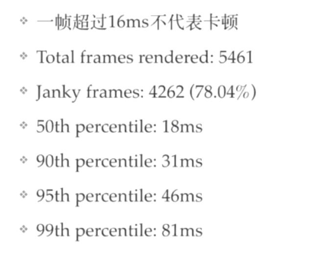

# 02-移动端专项测试


## 卡顿分析


出现的场景：

- 界面加载
- 滑动

在用户感知层面出现延迟现象，

数据解释：人眼感知的流畅度不能小于60fps。

**卡顿影响因素**

- 内存问题：内存分配任务严重、full gc
- cpu: 布局复杂overdraw，列表滚动
- gpu：位图上传过大


### 渲染性能

https://developer.android.com/topic/performance/rendering/inspect-gpu-rendering
https://developer.android.com/topic/performance/vitals/render
https://developer.android.com/training/testing/performance


###  gpu渲染分析




app渲染分析图形结果：


- 对于每个可见应用，该工具将显示一个图形。
- 沿水平轴的每个竖条代表一个帧，每个竖条的高度表示渲染该帧所花的时间（以毫秒为单位）。
- 水平绿线表示 16 毫秒。要实现每秒 60 帧，代表每个帧的竖条需要保持在此线以下。当竖条超出此线时，可能会使动画出现暂停。
- 该工具通过加宽对应的竖条并降低透明度来突出显示超出 16 毫秒阈值的帧。
- 每个竖条都有与渲染管道中某个阶段对应的彩色区段。区段数因设备的 API 级别不同而异。


**图形颜色代表含义说明：**


### systrace工具使用

- python 2.7.x only
- ./ systrace.py -l 列举所有支持的性能数据分类
- ./ systrace.py -t 10 收集10s左右的系统性能数据
- ./ systrace.py -t 10 -j 保存一份json数据文件用于编程分析

工具所在目录：

```
在sdk下/platform-tools/systrace下有systrace.py文件
```

源代码如下，代码写死判断python版本号


systrace如何使用可以使用help命令进行查看：
```
# systrace user$    python systrace.py --help    进入systace目录使用python命令 --help即可
Usage: systrace.py [options] [category1 [category2 ...]]

Example: systrace.py -b 32768 -t 15 gfx input view sched freq

Options:
  -h, --help            show this help message and exit
  -o FILE               write trace output to FILE
  -j, --json            write a JSON file
  --link-assets         (deprecated)
  --asset-dir=ASSET_DIR
                        (deprecated)
  -e DEVICE_SERIAL_NUMBER, --serial=DEVICE_SERIAL_NUMBER
                        adb device serial number
  --target=TARGET       choose tracing target (android or linux)
  --timeout=TIMEOUT     timeout for start and stop tracing (seconds)
  --collection-timeout=COLLECTION_TIMEOUT
                        timeout for data collection (seconds)
  -t N, --time=N        trace for N seconds
  -b N, --buf-size=N    use a trace buffer size  of N KB
  -l, --list-categories
                        list the available categories and exit

  Atrace options:
    --atrace-categories=ATRACE_CATEGORIES
                        Select atrace categories with a comma-delimited list,
                        e.g. --atrace-categories=cat1,cat2,cat3
    -k KFUNCS, --ktrace=KFUNCS
                        specify a comma-separated list of kernel functions to
                        trace
    --no-compress       Tell the device not to send the trace data in
                        compressed form.
    -a APP_NAME, --app=APP_NAME
                        enable application-level tracing for comma-separated
                        list of app cmdlines
    --from-file=FROM_FILE
                        read the trace from a file (compressed) rather than
                        running a live trace

  Atrace process dump options:
    --process-dump      Capture periodic per-process memory dumps.
    --process-dump-interval=PROCESS_DUMP_INTERVAL_MS
                        Interval between memory dumps in milliseconds.
    --process-dump-full=PROCESS_DUMP_FULL_CONFIG
                        Capture full memory dumps for some processes. Value:
                        all, apps or comma-separated process names.
    --process-dump-mmaps
                        Capture VM regions and memory-mapped files. It
                        increases dump size dramatically, hence only has
                        effect if --process-dump-full is a whitelist.

  Ftrace options:
    --ftrace-categories=FTRACE_CATEGORIES
                        Select ftrace categories with a comma-delimited list,
                        e.g. --ftrace-categories=cat1,cat2,cat3

  WALT trace options:
    --walt              Use the WALT tracing agent. WALT is a device for
                        measuring latency of physical sensors on phones and
                        computers. See https://github.com/google/walt
```


使用systrace可以进行页面的操作进行录制，会生成一个html报告供分析
```
$ python systrace.py 
These categories are unavailable: disk
Starting tracing (stop with enter)
Tracing completed. Collecting output...
Outputting Systrace results...
Tracing complete, writing results

Wrote trace HTML file: file:///Users/user/Library/Android/sdk/platform-tools/systrace/trace.html
```
报告如下：


输入以下命令，可以查看app-gfx相关的性能数据：
```
adb shell dumpsys gfxinfo
```


##  崩溃问题

官方文档：https://developer.android.com/topic/performance/vitals/crash

崩溃问题类型：

- ANR：
  - 主线程5s内没响应
- Java Crash
  - 未捕获的android vm异常
- Native Crash
  - 未处理的Native异常


**捕获异常**

```
adb logcat -s *：E
adb root
    adb shell ls /data/anr
```

获取app的进程ID

```
adb logcat | grep -i displayed    # 首先获取包名
adb shell ps | grep com.wlqq      # 获取包名的进程
```

结果如下：
```
HCBdeMacBook-Pro:~ user$ adb logcat | grep -i displayed
11-04 17:41:43.058  1452  1577 I ActivityManager: Displayed com.wlqq/.activity.HomeActivity: +10s757ms
^C
HCBdeMacBook-Pro:~ user$ adb shell ps | grep com.wlqq
u0_a461      19144   850 2285156 260672 futex_wait_queue_me 0 S com.wlqq
u0_a461      19303   850 1760360  44380 SyS_epoll_wait      0 S com.wlqq:yix
u0_a461      19401   850 1778872  47536 SyS_epoll_wait      0 S com.wlqq:pushservice
```


**ANR 常见原因：**

主线程IO、计算、跨进程通讯耗时
死锁、同步锁等待


### ANR发布前检测方法

- 健壮性测试：monkey、maxim
- 深度功能覆盖：appclawler自动化遍历
- 异常场景覆盖


**常见场景用例：**

- 后端接口问题：
  - 弱网：完成超时、2G、3G
  - 接口返回异常，null返回
  - 接口变更问题，字段类型变更

- 逻辑问题：
  - 异步线程问题，打开新页面立即返回
  - 逻辑处理不当，横竖屏切换，前后台切换

- 内存消耗：低内存、循环翻页、执行可累计内存的操作
  


**弱网测试方案**

- 模拟器方案：
  - $(which emulator) -avd [your-avd-image] -netdelay 20000 -netspeed gsm
  - $(which emulator) 不直接使用emulator是因为有个bug

- 真机代理方案：charles模拟弱网

- 网关方案:Facebook的ATC


**发布后的解决方案**

发布后建立监控体系。

- 捕获异常进行处理 
- 接入外部sdk，比如bugly


## 更多资源利用率统计

系统资源

```
adb shell dumpsys procstats --hours 3
adb shell dumpsys meminfo package_name|pid [-d]
adb shell dumpsys batterystats --charged package-name
adb shell dumpsys netstats detail
adb shell dumpsys gfxinfo package-name
```

更多性能数据，都保存在/proc/$pid目录保存了进程的大部分资源使用数据

- cpu
- mem
- network


**传统脚本统计**
```
# get_cpu_mem_by_pid com.wlqq
get_cpu_mem_by_pid(){
  uid=$(adb shell ps|grep "$1" | awk '{print $2}' | head -1) 
  while true;do
  adb shell top -n 1 -d 1 -b -o %CPU,%MEM,CMDLINE -p $uid |grep "$1";
  done
}
```


## 性能剖析（profile）

- ddms
- profile
- debug
- trace


**method profile**


