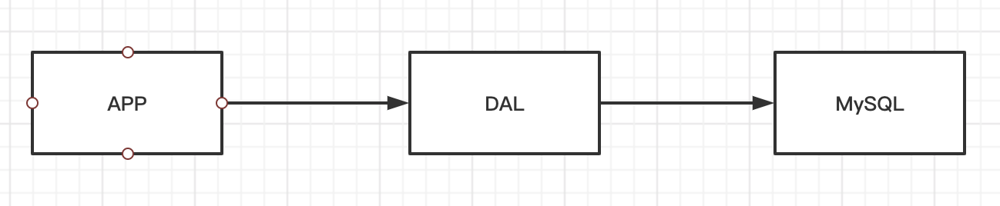
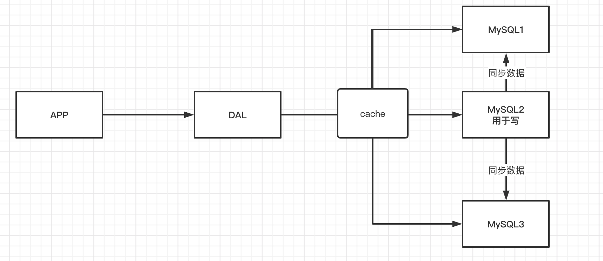
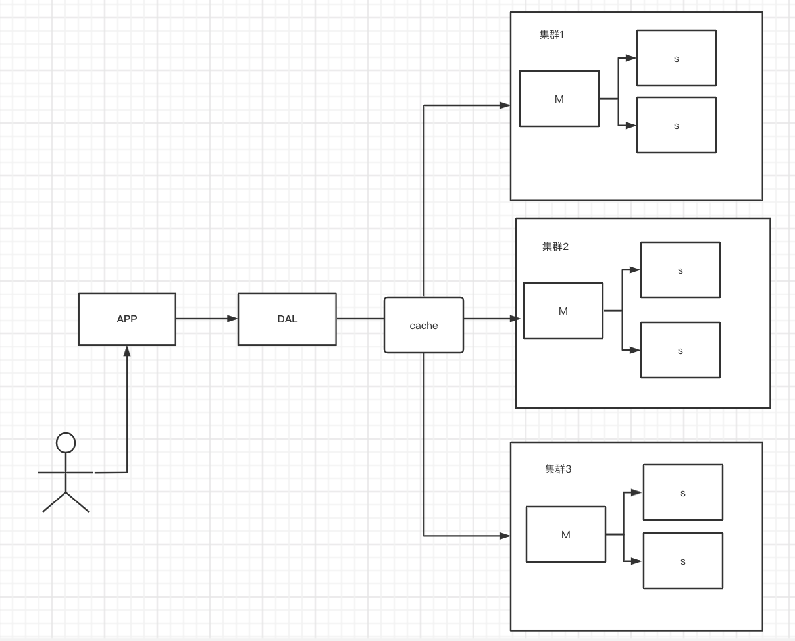
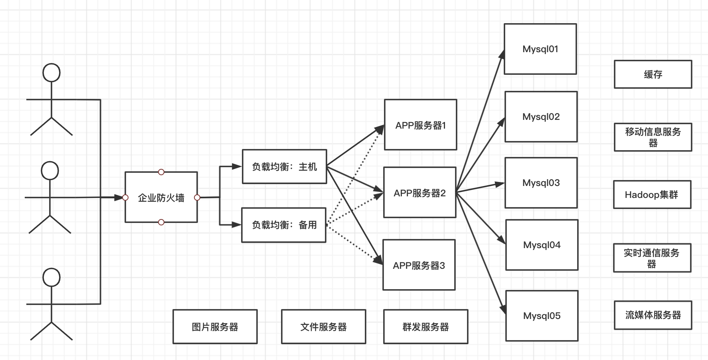
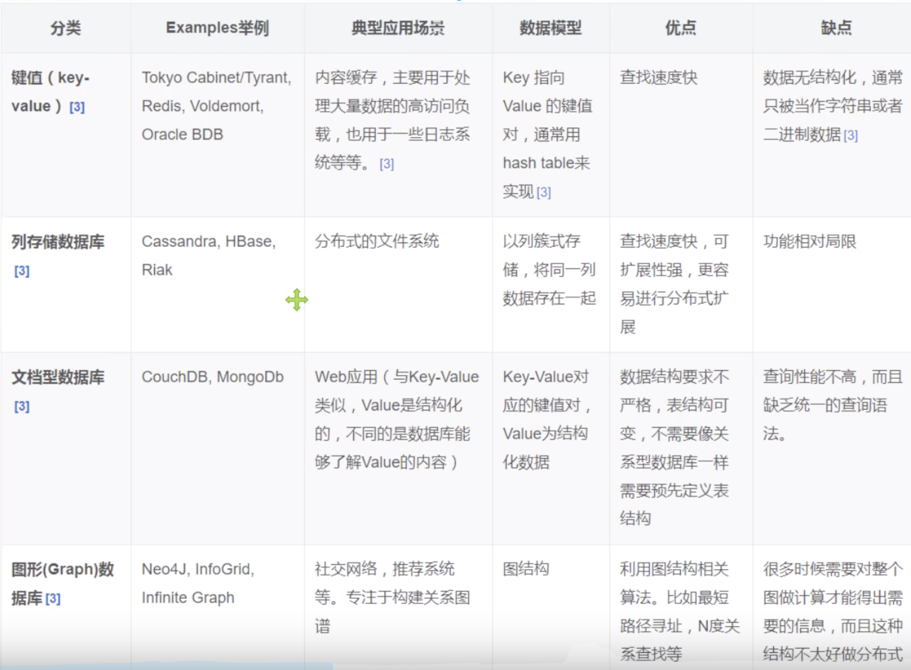

# 01-NoSQL概述


## 为什么要用NoSQL


1、单机MySQL的年代




90年代，一个基本的网站访问量一般不会太大，单个数据库完全足够！那个时候，更多的是使用是静态网页Html-服务器根本没有太大的压力。


思考一下，这种情况下：整个网站的瓶颈是什么？  

- 数据量太大，一个机器放不下
- 数据量超过300w，就需要建立索引，一个机器的内存也放不下
- 访问量（读写混合），一个服务器承受不了～

只要你开始出现以上的三种情况之一，那么你就必须要晋级。


2、Memcached（缓存）+MySQL+垂直拆分（读写分离） 时代

网站80%的情况下都是在读，每次都要去查询数据库的话就十分的麻烦，所以我们希望减轻数据的压力，我们可以使用缓存来保证效率！


发展过程：优化数据结构和索引--->文件缓存（IO）---->Memcached(当时最热门的技术)




3、分库分表+水平拆分+MySQL集群

技术和业务在发展的同时，对人对要求也越来越高！

本质：数据库（读、写）

早些年MyISM：表锁，十分影响效率！高并发下就会出现严重对锁问题
早些年Innodb：行锁

慢慢的就开始用分库分表来解决写的压力！MySQL在哪个年代推出了表分区，这个并没有多少公司使用！MySQL的集群解决了那个年代的问题！



4、如今最近的年代

2010-2020十年之间，世界已经发生翻天覆地的变化。（定位，也是一种数据，音乐、热榜）Mysql等关系数据库就不够用了，数据量很大，变化很快！

Mysql有的使用它来存储一些比较大的文件，博客，图片！数据库表就很大，效率就低了！如果有一种数据库专门来处理这种数据，Mysql压力就变得十分小（研究如何处理这些问题！）大数据的IO压力下，表几乎没法更改。


目前一个基本的互联网项目




为什么要用Nosql？

用户的个人信息，社交网络、地理位置。用户自己产生的数据，用户的日志等等爆发式增长！这时候我们就需要NoSQL数据库，Nosql可以很好的处理以上的情况。


## 什么是Nosql


NoSQL = Not Only SQL （不仅仅是SQL），泛指非关系型数据库，随着web2.0互联网的诞生！传统的关系型数据库很难对付web2.0时代！尤其是超大规模的高并发的社区！暴露出很多难以克服的问题，Nosql在当今大数据环境下发展的十分迅速，Redis是发展最快的，而且是我们当下必须要掌握的技术！

很多的数据类型：用户的个人信息，社交网络，地理位置。这些数据类型的存储不需要一个固定的格式，不需要过多的操作就可以横向扩展的！


Nosql特点：

- 方便扩展（数据之间没有关系，很好扩展）
- 大数据量，高性能（redis一秒可以写8w次，可以读取11w次，Nosql的缓存记录级的，是一种细粒度的缓存，性能会比较高！）
- 数据类型是多样型的（不需要事先设计数据库！随取随用！如果是数据量十分大的表，很多人就无法设计了）


传统的RDBMS和Nosql的区别：

```
传统的RDBMS
- 结构化组织
- SQL
- 数据和关系都存储在单独的表中 row col
- 操作，数据定义语言
- 严格的一致性
- 基础的事务
- .......

Nosql
- 不仅仅是数据
- 没有固定的查询语言
- 键值对存储，列存储，文档存储，图形数据库（社交关系）
- 最终一致性
- cap定理和BASE（异地多活）
- 高性能，高可用、高可扩展性
```


了解：3V+3高

大数据时代的3v：主要是描述问题的

- 海量 Volume
- 多样 Variety
- 实时 Velocity

大数据时代的3高，主要是针对程序的要求

- 高并发
- 高可扩
- 高性能

真正的公司实践，Nosql+RDBMS一起使用！


## Nosql四大分类


**KV键值对：**

- 新浪：redis
- 美团：redis+tair
- 阿里百、度：redis、memecache


**文档型数据库**

- mongDB
  - mongdb是一个基于分布式文件存储的数据库，c++编写，主要用来处理大量的文档！
  - mongdb是一个介于关系型数据库和非关系型数据中间的产品！Mongodb是非关系型数据中功能最丰富，最像关系型数据库的！


**列存储数据库**

- Hbase
- 分布式文件系统


**图形关系数据库**

- 他不是存图形，放的是关系，比如：朋友圈社交网络，广告推荐！
- Neo4j、infoGrid



