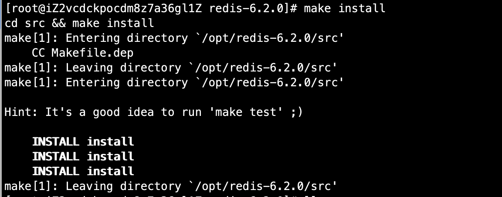
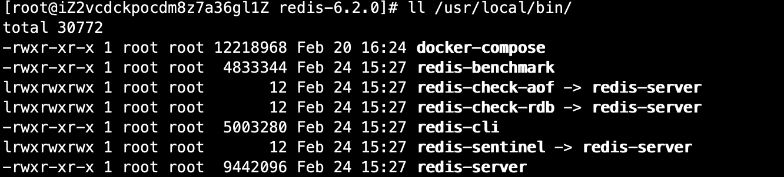
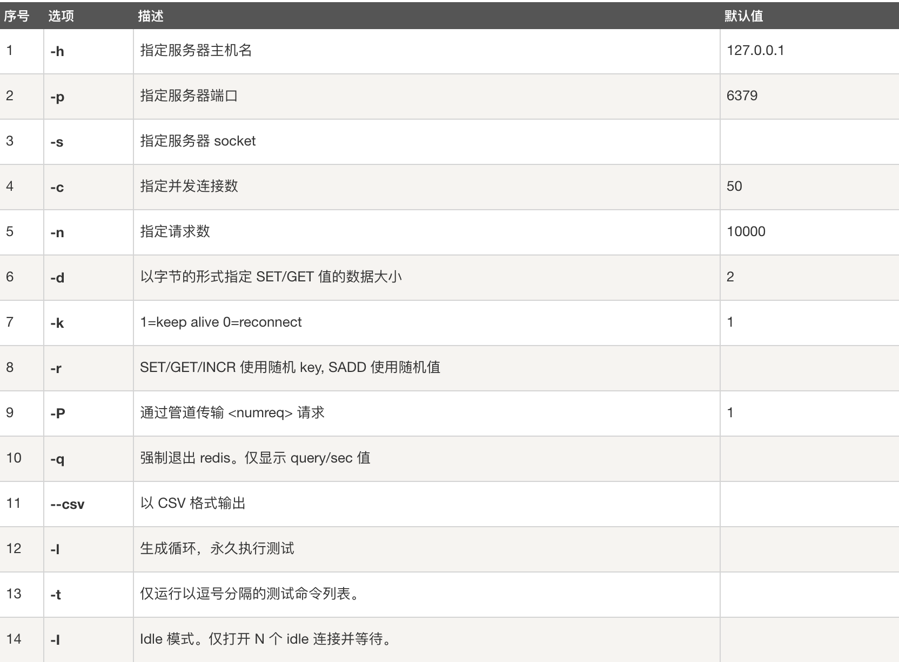
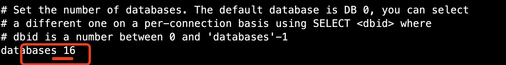
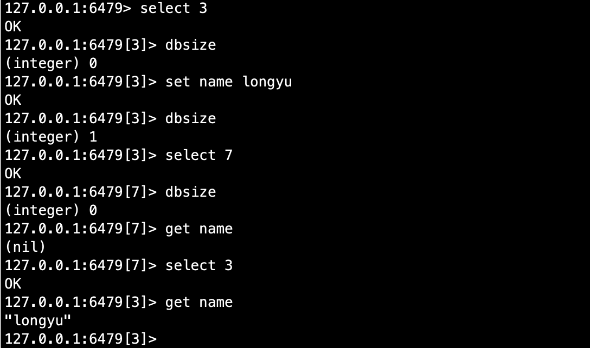

# 02-redis概述


## 概述


redis是什么？

Redis （Remote Dictionary Server），即远程字典服务。是一个开源的使用ANSI c语言编写、支持网络、可基于内存亦可持久化的日志型、key-value数据库，并提供多种语言的API。免费和开源！是当下最热门的Nosql技术之一。

redis会周期性的把更新的数据写入磁盘或者把修改操作写入追加的记录文件，并且在此基础上实现了master-slave主从同步！


redis能干嘛？

1、内存存储、持久化，内存中是断电即失，所以持久化很重要（rdb、aof）
2、效率高，可以用于高速缓存
3、发布订阅系统
4、地图信息分析
5、计时器、计数器（浏览量）


特性：

- 多样的数据类型
- 持久化
- 集群
- 事务


## linux下安装redis


1、进入redis官网下载安装包
wget https://download.redis.io/releases/redis-6.2.0.tar.gz

2、解压redis安装包，建议opt目录
tar -zxvf redis-6.2.0.tar.gz -C /opt/

3、进入解压后的文件，可以看到redis的配置文件
-rw-rw-r--  1 root root 92222 Feb 23 05:23 redis.conf

4、基本的环境安装
需要安装gcc，使用yum install 进行安装

在redis解压文件夹下，执行make命令
make
5、查看目录
会发现多一个src目录
drwxrwxr-x  3 root root 12288 Feb 24 15:25 src

6、安装
make install




7、redis默认的安装路径usr/local/bin




8、建立一个配置目录，将redis原生配置拷贝至此目录，后续用该配置文件进行启动

```
mkdir kconfig
cp /opt/redis-6.2.0/redis.conf kconfig/
```


9、redis默认不是后台启动的，修改配置文件

```
vim redis.conf

将daemonize no改为daemonize yes
```

10、启动redis服务并测试

```
# 通过配置文件启动服务
redis-server kconfig/redis.conf 

# 用客户端进行测试
 redis-cli -p 6479  # -p 指定端口号

127.0.0.1:6479> set a 111
OK
127.0.0.1:6479> get a
"111"
127.0.0.1:6479> ping
PONG
```


11、查看redis的进程是否开启

```
ps -ef |grep redis
```


12、如何关闭redis服务

```
127.0.0.1:6479> shutdown  # 关闭redis
not connected> exit       # 退出
```

再次查看redis进程，就不存在了！后面使用单机多redis启动集群测试！


## 测试性能


redis-benchmark是一个压力测试工具！官方自带的性能测试工具！

redis-benchmark命令参数：




简单测试案例：100个并发连接，100000请求

```
# 测试
命令： redis-benchmark -p 6479 -c 100 -n 100000

Summary:
  throughput summary: 97181.73 requests per second
  latency summary (msec):
          avg       min       p50       p95       p99       max
        0.724     0.168     0.711     1.079     1.319     2.439
====== HSET ======                                                   
  100000 requests completed in 1.07 seconds  # 10w请求在1.07秒内完成
  100 parallel clients          # 100个并发连接
  3 bytes payload               # 3字节数据
  keep alive: 1                 # 只有一台服务器来处理这些请求，单机性能
  host configuration "save": 3600 1 300 100 60 10000
  host configuration "appendonly": no
  multi-thread: no
```


## 基础知识

redis默认有16个数据库，




默认使用的是第0个数据库，可以使用select进行数据库切换！

```
[root@iZ2vcdckpocdm8z7a36gl1Z kconfig]# redis-cli -p 6479
127.0.0.1:6479> select 3  # 切换数据库
OK
127.0.0.1:6479[3]> dbsize  # 查看DB大小
(integer) 0
127.0.0.1:6479[3]> 
```




```
127.0.0.1:6479[3]> keys *  # 查看数据库所有的key
1) "name" 
```

清除当前数据库flushdb

```
127.0.0.1:6479[3]> flushdb  # 清除当前数据库
OK
127.0.0.1:6479[3]> keys *
(empty array)
```

清除所有数据库 flushall

```
127.0.0.1:6479> flushall
OK
127.0.0.1:6479> keys *
(empty array)
```

**redis是单线程的**

明白redis是很快的，官方表示，redis基于内存操作，CPU不是redis性能瓶颈，redis的瓶颈是根据机器的内存和网络带宽，既然可以使用单线程来实现，就使用单线程来！所以就使用单线程了！

redis是C语言写的，官方提供的数据为100000+的qps，完全不比同样是使用key-value的memcache差！

reids为什么单线程还这么快？

1、误区1:高性能的服务器一定是多线程的？
2、误区2:多线程（CPU上下文切换）一定比单线程效率高！

先去 CPU>内存>硬盘的速度要有所了解！

核心：redis是将所有的数据全部放在内存中的，所以使用单线程去操作效率就是最高的，多线程（CPU上下文切换：耗时的操作！！）对内存系统来说，如果没有上下文的切换效率是最高的！多次读写都是在一个CPU上的，在内存情况下，这个就是最佳的方案！