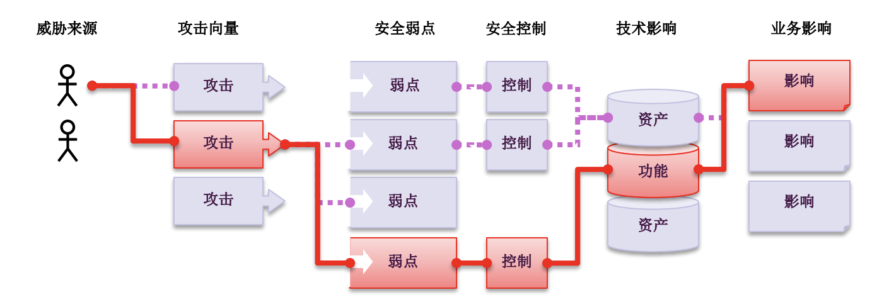
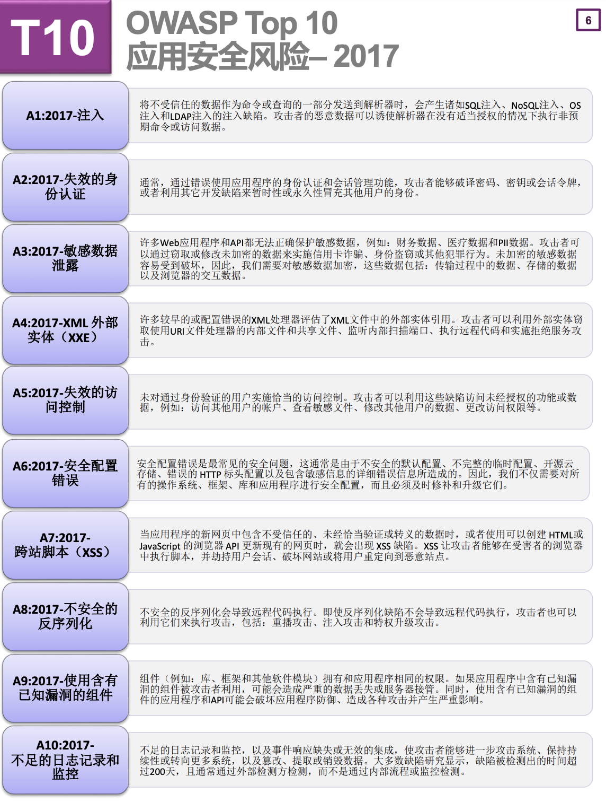
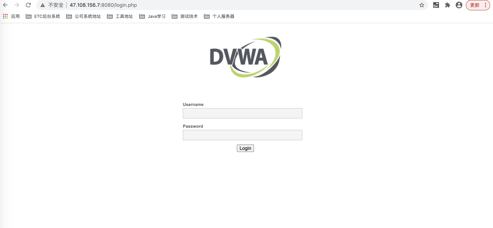
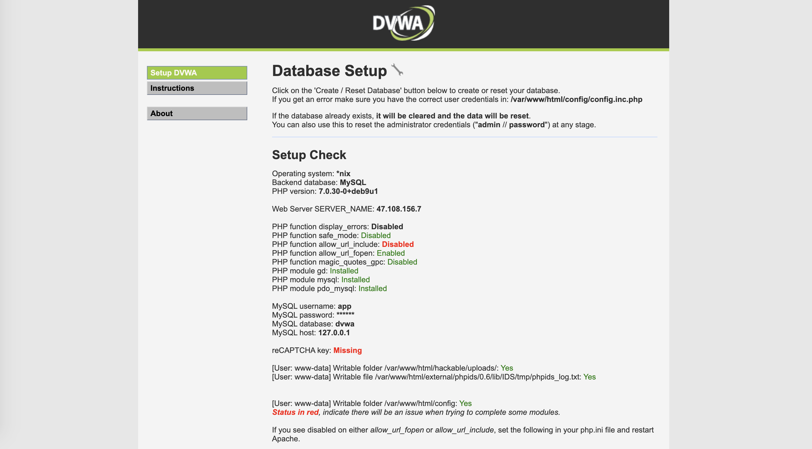

# 01-服务端安全测试体系概念


随着互联网的飞速发展，web应用在软件开发中所扮演的角色变得越来越重要，同时，web应用遭受着格外多的安全攻击，其原因在于，现在的网站以及网站上运行的应用在某种意义上来说，它是所有公司或者组织的虚拟正门，所以比较容易遭受到攻击，存在安全隐患。


中文官网地址：http://www.owasp.org.cn/

OWSAP：OWASP是一个开源的、非盈利的全球性安全组织，致力于应用软件的安全研究。我们的使命是使应用软件更加安全，使企业和组织能够对应用安全风险做出更清晰的决策。目前OWASP全球拥有250个分部近7万名会员，共同推动了安全标准、安全测试工具、安全指导手册等应用安全技术的发展。

OWASP Top 10 项目的最初目标是为了提高开发人员和管理人员的安全意识，但它目前已经成为了实际应用但安全标准。


**什么是应用程序安全风险？**

攻击者可以通过应用程序中许多不同的路径方法去危害你的业务或者企业组织。每种路径方法都代表了一种风险，这些风险可能会，也可能不会严重到值得你去关注。




有时，这些路径方法很容易被发现并利用，但有的则非常困难。同样，所造成的危害有可能无关紧要，也可能导致破产。为了确定您企业的风险，可以结合其产生的技术影响和对企业的业务影响，去评估威胁来源、攻击向量和安全漏洞的可能性。总之，这些因素决定了全部的风险




## 安全演练环境搭建


DVWA（Damn Vulnerable Web Application）是一个用来进行安全脆弱性鉴定的PHP/MYSQL WEB应用，旨在为安全专业人员测试自己的专业技能和工具提供合法的环境，帮助web开发者更好的理解web应用安全防范的过程，是一个开源项目。


DVWA共有10个模块，分别是：

- Brute Force （暴力破解）
- Command Injection（命令行注入）
- CSRF（跨站请求伪造）
- File Inclusion（文件包含）
- File Upload（文件上传）
- Insecure CAPTCHA（不安全的验证码）
- SQL Injection （SQL 注入）
- SQL Injection （Blind）SQL盲注】
- XSS（Reflected）发射型跨站脚本
- XSS（Stored） 存储型跨站脚本


接下来我们搭建演练环境


1、拉取dvwa镜像

```
docker pull  vulnerables/web-dvwa
```

2、运行镜像

```
docker run -d --name dvwa -p 8080:80 vulnerables/web-dvwa
```




默认密码是：admin/password




