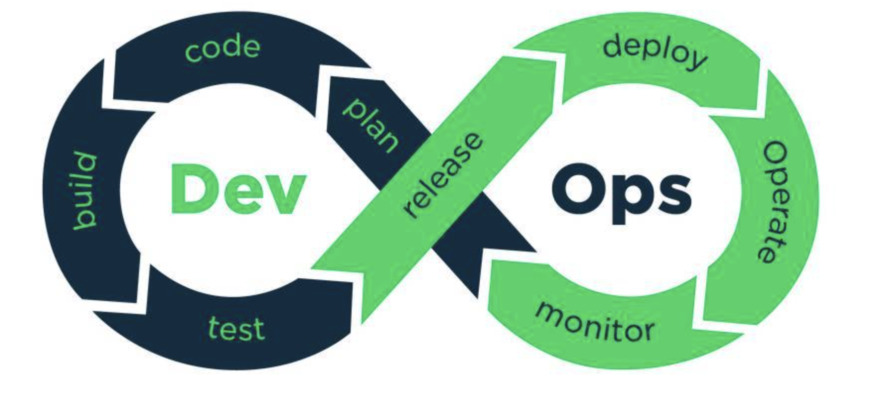
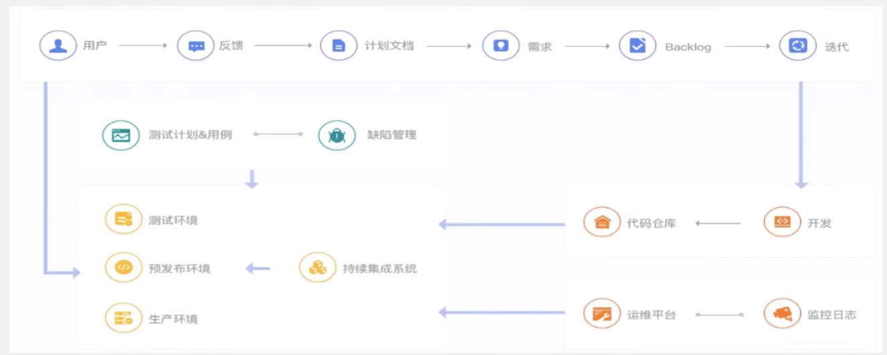
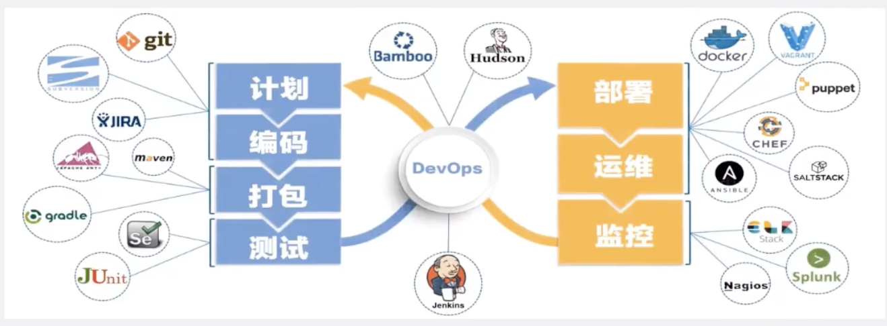
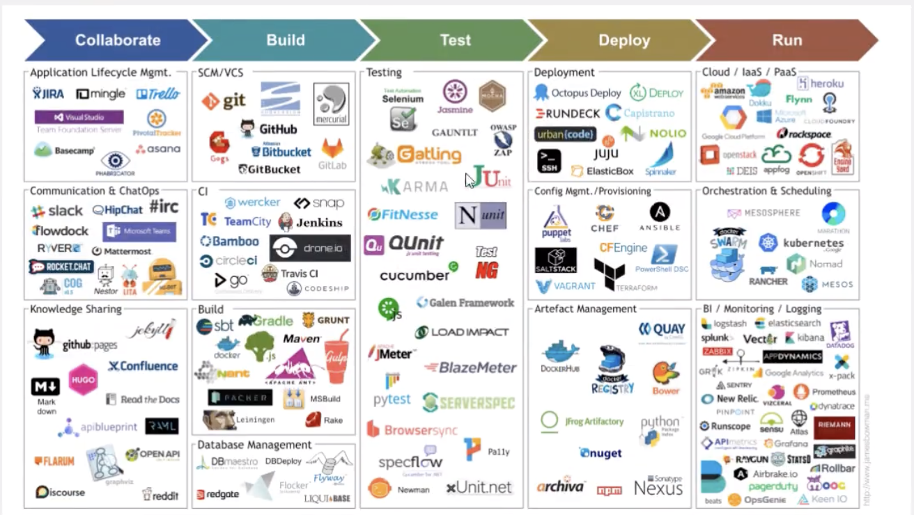
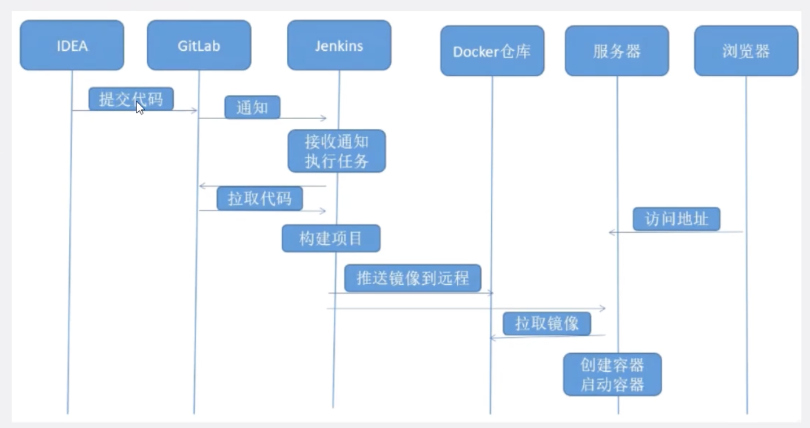
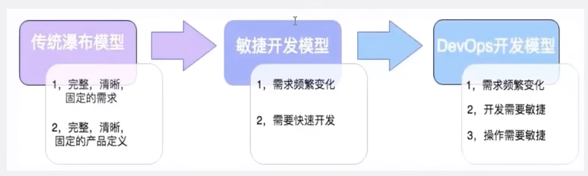

# 01-DevOPS思想

## 什么是DevOPS?

DevOPS 是一种思想或方法论，它涵盖开发、测试、运维的整个过程！

DevOPS强调软件开发人员与软件测试、软件运维、质量保障（QA）部门之间有效的沟通与协作。

强调通过自动化的方法管理软件变更、软件集成。

使软件从构建到测试、发布更加快捷、可靠、最终按时交付软件。

公司项目开发大概的流程，看看是如何一步一步操作 的：

Product Backlog源自于Scrum方法，是指产品待办事项的集合，其中事务有优先级判断，先处理优先级高的事项。

## 如何落地实现DevOps理念？

DevOPS 兴起于2009年，近年来由于云计算、互联网的发展，促进了DevOPS的基础设施及工具链的发展，涌现了一大批优秀的工具，这些工具包括开发，测试，运维的各个领域，例如：github，git/svn，docker，jenkis，HudSon，Ant/maven/Grade，Qunit、Jmeter等，看下图：

## 实战测试

**当今大公司一定要使用DevOPS**

传统上软件开发中（无论是瀑布模型还是敏捷方式，敏捷也比较传统）都由开发团队来构建软件。

开发团队需要与运维团队进行大规模都“交接”。运维团队负责执行一系列“部署”活动，将软件代码移至生成环境，并负责维护后续都系统稳定运行。生产环境的基础设施与开发或测试不同。需要额外检查和平衡，以确保它一切功能正常。部署是由不同的人完成的，运维团队之前从未见过或听说过任何此类软件。

DevOPS这种软件开发方法，涉及到软件整个开发生命周期，这些活动只能在DevOps中实现，而不是敏捷或瀑布流。

DevOps是在较短开发周期内开发高质量软件的首选方法，同时可以提高客户满意度。

这就是为什么顶级互联网公司选择DevOps作为其业务目标的前进方向。

如果你是一名开发工程师：学习DevOps，让你成为更加优秀的IT工程师

如果你是一名运维工程师：应用DevOps，必将简化你的工作流程，提高你的工作效率

如果你是一名测试工程师：学习DevOps，让你成为更加优秀的I测试工程师

如果你是一名架构师：DevOps是你在实践中必须拥有的技术能力

