# 01-jenkins-webhook机制


## web hook机制

运行jenkins任务的触发方式回顾：

- 主动运行方法
- 定时构建方式
- 定时轮询代码库方式

问题：有没有一种方式，可以通过代码库主动触发Jenkins的构建任务！

答案：有，web hook机制


web hook是jenkins对外暴露的一个事件接收器，通过web hook，外部程序可以向jenkins发出运行任务请求，然后由jenkins来执行。


**配置方法：**


第一步现在jenkins进行系统配置，详细步骤如下：

1、进入系统管理，找到github服务选项，点击高级
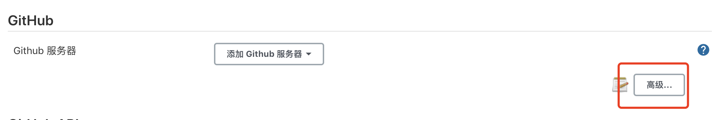


2、开启web-hook选项

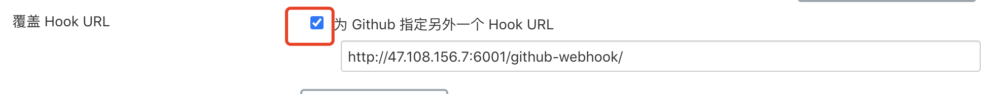

注意：这里勾选之后会默认生成一个地址，端口是8080，如果是docker做了端口映射，需要修改端口号为主机的映射的端口。


3、进行保存

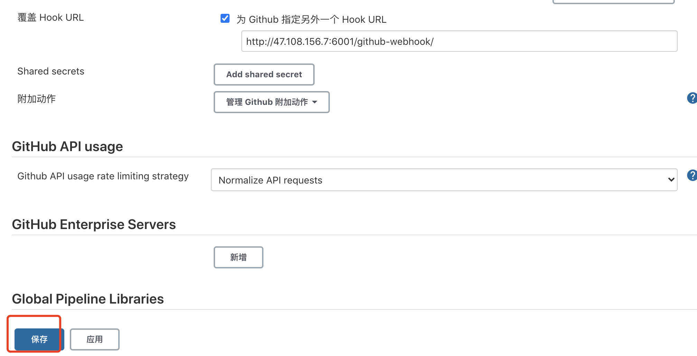


第二步，进入github进行配置，详细步骤如下：

1、在github项目上进入setting
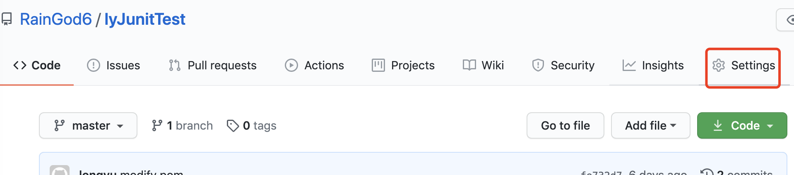


2、找到webhook选项
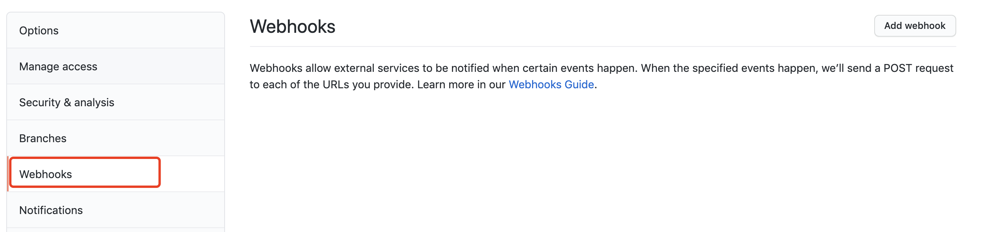


3、添加
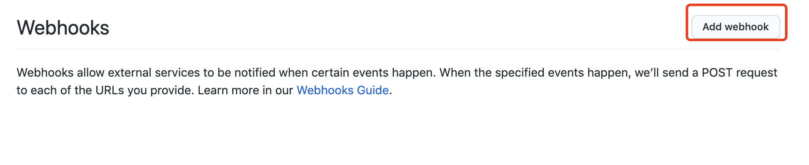

4、输入密码进行验证
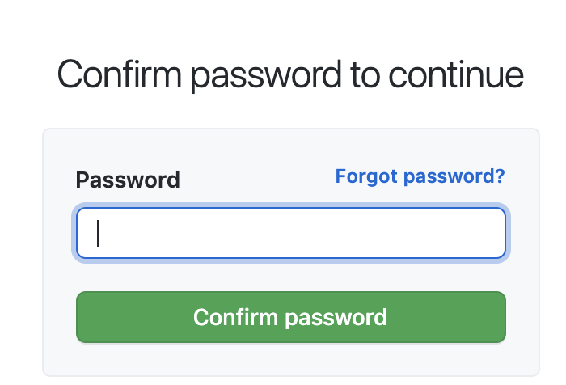


4、将jenkins生成配置的web-hook地址填入
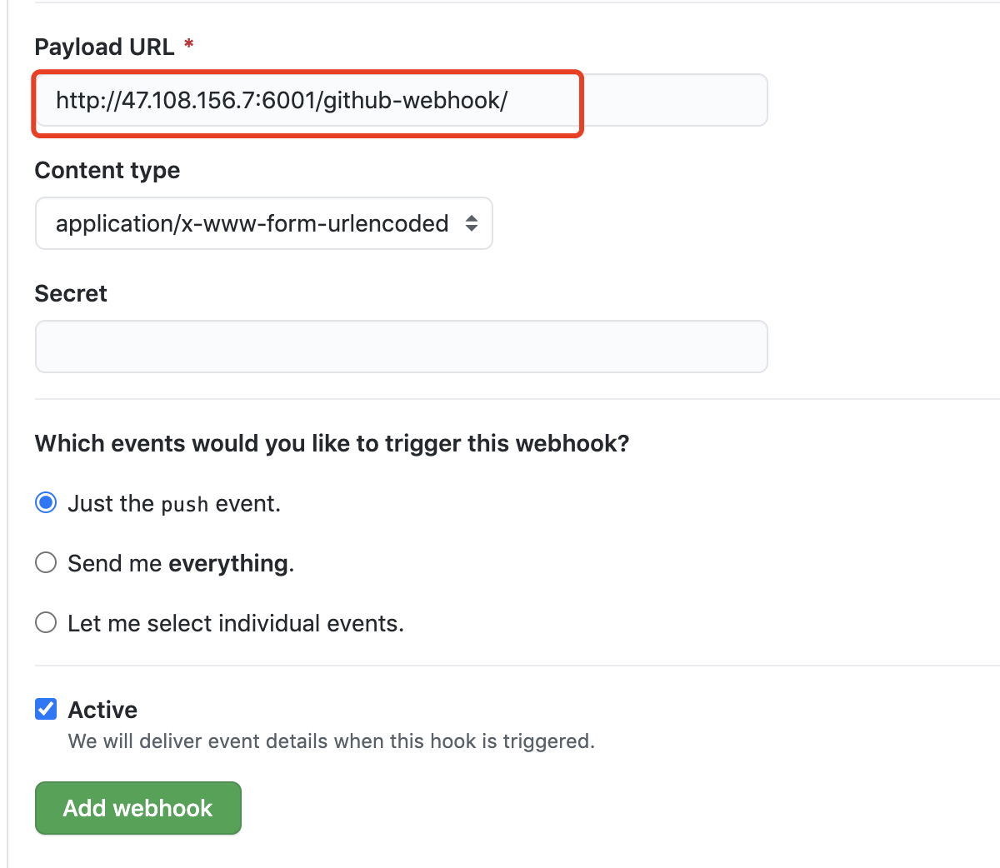


5、添加之后会出现如下成功提示：


第三步：在具体的任务下配置web-hook选项，详情如下：

1、进入具体项目进行配置，找到构建触发器

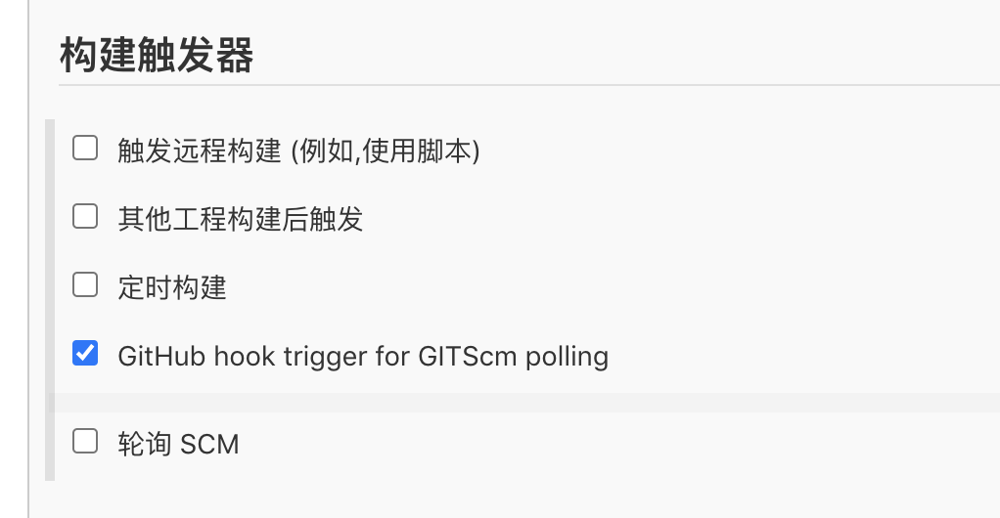


2、点击保存！


接下来我们进行测试，在github项目提交一个文件

```
HCBdeMacBook-Pro:lyJunitTest user$ git add README.md 
HCBdeMacBook-Pro:lyJunitTest user$ git commit -m "添加备注，测试web-hook机制"
[master ffb13ba] 添加备注，测试web-hook机制
 1 file changed, 1 insertion(+)
HCBdeMacBook-Pro:lyJunitTest user$ git push 
Enumerating objects: 5, done.
Counting objects: 100% (5/5), done.
Delta compression using up to 4 threads
Compressing objects: 100% (3/3), done.
Writing objects: 100% (3/3), 361 bytes | 361.00 KiB/s, done.
Total 3 (delta 1), reused 0 (delta 0)
remote: Resolving deltas: 100% (1/1), completed with 1 local object.
To https://github.com/RainGod6/lyJunitTest.git
   fe732d7..ffb13ba  master -> master

```


然后查看jenkins任务执行结果：

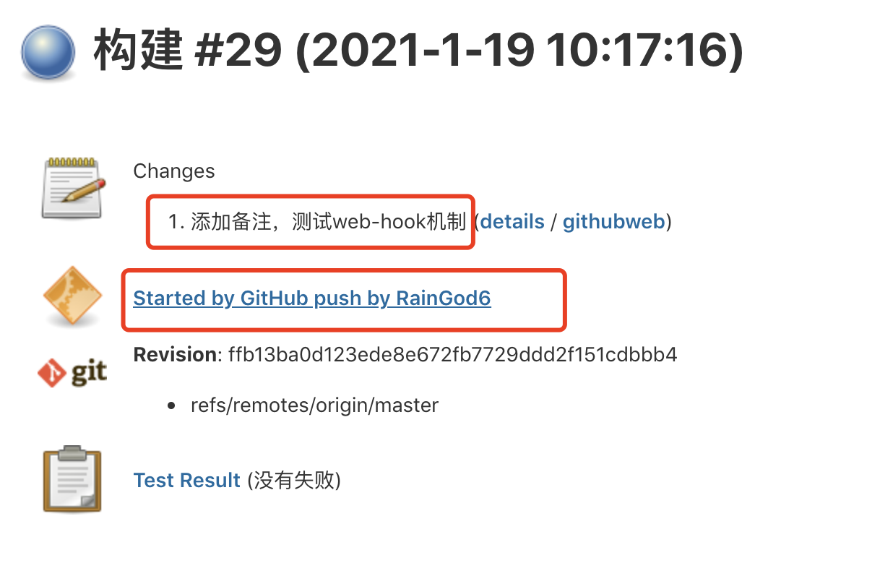  


发现自动触发成功，提交代码之后自动触发jenkins任务构建！


## jenkins主动轮询代码库变动


如果jenkins部署在公司内网，github无法访问jenkins，则需要更换触发策略！

- jenkins 主动轮询代码库变动
- 需要设定jenkins的轮询任务定时
- 定时设定格式 - crontab格式
- 设定位置，Build Tiggers--> Poll SCM


案例：

只需要在构建触发器，选择轮询scm即可
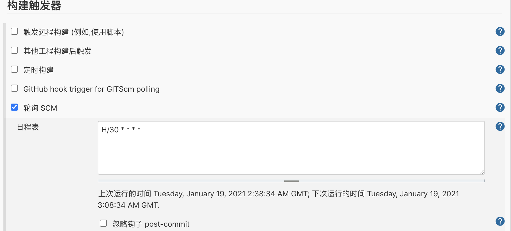


轮询，是每30分钟查询代码库，不会直接触发构建，代码库有变动的才会触发构建！


测试：

我们再提交代码验证下：


从执行结果可以看出是轮询任务触发！


webhok 是 github访问jenkins，如果jenkins是内网，则访问不通！

而SCM轮询，是jenkins访问github，即使jenkins是内网，也可以去轮询查询github公网！

所以两种方案，根据实际情况，大家可以选择！


