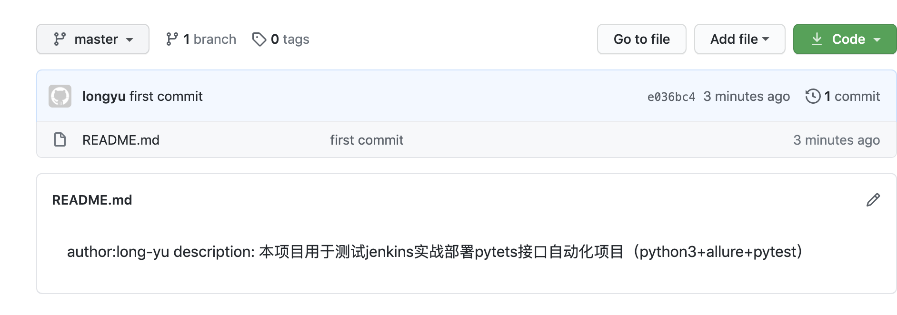
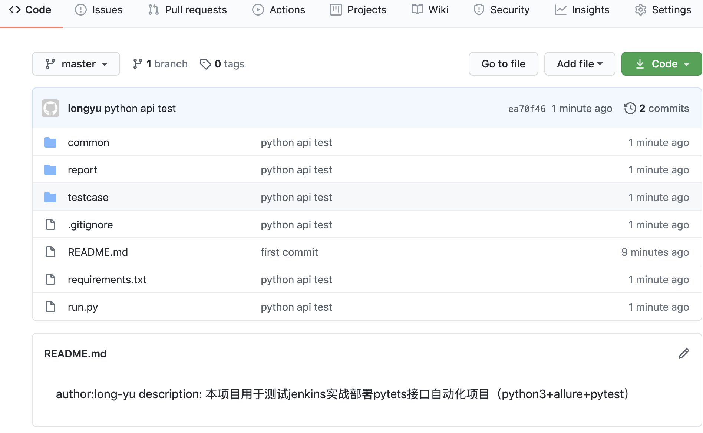
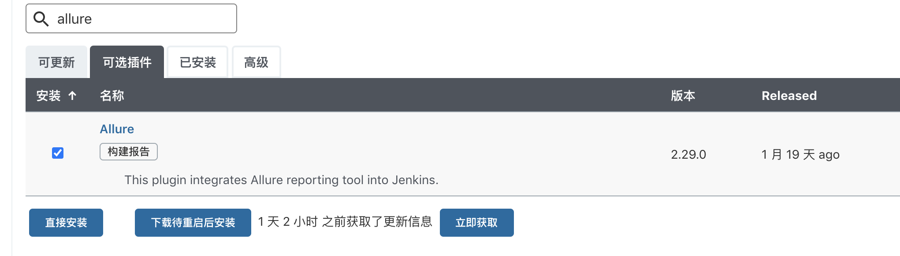
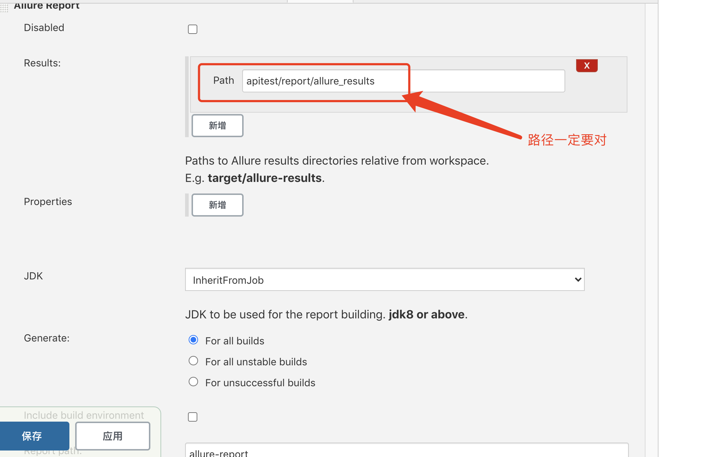
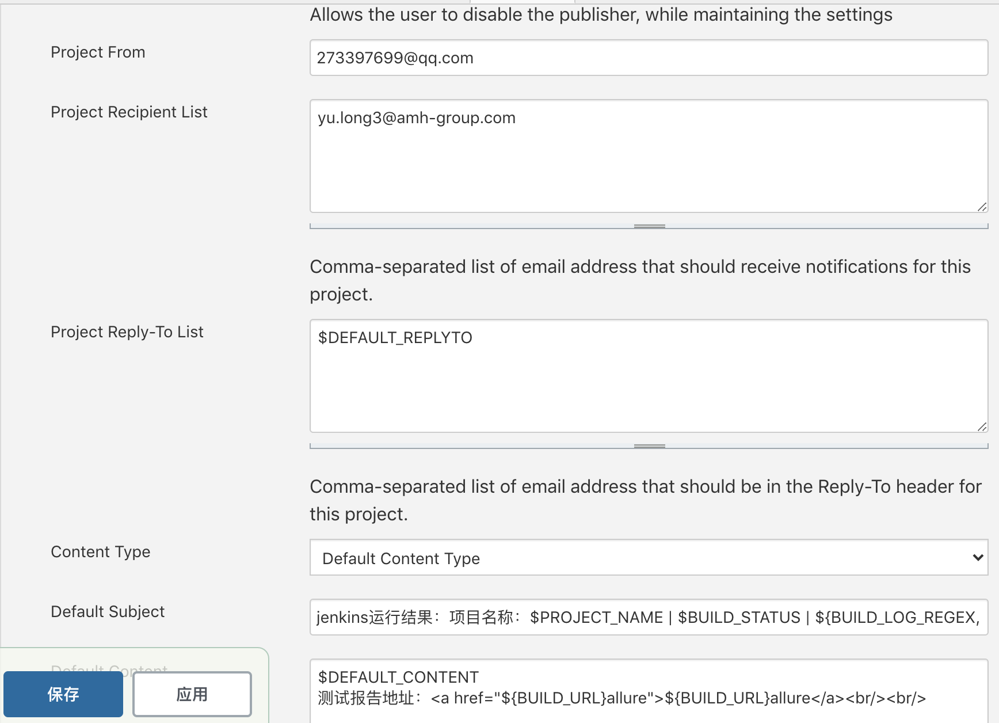
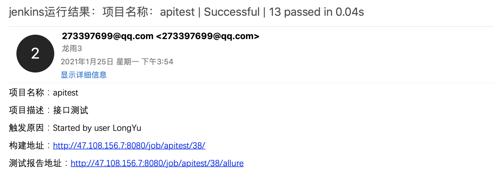
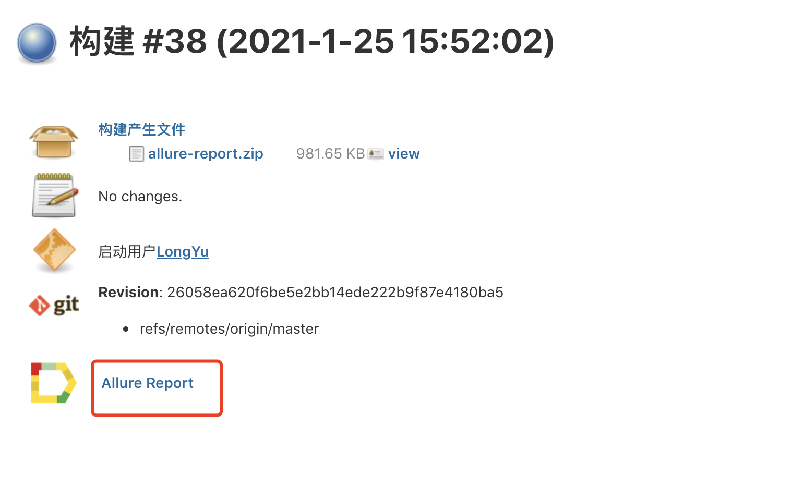
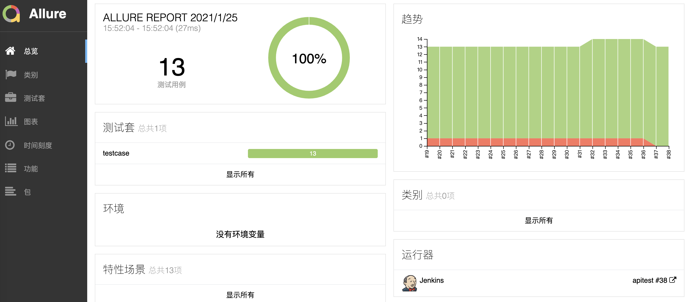

# 04-jenkins实现接口自动化实战


案例： jenkisn实现python接口自动化测试


**步骤一：准备python项目上传至github**

1、在github新建一个仓库

```
echo "# apitest" >> README.md
git init
git add README.md
git commit -m "first commit"
git branch -M main
git remote add origin https://github.com/RainGod6/apitest.git
git push -u origin main
```

首次创建成功会有如上命令提示。

接下来本地进行操作，由于我本地项目有README文件，因此从git init开始

```
# 进入项目目录
PycharmProjects user$ cd apitest/
apitest user$ ls
README.md		requirements.txt	venv
common			run.py
report			testcase
# 执行git init
Initialized empty Git repository in /Users/user/PycharmProjects/apitest/.git/

# 添加 git add README.md
:apitest user$ git add README.md 
# 添加备注 git commit -m "first commit"
:apitest user$ git commit -m "first commit"
[master (root-commit) e036bc4] first commit
 1 file changed, 2 insertions(+)
 create mode 100644 README.md
# 关联远程仓库，git remote add origin https://github.com/RainGod6/apitest.git
:apitest user$ git remote add origin https://github.com/RainGod6/apitest.git
# push到远程仓库master
apitest user$ git push -u origin master
Enumerating objects: 3, done.
Counting objects: 100% (3/3), done.
Delta compression using up to 4 threads
Compressing objects: 100% (2/2), done.
Writing objects: 100% (3/3), 329 bytes | 329.00 KiB/s, done.
Total 3 (delta 0), reused 0 (delta 0)
To https://github.com/RainGod6/apitest.git
 * [new branch]      master -> master
Branch 'master' set up to track remote branch 'master' from 'origin'.
```

这样首次提交就成功了！在github上看见如下信息：



接下来我们将所有剩余项目内容全部提交：

```
# 可以使用git status 查看提示
git status
On branch master
Your branch is up to date with 'origin/master'.

Untracked files:
  (use "git add <file>..." to include in what will be committed)

	.gitignore
	common/
	report/
	requirements.txt
	run.py
	testcase/

nothing added to commit but untracked files present (use "git add" to track)

# 将所有文件添加
apitest user$ git add .
# 添加备注
git commit -m "python api test"
# push至远程仓库
git push origin master
```

我们再次进入远程仓库查看内容：




步骤2：安装依赖

```
# 安装allure
npm install -g allure-commandline --save-dev  这个需要安装npm
# 安装完成之后，查看是否可用
[root@iZ2vcdckpocdm8z7a36gl1Z local]# allure --version
2.13.8
```


安装jenkins插件



生成python依赖包：
```
# 生成项目依赖
pip3 freeze > requirements.txt
# 安装依赖
pip3 install -r requirements.txt
```

启动docker镜像：
```
docker run -uroot -d -p 8080:8080 -p 50000:50000 --name ly_jenkins -v jenkins-data:/var/jenkins_home -v /usr/local/apache-maven-3.6.3/:/usr/local/apache-maven-3.6.3:ro -v /usr/local/allure-commandline-2.13.0/:/usr/local/allure-commandline-2.13.0:ro -v /usr/local/Python-3.7.9/:/usr/local/Python-3.7.9:ro jenkinsci/blueocean
```

配置容器内部环境变量：
```
export MAVEN_HOME=/usr/local/apache-maven-3.6.3/
export ALLURE_HOME=/usr/local/allure-commandline-2.13.0/  #失效，外部用的yum安装allure
export PYTHON_HOME=/usr/local/Python-3.7.9/
export PATH=$PATH:$MAVEN_HOME/bin:$ALLURE_HOME/bin:$PYTHON_HOME/bin

/usr/local/Python-3.7.9
```


**jenkins配置任务**

执行shell命令：
```
. /etc/profile
cd apitest
pip3 install -r requirements.txt
pytest ./testcase -s -q --alluredir=./report/allure_results --clean-alluredir  # --clean-alluredir 用于清除上一次数据
exit 0
```

allure报告设置：




邮件设置：




运行效果：




jenkins任务执行结果：



打开报告地址结果如下：

