# 01-jenkins介绍与安装


## 为什么会产生持续集成与持续交付？


随着互联网时代的快速发展，传统模式已经不能满足现在快速交付的需求。同时敏捷的概念也就应运而生。

大数据时代下，我们需要快速交付一个产品到用户手中，提高用户体验。以前一个月几个月才产生一个产品版本，现在可能一周、一天、甚至1小时就需要发布一个版本，那么快速发布给测试带来的压力是十分大的。时间紧、任务重。

要实现快速交付产品，在互联网时代下就产生了一些自动化的工具链，用于帮助产品从开发到测试到上线能够高效。所以持续集成和持续交付就应运而生！


- 持续集成可以帮助研发与测试团队快速的发现错误，每完成一个功能，就将更新内容集成到对应分支上，然后进行测试，这样定位错误会相对容易、高效

- 持续集成可以防止分支与主干分支大幅度的偏离，由于分支与主干是在不断的更新，所以如果不是持续的集成更新内容，就会导致分支与主干分支的差别越来越大，最终导致代码冲突过多，难以集成！

- 持续交付能够帮助产品与业务团队能够更快速的在线上尝试最新的产品设计是否能够满足市场的需求，能够快速纠偏，快速让产品满足实际的市场需求

- 天下武功唯快不破，效率第一，迅速纠偏是硬需求，持续交付正好可以满足这些


  
## jenkins简介


jenkins是一个免费的开源平台，提供友好操作界面的持续集成(CI)工具。主要用于持续、自动的构建/测试软件项目、监控外部任务运行。jenkins用java语言开发，可以在Tomcat等流行的servlet容器中运行，也可以独立运行。通常与版本管理工具、构建工具结合使用。常用的版本工具有SVN、GIT，构建工具有Maven、Ant、Gradle.


总结：

- 免费的开源平台
- 常用于持续集成，持续交付还有自动化测试项目
- 基于java开发，可以跨普平台运行
- 插件丰富、支持各种扩展
- 它的优势很多，最大的优势就是使用广泛


## CI/CD是什么？


CI（Continuous integration,中文意思是持续集成） 是一种软件开发时间。持续集成强调开发人员提交了新代码之后，立刻进行构建、（单元）测试。根据测试结果，我们可以确定新代码和原油代码能否正确的集成在一起。

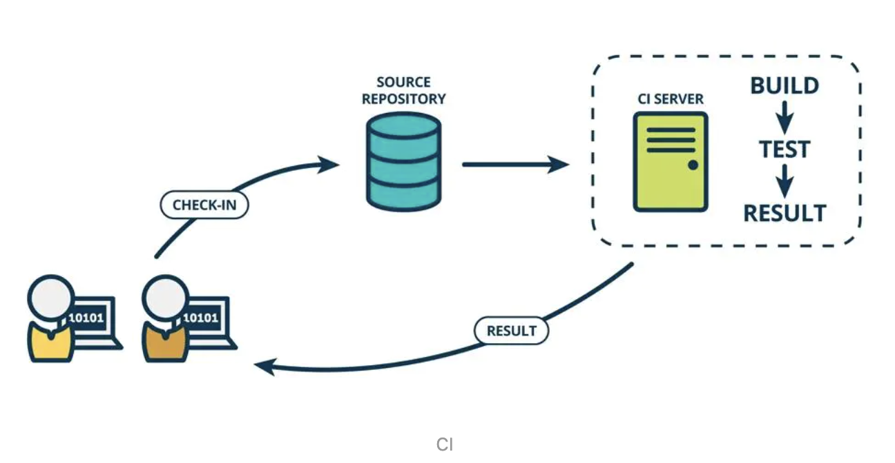


CD（Continuous Delivery，中文意思持续交付）是在持续集成的基础上，将集成后的代码部署到更贴近真实运行环境中。比如我们完成单元测试后，可以把代码部署到连接数据库的测试环境中进行测试，如果代码没有问题，可以继续手动部署到生产环境。

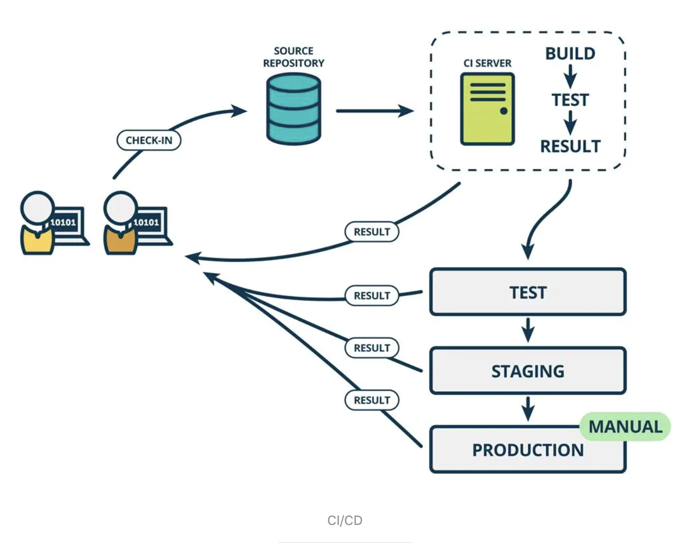


## jenkins安装


官网下载地址：https://www.jenkins.io/download/

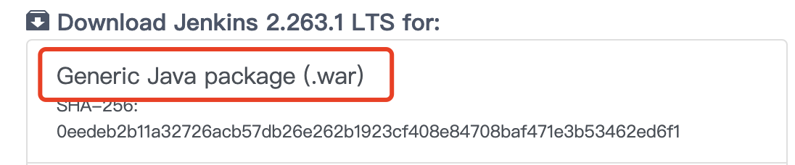


下载war包即可。

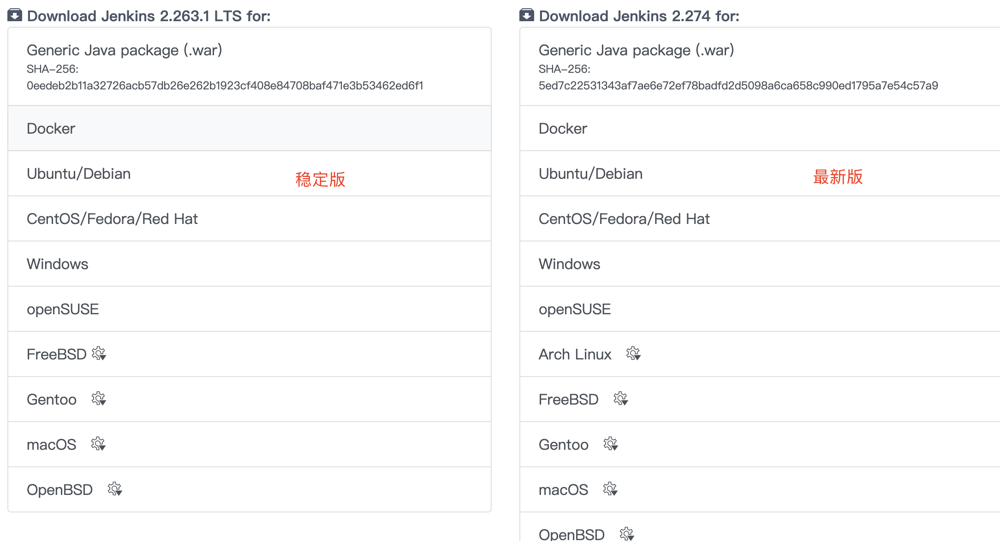

左边LTS是稳定版本，右边是最新的版本。


接下来我们下载war包到本地。历史版本下载地址：https://get.jenkins.io/war-stable/

```
# 将下载的文件移动至指定目录
HCBdeMacBook-Pro:jenkis user$ mv /Users/user/Downloads/jenkins.war  /Users/user/jenkis/
HCBdeMacBook-Pro:jenkis user$ ls
jenkins.war
```

jenkins是java开发的，所以主机上需要依赖JDK环境

**启动方法一：直接启动**

```
# 启动命令 java -jar jenkins.war --httpPort=8080  httpPort可以指定端口

访问：使用本机ip加端口号，例如本机访问： http://localhost:8080/
```

访问结果如下：（首次加载需要一定的时间，需要耐心等待！加载完成如下页面）

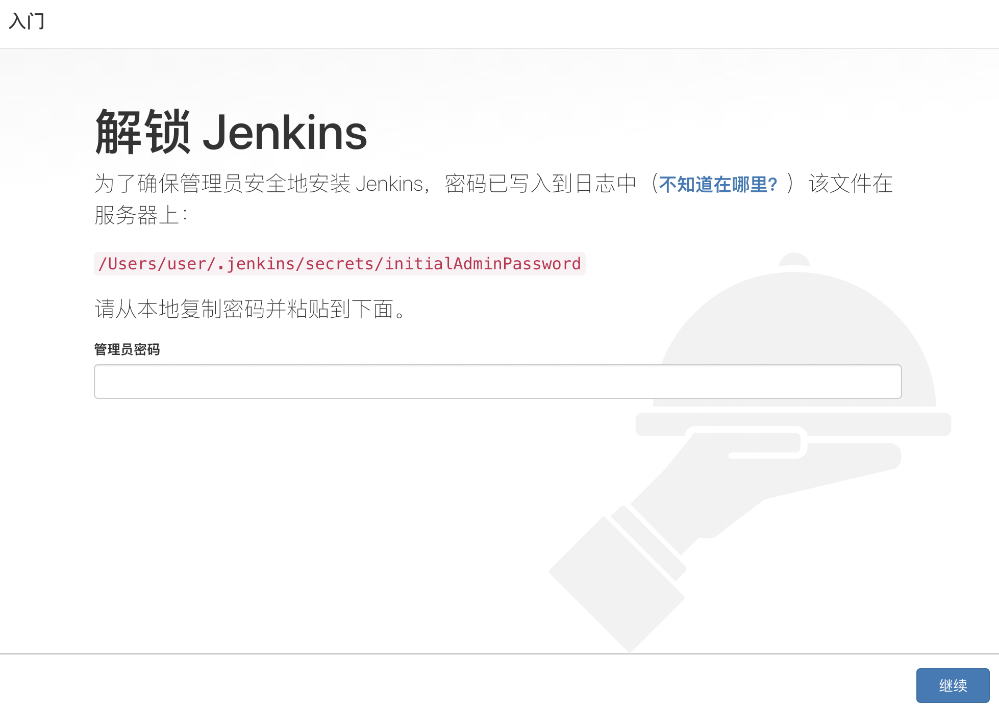


**启动之二：部署到Tomcat中**


步骤：
1、准备一台tomcat服务器
2、将jenkins.war复制到$tomcat_home/webapps/下
3、启动tomcat
4、jenkins服务地址：http://<tomcat_ip>:<tomcat_port>/jenkins


实战演练：

```
1、下载tomcat到本地
https://tomcat.apache.org/download-90.cgi ，mac下载Core下面到zip包即可
2、解压到指定文件夹下面
HCBdeMacBook-Pro:tomcat user$ ls
apache-tomcat-9.0.41		apache-tomcat-9.0.41.zip
3、进入apache-tomcat-9.0.41下面的bin目录执行startup.sh启动tomcat服务
-bash: ./startup.sh: Permission denied  提示没有权限
4、赋予权限
sudo chmod 755 *.sh  #将bin目录下所有.sh结尾的赋予权限，需要输入密码
5、再次启动tomcat服务
HCBdeMacBook-Pro:bin user$ startup.sh 
6、浏览器进行访问
http://localhost:8080/
```

结果如下：
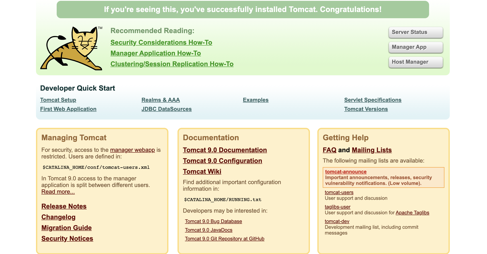


注意事项：

- tomcat的启动条件，需要在本地配置好java运行时环境
- 如果发生端口冲突，需要在config/server.xml中修改对应的端口，避开冲突
- 启动tomcat： bin/startup.sh
- 停止tomcat： bin/shutdown.sh
- 日志文件在logs/catalina.out, 追加输出日志的方法 tail -f <日志文件路径>


实战演练将jenkins部署至tomcat

```
1、进入apache-tomcat-9.0.41下webapps目录
cd webapps/
2、将jenkins.war复制到当前目录下
cp /Users/user/jenkis/jenkins.war  /Users/user/tool/tomcat/apache-tomcat-9.0.41/webapps/
HCBdeMacBook-Pro:webapps user$ ls
ROOT		docs		examples	host-manager	jenkins.war	manager
3、启动tomcat服务
sh bin/startup.sh 

Using CATALINA_BASE:   /Users/user/tool/tomcat/apache-tomcat-9.0.41
Using CATALINA_HOME:   /Users/user/tool/tomcat/apache-tomcat-9.0.41
Using CATALINA_TMPDIR: /Users/user/tool/tomcat/apache-tomcat-9.0.41/temp
Using JRE_HOME:        /Library/Java/JavaVirtualMachines/jdk1.8.0_201.jdk/Contents/Home
Using CLASSPATH:       /Users/user/tool/tomcat/apache-tomcat-9.0.41/bin/bootstrap.jar:/Users/user/tool/tomcat/apache-tomcat-9.0.41/bin/tomcat-juli.jar
Using CATALINA_OPTS:   
Tomcat started.

4、浏览器进行访问
http://localhost:8080/jenkins

5、查看日志
tail -f logs/catalina.out 

08-Jan-2021 16:06:37.493 警告 [Handling GET /jenkins/static/ebff9cbb/jsbundles/fonts/roboto-v15-greek_latin-ext_latin_vietnamese_cyrillic_greek-ext_cyrillic-ext-700.woff2 from 0:0:0:0:0:0:0:1 : http-nio-8080-exec-4] org.apache.catalina.webresources.Cache.getResource 无法将位于[/jsbundles/fonts/roboto-v15-greek_latin-ext_latin_vietnamese_cyrillic_greek-ext_cyrillic-ext-700.woff2]的资源添加到Web应用程序[/jenkins]的缓存中，因为在清除过期缓存条目后可用空间仍不足 - 请考虑增加缓存的最大空间
```

访问结果如下：

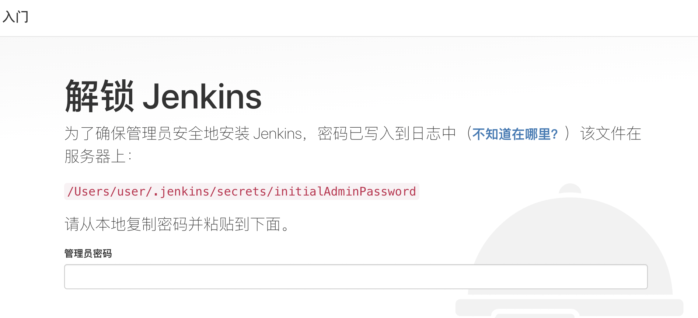


**jenkins启动之三：docker部署**


```
1、拉取jenkins镜像
docker pull jenkins/jenkins

2、运行镜像启动容器
docker run -d -p 8080:8080 -p 50000:50000 jenkins/jenkins

3、浏览器访问地址 
http://47.108.156.7:8080

4、进入容器内部
docker exec -it aef9ee530791 bash

```

启动成功如下：

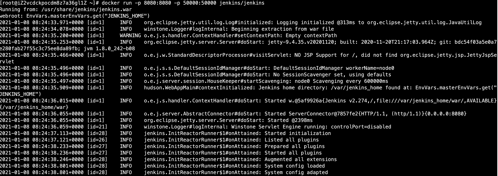


结果如下：

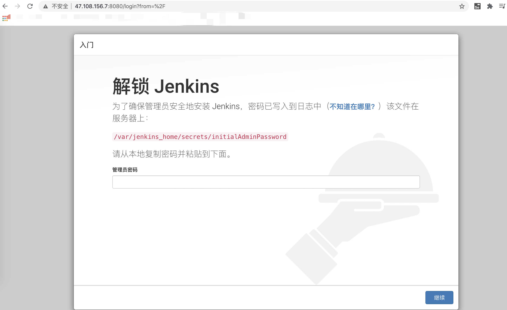


可以在宿主机上使用docker logs命令查看相关日志：

```
docker logs -f -t aef9ee530791
```


## jenkins初始化

- jenkins启动之后需要先输入initialAdminPassword，

- 初始密码存放位置：/var/jenkins_home/secrets/initialAdminPassword

- 复制出密码，输入在jenkins启动的首页弹框中


进入容器，使用cat进行查看密码，然后输入：
```
jenkins@aef9ee530791:/$ cat /var/jenkins_home/secrets/initialAdminPassword
315a6af500bd4bf09bbb8fe45cd56407
```


然后进入到建议大家安装到插件（建议大家安装建议的插件）

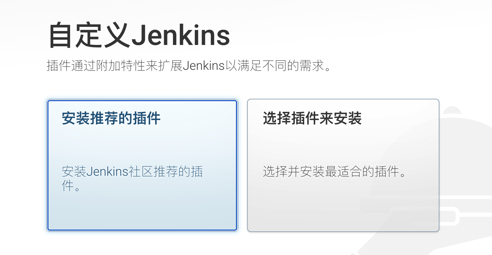


选择安装建议的插件之后，就会自动进行安装：
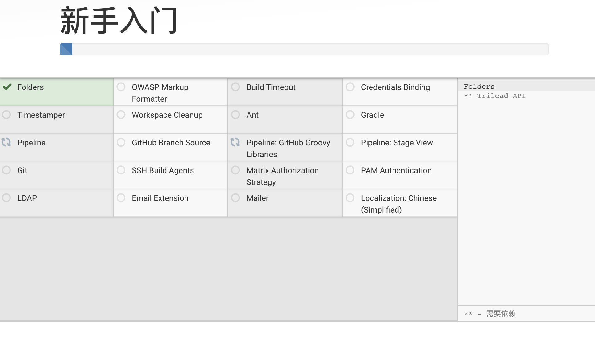


安装完成之后，进入创建管理员用户界面如下：

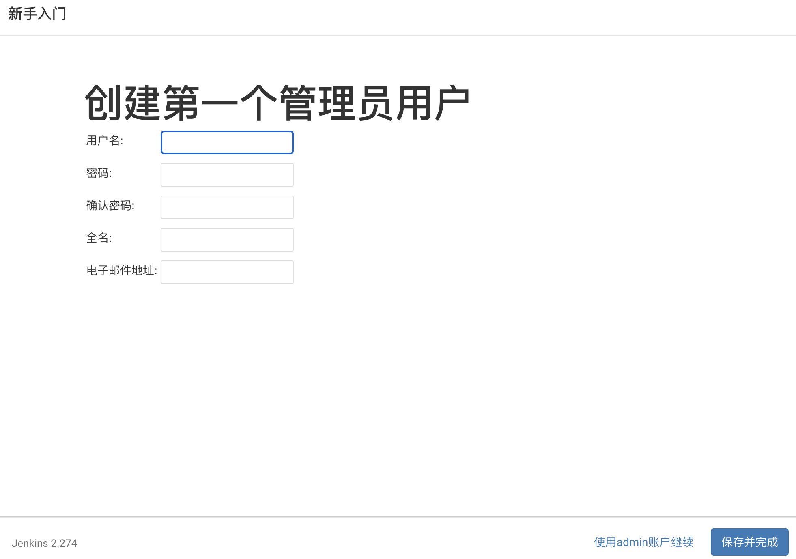


管理员用户设置完成之后，进入如下页面：

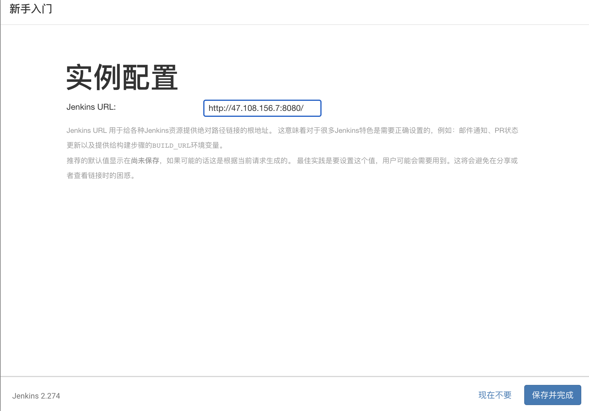


配置完成最终进入主页面如下：

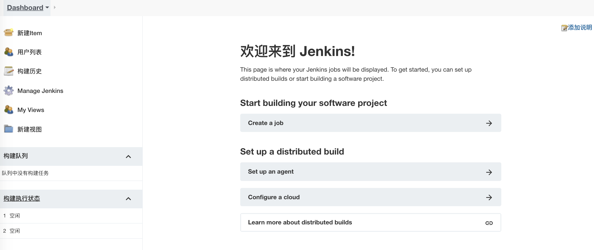


到此，已经完成jenkins的所有配置，可以开始使用了！


