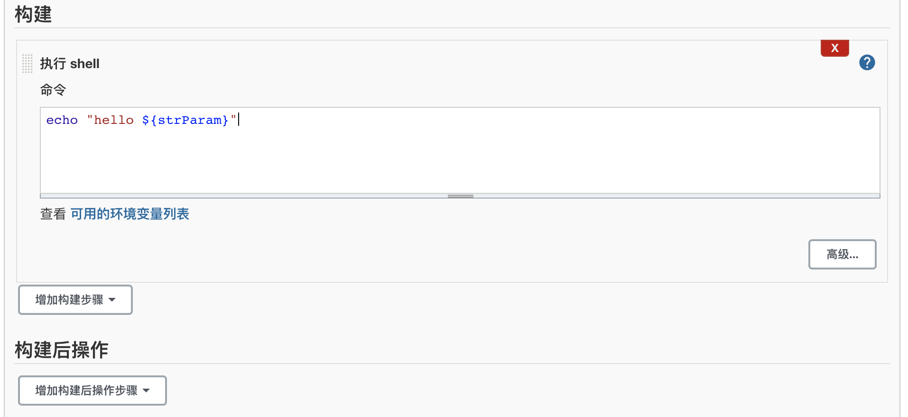

# 02-jenkins任务


## 新建第一个jenkins job

```
1、新建jenkins任务
2、类型选择自由风格
3、简单“描述”这个任务
4、设定最大构建记录的保留数（天数vs个数）节约磁盘空间
5、关于参数化构建
6、定时触发
7、构建执行步骤
8、保存，然后构建，看看结果如何
```

案例：创建第一个任务


1、点击创建第一个任务


2、输入任务名，选择自由风格，点击确定


3、输入详细的构建相关的选项和参数


如果需要设置保留的构建任务个数来节约磁盘空间的话，可以选择天或者个数：


接下来我们配置参数化：


选择文本参数：


填写文本参数内容：


4、添加定时构建选项


5、添加构建shell


输入对应shell脚本



这里将上面定义的参数，进行传递。使用${参数名}即可


这样一个任务就创建成功了，接下来，定时器将会每5分钟自动触发！


自动构建执行结果如下：


点击具体的任务可以发现，是由定时器触发构建的！


这里发现一个问题，docker的时区和宿主机不一致问题，这个问题可以用临时方案解决如下：

```
docker cp /etc/localtime aef9ee530791:/etc/localtime  # 将宿主机的时区配置信息文件复制到docker容器内
然后我们进入容器查看时间
jenkins@aef9ee530791:/$ date
Mon Jan 11 14:33:34 CST 2021
发现时间已经调整
```

同时需要在用户设置里面选择时区，这样宣示将正确：


调整后时区，构建记录显示展示如下：


现在我们传递其他的参数进行构建试一试：


查看输出结果：


## jenkins运行第一个单元测试


1、github上上传源代码


2、创建jenkins任务


将github的目录拉取到本地lyJunitTest目录


3、添加命令构建步骤

. /etc/profile  是加载当前系统的环境变量


4、添加测试报告

junit report生成的报告文件都是xml，所以 **/*.xml是通配符。匹配所有xml后缀文件！


5、构建任务后有测试结果展示如下：

