# 03-Jenkins节点管理与用户权限配置


## jenkins节点管理


- jenkins的任务可以分布在不同的节点上运行
- 节点需要配置Java运行时环境，Java_version>1.5
- 节点支持windows、linux、mac
- Jenkins运行的主机在逻辑上上master节点

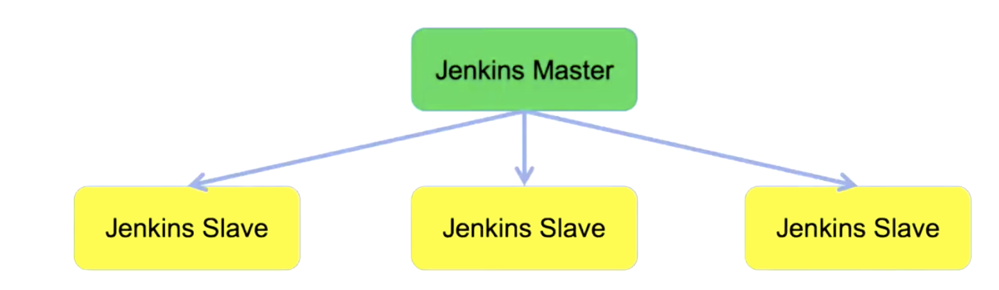


- 新的节点要与Jenkins Server保持连接畅通
- 支持远程运行，比如：ssh、jnlp
- 远程用户密码登录、或者公钥私钥认证
- 配置位置: 系统管理--->管理节点

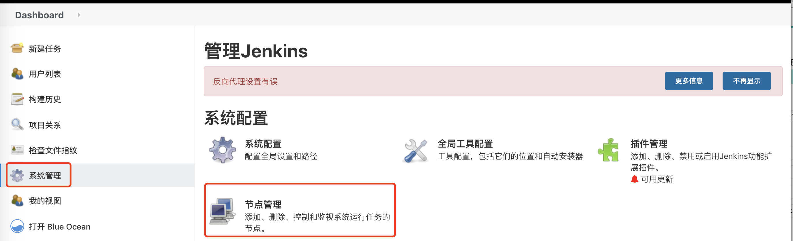


其它相关的节点配置：


- git基础配置

```
git config  --global user.name "your_account"
git config --global user.email "youremail@example.com"

```

- ssh-key 证书配置

```
ssh -keygen -t rsa -C "your email@example.com"
```

- github认证通过，往github里面配置public-key

- 关于Know hosts，尝试与github 握手一次，ssh git@github.com

以上配置的目的：配通github！


Javen&Maven环境

- 建议安装jdk1.8
- maven安装最新版就可以
- 配置国内镜像源加速下载

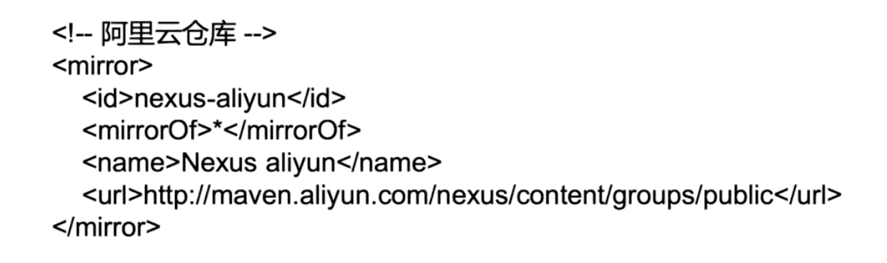


**实战：配置jenkins节点**  本地jenkins 添加远程服务器作为节点


首先进行从节点服务器相关配置：

```
1、创建jenkins用户
adduser jenkins
passwd jenkins
2、切换用户 
su - jenkins
3、生成密钥
[jenkins@iZ2vcdckpocdm8z7a36gl1Z ~]$ ssh-keygen -t rsa
Generating public/private rsa key pair.
Enter file in which to save the key (/home/jenkins/.ssh/id_rsa): 
Created directory '/home/jenkins/.ssh'.
4、添加ssh认证文件，方便远程机器无密码登录jenkins用户
$ cd ~/.ssh
$ touch authorized_keys
cat id_rsa.pub > authorized_keys
```

创建Jenkins Credentials 认证

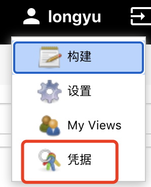

添加凭据：

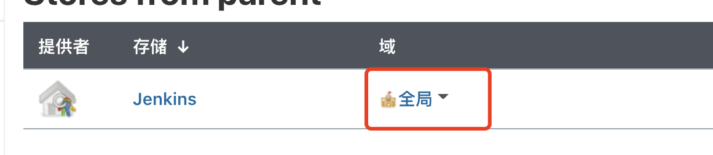


输入密钥相关配置：（私钥存储在丛机id_rsa文件中）
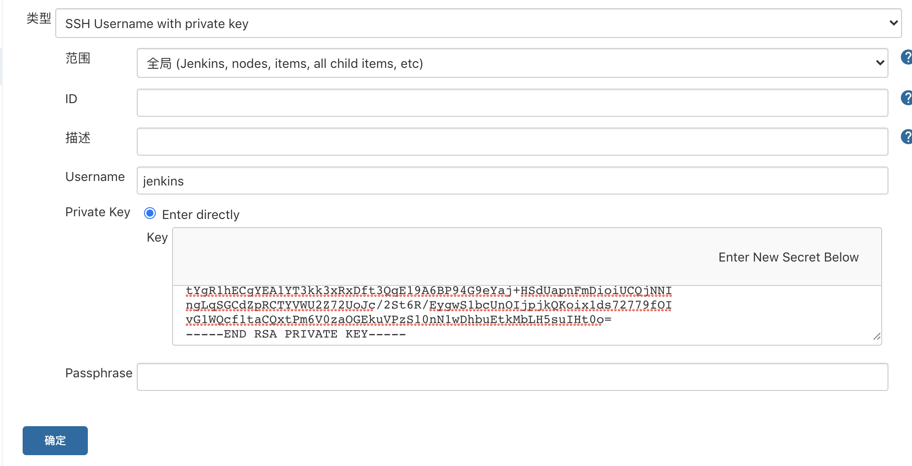


然后添加公钥到github上
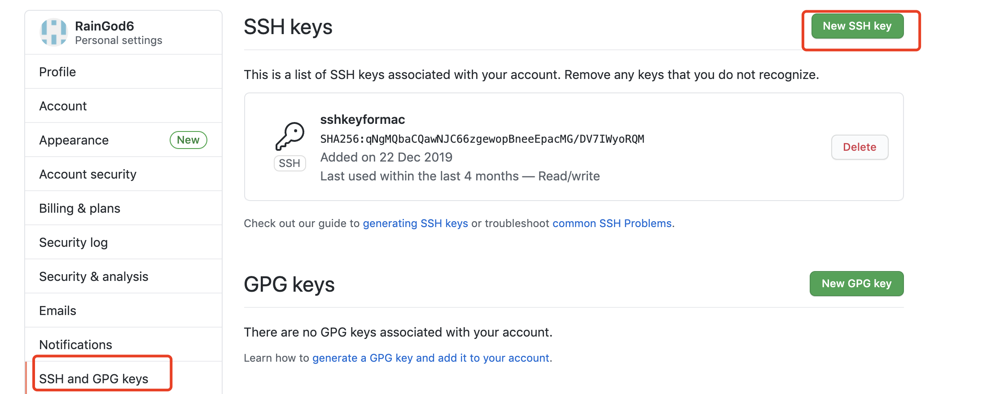


添加成功如下：（公钥位置：id_rsa.pub ）
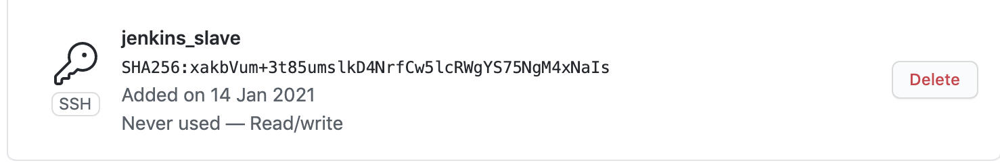


接下来配置master节点

在manager jenkins栏目--System Configuration
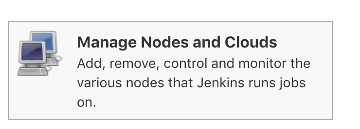

配置如下：
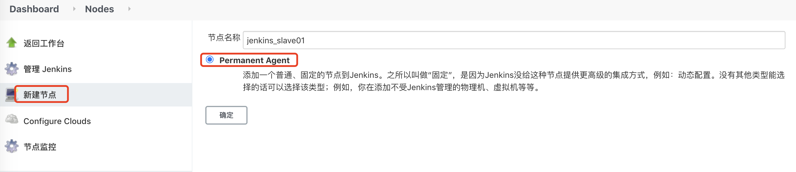


配置详细内容：

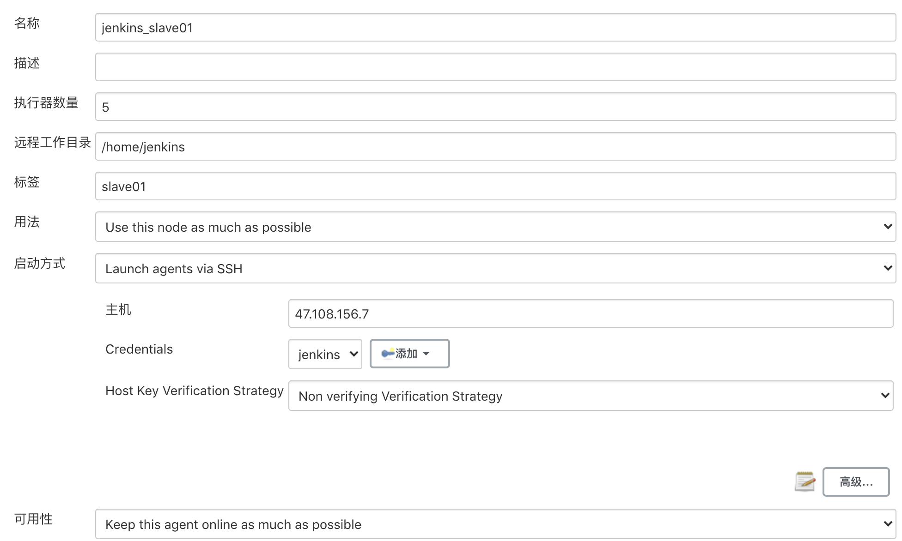

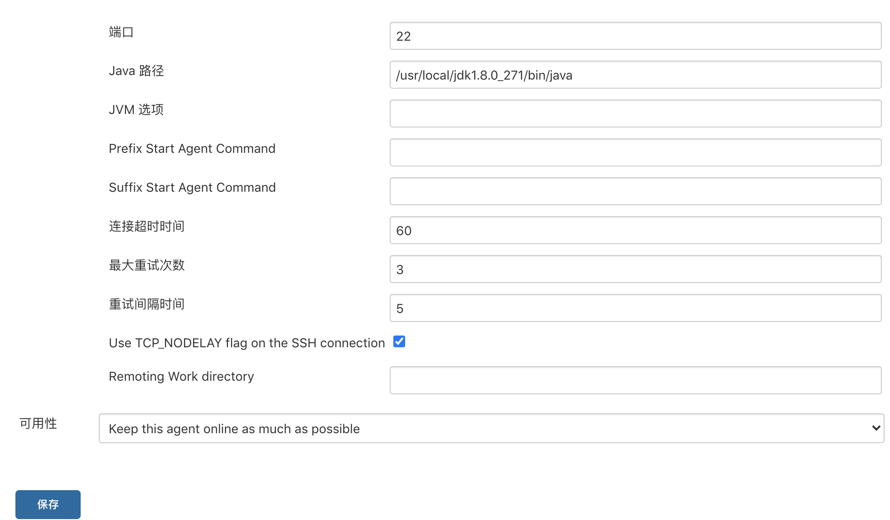


可以发现连接成功

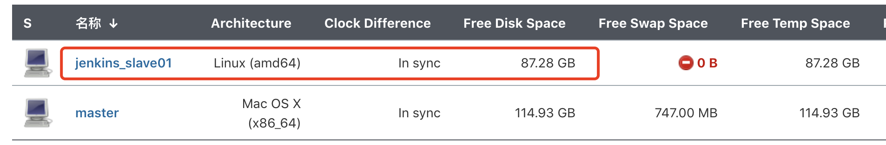


## 用户权限配置


Jenkins初始化过程会先注册一个管理员用户。这个用户可以用来创建和管理用户！

启用用户安全配置， Manager Jenkins ---> Configure Global Security

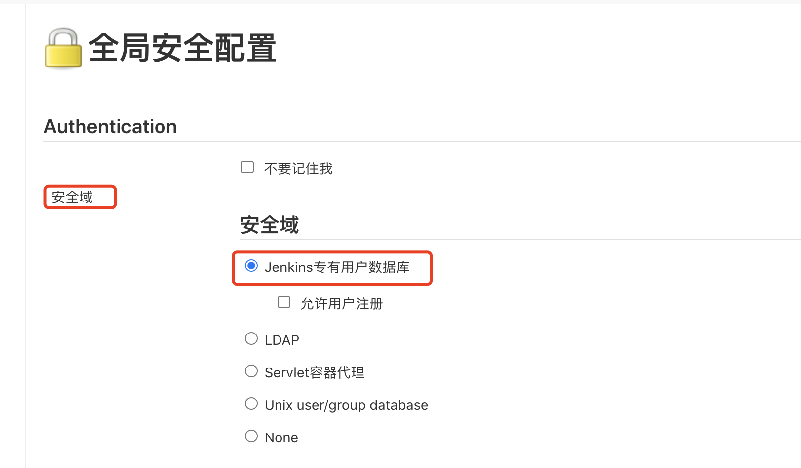

如果勾选了允许用户注册，则用户能自主注册，建议不要勾选！


注册用户的操作权限控制：

- 必须由管理员来控制
- 用户可以自主注册，启用之后在jenkins首页可以看到sign-up入口
- 注册权限配置在Configure Global Security中
- 配置好权限之后，管理员可以直接从后台添加权限 

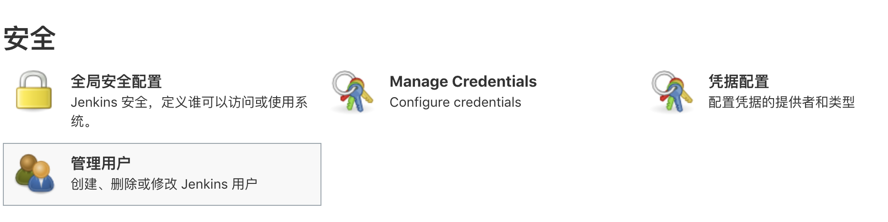


不同的用户在jenkins中可操作的内容不同，这个通过权限进行配置

常见的权限配置：

- jenkins管理员：配置jenkins、创建和更新job、运行job、查看日志
- jenkins任务开发： 创建和更新job、运行job、查看日志
- jenkins使用者：运行job、查看日志

这样的好处是：分权管理，避免用户误操作带来的麻烦，比如误删除任务、误改代码等


用户权限配置：在全局安全配置--->授权策略--->选择安全矩阵如下：


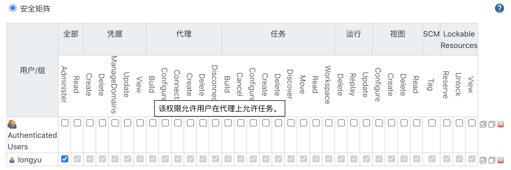


案例：创建jenkisn用户，并分配权限！


1、首先进入系统管理，选择管理用户

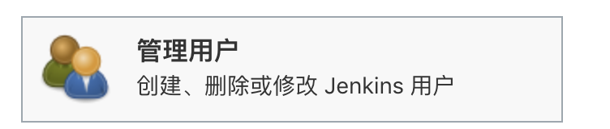


2、选择新建用户
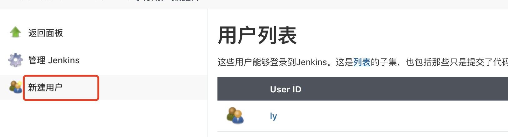


3、输入用户相关信息

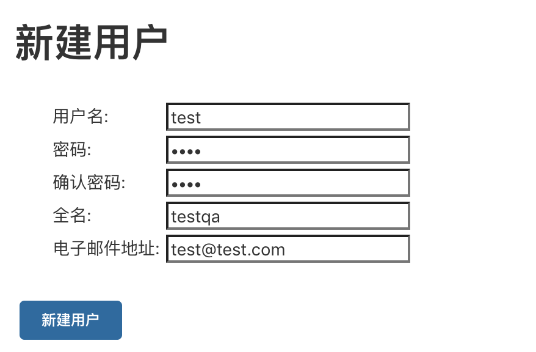


创建成功如下：
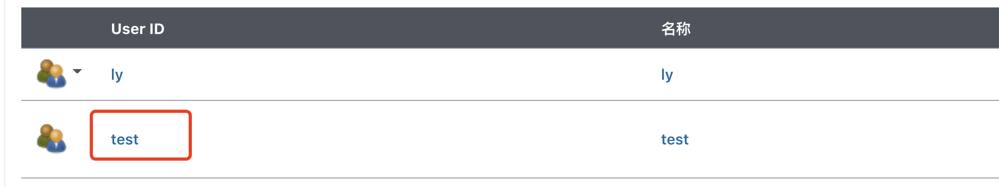


4、添加用户权限（进入系统管理--全局安全配置）

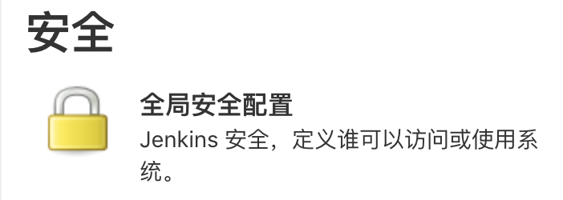


5、添加用户

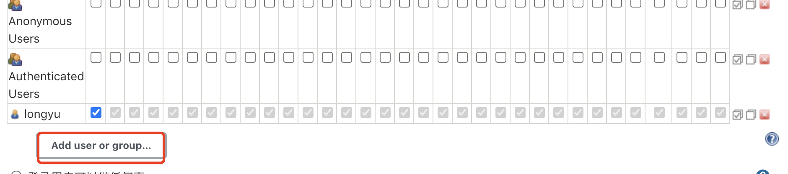


6、输入用户名进行搜索

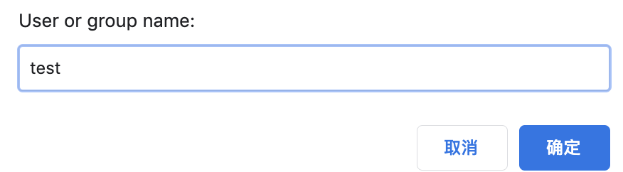


7、配置权限

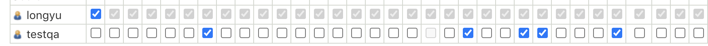


8、保存即可，接下来用用户登录试验一下

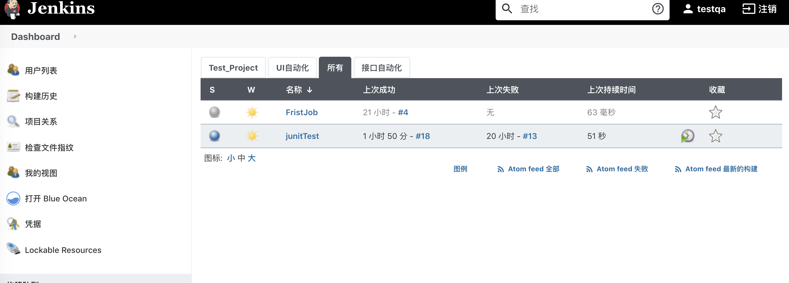


可以发现该用户，只能查看没有构建任务相关的权限。我们再看一下具体任务

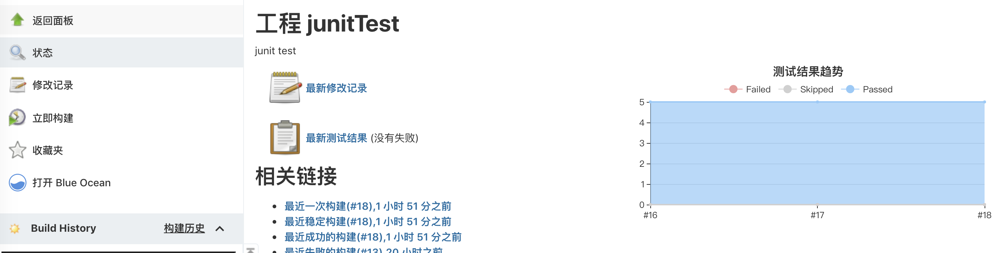


发现可以构建，这样分配权限也是我们想要的管理结果！


