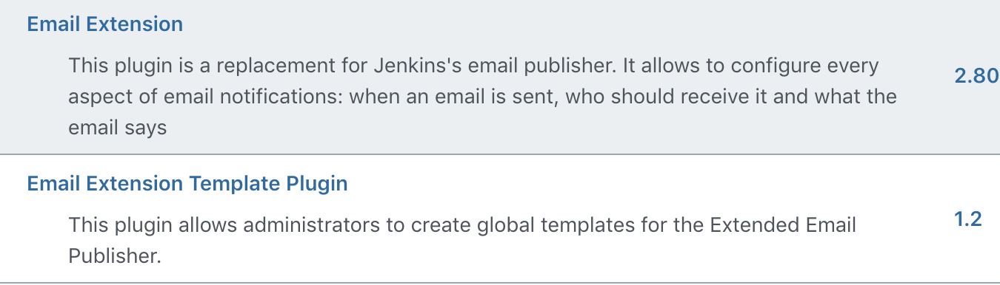
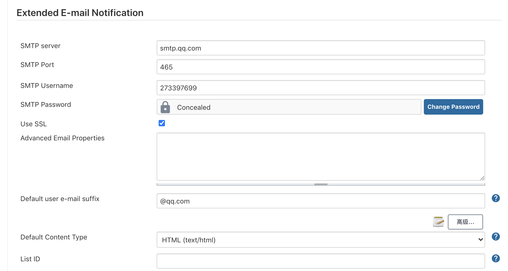
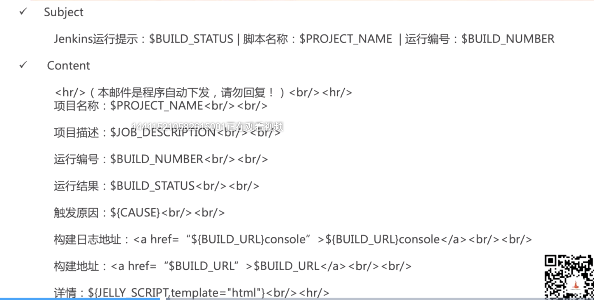
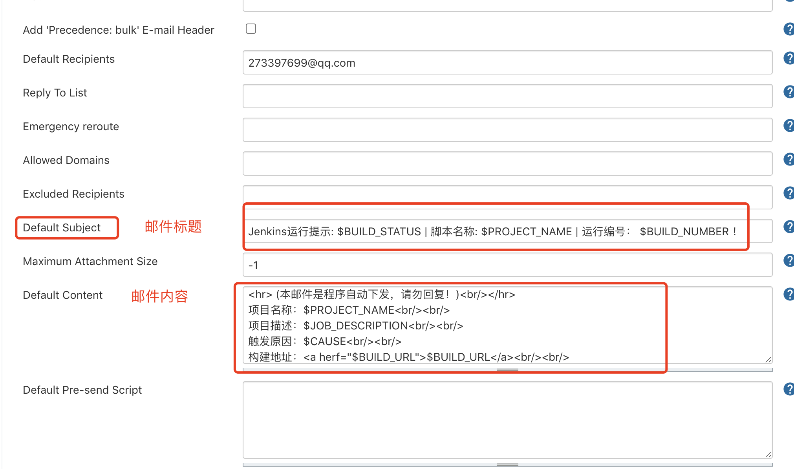
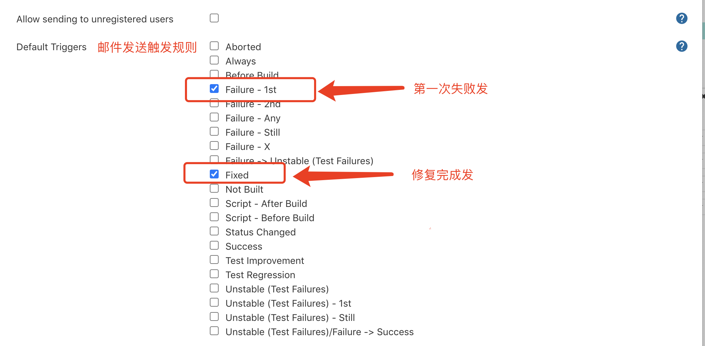
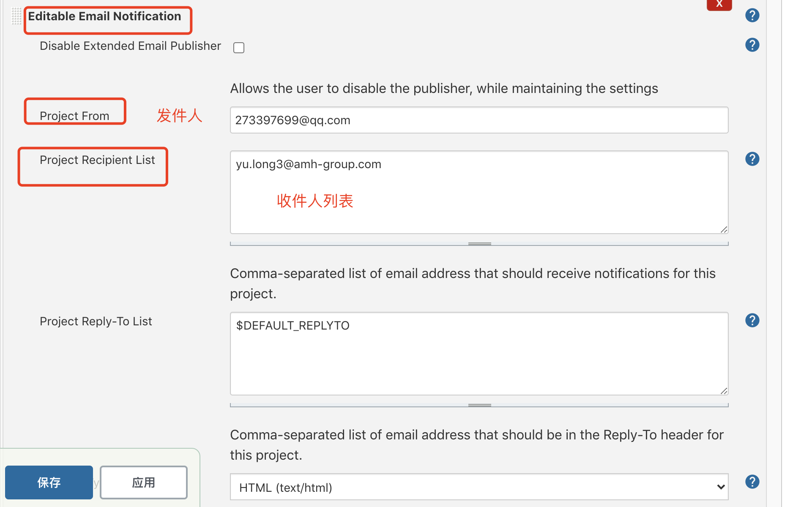
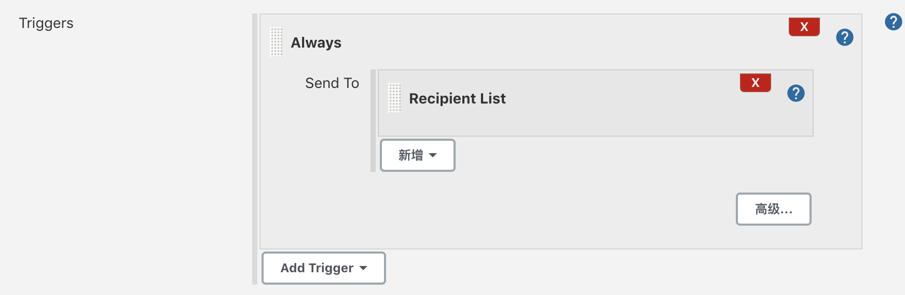
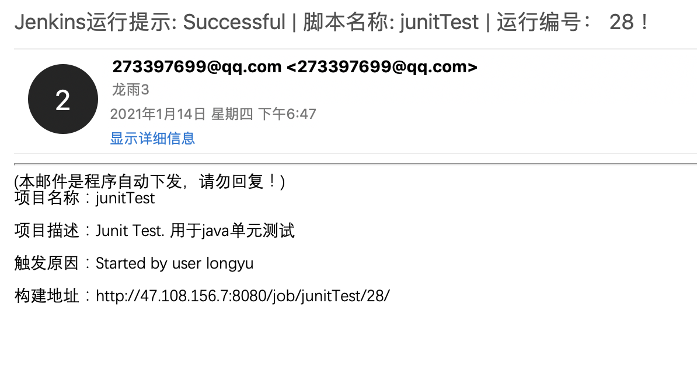

# 04-jenkins邮件配置与任务报警邮件发送


## jenkins配置Email

- 用户jenkins构建任务之后发送Email通知
- 配置邮件发送规则
- 配置邮件模版
- 需要下载插件


需要下载的Email插件名称： Email Extension， Email Extension Template

这两个插件的作用是帮助用户方便的设置格式化邮件！




配置步骤：

1、配置发送邮件的基础信息（系统管理-系统配置）




**注意这里的SMTP PASSWORD必须要使用个人QQ里面的授权码，使用密码会验证失败！**


2、jenkins可以根据你配置的邮件模版格式发送结果邮件


通过jenkins的参数定制自己的Email模板，常用的参数key如下：

```
- $BUILD_STATUS - 构建结果
- $PROJECT_NAME - 构建脚本名称
- $BUILD_NUMBER - 构建脚本编号
- $JOB_DESCRIPTION - 构建项目描述
- $CAUSE - 脚本启动原因
- $BUILD_URL - 脚本构建详情URL地址
```

邮件模板



实际的配置操作结果如下图所示：



3、配置触发规则 （这个是全局的，在具体任务中可以进行修改）




4、具体任务进行配置




可以在当前任务修改Trigger规则，



这里就修改成了Always，意思是每次都发。这个可以根据大家的需要进行配置！


配置完毕后，我们来构建任务，测试邮件发送结果：




这就是收到的邮件结果！

