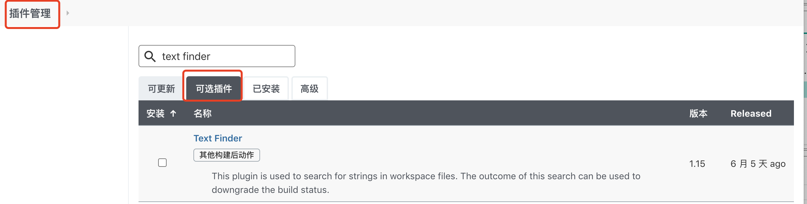
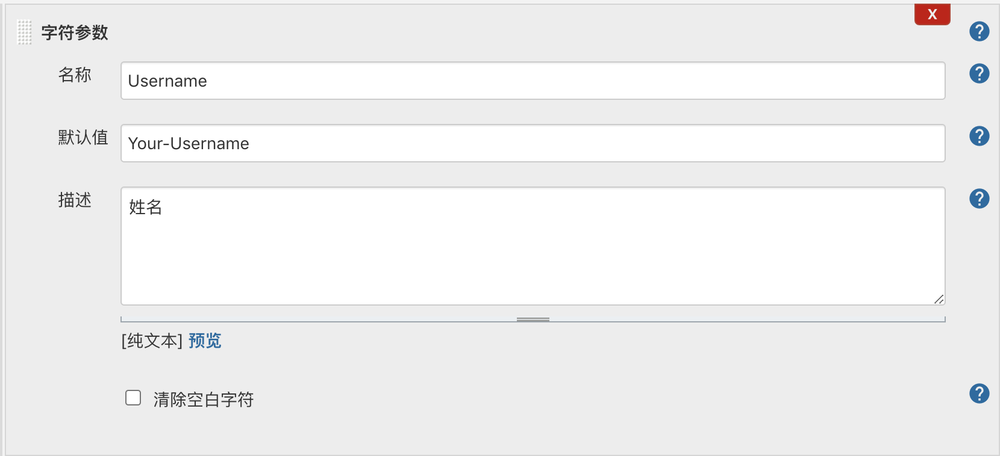
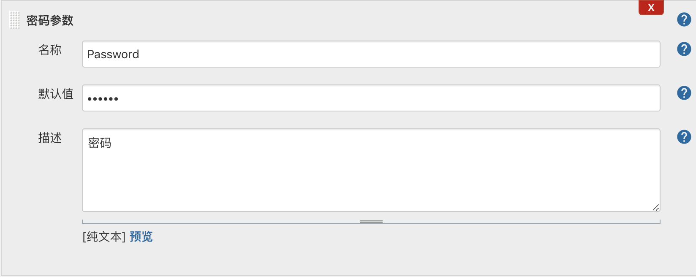
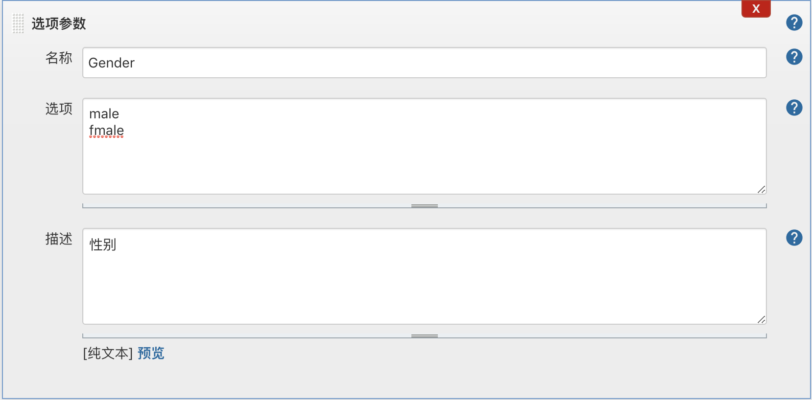
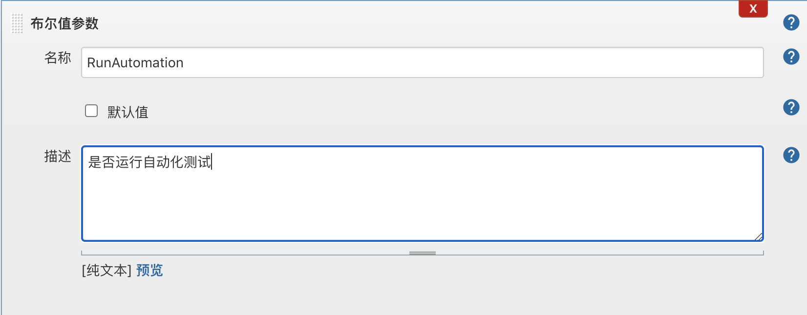
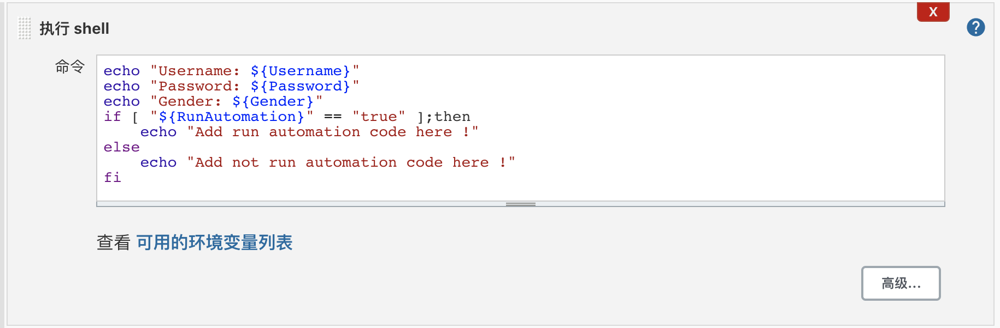
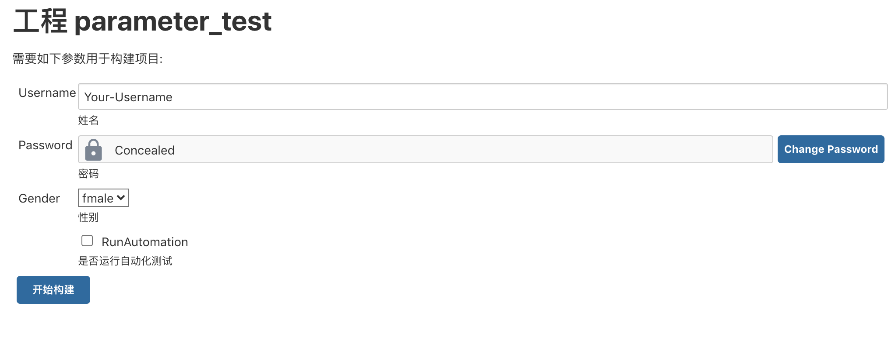
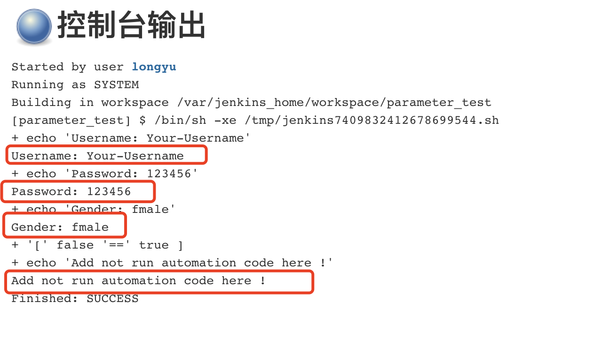
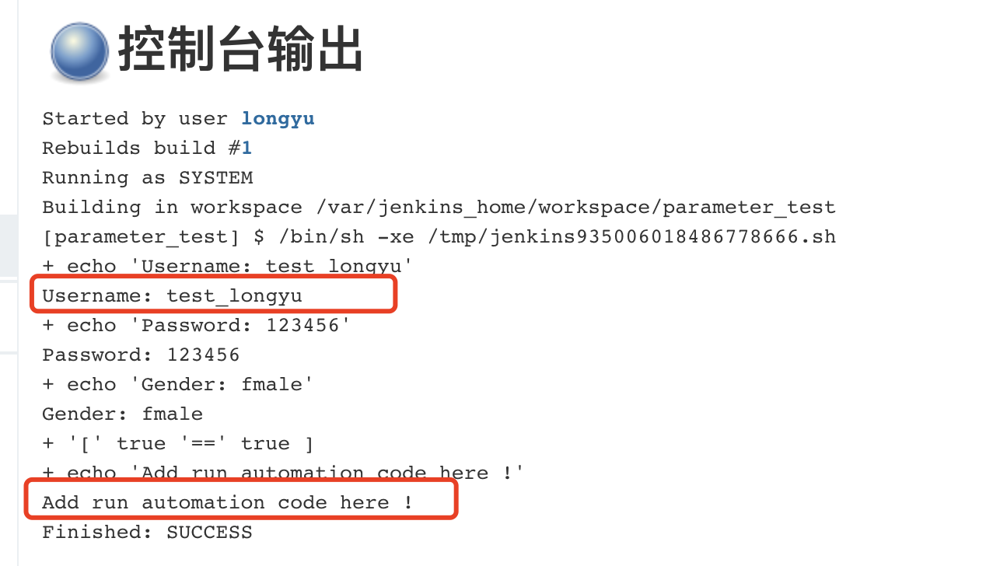

# 05-jenkins插件应用与参数化构建

## jenkins高级插件简介

jenkins强大的原因之一就是插件众多，插件帮助jenkins丰富自身原有的功能。

插件安装的方法：

- 进入插件安装也没：Manage Jenkins -> Manage Plugins -> Available

- 在Fileter中输入希望安装的插件名称，然后看下过滤结果

- 如果插件存在，则勾选插件，然后执行插件安装

- 标签也分别代表Update(可更新)、Available(可选的）、Installed（已安装）、Advanced（高级--配置代理服务-或者自定义插件）

**建议大家安装的插件**

- Multiple SCMs plugin   (复合代码库)
- Rebuilder                   
- Safe Restart Plugin     （重启jenkins服务）
- Pipline                         
- Text Finder                  
- Blue Ocean               （交互页面比较美观）

## jenkins 参数化构建

目的： 设定动态参数构建之前输入

- 任务后续运行的时候可以通过 ${parameter-name} 获取变量值
- 获取参数变量值之后的处理逻辑用代码来控制
- 一些常用的参数还有：Choice、boolean、Password
- 使用场景举例：配置构建分支、输入配置参数

案例一：创建一个parameter参数化的测试任务

1、添加字符参数

2、添加密码参数

3、添加选项参数

4、添加布尔值参数

添加构建shell脚本，对参数进行判断：

接下来我们构建运行测试：

然后我们看一下输出结果：

可以发现按照预期进行输出！

我们调整一下参数值，再运行一次，结果如下：

