# 06-父子多任务运行

可能也存在这样一种需求，当前任务运行依赖于其它任务的运行结果！根据上一个任务结果，执行不同的任务！


任务启动的触发条件：其它任务的运行结果！

- 前驱任务成功的条件下被触发
- 前驱任务失败的条件下被触发
- 前驱任务不稳定的条件下被触发
- 适用场景：有先后次序关系的任务，比如：部署环境任务->验收测试任务


案例 ：demo前驱任务稳定成功的条件下被触发


先创建两个任务，首先创建任务一：

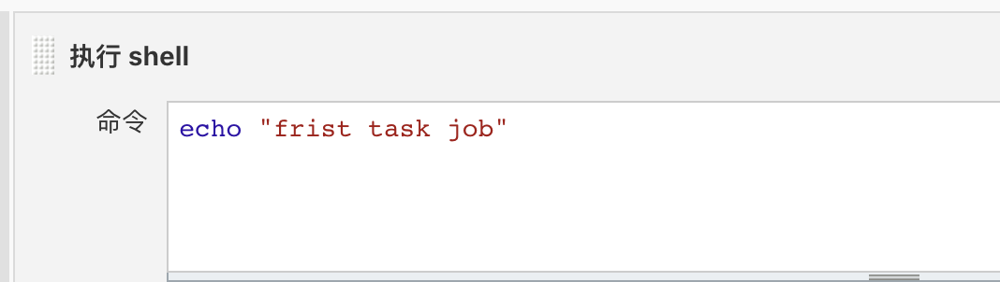


再创建第二个任务：让第二个任务进行关联第一个任务

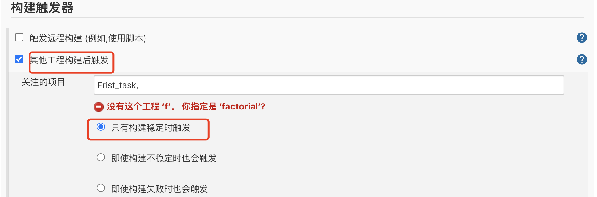


然后我们执行测试：（执行第一个任务！）


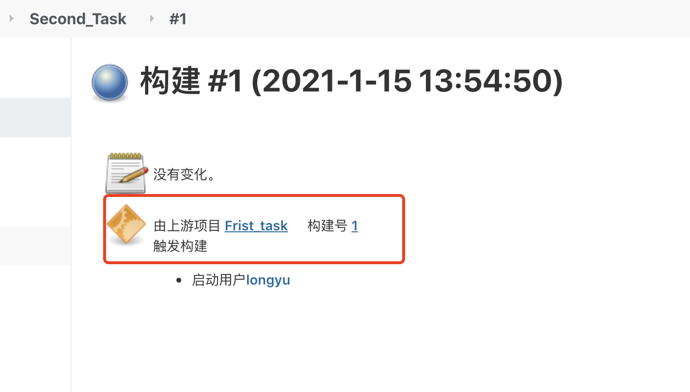


发现第二个任务也自动构建，构建触发的详细信息是由第一个任务触发的！


我们将第一个任务执行脚本修改如下，再次构建测试：
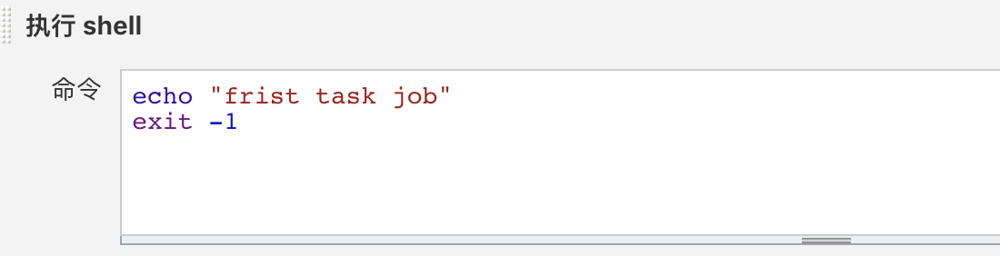


任务一，执行如下：
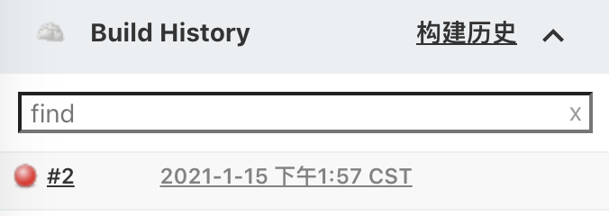


我们在看下任务二：
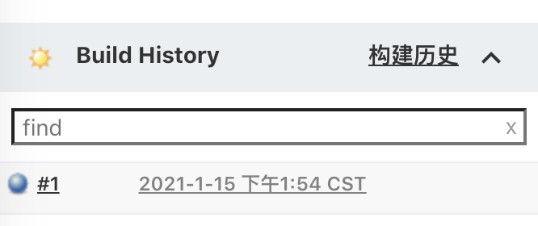


并没有触发新的构建，这也就是父子关联任务，前驱任务成功的条件下才会触发！


案例二：前驱任务失败，也被触发！


接着上面的案例，我们修改任务二的触发条件如下：

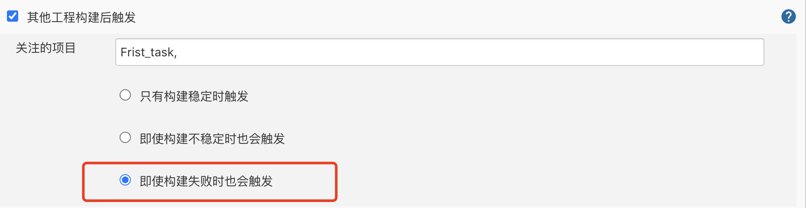


我们再次执行任务一，观察任务二是否被执行？


首先任务一构建执行，再观察任务二：

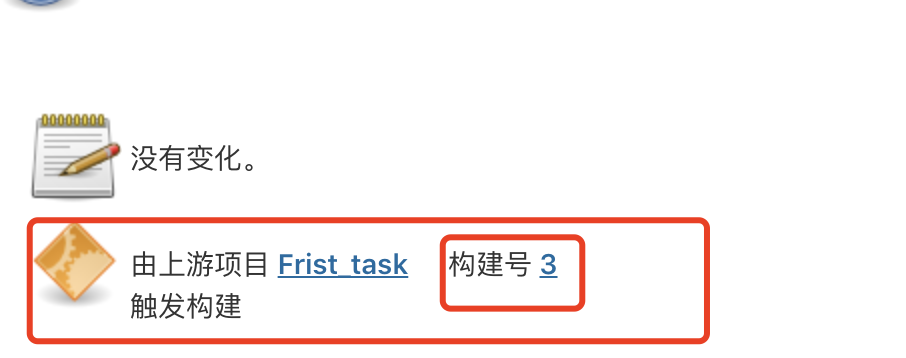


发现任务二已经触发成功！

当然这种选项是，依赖任务不管成功失败，任务二都会触发！


**如何设定jenkins任务失败？**

shell退出状态值非0，jenkins即会将任务状态标记为失败。


案例三：前驱任务不稳定的条件下也被触发


如何故意设置 jenkins任务结果不稳定？

```
- 安装text finder插件
- 任务最终结果成功，输出字样中含“unstable”
- 在Post action中设置规则：如果在console中检测到unstable，则标记任务状态为unstable
```

接下来我们将任务一进行设置：

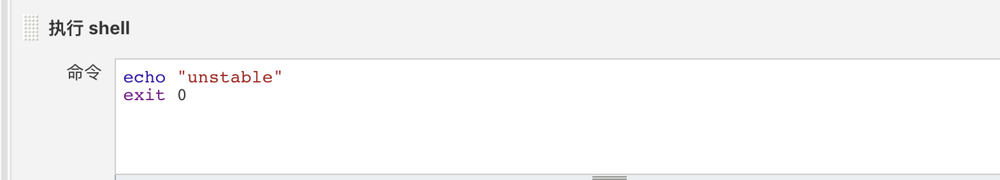

在shell中需要输入unstable字样的文本。


接下来添加构建后续操作：

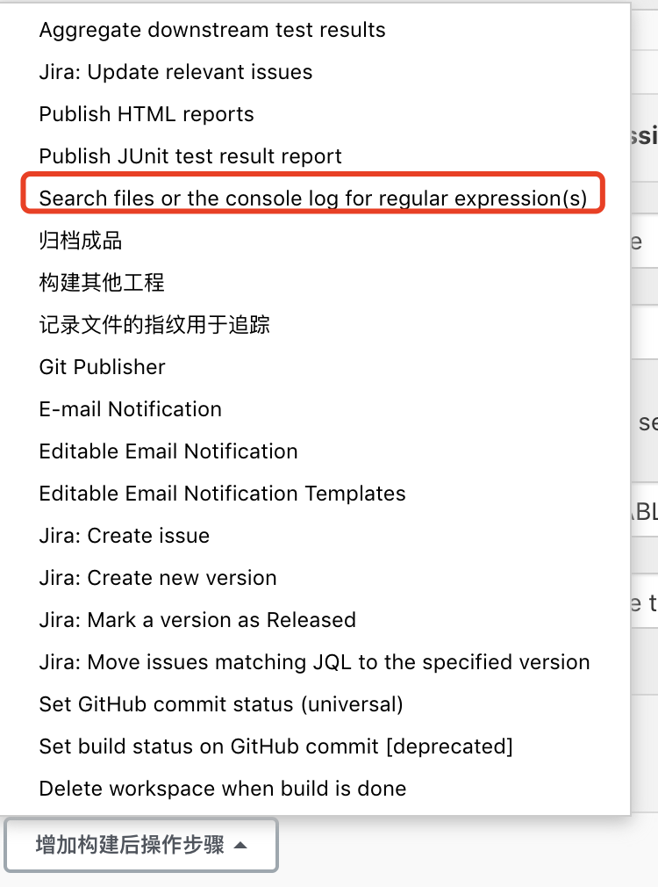


进行如下配置：
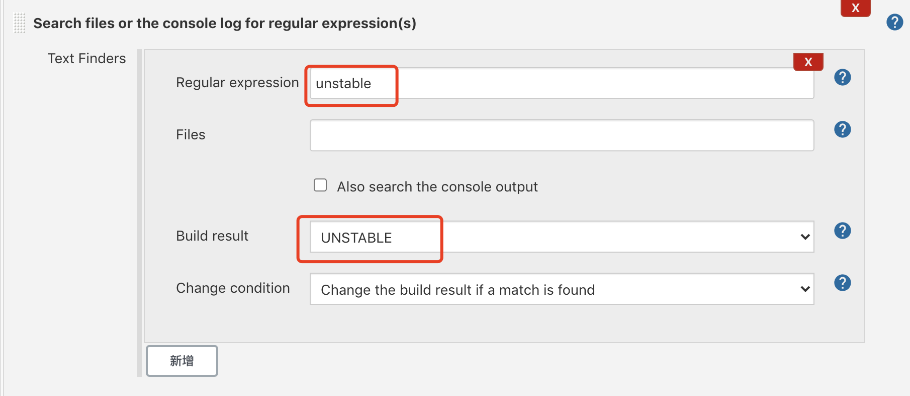

接下来我们运行一下任务一，保证正常

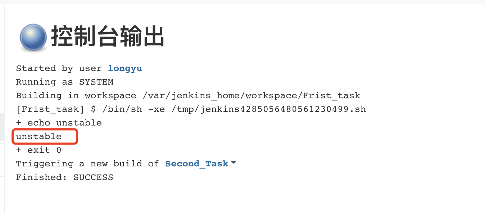


接下来配置任务二：

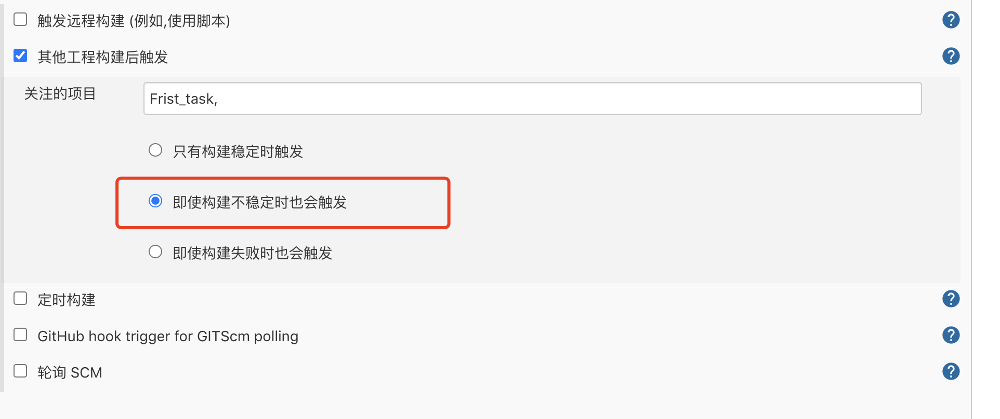

选择不稳定的触发条件，保存！

我们再次执行任务一，查看任务二是否自动触发？

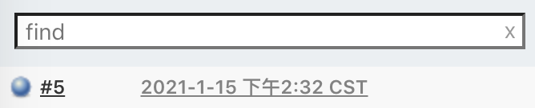

任务一构建成功，查看任务二：

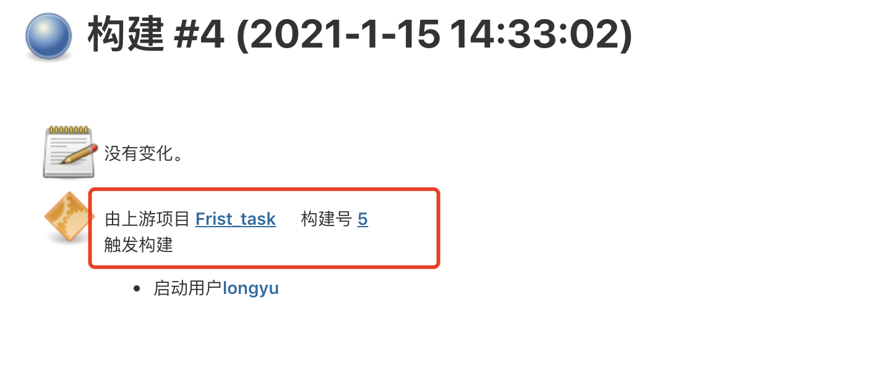


可以发现构建成功！这样任务一的unstable状态也就制作成功！如我们的预期！


