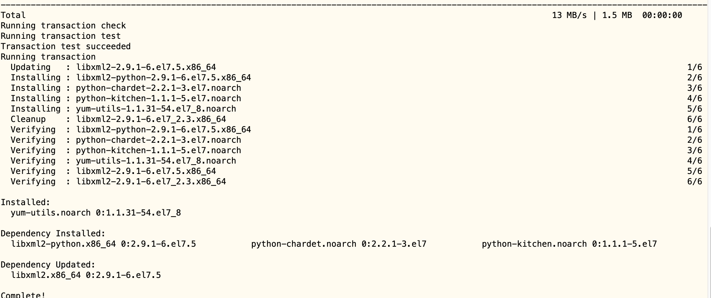

# 01-Docker安装


## 在CentOS上安装Docker Engine


官方参考文档：https://docs.docker.com/engine/install/centos/#prerequisites


### 准备工作


**系统要求：**

Docker 支持 64 位版本 CentOS 7/8，并且要求内核版本不低于 3.10。 CentOS 7 满足最低内核的要求，但由于内核版本比较低，部分功能（如 overlay2 存储层驱动）无法使用，并且部分功能可能不太稳定。

可以使用如下命令，查看linux内核版本：

```
uname -a

[root@iZ2vcdckpocdm8z7a36gl1Z ~]# uname -a 
Linux iZ2vcdckpocdm8z7a36gl1Z 3.10.0-957.21.3.el7.x86_64 #1 SMP Tue Jun 18 16:35:19 UTC 2019 x86_64 x86_64 x86_64 GNU/Linux
```


如果你机器上已经安装旧版本可以使用以下命令进行卸载：

```
sudo yum remove docker \
                  docker-client \
                  docker-client-latest \
                  docker-common \
                  docker-latest \
                  docker-latest-logrotate \
                  docker-logrotate \
                  docker-selinux \
                  docker-engine-selinux \
                  docker-engine
```


### 使用yum安装


安装依赖包：

```
$ sudo yum install -y yum-utils
```

安装成功如下：




鉴于国内网络问题，强烈建议使用国内源，官方源请在注释中查看。执行下面的命令添加 yum 软件源：

```
$ sudo yum-config-manager \
    --add-repo \
    https://mirrors.aliyun.com/docker-ce/linux/centos/docker-ce.repo

$ sudo sed -i 's/download.docker.com/mirrors.aliyun.com\/docker-ce/g' /etc/yum.repos.d/docker-ce.repo

# 官方源
# $ sudo yum-config-manager \
#     --add-repo \
#     https://download.docker.com/linux/centos/docker-ce.repo
```


### 安装docker


更新 yum 软件源缓存，并安装 docker-ce。

```
$ sudo yum install docker-ce docker-ce-cli containerd.io
```

执行过程中，需要手动输入两次y，同意相关安装下载操作。，最终安装成功结果如下：


### 启动docker

```
$ sudo systemctl enable docker
$ sudo systemctl start docker
```


测试docker是否安装正确，使用如下命令：

```
[root@iZ2vcdckpocdm8z7a36gl1Z home]# docker run hello-world
Unable to find image 'hello-world:latest' locally
latest: Pulling from library/hello-world
0e03bdcc26d7: Pull complete 
Digest: sha256:e7c70bb24b462baa86c102610182e3efcb12a04854e8c582838d92970a09f323
Status: Downloaded newer image for hello-world:latest

Hello from Docker!
This message shows that your installation appears to be working correctly.

To generate this message, Docker took the following steps:
 1. The Docker client contacted the Docker daemon.
 2. The Docker daemon pulled the "hello-world" image from the Docker Hub.
    (amd64)
 3. The Docker daemon created a new container from that image which runs the
    executable that produces the output you are currently reading.
 4. The Docker daemon streamed that output to the Docker client, which sent it
    to your terminal.

To try something more ambitious, you can run an Ubuntu container with:
 $ docker run -it ubuntu bash

Share images, automate workflows, and more with a free Docker ID:
 https://hub.docker.com/

For more examples and ideas, visit:
 https://docs.docker.com/get-started/
```

若能正常输出以上信息，则说明安装成功。


### 镜像加速器


阿里云配置地址：https://www.aliyun.com/product/acr?source=5176.11533457&userCode=8lx5zmtu&spm=5176.12901015.0.i12901015.45aa525cSUKc8e

设置阿里云镜像仓库密码：


然后再镜像加速器，复制地址即可。


新建配置文件：

```
sudo mkdir -p /etc/docker
sudo tee /etc/docker/daemon.json <<-'EOF'
{
  "registry-mirrors": ["https://7mpf6kgk.mirror.aliyuncs.com"]
}
EOF
```

然后重新启动服务：

```
$sudo systemctl daemon-reload
$sudo systemctl restart docker
```