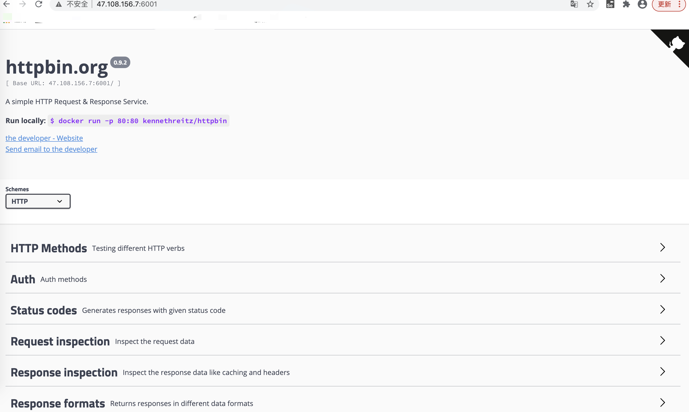

# 02-Docker搭建httpbin环境


httpbin是一个开源项目，使用Python+Flask编写，利用它可以测试各种HTTP请求和响应。

- 官网：http://www.httpbin.org/
- github：https://github.com/postmanlabs/httpbin


项目虽好，但是鉴于国内网络的问题，httpbin的官网可能无法访问或者很卡，这个时候就需要在本地配置httpbin了。


## 环境

阿里云centos + docker


docker环境搭建httpbin，参照如下命令即可：

```
docker pull kennethreitz/httpbin
docker run -p 80:80 kennethreitz/httpbin
```


将项目下载到docker容器中

```
[root@iZ2vcdckpocdm8z7a36gl1Z lib]# docker pull kennethreitz/httpbin
Using default tag: latest

latest: Pulling from kennethreitz/httpbin
473ede7ed136: Pull complete 
c46b5fa4d940: Pull complete 
93ae3df89c92: Pull complete 
6b1eed27cade: Pull complete 
0373952b589d: Pull complete 
7b82cd0ee527: Pull complete 
a36b2d884a89: Pull complete 
Digest: sha256:599fe5e5073102dbb0ee3dbb65f049dab44fa9fc251f6835c9990f8fb196a72b
Status: Downloaded newer image for kennethreitz/httpbin:latest
docker.io/kennethreitz/httpbin:latest
```

在后台运行：

```
$docker run -d -p 6001:80 --name httpbin --restart=always kennethreitz/httpbin:latest
```

宿主机的port是6001，然后映射到docker容器中的httbin监听的80端口。-d参数是后台运行。


## 测试httpbin服务访问


如果是阿里云服务器，需要在安全组开放端口。

然后再浏览器，输入服务器地址，以及使用docker 映射的端口即可访问服务，如下：

