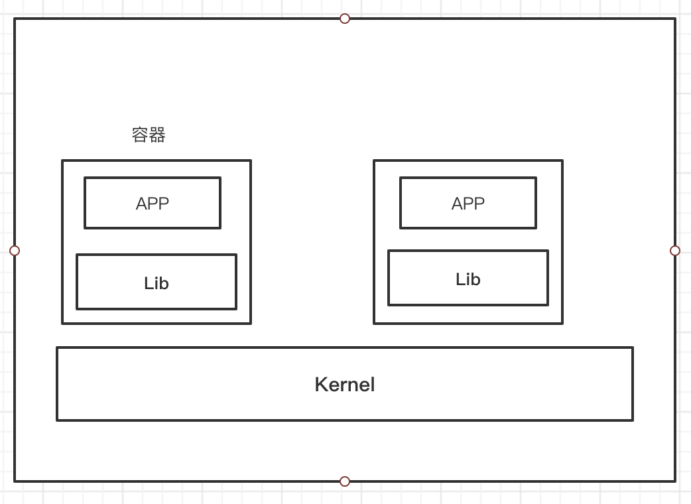

# 01-docker概述


## Docker为什么出现？


一款产品：经常会经历从开发---测试--上线的过程！ 然而每个应用都有自己的环境、以及配置。在常规公司中就会出现两个角色：开发和运维。经常会遇到这样的问题，

问题： 我在我的电脑上可以运行！ 换到其它电脑主机上不能运行。还有比如版本更新，导致服务不可用等问题！对于运维来说，考验十分大。


要解决如上问题，就有两种情况；开发学习运维知识，或者运维学习开发知识。所以我们开发人员就要学习运维相关技能！


环境配置十分的麻烦，每一个机器都要部署环境（集群redis、ES、Hadoop）! 费时费力！发布一个项目jar（redis、mysql、jdk、ES）war。部署环境会耗费大量时间，所以就会想到开发一个项目，同时把环境打包，提供运维。运维就不再需要每次去部署相关环境。也就是项目能不能都带上环境安装打包！


之前在服务器配置一个应用的环境，配置超麻烦，不能够跨平台。windows，最后发不到linux！

传统： 开发jar，运维来做
现在： 开发打包部署上线，一套流程做完。


java ---apk---发布（应用商店）---张三使用apk---安装即可用！
java----jar(环境)----打包项目带上环境（镜像）----（Docker仓库：商店）-----下载我们发布的镜像-----直接运行即可！


**Docker给以上的问题，提出了解决方案！**


Docker的思想来自于集装箱！每个箱子是相互隔离的！

原来：
 JRE---多个应用（端口冲突）---原来都是交叉的
隔离：Docker核心思想！打包装箱，每个箱子都是相互隔离的。
 
docker通过隔离机制，可以将服务器利用到极致！


本质：所有的技术都是因为出现了一些问题，我们需要去解决！


## Docker的历史

2010年，几个搞IT的年青人，就在美国成立了一家公司dotCloud，做一些pass的云计算服务！LXC有关的容器技术！

他们将自己的技术（容器化技术）命名就是Docker！Docker刚诞生的时候，没有引起行业的注意！dotCloud，就活不下去！

于是他们想到：开源，开放源代码。


2013年，Docker开源！Docker越来越多的人发现了docker的优点，就开始火了。Docker每个月都更新一个版本，
2014年4月9日，Docker 1.0发布！


Docker为什么这么火？十分的轻巧！

在容器技术出来之前，我们都使用的是虚拟机的技术

虚拟机： 在windows中装一个Vmvare，通过这个软件我们就可以虚拟出来一台或多台电脑！笨重！

虚拟机也是属于虚拟化技术，Docker容器技术，也是一种虚拟化技术！
```
vm： linux centos原生镜像（一个电脑）隔离，需要开启多个虚拟机！  几个G
docker： 隔离，镜像（最核心的环境 4m + jdk+mysql）十分的小巧，运行镜像就可以了！小巧！几M， KB  秒级启动！
```

到现在，所有开发人员都必须要学会docker。

Docker是基于Go语言开发的，开源项目！

官网：https://www.docker.com/


文档地址：https://docs.docker.com/，docker的文档是非常详细的！

仓库地址：https://hub.docker.com/


## Docker能做什么


之前的虚拟技术


虚拟机技术缺点：

1、资源占用十分多
2、冗余步骤多
3、启动很慢


容器化技术：

**容器化技术不是模拟的一个完整的操作系统**




比较Docker和虚拟技术的不同：

- 传统虚拟机，虚拟出一条硬件，运行一个完整的操作系统，然后在这个系统上安装和运行软件
- 容器内的应用直接运行在宿主机之上，容器没有自己的内核的，也没有虚拟硬件，所以就轻便了
- 每个容器互相隔离，每个容器内都有一个属于自己的文件系统，互不影响


DevOps（开发、运维）

1、**应用更快的交付和部署**

传统：一堆帮助文档，安装程序
Docker： 打包镜像发布测试，一键运行

2、**更快捷的升级和扩缩容**

使用了docker之后，我们部署应用就和搭积木一样！

项目打包为一个镜像，扩展服务器A！服务器B！

3、**更简单的系统运维**

在容器化之后，我们的开发、测试环境都是高度一致的

4、**更高效的计算资源利用**

Docker是内核级别的虚拟化，可以在一个物理机上运行很多的容器实例！服务器的性能可以被压榨到极致！


## Docker的基本组成


**镜像(image)：**

docker镜像就好比一个模板，可以通过这个模板来创建容器服务。tomcat镜像===>run====>tomcat01容器（提供服务器）
通过这个镜像可以创建多个容器（最终服务运行或者项目运行就是在容器中的）

**容器(container):**

Docker利用容器技术，独立运行一个或者一个组应用，通过镜像来创建的。容器具备：启动、停止、删除、基本命令

目前就可以把这个容器理解为一个简易的linux系统

**仓库(repository):**

仓库就是存放镜像的地方！仓库分为公有仓库和私有仓库！

Docker Hub   （默认是国外的）   阿里云....都有容器服务器（配置镜像加速）


## 回顾hello-wrold流程


docker run命令，流程原理如下：


这样我们就了解了使用run命令docker背后的原理，我们来run一个不存在的镜像，错误提示如下：


## 底层原理


**Docker是怎么工作的？**

Docker是一个clinet-server结构的系统，Docker的守护进程运行在宿主机上。通过Socket从客户端访问！

DockerServer接收到Docker-Client的指令，就会执行这个命令！


Docker为什么比虚拟机快？

1、docker有着比虚拟机更少的抽象层
2、docker利用的是宿主机的内核，vm需要是Guset OS


所以说，新建一个容器的时候，docker不需要像虚拟机一样重新加载一个操作系统内核，避免引导。虚拟机是加载Guest OS，分钟级别的，而docker是利用宿主机的操作系统，省略了这个复杂的过程，秒级！


