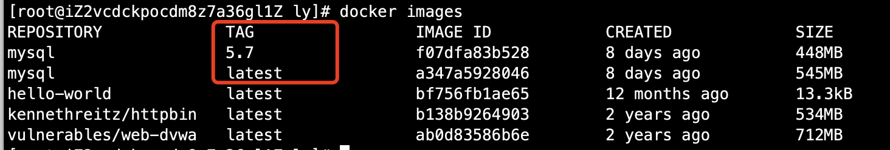
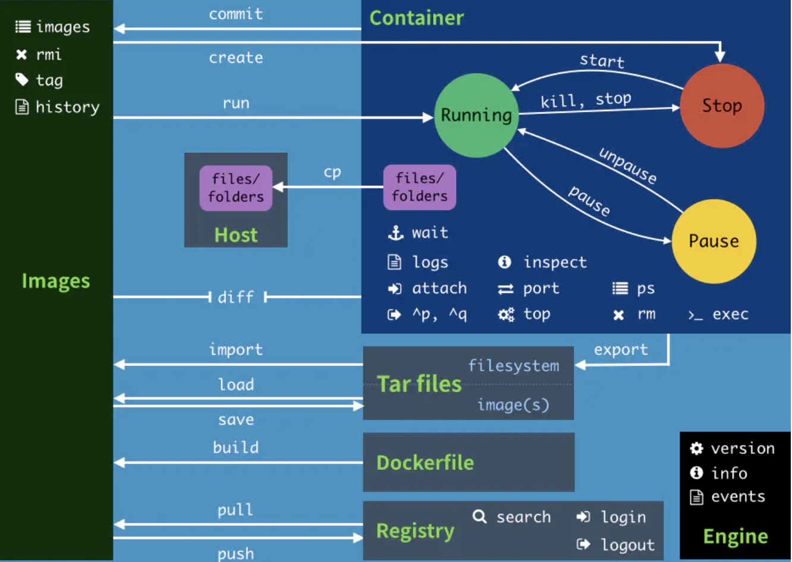

# 02-docker的常用命令


**帮助命令：**

```
docker version     # 显示docker的版本信息，客户端和服务端信息
docker info        # 显示docker的系统信息，包括镜像和容器的数量
docker 命令 --help  # 万能命令，可以查看命令帮助
```

帮助文档的地址：https://docs.docker.com/reference/


## 镜像命令


**docker images  #查看本地的主机上的镜像**

```
[root@iZ2vcdckpocdm8z7a36gl1Z ly]# docker images
REPOSITORY             TAG                 IMAGE ID            CREATED             SIZE
hello-world            latest              bf756fb1ae65        12 months ago       13.3kB
kennethreitz/httpbin   latest              b138b9264903        2 years ago         534MB
vulnerables/web-dvwa   latest              ab0d83586b6e        2 years ago         712MB

# 解释
REPOSITORY     镜像的仓库源
TAG            镜像的标签
IMAGE ID       镜像的ID
CREATED        镜像的创建时间
SIZE           镜像的大小

# 可选项
  -a, --all             列出所有的镜像
  -q, --quiet           只显示镜像的ID
```


**docker search**  #搜索镜像

```
[root@iZ2vcdckpocdm8z7a36gl1Z ly]# docker search mysql
NAME                              DESCRIPTION                                     STARS               OFFICIAL            AUTOMATED
mysql                             MySQL is a widely used, open-source relation…   10326               [OK]                
mariadb                           MariaDB is a community-developed fork of MyS…   3825                [OK]                
mysql/mysql-server                Optimized MySQL Server Docker images. Create…   754                                     [OK]

# 可选项 通过收藏来过滤
--filter STARS=3000 # 搜索出来的镜像STARS是大于3000的，也可以用简写的-f参数
[root@iZ2vcdckpocdm8z7a36gl1Z ly]# docker search mysql --filter STARS=3000
NAME                DESCRIPTION                                     STARS               OFFICIAL            AUTOMATED
mysql               MySQL is a widely used, open-source relation…   10326               [OK]                
mariadb             MariaDB is a community-developed fork of MyS…   3825                [OK]            

[root@iZ2vcdckpocdm8z7a36gl1Z ly]# docker search mysql -f STARS=9000
NAME                DESCRIPTION                                     STARS               OFFICIAL            AUTOMATED
mysql               MySQL is a widely used, open-source relation…   10326               [OK]       
```

**docker pull** 下载镜像

```
# 下载镜像 docker pull 镜像名 [:tag]
[root@iZ2vcdckpocdm8z7a36gl1Z ly]# docker pull mysql
Using default tag: latest    # 如果不写tag，默认就是latest
latest: Pulling from library/mysql
6ec7b7d162b2: Pull complete     # 分层下载，docker image的核心，联合文件系统
fedd960d3481: Pull complete 
7ab947313861: Pull complete 
64f92f19e638: Pull complete 
3e80b17bff96: Pull complete 
014e976799f9: Pull complete 
59ae84fee1b3: Pull complete 
ffe10de703ea: Pull complete 
657af6d90c83: Pull complete 
98bfb480322c: Pull complete 
6aa3859c4789: Pull complete 
1ed875d851ef: Pull complete 
Digest: sha256:78800e6d3f1b230e35275145e657b82c3fb02a27b2d8e76aac2f5e90c1c30873  # 签名
Status: Downloaded newer image for mysql:latest
docker.io/library/mysql:latest  # 真实地址

# 如下两条命令是等价的
docker pull mysql 
docker pull docker.io/library/mysql:latest  

# 指定版本下载
[root@iZ2vcdckpocdm8z7a36gl1Z ly]# docker pull mysql:5.7
5.7: Pulling from library/mysql
6ec7b7d162b2: Already exists 
fedd960d3481: Already exists 
7ab947313861: Already exists 
64f92f19e638: Already exists 
3e80b17bff96: Already exists 
014e976799f9: Already exists 
59ae84fee1b3: Already exists 
7d1da2a18e2e: Pull complete 
301a28b700b9: Pull complete 
529dc8dbeaf3: Pull complete 
bc9d021dc13f: Pull complete 
Digest: sha256:c3a567d3e3ad8b05dfce401ed08f0f6bf3f3b64cc17694979d5f2e5d78e10173
Status: Downloaded newer image for mysql:5.7
docker.io/library/mysql:5.7
```




**docker rmi** 删除镜像

```
# docker rmi -f 镜像id   删除指定的镜像
# docker rmi -f 镜像id   镜像id  镜像id  删除多个镜像
# docker rmi -f $(docker images -aq)  删除所有镜像
[root@iZ2vcdckpocdm8z7a36gl1Z ly]# docker rmi -f f07dfa83b528  
Untagged: mysql:5.7
Untagged: mysql@sha256:c3a567d3e3ad8b05dfce401ed08f0f6bf3f3b64cc17694979d5f2e5d78e10173
Deleted: sha256:f07dfa83b5283f486f1fa1628cb8b4a18a4d071a486708acc5c06243ca7f592a
Deleted: sha256:1137660d239dd339c83697d1d5cc93542333aaf35c1fd90418f9c0d166c23487
Deleted: sha256:20c29fc0161bc3cc0addc48ab1aeb70f605a5529590fd32d01502d58d1c6dc10
Deleted: sha256:8615ae1ee613441540ee54a2c517eb0600a6c83667a79f7ca74acc9ffec4c9a4
Deleted: sha256:252efab3ecb7891820c5a340645044850d6edc7815c6588450d74b0a743424f4

# 删除所有镜像
[root@iZ2vcdckpocdm8z7a36gl1Z ly]# docker rmi -f $(docker images -aq)
```


## 容器命令

说明：我们有了镜像，才可以创建容器，我们来下载个linux centos镜像来测试学习！

```
docker pull centos
```

**新建容器并启动**

```
docker run [可选参数] image

# 参数说明
--name     容器名字：tomcat01 tomcat02，用来区分容器
-d         后台方式运行
-it        使用交互模式运行，进入容器查看内容
-p         指定容器端口  -p 8080:8080
    -p ip：主机端口:容器端口
    -p 主机端口:容器端口
    -p 容器端口
    容器端口
-P       随机指定端口

# 测试,启动并进入容器
[root@iZ2vcdckpocdm8z7a36gl1Z ly]# docker run -it centos /bin/bash
[root@91cf19af2a54 /]# ls #查看容器内的centos，基础版本很多命令不完善
bin  dev  etc  home  lib  lib64  lost+found  media  mnt  opt  proc  root  run  sbin  srv  sys  tmp  usr  var
# 从容器中退回主机
[root@91cf19af2a54 /]# exit
exit
```

**列出所有的运行的容器**

```
# docker ps 命令
    # 列出当前正在运行的容器，不带参数
-a  # 列出当前正在运行的容器+带出历史运行过的容器
-n=？ # 显示最近创建个数的容器
-q   # 只显示容器的编号

测试：
[root@iZ2vcdckpocdm8z7a36gl1Z ly]# docker ps -aq
91cf19af2a54
8702a059fd73
97d4c563e0ee
5cef9daaf00a
[root@iZ2vcdckpocdm8z7a36gl1Z ly]# docker ps -n 1
CONTAINER ID        IMAGE               COMMAND             CREATED             STATUS                     PORTS               NAMES
91cf19af2a54        centos              "/bin/bash"         6 minutes ago       Exited (0) 4 minutes ago                       agitated_kepler
[root@iZ2vcdckpocdm8z7a36gl1Z ly]# docker ps -n 2
CONTAINER ID        IMAGE               COMMAND             CREATED             STATUS                     PORTS               NAMES
91cf19af2a54        centos              "/bin/bash"         6 minutes ago       Exited (0) 4 minutes ago                       agitated_kepler
8702a059fd73        hello-world         "/hello"            2 hours ago         Exited (0) 2 hours ago                         brave_rubin
```

**退出容器**

```
exit # 直接容器停止并退出
crtl +p + q  # 容器不停止并退出
```


**删除容器**

```
docker rm 容器id  # 删除指定容器,不能删除运行中的容器，如果要强制删除使用rm -f
docker rm -f $(docker ps -aq)       # 删除所有容器
docker ps -a -q|xargs docker rm     # 删除所有的容器
```

**启动和停止容器的操作**

```
docker start 容器id      # 启动容器
docker restart 容器id    # 重启容器
docker stop 容器id       # 停止容器
docker kill 容器id       # 强制停止当前容器
```

## 常用其它命令


**后台启动容器**

```
# 命令 docker run -d 镜像名
[root@iZ2vcdckpocdm8z7a36gl1Z ly]# docker run -d centos
bf26fa9e20e2ff39dd97f828ab8ee41a43900f45e807f6ef2a33ed75134754c7
[root@iZ2vcdckpocdm8z7a36gl1Z ly]# docker ps
CONTAINER ID        IMAGE                  COMMAND                  CREATED             STATUS              PORTS                  NAMES
5cef9daaf00a        kennethreitz/httpbin   "gunicorn -b 0.0.0.0…"   3 weeks ago         Up 3 weeks          0.0.0.0:6001->80/tcp   httpbin

# 问题，docker ps 发现centos停止了
# 常见的坑，docker容器使用后台运行，就必须要有一个前台进程，docker发现没有应用，就会自动停止
# 例如nginx，容器启动后，发现自己没有提供服务，就会立刻停止，就是没有程序了。

```

**查看日志**

```
docker logs -f -t --taili 容器 ，也可以指定显示的条数
# 选项
    -tf   # 显示全部日志
    -- tail number #显示日志条数
[root@iZ2vcdckpocdm8z7a36gl1Z ~]# docker logs -ft --tail 10 5cef9daaf00a 
2020-12-07T07:14:08.385986733Z [2020-12-07 07:14:08 +0000] [1] [INFO] Starting gunicorn 19.9.0
2020-12-07T07:14:08.386467876Z [2020-12-07 07:14:08 +0000] [1] [INFO] Listening at: http://0.0.0.0:80 (1)
2020-12-07T07:14:08.386509983Z [2020-12-07 07:14:08 +0000] [1] [INFO] Using worker: gevent
2020-12-07T07:14:08.388711203Z [2020-12-07 07:14:08 +0000] [8] [INFO] Booting worker with pid: 8
```

**查看容器中进程信息**


```
命令：docker top 容器ID  

[root@iZ2vcdckpocdm8z7a36gl1Z ~]# docker top 5cef9daaf00a 
UID                 PID                 PPID                C                   STIME               TTY                 TIME                CMD
root                10588               10571               0                   Dec07               ?                   00:03:32            /usr/bin/python3 /usr/local/bin/gunicorn -b 0.0.0.0:80 httpbin:app -k gevent
root                10617               10588               0                   Dec07               ?                   00:05:50            /usr/bin/python3 /usr/local/bin/gunicorn -b 0.0.0.0:80 httpbin:app -k gevent
```

**查看镜像的元数据**

```
命令： docker inspect 容器ID

[root@iZ2vcdckpocdm8z7a36gl1Z ~]# docker inspect 5cef9daaf00a 
[
    {
        "Id": "5cef9daaf00a86ad5407d9ec5b34209ed8fe9c3b553ce7866a7f6ea4632ea72a",
        "Created": "2020-12-07T07:14:07.93021189Z",
        "Path": "gunicorn",
        "Args": [
            "-b",
            "0.0.0.0:80",
            "httpbin:app",
            "-k",
            "gevent"
        ],
        "State": {
            "Status": "running",
            "Running": true,
            "Paused": false,
            "Restarting": false,
            "OOMKilled": false,
            "Dead": false,
            "Pid": 10588,
            "ExitCode": 0,
            "Error": "",
            "StartedAt": "2020-12-07T07:14:08.194696544Z",
            "FinishedAt": "0001-01-01T00:00:00Z"
        },
        "Image": "sha256:b138b9264903f46a43e1c750e07dc06f5d2a1bd5d51f37fb185bc608f61090dd",
        "ResolvConfPath": "/var/lib/docker/containers/5cef9daaf00a86ad5407d9ec5b34209ed8fe9c3b553ce7866a7f6ea4632ea72a/resolv.conf",
        "HostnamePath": "/var/lib/docker/containers/5cef9daaf00a86ad5407d9ec5b34209ed8fe9c3b553ce7866a7f6ea4632ea72a/hostname",
        "HostsPath": "/var/lib/docker/containers/5cef9daaf00a86ad5407d9ec5b34209ed8fe9c3b553ce7866a7f6ea4632ea72a/hosts",
        "LogPath": "/var/lib/docker/containers/5cef9daaf00a86ad5407d9ec5b34209ed8fe9c3b553ce7866a7f6ea4632ea72a/5cef9daaf00a86ad5407d9ec5b34209ed8fe9c3b553ce7866a7f6ea4632ea72a-json.log",
        "Name": "/httpbin",
        "RestartCount": 0,
        "Driver": "overlay2",
        "Platform": "linux",
        "MountLabel": "",
        "ProcessLabel": "",
        "AppArmorProfile": "",
        "ExecIDs": null,
        "HostConfig": {
            "Binds": null,
            "ContainerIDFile": "",
            "LogConfig": {
                "Type": "json-file",
                "Config": {}
            },
            "NetworkMode": "default",
            "PortBindings": {
                "80/tcp": [
                    {
                        "HostIp": "",
                        "HostPort": "6001"
                    }
                ]
            },
            "RestartPolicy": {
                "Name": "always",
                "MaximumRetryCount": 0
            },
            "AutoRemove": false,
            "VolumeDriver": "",
            "VolumesFrom": null,
            "CapAdd": null,
            "CapDrop": null,
            "Capabilities": null,
            "Dns": [],
            "DnsOptions": [],
            "DnsSearch": [],
            "ExtraHosts": null,
            "GroupAdd": null,
            "IpcMode": "private",
            "Cgroup": "",
            "Links": null,
            "OomScoreAdj": 0,
            "PidMode": "",
            "Privileged": false,
            "PublishAllPorts": false,
            "ReadonlyRootfs": false,
            "SecurityOpt": null,
            "UTSMode": "",
            "UsernsMode": "",
            "ShmSize": 67108864,
            "Runtime": "runc",
            "ConsoleSize": [
                0,
                0
            ],
            "Isolation": "",
            "CpuShares": 0,
            "Memory": 0,
            "NanoCpus": 0,
            "CgroupParent": "",
            "BlkioWeight": 0,
            "BlkioWeightDevice": [],
            "BlkioDeviceReadBps": null,
            "BlkioDeviceWriteBps": null,
            "BlkioDeviceReadIOps": null,
            "BlkioDeviceWriteIOps": null,
            "CpuPeriod": 0,
            "CpuQuota": 0,
            "CpuRealtimePeriod": 0,
            "CpuRealtimeRuntime": 0,
            "CpusetCpus": "",
            "CpusetMems": "",
            "Devices": [],
            "DeviceCgroupRules": null,
            "DeviceRequests": null,
            "KernelMemory": 0,
            "KernelMemoryTCP": 0,
            "MemoryReservation": 0,
            "MemorySwap": 0,
            "MemorySwappiness": null,
            "OomKillDisable": false,
            "PidsLimit": null,
            "Ulimits": null,
            "CpuCount": 0,
            "CpuPercent": 0,
            "IOMaximumIOps": 0,
            "IOMaximumBandwidth": 0,
            "MaskedPaths": [
                "/proc/asound",
                "/proc/acpi",
                "/proc/kcore",
                "/proc/keys",
                "/proc/latency_stats",
                "/proc/timer_list",
                "/proc/timer_stats",
                "/proc/sched_debug",
                "/proc/scsi",
                "/sys/firmware"
            ],
            "ReadonlyPaths": [
                "/proc/bus",
                "/proc/fs",
                "/proc/irq",
                "/proc/sys",
                "/proc/sysrq-trigger"
            ]
        },
        "GraphDriver": {
            "Data": {
                "LowerDir": "/var/lib/docker/overlay2/b5ec29425116e58b1c43d333a27f826919625a18062810fcdea5471776824578-init/diff:/var/lib/docker/overlay2/02cb66a44076a7dec1ae08862e4ce3fef248fae5a155953bce0603680f1b2234/diff:/var/lib/docker/overlay2/fba2b924307135cc04262313c4a1e5ca8b61dea3ff3051b3f7191d10129907c8/diff:/var/lib/docker/overlay2/0c27316d6c8f2d2d2acfa0d1f455002c876b433d47b9b7afdf5a92b81c0ddca9/diff:/var/lib/docker/overlay2/b227758ee49899ffd77270c1fcf88d8a7a11c9d5441ad56f9ce941d5b308c5c3/diff:/var/lib/docker/overlay2/241e722f05f6a7aec3cb485ae4bb648c5605955be4c6fdc121a126795b66fb07/diff:/var/lib/docker/overlay2/6728eff6540abc824d4a6adba6e526289e04421c62de4c4a5e7d2b144a16f934/diff:/var/lib/docker/overlay2/4d17a7a4492d9e0c8c3dcb9c3d1a9bcb090c12e0029a2ef5ecd73793950f12f3/diff",
                "MergedDir": "/var/lib/docker/overlay2/b5ec29425116e58b1c43d333a27f826919625a18062810fcdea5471776824578/merged",
                "UpperDir": "/var/lib/docker/overlay2/b5ec29425116e58b1c43d333a27f826919625a18062810fcdea5471776824578/diff",
                "WorkDir": "/var/lib/docker/overlay2/b5ec29425116e58b1c43d333a27f826919625a18062810fcdea5471776824578/work"
            },
            "Name": "overlay2"
        },
        "Mounts": [],
        "Config": {
            "Hostname": "5cef9daaf00a",
            "Domainname": "",
            "User": "",
            "AttachStdin": false,
            "AttachStdout": false,
            "AttachStderr": false,
            "ExposedPorts": {
                "80/tcp": {}
            },
            "Tty": false,
            "OpenStdin": false,
            "StdinOnce": false,
            "Env": [
                "PATH=/usr/local/sbin:/usr/local/bin:/usr/sbin:/usr/bin:/sbin:/bin"
            ],
            "Cmd": [
                "gunicorn",
                "-b",
                "0.0.0.0:80",
                "httpbin:app",
                "-k",
                "gevent"
            ],
            "Image": "kennethreitz/httpbin",
            "Volumes": null,
            "WorkingDir": "",
            "Entrypoint": null,
            "OnBuild": null,
            "Labels": {
                "description": "A simple HTTP service.",
                "name": "httpbin",
                "org.kennethreitz.vendor": "Kenneth Reitz",
                "version": "0.9.2"
            }
        },
        "NetworkSettings": {
            "Bridge": "",
            "SandboxID": "bc4a0755857f930aa143c9ce825513795c3aa199aa13ce37aa4ebb039f9e970c",
            "HairpinMode": false,
            "LinkLocalIPv6Address": "",
            "LinkLocalIPv6PrefixLen": 0,
            "Ports": {
                "80/tcp": [
                    {
                        "HostIp": "0.0.0.0",
                        "HostPort": "6001"
                    }
                ]
            },
            "SandboxKey": "/var/run/docker/netns/bc4a0755857f",
            "SecondaryIPAddresses": null,
            "SecondaryIPv6Addresses": null,
            "EndpointID": "f71409289b4de0bbefcc83274f465206f0f39af7040171bc79ab962ce066b85f",
            "Gateway": "172.17.0.1",
            "GlobalIPv6Address": "",
            "GlobalIPv6PrefixLen": 0,
            "IPAddress": "172.17.0.2",
            "IPPrefixLen": 16,
            "IPv6Gateway": "",
            "MacAddress": "02:42:ac:11:00:02",
            "Networks": {
                "bridge": {
                    "IPAMConfig": null,
                    "Links": null,
                    "Aliases": null,
                    "NetworkID": "c66c4e1a8c8854ae1e3807f3b7e642b30f43945dc1ba214318b8b7dcc2eaf974",
                    "EndpointID": "f71409289b4de0bbefcc83274f465206f0f39af7040171bc79ab962ce066b85f",
                    "Gateway": "172.17.0.1",
                    "IPAddress": "172.17.0.2",
                    "IPPrefixLen": 16,
                    "IPv6Gateway": "",
                    "GlobalIPv6Address": "",
                    "GlobalIPv6PrefixLen": 0,
                    "MacAddress": "02:42:ac:11:00:02",
                    "DriverOpts": null
                }
            }
        }
    }
]
```


**进入当前正在运行的容器**

```
# 我们通常容器都是使用后台方式运行的，需要进入容器，修改一些配置
# 命令
docker exec -it 容器ID bashshell
[root@iZ2vcdckpocdm8z7a36gl1Z ~]# docker exec -it 5cef9daaf00a  /bin/bash
root@5cef9daaf00a:/# ls
bin  boot  dev  etc  home  httpbin  lib  lib64  media  mnt  opt  proc  root  run  sbin  srv  sys  tmp  usr  var
root@5cef9daaf00a:/# pwd

方式二：
docker attach 容器id 
[root@iZ2vcdckpocdm8z7a36gl1Z ~]# docker attach 5cef9daaf00a 

# docker exec      进入容器开启一个新的终端，可以在里面操作（常用）
# docker attach    进入容器正在执行的终端，不会启动新的进程
```


**从容器拷贝文件到主机上**

```
docker cp 容器id:容器内路径 目的主机路径

# 进入docker容器内部
[root@iZ2vcdckpocdm8z7a36gl1Z ~]# docker run -it  300e315adb2f  /bin/bash
[root@a5b0b49535c0 /]# ls
bin  dev  etc  home  lib  lib64  lost+found  media  mnt  opt  proc  root  run  sbin  srv  sys  tmp  usr  var
[root@a5b0b49535c0 /]# cd /home
# 在容器内部创建文件
[root@a5b0b49535c0 home]# touch test.java
[root@a5b0b49535c0 home]# ls
test.java
[root@a5b0b49535c0 home]# [root@iZ2vcdckpocdm8z7a36gl1Z ~]# docker ps
CONTAINER ID        IMAGE               COMMAND             CREATED             STATUS              PORTS               NAMES
a5b0b49535c0        300e315adb2f        "/bin/bash"         48 seconds ago      Up 48 seconds                           sad_cartwright
# 将容器文件拷贝到主机上
[root@iZ2vcdckpocdm8z7a36gl1Z ~]# docker cp a5b0b49535c0:/home/test.java /tmp/
[root@iZ2vcdckpocdm8z7a36gl1Z ~]# ls /tmp/
AliyunAssistClientSingleLock.lock  project  sh  test  test.java

# 拷贝是一个手动过程，未来我们使用-v卷的技术，可以实现自动同步

```

## 常用命令小结




```
管理命令:                                                                                                               
  config      管理Docker配置
  container   管理容器                                                                                                    
  image       管理镜像
  network     管理网络
  node        管理Swarm节点
  plugin      管理插件
  secret      管理Docker安全
  service     管理服务
  swarm       管理Swarm集群
  system      管理Docker系统
  trust       Manage trust on Docker images                                                                                        
  volume      管理卷
                                                                                                                                   
命令:                                                                                                                          
  attach      将标准输入和标准输出连接到正在运行的容器                                        
  build       使用dockerfile文件创建镜像                                                                                     
  commit      从容器的修改项中创建新的镜像
  cp          将容器的目录或文件复制到本地文件系统中
  create      创建一个新的镜像
  diff        检查容器文件系统的修改
  events      实时输出docker服务器中发生的事件
  exec        从外部运行容器内部的命令
  export      将容器的文件系统到处为tat文件包
  history     显示镜像的历史
  images      输出镜像列表
  import      从压缩为tar文件的文件系统中创建镜像
  info        显示当前系统信息、docker容器与镜像个数、设置信息等
  inspect     使用JSON格式显示容器与镜像的详细信息
  kill        向容器发送kill信号关闭容器
  load        从tar文件或标准输入中加载镜像
  login       登录docker注册服务器
  logout      退出docker注册服务器
  logs        输出容器日志信息
  pause       暂停容器中正在运行的所有进程
  port        查看容器的端口是否处于开放状态
  ps          输出容器列表
  pull        从注册服务器中拉取一个镜像或仓库
  push        将镜像推送到docker注册服务器
  rename      重命名一个容器
  restart     重启一个或多个容器
  rm          删除一个或多个容器，若没有指定标签则删除lastest标签。
  rmi         删除一个或多个镜像，若没有指定标签则删除lastest标签。                                                
  run         在一个新容器中中运行命令，用于指定镜像创建容器。
  save        将一个或多个镜像保存为tar包             
  search      从Docker Hub中搜索镜像
  start       启动一个或多个已经停止的容器
  stats       Display a live stream of container(s) resource usage statistics                                                      
  stop        停止一个或多个正在运行的容器
  tag         设置镜像标签
  top         显示容器中正在运行的进程信息
  unpause     重启pause命令暂停的容器
  update      更新一个或多个容器的配置
  version     显示docker版本信息
  wait        等待容器终止然后输出退出码                           
```