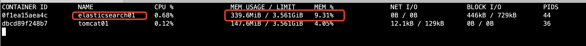

# 03-作业练习


## docker部署nginx

```
1、搜索镜像 searsh

[root@iZ2vcdckpocdm8z7a36gl1Z ~]# docker search nginx
NAME                               DESCRIPTION                                     STARS               OFFICIAL            AUTOMATED
nginx                              Official build of Nginx.                        14228               [OK]                

2、下载镜像 pull
[root@iZ2vcdckpocdm8z7a36gl1Z ~]# docker pull nginx
Using default tag: latest
latest: Pulling from library/nginx
6ec7b7d162b2: Already exists 
cb420a90068e: Pull complete 
2766c0bf2b07: Pull complete 
e05167b6a99d: Pull complete 
70ac9d795e79: Pull complete 
Digest: sha256:4cf620a5c81390ee209398ecc18e5fb9dd0f5155cd82adcbae532fec94006fb9
Status: Downloaded newer image for nginx:latest
docker.io/library/nginx:latest

3、查看镜像 images
[root@iZ2vcdckpocdm8z7a36gl1Z ~]# docker images
REPOSITORY             TAG                 IMAGE ID            CREATED             SIZE
mysql                  latest              a347a5928046        9 days ago          545MB
nginx                  latest              ae2feff98a0c        2 weeks ago         133MB

4、运行镜像并启动 run
[root@iZ2vcdckpocdm8z7a36gl1Z ~]# docker run -d --name nginx01 -p 6001:80 ae2feff98a0c
c6d6a812fe28f20a54be730349f3c6e6f440f0c58ea063be4292133d599c6e2c

5、测试运行
[root@iZ2vcdckpocdm8z7a36gl1Z ~]# curl localhost:6001
也可以本地访问IP加端口：http://47.108.156.7:6001/

6、进入容器
[root@iZ2vcdckpocdm8z7a36gl1Z ~]# docker exec -it c6d6a812fe28 /bin/bash

7、退出容器
root@c6d6a812fe28:/etc# exit
exit

8、停止容器
[root@iZ2vcdckpocdm8z7a36gl1Z ~]# docker stop nginx01
nginx01
```

端口映射逻辑如下：


## docker部署tomcat

```
我们之前的启动都是后台，停止了容器之后，容器还是可以查到  docker run -it --rm ,一般用来测试，用完就自动删除
[root@iZ2vcdckpocdm8z7a36gl1Z ~]# docker run -it --rm tomcat
Unable to find image 'tomcat:latest' locally

[root@iZ2vcdckpocdm8z7a36gl1Z ~]# docker ps
CONTAINER ID        IMAGE               COMMAND             CREATED             STATUS              PORTS               NAMES

# 我们重新下载，来安装下
[root@iZ2vcdckpocdm8z7a36gl1Z ~]# docker pull tomcat  # 下载
Using default tag: latest
latest: Pulling from library/tomcat
Digest: sha256:57dae7dfb9b62a413cde65334c8a18893795cac70afc3be589c8336d8244655d
Status: Image is up to date for tomcat:latest
docker.io/library/tomcat:latest

# 启动
[root@iZ2vcdckpocdm8z7a36gl1Z ~]# docker run -d -p:6001:8080 --name tomcat01 tomcat
dbcd89f248b763bfef6b1bb150f83d6244dbf863c74b14ff7bca6c37ca822ee1

# 测试

访问发现404，文件未找到,发现webapps文件为空，原因是阿里云镜像的原因，默认是最小的镜像，所有不必要的都剔除掉。保证最小可运行的环境

# 进入容器内部
[root@iZ2vcdckpocdm8z7a36gl1Z ~]# docker exec -it  tomcat01 /bin/bash

# 拷贝文件
root@dbcd89f248b7:/usr/local/tomcat# cp -r webapps.dist/* webapps   # 将webapps.dist所有文件进行copy至webapps文件

然后再次访问，发现成功展示页面信息
```

思考问题：我们以后要部署项目，如果每次都要进入容器是不是十分麻烦？我要是可以在容器外部提供一个映射路径，webapps，我们在外部放置项目，就自动同步至内部就完美了。


## 部署ES+Kibana

```
# es暴露的端口很多
# es十分的耗内存
# es的数据一般需要放置到安全目录！挂载
# --net somenetwork ？ 网络配置

# 启动elasticsearch
docker run -d --name elasticsearch  -p 9200:9200 -p 9300:9300 -e "discovery.type=single-node" elasticsearch:7.6.2

# es很耗资源，如果服务器配置较低，会十分的卡顿。可以使用docker stats 查看CPU的状态，发现耗费内存34%

CONTAINER ID        NAME                CPU %               MEM USAGE / LIMIT     MEM %               NET I/O             BLOCK I/O           PIDS
a559bc55aeee        elasticsearch       0.19%               1.229GiB / 3.561GiB   34.51%              0B / 0B             2.4MB / 700kB       43
dbcd89f248b7        tomcat01            0.12%               147.5MiB / 3.561GiB   4.04%               12kB / 129kB        0B / 0B             36

# 测试
[root@iZ2vcdckpocdm8z7a36gl1Z ~]# curl localhost:9200
{
  "name" : "a559bc55aeee",
  "cluster_name" : "docker-cluster",
  "cluster_uuid" : "G6128PnDQaee_69NvC2JMQ",
  "version" : {
    "number" : "7.6.2",
    "build_flavor" : "default",
    "build_type" : "docker",
    "build_hash" : "ef48eb35cf30adf4db14086e8aabd07ef6fb113f",
    "build_date" : "2020-03-26T06:34:37.794943Z",
    "build_snapshot" : false,
    "lucene_version" : "8.4.0",
    "minimum_wire_compatibility_version" : "6.8.0",
    "minimum_index_compatibility_version" : "6.0.0-beta1"
  },
  "tagline" : "You Know, for Search"
}

# 接下来我们来增加内存的限制，修改配置文件-e 环境配置修改   -e ES_JAVA_OPTS="-Xms64m -Xmx512m 限制最大内存

docker run -d --name elasticsearch  -p 9200:9200 -p 9300:9300 -e "discovery.type=single-node" -e ES_JAVA_OPTS="-Xms64m -Xmx512m" elasticsearch:7.6.2
```




可以发现修改参数之后，再次运行内存消耗降低明显，只占9%。

