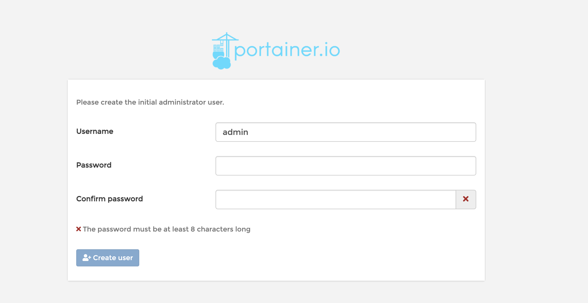
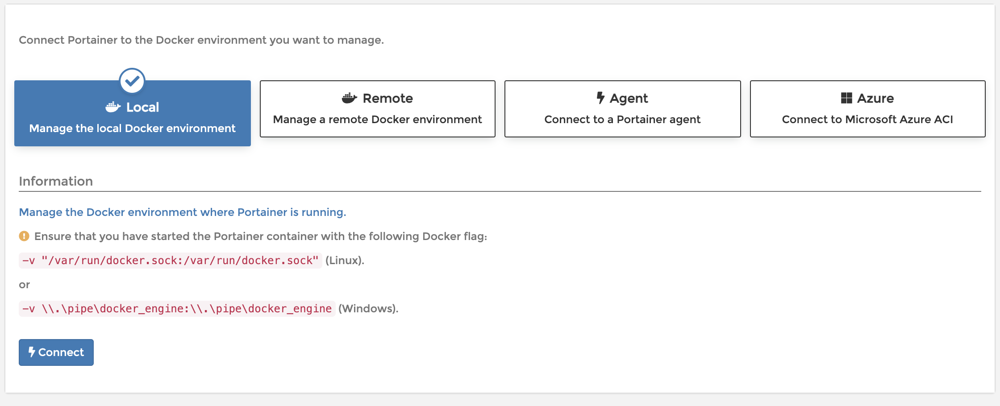

# 04-可视化portainer安装


## 可视化

- portainer 

```
[root@iZ2vcdckpocdm8z7a36gl1Z ~]# docker run -d -p 6001:9000 portainer/portainer 
```


什么是portainer

Docker 图形化界面管理工具！提供一个后台面板供我们操作！

访问外网地址：http://47.108.156.7:6001/#/init/admin

输入密码，完成用户创建。




选择本地：




选择远程之后，就会进入面板。


