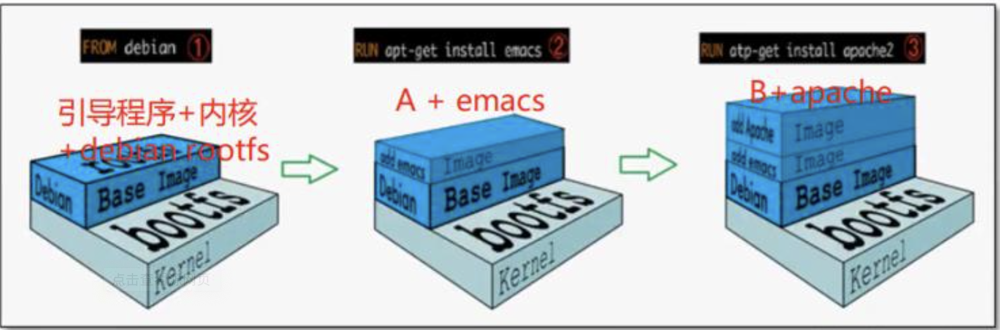
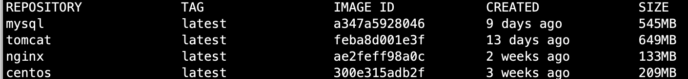
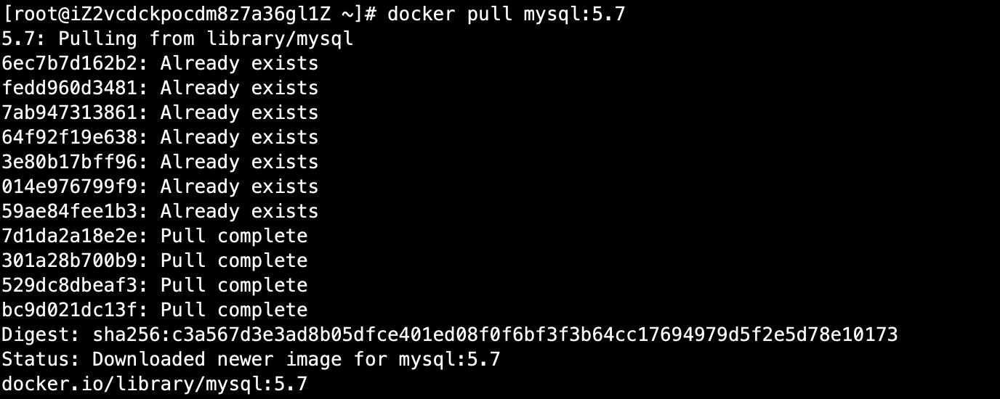
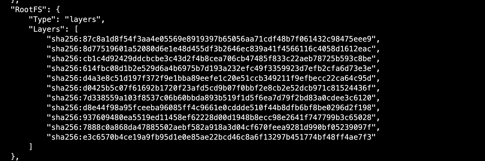
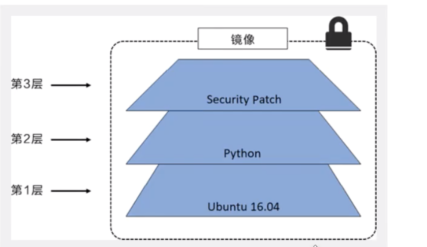
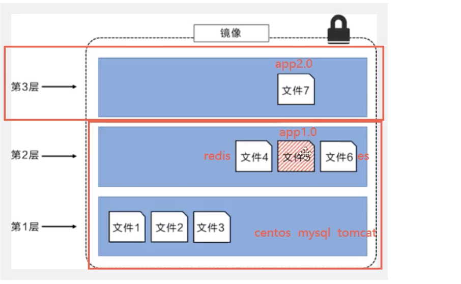
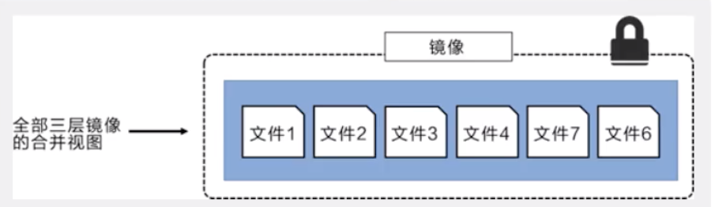
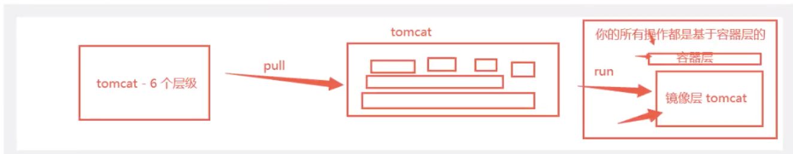
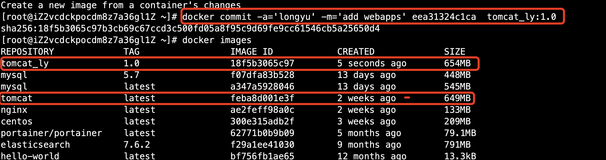

# 05-docker镜像


## 镜像是什么


镜像是一种轻量级、可执行的独立软件包，用来打包软件运行环境和基于运行环境开发的软件，它包含运行某个软件所需的所有内容、包括代码、运行时库、环境变量和配置文件。

所有的应用，直接打包docker镜像，就可以直接跑起来！

如何得到镜像：

- 从远程仓库下载
- 朋友拷贝给你
- 自己制作一个镜像DockerFile


## Docker镜像加载原理


UnionFS（联合文件系统）

我们下载镜像的时候看到的一层层就是这个！

联合文件系统是一种分层、轻量级并且高性能的文件系统，它支持对文件系统的修改作为一次提交来一层层的叠加，同时可以将不同目录挂载到同一个虚拟机文件系统下。Union文件系统是Docker镜像的基础，镜像可以通过分层来进行继承，基于基础镜像，可以制作各种具体的应用镜像。


特性：一次同时加载多个文件系统，但从外面看起来，只能看到一个文件系统，联合加载会把各层文件系统叠加起来，这样最终的文件系统会包含所有底层文件和目录！


**Docker镜像加载原理**


docker镜像实际上由一层一层的文件系统组成，这种层级的文件系统UnionFS。

bootfs（boot file system）主要包含bootloader和kernel，bootloader主要是引导加载kernel,linux刚启动时会加载bootfs文件系统，在Docker镜像的最底层是botfs，这一层与我们典型的Linux/unix系统是一样的，包含boot加载和内核。当boot加载完成之后整个内核都在内存中了，此时内存的使用权已由bootfs转交给内核，此时系统会卸载bootfs。

黑屏----开机

rootfs（root file system），在bootfs之上，包含的就是典型Linux系统中的/dev，/proc，/bin，/etc等标准目录和文件，rootfs就是各种不同的操作系统发行版，比如Ubuntu，Centos等等。




平时我们安装进虚拟机的CentOS都是好几个G，为什么docker这里才200M




对于一个精简的OS，rootfs可以很小，只需要包含最基本的命令，工具和程序库就可以了，因为底层直接用host的kernel，自己只需要提供rootfs就可以了，由此可以对于不同对linux发行版，bootfs基本一致的，rootfs会有差别，因此不同的发行版可以公用bootfs。


虚拟机是分钟级别，而容器是秒级！


## 分层理解

分层的镜像

我们可以去下载一个镜像，注意观察下载的日志输出，可以看到是一层一层的在下载！




```
# 查看分层信息
[root@iZ2vcdckpocdm8z7a36gl1Z ~]# docker inspect f07dfa83b528 
```




**理解：**

所有的Docker镜像都起始于一个基础镜像层，当进行修改或增加新的内容时，就会在当前镜像层之上，创建新的镜像层，举一个简单的例子，假如基于Ubuntu linux 16.04 创建一个新的镜像，这就是镜像的第一层；如果在该镜像中添加python包，就会在基础镜像层之上创建第二个镜像层；如果继续添加一个安全补丁，就会创建第三个镜像层。

该镜像当前已经包含3个镜像层，如下图所示：




在添加额外的镜像层同时，镜像始终保持是当前所有镜像的组合，理解这一点非常重要，下图中举了一个简单的例子，每个镜像层包含3个文件，而镜像包含了来自两个镜像层的6个文件。





这种情况下，上层镜像中的文件覆盖了底层镜像中的文件，这样就使得文件的更新版本作为一个新镜像层添加到镜像当中。Docker通过存储引擎的方式来实现镜像层堆栈，并保证多镜像层对外展示为统一的文件系统。

linux上可用的存储引擎有AUFS、Overlay2、Device Mapper、Btrfs以及ZFS。顾名思义，每种存储引擎基于linux中对应的文件系统或者块设备技术，并且每种存储引擎都有其独有的性能特点。





特点：

docker镜像都是只读的，当容器启动时，一个新的可写层被加载到镜像的顶部，这一层我们通常会所的容器层，容器之下的都叫镜像层。




如何提交一个自己的镜像


## commit镜像

```
docker commit 提交容器成为一个新的副本
# 命令和git原理类似
docker commit -m="提交的描述信息" -a="作者" 容器id  目标镜像名：[tag]
```

实战测试

```
# 1、启动一个tomcat
# 2、发现这个默认的tomcat 是没有webapps应用，镜像的原因，官方的镜像默认webapps下面是没有文件的！
# 3、自己将 webapps.dist下所有文件拷贝至 webapps下
# 4、将操作过的容器，通过commit提交为一个新的镜像，我们以后就使用我们修改过的镜像即可
```



如果你想要保存当前容器的状态，就可以通过commit来提交，获得一个镜像！就好比VM的快照。


到这里才算是入门docker！


