# 06-容器数据卷


## 什么是容器数据卷


docker的理念回顾：将应用和运行的环境打包成一个镜像！

数据？如果数据都存在容器中，那么我们容器删除，数据就会丢失！  于是我们产生一个新的需求：**数据可以持久化**

MySQL，容器删了，删库跑路！ 需求：MySQL数据可以存储在本地！

容器之间可以有一个数据共享的技术！Docker容器中产生的数据，同步到本地！ 这就是数据卷技术！目录的挂载，将我们容器内的目录，挂载到linux上面！


总结一句话：容器的持久化和同步操作！容器间也是可以数据共享的！


## 使用数据卷


方式一：直接使用命令来挂载 -v

```
docker run -it -v 主机目录：容器目录

# 测试
[root@iZ2vcdckpocdm8z7a36gl1Z ~]# docker run -it -v /home/ly/ceshi:/home  centos 

# 启动起来之后我们可以通过docker inspect 容器id  来查看容器详细信息  


```
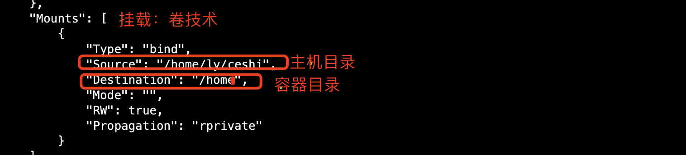


然后我们来测试数据的挂载及同步：

1、首先我们在容器内home目录下新建一个test.py文件，然后进入主机查看文件是否同步

```
# 在容器home目录下传教test.py文件
[root@224ac6eaa833 home]# touch test.py 

# 在宿主机上查看文件是否同步
[root@iZ2vcdckpocdm8z7a36gl1Z ly]# cd ceshi/
[root@iZ2vcdckpocdm8z7a36gl1Z ceshi]# ls
test.py    # 可以发现文件已同步
```

2、我们在宿主机上创建一个文件，hello.java,，然后进入容器查看

```
# 在宿主机上创建文件
[root@iZ2vcdckpocdm8z7a36gl1Z ceshi]# touch hello.java
[root@iZ2vcdckpocdm8z7a36gl1Z ceshi]# ls
hello.java  test.py
# 进入容器内部查看文件是否同步
[root@224ac6eaa833 home]# ls
hello.java  test.py   # 可以发现容器内部也已经同步更新
```

3、我们将容器停止掉，然后再宿主机上修改文件，然后再启动容器，查看文件是否同步

```
# 第一步：停止容器
[root@224ac6eaa833 home]# exit
exit
[root@iZ2vcdckpocdm8z7a36gl1Z ~]# docker ps
CONTAINER ID        IMAGE               COMMAND             CREATED             STATUS              PORTS               NAMES
# 第二步：在宿主机上修改hello.java 文件
[root@iZ2vcdckpocdm8z7a36gl1Z ceshi]# vim hello.java 

输入以下内容：
echo hello world 
echo docker studying

# 第三步：然后我们重新启动容器进行查看
[root@iZ2vcdckpocdm8z7a36gl1Z ~]# docker start 224ac6eaa833
224ac6eaa833
[root@iZ2vcdckpocdm8z7a36gl1Z ~]# docker exec -it 224ac6eaa833  /bin/bash
[root@224ac6eaa833 /]# ls
bin  dev  etc  home  lib  lib64  lost+found  media  mnt  opt  proc  root  run  sbin  srv  sys  tmp  usr  var
[root@224ac6eaa833 /]# cd /home/
[root@224ac6eaa833 home]# ls
hello.java  test.py
[root@224ac6eaa833 home]# cat hello.java 
echo hello world 
echo docker studying
```

可以发现内容已经更新！也通过实验发现，数据是双向同步的。

好处：以后我们只需要在宿主机上修改，容器内会自动同步。


## 实战安装MySQL

思考：MySQL的数据持久化的问题！

```
# 运行容器，需要做数据挂载， 安装启动mysql需要配置密码，这个是注意点

官方示例：$ docker run --name some-mysql -e MYSQL_ROOT_PASSWORD=my-secret-pw -d mysql:tag

# 测试
[root@iZ2vcdckpocdm8z7a36gl1Z ~]# docker run -d -p 3310:3306 -v /home/ly/mysql/conf:/etc/conf.d -v /home/ly/mysql/data:/var/lib/mysql -e MYSQL_ROOT_PASSWORD=1233210 --name mysql01 mysql:5.7
329d1a8685bb8ae135632cb7712f8427d3057090bed17eb320001029d94eed42


-e参数是用于环境配置，需要挂载多个文件目录使用多个-v参数即可
```


接下来我们使用mysql客户端连接测试一下：

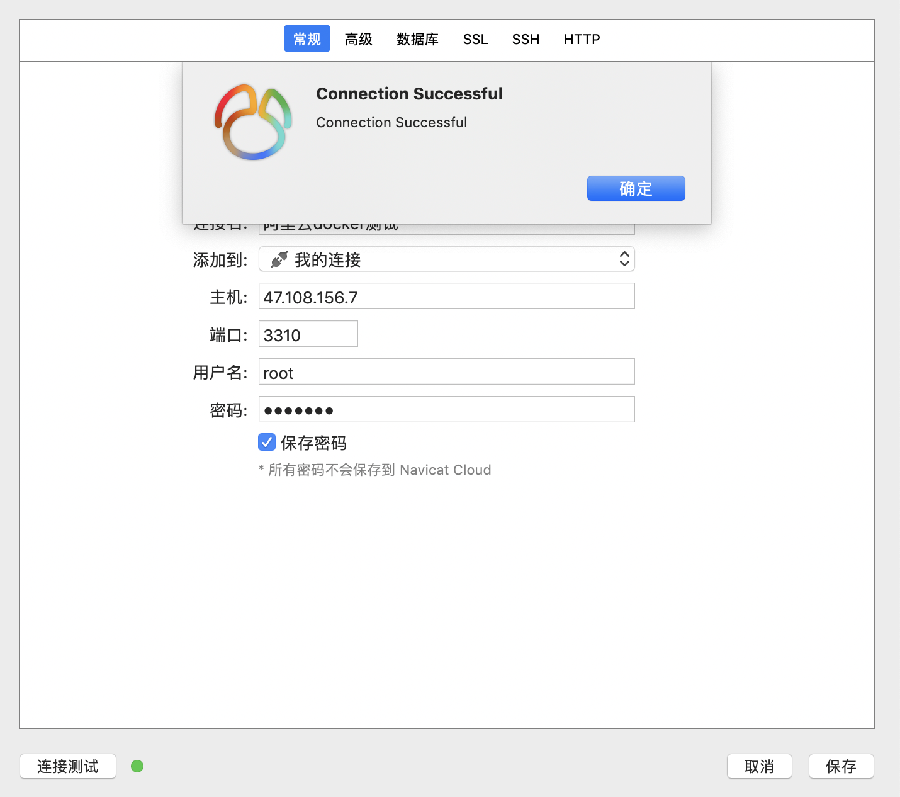


我们从外网连接到linux服务器的容器内部，发现已经测试成功，然后我们创建个数据库test！


接下来我们看下宿主机挂载的目录
```
[root@iZ2vcdckpocdm8z7a36gl1Z ly]# cd mysql/
[root@iZ2vcdckpocdm8z7a36gl1Z mysql]# ls
conf  data
[root@iZ2vcdckpocdm8z7a36gl1Z mysql]# cd data/
[root@iZ2vcdckpocdm8z7a36gl1Z data]# ls
auto.cnf    ca.pem           client-key.pem  ibdata1      ib_logfile1  mysql               private_key.pem  server-cert.pem  sys
ca-key.pem  client-cert.pem  ib_buffer_pool  ib_logfile0  ibtmp1       performance_schema  public_key.pem   server-key.pem   test
```

可以发现我们通过客户端创建的数据库也已经在文件中呈现！


接下来我们删除mysql容器，来查看宿主机的目录文件：

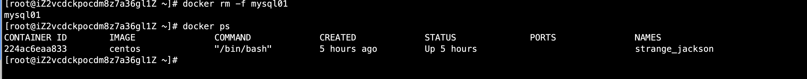


可以发现挂载的目录依旧存在，这就避免容器删除数据丢失的严重问题！这就实现了容器数据持久化功能！


## 具名挂载和匿名挂载

```
# 匿名挂载
-v 容器内路径！
docker run -d -P --name nginx01 -v /etc/nginx nginx

# 查看所有的volume 的情况
[root@iZ2vcdckpocdm8z7a36gl1Z ~]# docker volume ls
DRIVER              VOLUME NAME
local               16b1c3fc4a46a40ee71bd0adb96997d46cdc83e215d265e20d6e21e942b2b87c
local               81c04ab3cb1e4e361c040cbcad3e071a2585a0ea701bd3e6c16051f49b6e10cb

# 这里发现，这种就是匿名挂载 我们在-v只写了容器内的路径，没有写容器外的路径。


# 具名挂载
[root@iZ2vcdckpocdm8z7a36gl1Z ~]# docker run -d -P --name nginx02 -v juming-nginx:/etc/nginx nginx
[root@iZ2vcdckpocdm8z7a36gl1Z ~]# docker volume ls
DRIVER              VOLUME NAME
local               juming-nginx
```

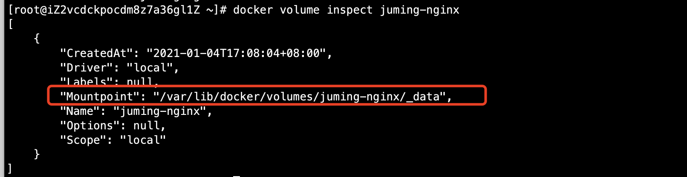

所有的docker容器内的卷，没有指定目录的情况下都是在：/var/lib/docker/volumes/xxx/_data

我们通过具名挂载可以方便的找到我们的一个卷，大多数情况在使用的 都是具名挂载。


**如何确定是具名挂载还是匿名挂载，还是指定路径挂载？**

```
-v 容器内路径              # 匿名挂载
-v 卷名：容器内路径         # 具名挂载
-v /宿主机路径：容器内路径   # 指定路径挂载
```


拓展：

```
# 通过 -v 容器内路径：ro rw改变读写权限
ro readonly  # 只读
rw readwrite # 可读可写

一旦这个设置了容器权限，容器对我们挂载出来的内容就有限定了

[root@iZ2vcdckpocdm8z7a36gl1Z ~]# docker run -d -P --name nginx02 -v juming-nginx:/etc/nginx:ro nginx
[root@iZ2vcdckpocdm8z7a36gl1Z ~]# docker run -d -P --name nginx02 -v juming-nginx:/etc/nginx:rw nginx

# ro 只要看到ro就说明这个路径只能通过宿主机来操作，容器内部是无法操作！

```


## 初识Dockerfile

DockerFile 就是用来构建docker镜像的构建文件！命令脚本。
通过这个脚本可以生成镜像，

方式二：

```
# 编辑dockerfile文件脚本
# 文件中的内容 指令（指令都是大写） 参数
[root@iZ2vcdckpocdm8z7a36gl1Z docker-test-volume]# vi dockerfile01 
FROM centos

VOLUME ["volume01","volume02"]

CMD echo "----end----"

CMD /bin/bash

# 上面的每个命令都是镜像的一层

# 使用docker build命令进行构建镜像 -f 指定dockerfile文件路径， -t指定目标镜像名称及版本号  
# 注意后面必须加构建保存路径， .表示当前路径

[root@iZ2vcdckpocdm8z7a36gl1Z docker-test-volume]# docker build -f dockerfile01 -t centos_ly_test:1.0 .
Sending build context to Docker daemon  2.048kB
Step 1/4 : FROM centos
 ---> 300e315adb2f
Step 2/4 : VOLUME ["volume01","volume02"]
 ---> Running in 5a2c6e851d6d
Removing intermediate container 5a2c6e851d6d
 ---> 22f546d924e9
Step 3/4 : CMD echo "----end----"
 ---> Running in a1356c04e4ba
Removing intermediate container a1356c04e4ba
 ---> 26395177fa3f
Step 4/4 : CMD /bin/bash
 ---> Running in c34a7f757353
Removing intermediate container c34a7f757353
 ---> bab454e633d7
Successfully built bab454e633d7
Successfully tagged centos_ly_test:1.0
```

然后本地查看镜像已经生成：
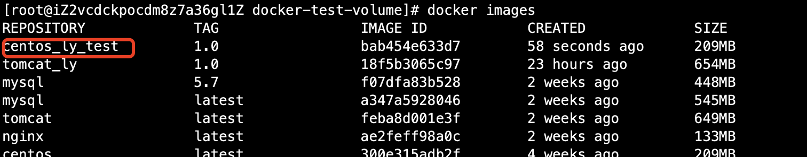


运行自己构建的镜像：

```
[root@iZ2vcdckpocdm8z7a36gl1Z docker-test-volume]# docker run -it bab454e633d7 /bin/bash
```


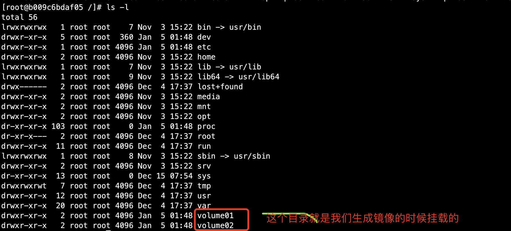


这个卷和外部一定有一个同步的目录


查看卷挂载的路径：

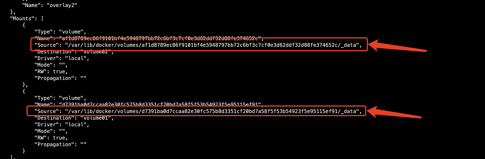


测试文件是否同步

首先在volume01创建文件如下：

```
[root@b009c6bdaf05 /]# cd volume01
[root@b009c6bdaf05 volume01]# ls
[root@b009c6bdaf05 volume01]# touch container.txt
```


然后我们进入查看文件是否同步：

```
[root@iZ2vcdckpocdm8z7a36gl1Z _data]# cd /var/lib/docker/volumes/d7391ba0d7ccaa82e30fc575b8d3351cf20bd7a58f5f53b54923f5e95115ef91/_data
[root@iZ2vcdckpocdm8z7a36gl1Z _data]# ls
container.txt
```

这种方式我们未来使用的十分多，因为我们通常会构建自己的镜像！假设构建镜像的时候没有挂载卷，要手动镜像挂载 -v 卷名：容器内路径


## 数据卷容器


两个mysql同步数据

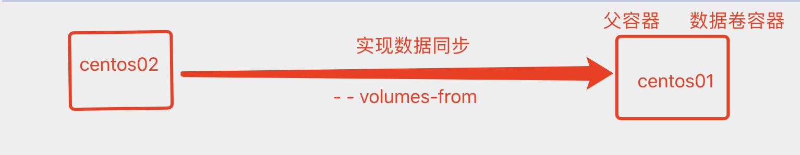


测试：

启动容器01

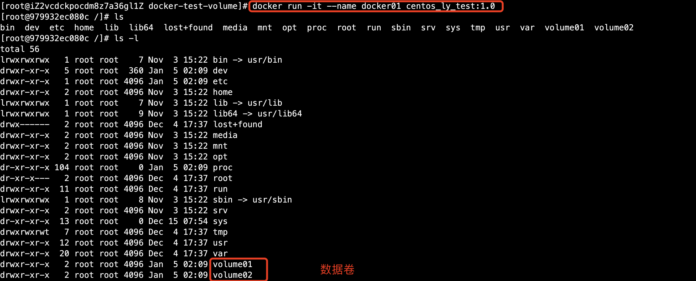


启动容器02
```
# 使用--volumes-from进行容器间数据同步
[root@iZ2vcdckpocdm8z7a36gl1Z docker-test-volume]# docker run -it --name docker02 --volumes-from docker01 centos_ly_test:1.0

```

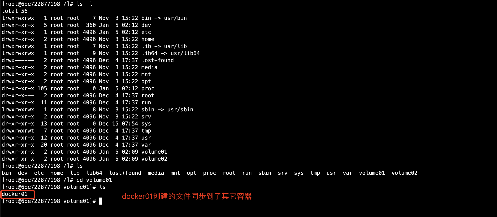


启动容器03

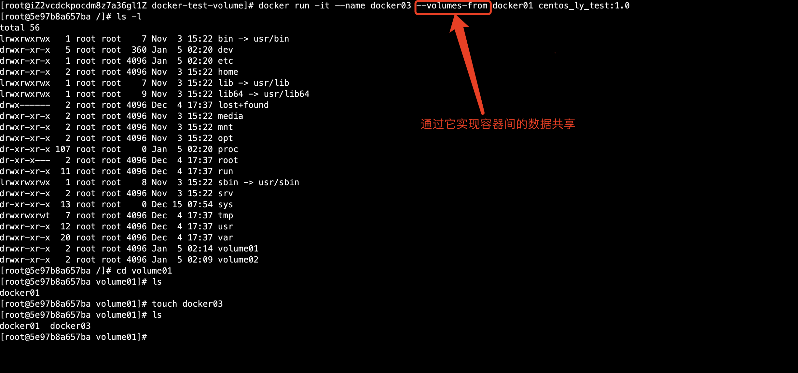


接下来我们将docker01删除掉，去看其它容器文件是否存在


```
[root@iZ2vcdckpocdm8z7a36gl1Z ~]# docker ps
CONTAINER ID        IMAGE                COMMAND                  CREATED             STATUS              PORTS                   NAMES
5e97b8a657ba        centos_ly_test:1.0   "/bin/sh -c /bin/bash"   2 minutes ago       Up 2 minutes                                docker03
6be722877198        centos_ly_test:1.0   "/bin/sh -c /bin/bash"   10 minutes ago      Up 10 minutes                               docker02
979932ec080c        centos_ly_test:1.0   "/bin/sh -c /bin/bash"   13 minutes ago      Up 13 minutes                               docker01
[root@iZ2vcdckpocdm8z7a36gl1Z ~]# docker rm -f  docker01
docker01
[root@iZ2vcdckpocdm8z7a36gl1Z ~]# docker ps 
CONTAINER ID        IMAGE                COMMAND                  CREATED             STATUS              PORTS                   NAMES
5e97b8a657ba        centos_ly_test:1.0   "/bin/sh -c /bin/bash"   3 minutes ago       Up 3 minutes                                docker03
6be722877198        centos_ly_test:1.0   "/bin/sh -c /bin/bash"   11 minutes ago      Up 11 minutes                               docker02
```

然后ls进行查看：
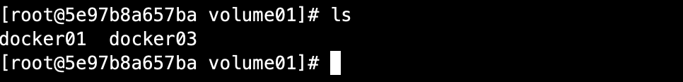


可以发现，docker02和docker03的文件都存在。这个是数据备份的机制。


结论：

**容器之间配置信息的传递，数据卷容器的生命周期一直持续到没有容器使用为止！** 但是一旦你持久化到了本地，这个时候本地的数据是不会删除的！


