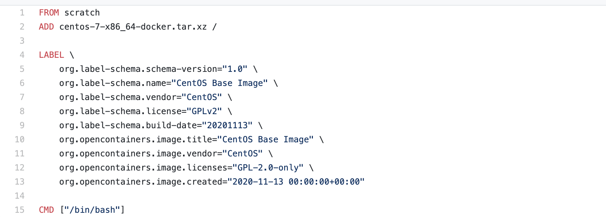

# 07-dockerfile


## dockerfile介绍

dockerfile 是用来构建docker镜像的文件！命令参数脚本

构建步骤：

1、编写一个dockerfile文件
2、docker build 构建成为一个镜像
3、docker run 运行镜像
4、docker push 发布镜像 （dockerhub、阿里云镜像）


我们查看官方是这样做的？


点击对应的版本会跳转至github对应的dokerfile文件如下：



很多官方镜像包都是基础包，很多功能没有，我们通常会自己搭建镜像！


官方既然可以制作镜像，那我们也可以！


## dockerfile构建过程


基础知识：

- 每个保留关键字（指令）都必须是大写字母
- 执行从上到下顺序执行
-  \# 表示注释
- 每一条指令都会创建提交一个新的镜像层，并提交


dockerfile是面向开发的，我们以后要发布项目，做镜像，就需要编写dockerfile文件，这个文件十分简单！

docker镜像逐渐成为企业交付的标准！必须要掌握！


步骤：开发、部署、运维  三部缺一不可

DockerFile：      构建文件，定义了一切的步骤，源代码
DockerImages：通过DockerFile构建生成的镜像，最终发布和运行的产品
Docker容器：     容器就是镜像运行起来提供服务器


## dockerfile指令


以前的时候我们就是使用别人的，现在我们可以利用学习的指令 ，自己编写！

```
FROM          # 基础镜像，一切从这里开始构建
MAINTAINER    # 镜像的作者信息， 姓名+邮箱 
RUN           # 镜像构建的时候需要运行的命令
ADD           # 步骤，例如添加tomcat镜像，这个tomcat压缩包！添加内容
WORKDIR       # 镜像的工作目录
VOLUME        # 挂载的目录
EXPOST        # 暴露端口配置
CMD           # 指定这个容器启动的时候要运行的命令，只要最后一个会生效，可被替代
ENTRYPOINT    # 指定这个容器启动的时候要运行的命令，可以追加命令
ONBUILD       # 当构建一个被继承Dockerfile这个时候就会运行ONBUILD的指令，触发指令
COPY          # 类似ADD，将文件拷贝到镜像中
ENV           # 构建的时候设置环境变量
```


## 实战测试


docker hub中99%镜像都是从这个基础镜像过来的 FROM scratch ，然后配置需要的软件和配置来进行构建！


创建一个自己的centos

```
# 1、编写dockerfile文件
FROM centos
MAINTAINER longyu<273397699@qq.com>

ENV MYPATH /usr/local
WORKDIR $MYPATH

RUN yum -y install vim
RUN yum -y install net-tools

EXPOSE 80

CMD echo $MYPATH
CMD echo "----end----"
CMD /bin/bash

# 2、通过这个文件进行构建镜像
# 命令： docker build -f dockerfile文件路径 -t 镜像名:[tag]  存放路径

Successfully built d50f7907517f
Successfully tagged mycentos:0.1

# 3、测试运行

[root@iZ2vcdckpocdm8z7a36gl1Z ly]# docker run -it mycentos:0.1
[root@4c9eef8cdc36 local]# ls
bin  etc  games  include  lib  lib64  libexec  sbin  share  src
[root@4c9eef8cdc36 local]# pwd
/usr/local
[root@4c9eef8cdc36 local]# ifconfig
eth0: flags=4163<UP,BROADCAST,RUNNING,MULTICAST>  mtu 1500
        inet 172.17.0.2  netmask 255.255.0.0  broadcast 172.17.255.255
        ether 02:42:ac:11:00:02  txqueuelen 0  (Ethernet)
        RX packets 0  bytes 0 (0.0 B)
        RX errors 0  dropped 0  overruns 0  frame 0
        TX packets 0  bytes 0 (0.0 B)
        TX errors 0  dropped 0 overruns 0  carrier 0  collisions 0

lo: flags=73<UP,LOOPBACK,RUNNING>  mtu 65536
        inet 127.0.0.1  netmask 255.0.0.0
        loop  txqueuelen 1000  (Local Loopback)
        RX packets 0  bytes 0 (0.0 B)
        RX errors 0  dropped 0  overruns 0  frame 0
        TX packets 0  bytes 0 (0.0 B)
        TX errors 0  dropped 0 overruns 0  carrier 0  collisions 0

```

对比，之前原生的centos


我们增加之后的镜像


我们可以列出本地的变更历史：使用docker history 镜像id


我们平时拿到一个镜像，就可以使用此命令研究一下它是怎么做的了。


CMD和ENTRYPOINT区别：

```
CMD           # 指定这个容器启动的时候要运行的命令，只要最后一个会生效，可被替代
ENTRYPOINT    # 指定这个容器启动的时候要运行的命令，可以追加命令
```

测试CMD

```
# 编写dockerfile文件
[root@iZ2vcdckpocdm8z7a36gl1Z dockerfile]# vi mydockerfile-cmd-test
FROM centos
CMD ["ls","-a"]
# 通过dockerfile文件构建镜像
[root@iZ2vcdckpocdm8z7a36gl1Z dockerfile]# docker build -f mydockerfile-cmd-test -t cmd-test .
Sending build context to Docker daemon  3.072kB
Step 1/2 : FROM centos
 ---> 300e315adb2f
Step 2/2 : CMD ["ls","-a"]
 ---> Running in b9884fca9a8e
Removing intermediate container b9884fca9a8e
 ---> e6fa54ffc6ce
Successfully built e6fa54ffc6ce
Successfully tagged cmd-test:latest
# 运行镜像，发现ls -a命令生效了
[root@iZ2vcdckpocdm8z7a36gl1Z dockerfile]# docker run -it e6fa54ffc6ce
.   .dockerenv  dev  home  lib64       media  opt   root  sbin  sys  usr
..  bin         etc  lib   lost+found  mnt    proc  run   srv   tmp  var


想追加一个命令： -l
[root@iZ2vcdckpocdm8z7a36gl1Z dockerfile]# docker run -it mycentos:0.1 -l
docker: Error response from daemon: OCI runtime create failed: container_linux.go:349: starting container process caused "exec: \"-l\": executable file not found in $PATH": unknown.
ERRO[0000] error waiting for container: context canceled 

# CMD的情况下，-l 替换了CMD ["ls","-a"]命令，-l不是命令所以报错！

[root@iZ2vcdckpocdm8z7a36gl1Z dockerfile]# docker run -it mycentos:0.1  ls -al
total 48
drwxr-xr-x 12 root root 4096 Dec  4 17:37 .
drwxr-xr-x  1 root root 4096 Dec  4 17:37 ..
drwxr-xr-x  2 root root 4096 Nov  3 15:22 bin
drwxr-xr-x  2 root root 4096 Nov  3 15:22 etc
drwxr-xr-x  2 root root 4096 Nov  3 15:22 games
drwxr-xr-x  2 root root 4096 Nov  3 15:22 include
drwxr-xr-x  2 root root 4096 Nov  3 15:22 lib
drwxr-xr-x  3 root root 4096 Dec  4 17:37 lib64
drwxr-xr-x  2 root root 4096 Nov  3 15:22 libexec
drwxr-xr-x  2 root root 4096 Nov  3 15:22 sbin
drwxr-xr-x  5 root root 4096 Dec  4 17:37 share
drwxr-xr-x  2 root root 4096 Nov  3 15:22 src

使用完整命令 可以发现没有问题
```


测试 ENTRYPOINT

```
# 编写dockerfile文件
[root@iZ2vcdckpocdm8z7a36gl1Z dockerfile]# vi mydockerfile-cmd-entrypoint
FROM centos
ENTRYPOINT ["ls","-a"]
# 使用dockerfile文件构建镜像
[root@iZ2vcdckpocdm8z7a36gl1Z dockerfile]# docker build -f mydockerfile-cmd-entrypoint -t cmd-entrypoint .
Sending build context to Docker daemon  4.096kB
Step 1/2 : FROM centos
 ---> 300e315adb2f
Step 2/2 : ENTRYPOINT ["ls","-a"]
 ---> Running in 947a7dda1d3e
Removing intermediate container 947a7dda1d3e
 ---> 97dd21744ad7
Successfully built 97dd21744ad7
Successfully tagged cmd-entrypoint:latest
# 运行镜像
[root@iZ2vcdckpocdm8z7a36gl1Z dockerfile]# docker run -it 97dd21744ad7
.   .dockerenv  dev  home  lib64       media  opt   root  sbin  sys  usr
..  bin         etc  lib   lost+found  mnt    proc  run   srv   tmp  var

# 使用参数追加运行，发现追加的命令是加在原命令之后的
[root@iZ2vcdckpocdm8z7a36gl1Z dockerfile]# docker run -it 97dd21744ad7 -l
total 56
drwxr-xr-x   1 root root 4096 Jan  5 08:06 .
drwxr-xr-x   1 root root 4096 Jan  5 08:06 ..
-rwxr-xr-x   1 root root    0 Jan  5 08:06 .dockerenv
lrwxrwxrwx   1 root root    7 Nov  3 15:22 bin -> usr/bin
drwxr-xr-x   5 root root  360 Jan  5 08:06 dev
drwxr-xr-x   1 root root 4096 Jan  5 08:06 etc
drwxr-xr-x   2 root root 4096 Nov  3 15:22 home
lrwxrwxrwx   1 root root    7 Nov  3 15:22 lib -> usr/lib
lrwxrwxrwx   1 root root    9 Nov  3 15:22 lib64 -> usr/lib64
drwx------   2 root root 4096 Dec  4 17:37 lost+found
drwxr-xr-x   2 root root 4096 Nov  3 15:22 media
drwxr-xr-x   2 root root 4096 Nov  3 15:22 mnt
drwxr-xr-x   2 root root 4096 Nov  3 15:22 opt
dr-xr-xr-x 109 root root    0 Jan  5 08:06 proc
dr-xr-x---   2 root root 4096 Dec  4 17:37 root
drwxr-xr-x  11 root root 4096 Dec  4 17:37 run
lrwxrwxrwx   1 root root    8 Nov  3 15:22 sbin -> usr/sbin
drwxr-xr-x   2 root root 4096 Nov  3 15:22 srv
dr-xr-xr-x  13 root root    0 Dec 15 07:54 sys
drwxrwxrwt   7 root root 4096 Dec  4 17:37 tmp
drwxr-xr-x  12 root root 4096 Dec  4 17:37 usr
drwxr-xr-x  20 root root 4096 Dec  4 17:37 var
```

**可以发现ENTRYPOINT是可以在原先命令上追加参数的，而CMD是不能的，并且CMD是替换命令参数。**


## 实战tomcat镜像


1、 准备工作：准备镜像文件tomcat压缩包、JDK压缩包

```
下载tomcat 和 JDK 压缩包

# 下载tomcat
[root@iZ2vcdckpocdm8z7a36gl1Z soft]# wget https://mirrors.bfsu.edu.cn/apache/tomcat/tomcat-9/v9.0.41/bin/apache-tomcat-9.0.41.tar.gz

# 下载JDK1.8
[root@iZ2vcdckpocdm8z7a36gl1Z soft]# wget https://download.oracle.com/otn/java/jdk/8u271-b09/61ae65e088624f5aaa0b1d2d801acb16/jdk-8u271-linux-x64.tar.gz?AuthParam=1609835869_84f6621ae4b27c6eaa43619659089844

下载完成之后，jdk的命名多了？后面的内容
[root@iZ2vcdckpocdm8z7a36gl1Z soft]# ls
apache-tomcat-9.0.41.tar.gz  jdk-8u271-linux-x64.tar.gz?AuthParam=1609835869_84f6621ae4b27c6eaa43619659089844

# 使用mv进行重命名
[root@iZ2vcdckpocdm8z7a36gl1Z soft]# mv  jdk-8u271-linux-x64.tar.gz?AuthParam=1609835869_84f6621ae4b27c6eaa43619659089844   jdk-8u271-linux-x64.tar.gz
[root@iZ2vcdckpocdm8z7a36gl1Z soft]# ls
apache-tomcat-9.0.41.tar.gz  jdk-8u271-linux-x64.tar.gz

软件包已经下载完毕
```


2、编写dockerfile文件, 官方命名： Dockerfile  ，build会自动寻找这个文件，不用加-f参数。

```
FROM centos
MAINTAINER longyu<273397699@qq.com>

COPY readme.txt /usr/local/readme.txt

ADD jdk-8u271-linux-x64.tar.gz   /usr/local/
ADD apache-tomcat-9.0.41.tar.gz  /usr/local/

RUN yum -y install vim

ENV MYPATH /usr/local

WORKDIR $MYPATH

ENV JAVA_HOME /usr/local/jdk1.8.0_271
ENV CLASSPATH $JAVA_HOME/lib/dt.jar:$JAVA_HOME/lib/tools.jar
ENV CATALINA_HOME /usr/local/apache-tomcat-9.0.41
ENV CATALINA_BASH /usr/local/apache-tomcat-9.0.41
ENV PATH $PATH:$JAVA_HOME/bin:$CATALINA_HOME/lib:$CATALINA_HOME/bin

EXPOSE 8080

CMD /usr/local/apache-tomcat-9.0.41/bin/startup.sh  && tail -F /usr/local/apache-tomcat-9.0.41/bin/logs/catalina.out

```


3、构建镜像 使用Dockerfile命名不需要使用-f参数

```
[root@iZ2vcdckpocdm8z7a36gl1Z tomcat]# docker build -t diytomcat .
Sending build context to Docker daemon  154.6MB
Step 1/15 : FROM centos
 ---> 300e315adb2f
Step 2/15 : MAINTAINER longyu<273397699@qq.com>
 ---> Using cache
 ---> d98298565077
Step 3/15 : COPY readme.txt /usr/local/readme.txt
 ---> Using cache
......
Successfully built 40f3a4936567
Successfully tagged diytomcat:latest
```


4、启动镜像
```
[root@iZ2vcdckpocdm8z7a36gl1Z tomcat]# docker run -d -p 6001:8080 --name ly_tomcat01  -v /home/ly/dockerfile/tomcat/test:/usr/local/apache-tomcat-9.0.41/webapps/test -v  /home/ly/dockerfile/tomcat/logs:/usr/local/apache-tomcat-9.0.41/logs diytomcat 
```

5、访问测试


6、发布项目（由于做了卷挂载，我们直接在本地编写项目就可以发布了）


我们以后开发的步骤：需要掌握Dockerfile的编写，我们之后的一切都是使用docker镜像来发布运行！

