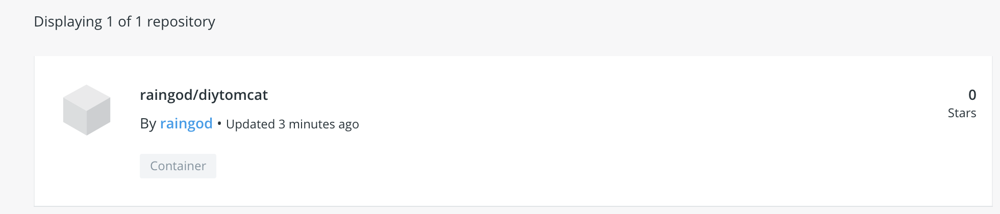
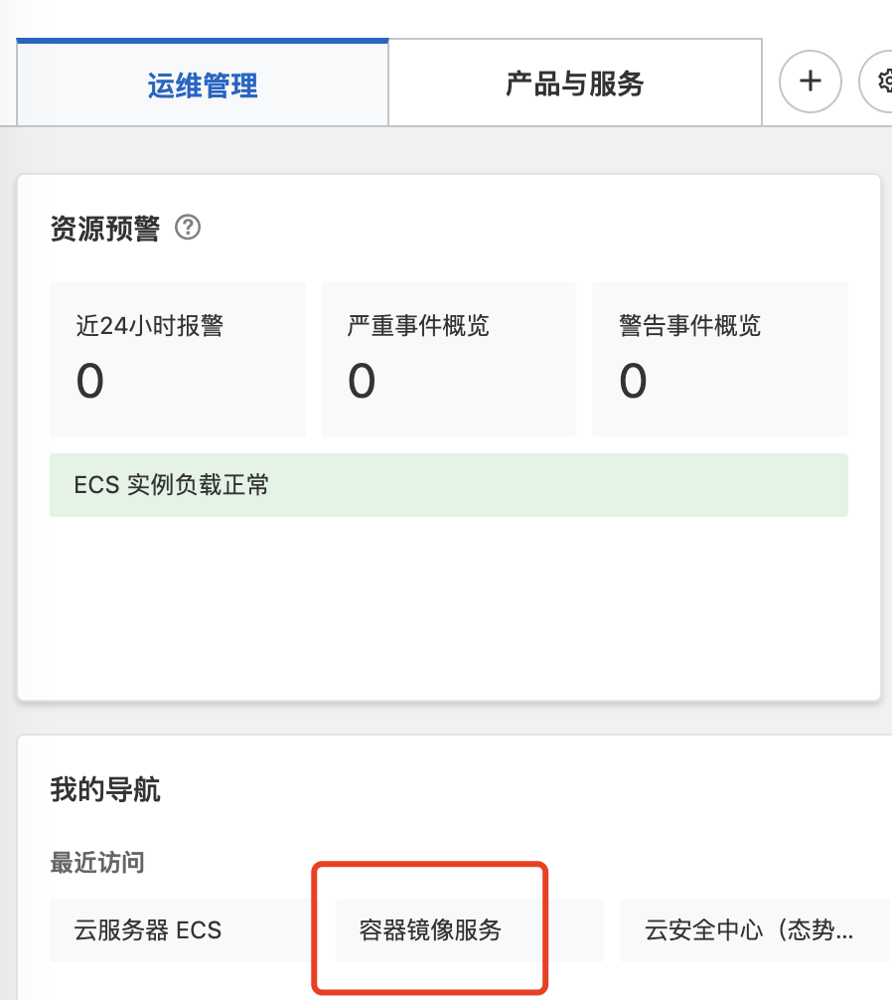
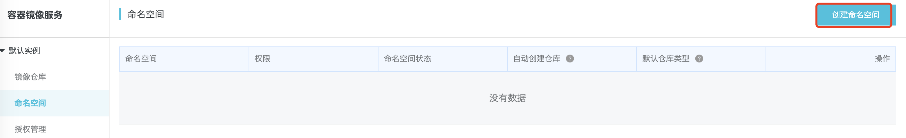
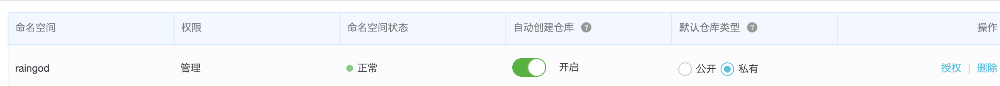
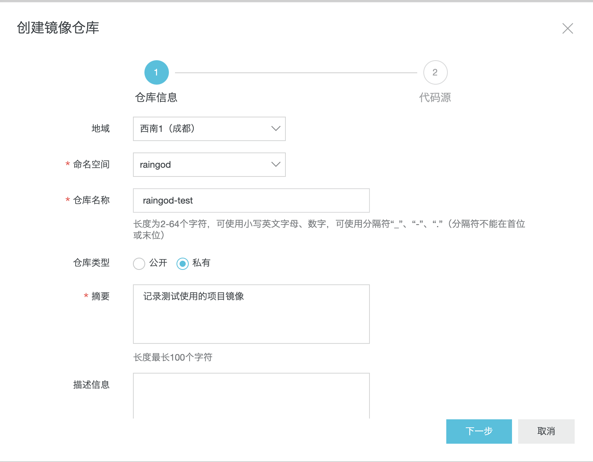
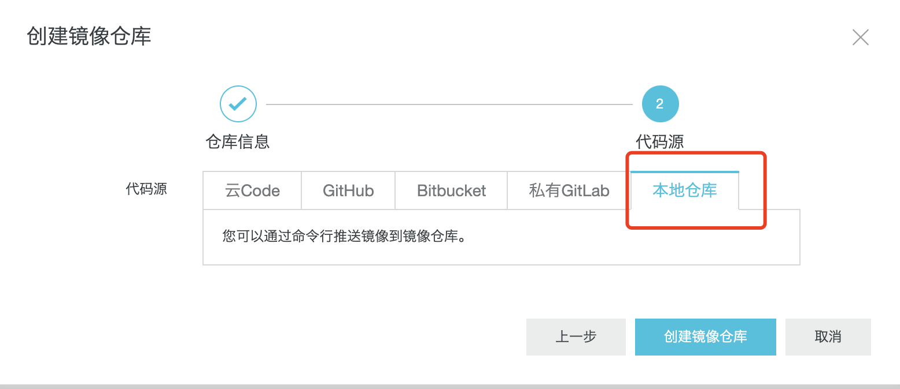
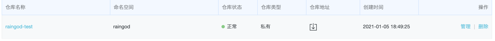
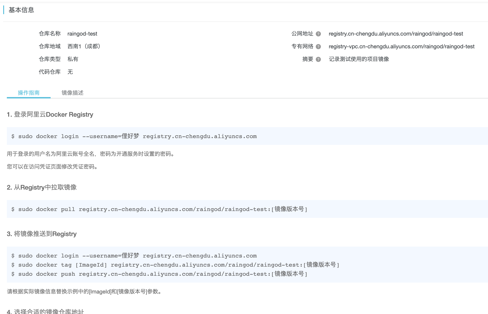
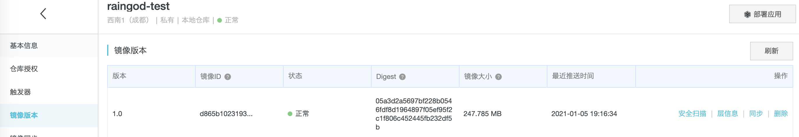
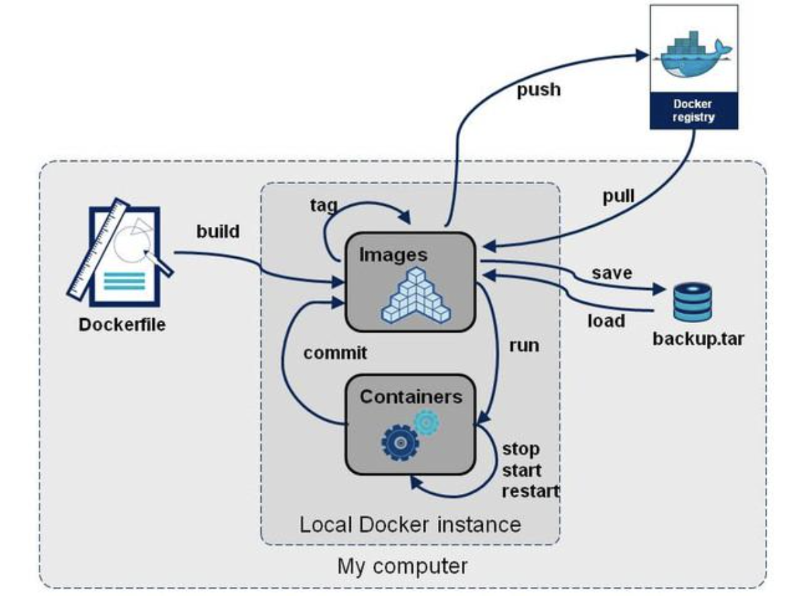

# 08-发布镜像


## 发布镜像至dockerhub


1、地址：https://hub.docker.com/

2、确定这个账号可以登录

3、在我们服务器上提交自己的镜像

```
[root@iZ2vcdckpocdm8z7a36gl1Z tomcat]# docker login --help

Usage:  docker login [OPTIONS] [SERVER]

Log in to a Docker registry.
If no server is specified, the default is defined by the daemon.

Options:
  -p, --password string   Password
      --password-stdin    Take the password from stdin
  -u, --username string   Username

[root@iZ2vcdckpocdm8z7a36gl1Z tomcat]# docker login -u raingod
Password: 
WARNING! Your password will be stored unencrypted in /root/.docker/config.json.
Configure a credential helper to remove this warning. See
https://docs.docker.com/engine/reference/commandline/login/#credentials-store

Login Succeeded
```

4、登录完毕之后就可以发布镜像了 docker push 

```
[root@iZ2vcdckpocdm8z7a36gl1Z tomcat]# docker push diytomcat:latest
The push refers to repository [docker.io/library/diytomcat]
3b86f060f124: Preparing 
27aaf7d91750: Preparing 
efbfc7c5c51a: Preparing 
3a97e44f23e1: Preparing 
2653d992f4ef: Preparing 
denied: requested access to the resource is denied

# push 被拒绝

解决方案： 给本地镜像增加一个tag
docker tag d865b1023193 raingod/diytomcat:1.0  # 因为dockerhub上提交规范需要使用用户名/镜像名：版本号

# push 成功
[root@iZ2vcdckpocdm8z7a36gl1Z tomcat]# docker push raingod/diytomcat:1.0
The push refers to repository [docker.io/raingod/diytomcat]
3b86f060f124: Pushed 
27aaf7d91750: Pushed 
efbfc7c5c51a: Pushed 
3a97e44f23e1: Pushed 
2653d992f4ef: Pushed 
1.0: digest: sha256:05a3d2a5697bf228b0546fdf8d1964897f05ef95f2c1f806c452445fb232df5b size: 1373
```


然后查看dockerhub，可以发现镜像已经上传成功！



注意：

- 使用docker push到docker hub的时候，镜像名一定要满足此规则： 用户名/镜像名:[tag]   用户名指dockerhub用户名


## 发布镜像至阿里云


1、登录阿里云
2、找到容器镜像服务



3、创建命名空间




注意一个账号最多创建3个命名空间，创建成功如下。



4、创建容器镜像




选择本地仓库：




创建成功如下：



5、浏览阿里云信息




然后根据阿里云的提示信息进行上传操作：

```
# 登录阿里云

[root@iZ2vcdckpocdm8z7a36gl1Z tomcat]# docker login --username=俚好梦 registry.cn-chengdu.aliyuncs.com
Password: 
WARNING! Your password will be stored unencrypted in /root/.docker/config.json.
Configure a credential helper to remove this warning. See
https://docs.docker.com/engine/reference/commandline/login/#credentials-store

Login Succeeded


# 生成tag docker tag [ImageId] registry.cn-chengdu.aliyuncs.com/raingod/raingod-test:[镜像版本号]
[root@iZ2vcdckpocdm8z7a36gl1Z tomcat]# docker tag d865b1023193  registry.cn-chengdu.aliyuncs.com/raingod/raingod-test:1.0
# push 上传

[root@iZ2vcdckpocdm8z7a36gl1Z tomcat]# docker push registry.cn-chengdu.aliyuncs.com/raingod/raingod-test/raingod/diytomcat:1.0 
The push refers to repository [registry.cn-chengdu.aliyuncs.com/raingod/raingod-test/raingod/diytomcat]
An image does not exist locally with the tag: registry.cn-chengdu.aliyuncs.com/raingod/raingod-test/raingod/diytomcat
[root@iZ2vcdckpocdm8z7a36gl1Z tomcat]# docker tag d865b1023193  registry.cn-chengdu.aliyuncs.com/raingod/raingod-test:1.0
[root@iZ2vcdckpocdm8z7a36gl1Z tomcat]# docker push registry.cn-chengdu.aliyuncs.com/raingod/raingod-test:1.0
The push refers to repository [registry.cn-chengdu.aliyuncs.com/raingod/raingod-test]
3b86f060f124: Pushed 
27aaf7d91750: Pushed 
efbfc7c5c51a: Pushed 
3a97e44f23e1: Pushed 
2653d992f4ef: Pushed 
1.0: digest: sha256:05a3d2a5697bf228b0546fdf8d1964897f05ef95f2c1f806c452445fb232df5b size: 1373
```

登录阿里云可以看见镜像已经上传：




阿里云容器镜像的上传参考官方文档！


## docker小结

