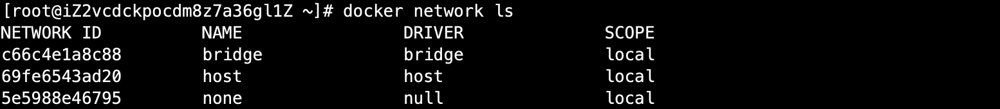

# 09-docker网络


## 理解Dokcer0

清空所有环境

```
# 清空所有容器
docker rm -f $(docker ps -aq)
# 清空所有镜像
docker rmi -f $(docker images -aq)
```


测试：


三个网络：

思考一个问题：docker是如何处理容器网络访问的？

```
# 启动一个tomcat容器
[root@iZ2vcdckpocdm8z7a36gl1Z ~]# docker run -d -P --name tomcat01 tomcat 

# 查看容器的内部网络地址 ip addr ,发现容器启动的时候会得到一个 108: eth0@if109 ip地址，docker分配的！
[root@iZ2vcdckpocdm8z7a36gl1Z ~]# docker exec -it tomcat01 ip addr
1: lo: <LOOPBACK,UP,LOWER_UP> mtu 65536 qdisc noqueue state UNKNOWN group default qlen 1000
    link/loopback 00:00:00:00:00:00 brd 00:00:00:00:00:00
    inet 127.0.0.1/8 scope host lo
       valid_lft forever preferred_lft forever
108: eth0@if109: <BROADCAST,MULTICAST,UP,LOWER_UP> mtu 1500 qdisc noqueue state UP group default 
    link/ether 02:42:ac:11:00:02 brd ff:ff:ff:ff:ff:ff link-netnsid 0
    inet 172.17.0.2/16 brd 172.17.255.255 scope global eth0
       valid_lft forever preferred_lft forever

思考：linux 能不能ping通容器内部
[root@iZ2vcdckpocdm8z7a36gl1Z ~]# ping 172.17.0.2
PING 172.17.0.2 (172.17.0.2) 56(84) bytes of data.
64 bytes from 172.17.0.2: icmp_seq=1 ttl=64 time=0.083 ms
64 bytes from 172.17.0.2: icmp_seq=2 ttl=64 time=0.061 ms
64 bytes from 172.17.0.2: icmp_seq=3 ttl=64 time=0.050 ms

# linux可以ping通docker容器内部
```


**原理：**

1、我们每启动一个docker容器，docker就会给docker容器分配一个ip，我们只要安装了docker，就会有一个网卡docker0.

桥接模式，使用的技术是：evth-pair技术！


再次测试ip addr：


2、再启动一个容器测试,发现又多了一对网卡


发现容器内的Ip地址：
```
[root@iZ2vcdckpocdm8z7a36gl1Z ~]# docker exec -it tomcat02 ip addr
1: lo: <LOOPBACK,UP,LOWER_UP> mtu 65536 qdisc noqueue state UNKNOWN group default qlen 1000
    link/loopback 00:00:00:00:00:00 brd 00:00:00:00:00:00
    inet 127.0.0.1/8 scope host lo
       valid_lft forever preferred_lft forever
110: eth0@if111: <BROADCAST,MULTICAST,UP,LOWER_UP> mtu 1500 qdisc noqueue state UP group default 
    link/ether 02:42:ac:11:00:03 brd ff:ff:ff:ff:ff:ff link-netnsid 0
    inet 172.17.0.3/16 brd 172.17.255.255 scope global eth0
       valid_lft forever preferred_lft forever
```

我们发现这个容器网卡，都是一对一对的。

evth-pair 就是一对虚拟设备接口，他们都是成对出现的，一段连着协议，一段彼此相连，正因为有这个特性，evth-pair充当一个桥梁！连接各种虚拟网络设备的！

Openstac、Docker容器之间的连接、OVS的连接、都是使用evth-pair技术。


3、我们来测试下tomcat01 是否可以ping通 tomcat02

```
[root@iZ2vcdckpocdm8z7a36gl1Z ~]# docker exec -it tomcat02  ping  172.17.0.2
PING 172.17.0.2 (172.17.0.2) 56(84) bytes of data.
64 bytes from 172.17.0.2: icmp_seq=1 ttl=64 time=0.112 ms
64 bytes from 172.17.0.2: icmp_seq=2 ttl=64 time=0.067 ms

# 结论：容器和容器之间是可以相互ping通
```


绘制一个网络模型图（容器之间网络通信）


结论：tomcat01和tomcat02是公用的一恶搞路由器，docker0.

所有的容器不指定网络的情况下，都是docker0路由的，docker会给我们的容器分配一个默认的可用IP！


小结：

Docker使用的是linux 桥接：


Dokcer中的所有网络接口都是虚拟的。虚拟的转发效率高！（内外传递文件）

只要容器删除，对应的一对网桥就没了。


## 容器互联 --link


思考一个场景：我们编写了一个微服务，database url=ip，项目不重启，数据库IP换了。我们希望可以处理这个问题，可以名字来进行访问容器？


```
# 启动两个容器
[root@iZ2vcdckpocdm8z7a36gl1Z ~]# docker run -d -P --name tomcat01 tomcat
a19cf1d80044689ee528f60da94050344ca7ac504e517af203589a241318f981
[root@iZ2vcdckpocdm8z7a36gl1Z ~]# docker run -d -P --name tomcat02 tomcat
f771bd5d2bc29b44178635376ae3b7207b019683967fed77331e13bd614e6da3
[root@iZ2vcdckpocdm8z7a36gl1Z ~]# docker exec -it tomcat02 ping tomcat01
ping: tomcat01: Name or service not known

# 如何解决呢

# 通过--link 就可以解决网络连通问题
[root@iZ2vcdckpocdm8z7a36gl1Z ~]# docker run -d -P --name tomcat03 --link tomcat02 tomcat
c1524a3fb3387e41db8bc8145e2620f44aee430668ce4d6264fa9aaed215aff9
[root@iZ2vcdckpocdm8z7a36gl1Z ~]# docker exec -it tomcat03 ping tomcat02
PING tomcat02 (172.17.0.3) 56(84) bytes of data.
64 bytes from tomcat02 (172.17.0.3): icmp_seq=1 ttl=64 time=0.097 ms
64 bytes from tomcat02 (172.17.0.3): icmp_seq=2 ttl=64 time=0.068 ms

# 我们来反向ping试一下能否连通
[root@iZ2vcdckpocdm8z7a36gl1Z ~]# docker exec -it tomcat02 ping tomcat03
ping: tomcat03: Name or service not known
```

探究：inspect

```
[root@iZ2vcdckpocdm8z7a36gl1Z ~]# docker network ls
NETWORK ID          NAME                DRIVER              SCOPE
c66c4e1a8c88        bridge              bridge              local
69fe6543ad20        host                host                local
5e5988e46795        none                null                local
[root@iZ2vcdckpocdm8z7a36gl1Z ~]# docker network inspect c66c4e1a8c88
```


其实这个tomcat03配置了tomcat02的配置

```
# 查看host配置发现
root@c1524a3fb338:/usr/local/tomcat# cat /etc/hosts
127.0.0.1       localhost
::1     localhost ip6-localhost ip6-loopback
fe00::0 ip6-localnet
ff00::0 ip6-mcastprefix
ff02::1 ip6-allnodes
ff02::2 ip6-allrouters
172.17.0.3      tomcat02 f771bd5d2bc2
172.17.0.4      c1524a3fb338
```

本质探究：--link 就是在我们的hosts配置中增加了一个ttomcat02 f771bd5d2bc2 ，因此可以ping 通！

我们现在玩docker已经不建议使用 --link 了！

自定义网络！不使用Docker0 ，docker0问题，不支持容器名连接访问！


## 自定义网络


查看所有的docker网络




**网络模式：**

-   bridge:         桥接  docker（默认，自己创建也使用bridge模式）
-   none：         不配置网络
-   host：          和宿主机共享网络
-   container：   容器网络连通！（用的少，局限很大）


测试：

```
# 我们直接启动名款 --net bridge ，而这个就是我们的docker0
docker run -d -P tomcat01 tomcat
docker run -d -P tomcat01 --net bridge tomcat  

上面2条命令是等价的。不写--net 默认就是--net bridge

# docker0 的特点,  默认域名不能访问 --link 可以打通连接！

# 我们可以自定义一个网络
# --driver bridge
# --subnet 192.168.0.0/16  192.168.0.2------>192.168.255.255
# --gateway 192.168.0.1
[root@iZ2vcdckpocdm8z7a36gl1Z ~]# docker network create --driver bridge --subnet 192.168.0.0/16 --gateway 192.168.0.1 mynet 
15859692368c97ea2cef33efa1b359b94303e4fff4abd35140929a39dc380334
[root@iZ2vcdckpocdm8z7a36gl1Z ~]# docker network ls
NETWORK ID          NAME                DRIVER              SCOPE
c66c4e1a8c88        bridge              bridge              local
69fe6543ad20        host                host                local
15859692368c        mynet               bridge              local
5e5988e46795        none                null                local
```

我们自己的网络就建好了


接下来我们使用自己的网络来启动容器：

```
[root@iZ2vcdckpocdm8z7a36gl1Z ~]# docker run -d -P --name tomcat-net-01 --net mynet tomcat
[root@iZ2vcdckpocdm8z7a36gl1Z ~]# docker run -d -P --name tomcat-net-02 --net mynet tomcat
[root@iZ2vcdckpocdm8z7a36gl1Z ~]# docker run -d -P --name tomcat01  tomcat
[root@iZ2vcdckpocdm8z7a36gl1Z ~]# docker run -d -P --name tomcat02  tomcat
```

然后我们查看网络下面对应的容器信息：

```
[root@iZ2vcdckpocdm8z7a36gl1Z ~]# docker network inspect mynet
```


```
再次测试ping连接

[root@iZ2vcdckpocdm8z7a36gl1Z ~]# docker exec -it tomcat-net-01 ping 192.168.0.2
PING 192.168.0.2 (192.168.0.2) 56(84) bytes of data.
64 bytes from 192.168.0.2: icmp_seq=1 ttl=64 time=0.080 ms
64 bytes from 192.168.0.2: icmp_seq=2 ttl=64 time=0.067 ms

# 现在不使用--link 也可以ping 名字了
[root@iZ2vcdckpocdm8z7a36gl1Z ~]# docker exec -it tomcat-net-01 ping tomcat-net-02
PING tomcat-net-02 (192.168.0.2) 56(84) bytes of data.
64 bytes from tomcat-net-02.mynet (192.168.0.2): icmp_seq=1 ttl=64 time=0.086 ms
64 bytes from tomcat-net-02.mynet (192.168.0.2): icmp_seq=2 ttl=64 time=0.065 ms

```

我们自定义的网络docker都已经帮我们维护好了对应的关系，推荐我们平时使用自定义网络！


好处：

redis： 不同集群使用不同网络，保证集群是安全和健康的
mysql：  不同集群使用不同网络，保证集群是安全和健康的


## 网络连通

把一个容器连接到一个网络上。


```
测试打通docker容器tomcat01 到 tomcat-net-01 的网络
[root@iZ2vcdckpocdm8z7a36gl1Z ~]# docker exec -it tomcat01 ping tomcat-net-01
ping: tomcat-net-01: Name or service not known

# 测试发现，我们不加任何操作发现是连接不上的。

# 容器连通网络
[root@iZ2vcdckpocdm8z7a36gl1Z ~]# docker network connect mynet tomcat01
# 查看网络详细信息
[root@iZ2vcdckpocdm8z7a36gl1Z ~]# docker network inspect mynet

# 连通之后，一个容器两个IP地址，就像阿里云服务器一样：公网ip，私有ip

# 再次测试，发现tomcat01能够ping通tomcat-net-01
[root@iZ2vcdckpocdm8z7a36gl1Z ~]# docker exec -it tomcat01 ping tomcat-net-01
PING tomcat-net-01 (192.168.0.3) 56(84) bytes of data.
64 bytes from tomcat-net-01.mynet (192.168.0.3): icmp_seq=1 ttl=64 time=0.093 ms
64 bytes from tomcat-net-01.mynet (192.168.0.3): icmp_seq=2 ttl=64 time=0.067 ms

# 可以发现tomcat02并没有连通，如果需要连通02也需要connect连接网络
[root@iZ2vcdckpocdm8z7a36gl1Z ~]# docker exec -it tomcat02 ping tomcat-net-01
ping: tomcat-net-01: Name or service not known
```


结论：**假设要跨网络（跨网段）操作别人，就需要使用docker network connect 连通。**


我们可以用下面的图来描述：


扩展知识：

IP地址是一个32位的二进制数，但为了方便记忆，通常被分割为4个"8位二进制数"，并且用"点分十进制"表示为a.b.c.d的形式，其中a,b,c,d都是0~255之间的十进制整数。

IP地址分为五类，各类可容纳的地址数目不同：
A类保留给政府机构（0.0.0.0到127.255.255.255）
B类分配给中等规模的公司（128.0.0.0到191.255.255.255）
C类分配给任何需要的人（192.0.0.0到223.255.255.255）
D类用于组播（224.0.0.0---239.255.255.255）
E类用于实验（240.0.0.0---247.255.255.255）
A、B、C三类中IP地址=网络地址+主机地址，而D、E两类不区分网络地址和主机地址


网络地址可以简单理解我们平时常说的网段，主机地址则是在这个网段中不同设备的地址

子网掩码：255.255.255.255

二进制：0b00000000  ----->对应十进制0 
二进制：0b11111111 ------->对应十进制255


上面的subnet后面/16 代表两个8位2进制，也就是主机地址段可以是xxx.xxx.0.0到xxx.xxx.255.255 也就是支持255*255个组合，也就是65535个。代表可以支持65535个设备在同一网段！

如果subnet后面/8，也就是1个8位二进制，也就是主机地址段xxx.xxx.xxx.0到xxx.xxx.xxx.255 ，也就是只支持255个主机地址，支持255个设备在同一网段！


