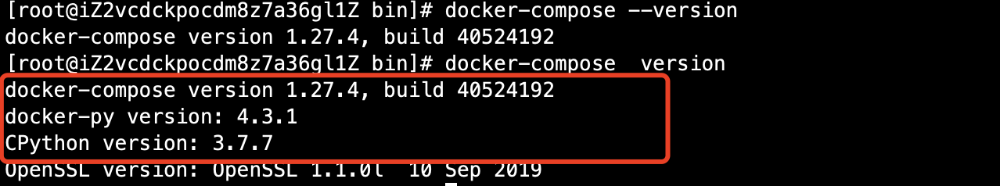
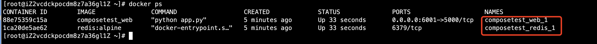
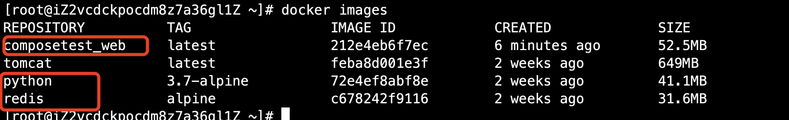
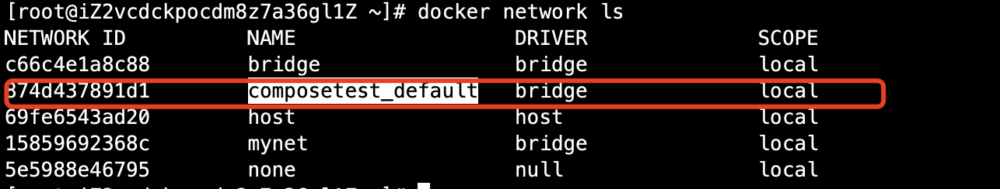

# 01-docker-compose介绍


## 简介

Docker

DockerFIle build run 手动操作，单个容器！

如果有大批量的微服务，100个、1000个！同时还存在依赖关系，那么手动一个一个部署启动是不是相当麻烦呢？

Docker Compose 来轻松高效的管理容器！定义运行多个容器！


官方介绍：


定义、运行多个容器。
YAML file 配置文件
single command 命令有哪些？


```
Compose is a tool for defining and running multi-container Docker applications. With Compose, you use a YAML file to configure your application’s services. Then, with a single command, you create and start all the services from your configuration. To learn more about all the features of Compose, see the list of features.

Compose works in all environments: production, staging, development, testing, as well as CI workflows. You can learn more about each case in Common Use Cases.

所有的环境都可以使用Compose

三步骤：
Using Compose is basically a three-step process:


1、Define your app’s environment with a Dockerfile so it can be reproduced anywhere.
    Dockerfile 保证我们的项目在任何地方可以运行

2、Define the services that make up your app in docker-compose.yml so they can be run together in an isolated environment.
    services 什么是服务
    docker-compose.yml这个文件怎么写

3、Run docker-compose up and Compose starts and runs your entire app.
    启动项目
```


作用：批量容器编排。


Compose 是Docker官方的开源项目，需要安装！

Dockerfile 让程序在任何地方运行！web服务、redis、mysql、nginx......多个容器！

compose

docker-compose.yml官方示例：
```
version: "3.9"  # optional since v1.27.0
services:
  web:
    build: .
    ports:
      - "5000:5000"
    volumes:
      - .:/code
      - logvolume01:/var/log
    links:
      - redis
  redis:
    image: redis
volumes:
  logvolume01: {}
```

docker-compose up 100个(任意)服务......


compose重要理念：

- 服务services，容器、应用（web、redis、mysql）
- 项目project   一组关联的容器。 博客、mysql、web、wp


##  compose 安装


安装官方文档：https://docs.docker.com/compose/install/


1、下载


```
sudo curl -L "https://github.com/docker/compose/releases/download/1.27.4/docker-compose-$(uname -s)-$(uname -m)" -o /usr/local/bin/docker-compose

```


2、赋予执行权限

```
[root@iZ2vcdckpocdm8z7a36gl1Z bin]# chmod +x docker-compose 
[root@iZ2vcdckpocdm8z7a36gl1Z bin]# ll
total 11936
-rwxr-xr-x 1 root root 12218968 Jan  7 09:50 docker-compose
```

查看版本信息，如下信息代表成功安装！




**体验**


地址：https://docs.docker.com/compose/gettingstarted/

python应用。计数器，redis


1、创建应用app.py
```
import time

import redis
from flask import Flask

app = Flask(__name__)
cache = redis.Redis(host='redis', port=6379)

def get_hit_count():
    retries = 5
    while True:
        try:
            return cache.incr('hits')
        except redis.exceptions.ConnectionError as exc:
            if retries == 0:
                raise exc
            retries -= 1
            time.sleep(0.5)

@app.route('/')
def hello():
    count = get_hit_count()
    return 'Hello World! I have been seen {} times.\n'.format(count)

if __name__ == "__main__":
    app.run(host="0.0.0.0",debug=True)
```

2、Dokcerfile 将应用打包为镜像
```
FROM python:3.7-alpine
ADD . /code
WORKDIR /code

RUN pip install -r requirements.txt
```
3、Docker-compose yaml文件 （定义整个服务、需要的环境。web、redis） 完整的上线服务

```
version: "3.8"
services:
  web:
    build: .
    ports:
      - "6001:5000"
  redis:
    image: "redis:alpine"
```

4、启动compose项目（docker-compose up）

```
当前文件目录下启动：
docker-compose up
```

5、然后浏览器访问





默认的服务名 文件名_服务名_num

多个服务器。集群。A、B _num副本数量

比如：服务redis服务===> 4个副本，未来都是集群状态，服务都不可能只有一个运行实例。 弹性





网络规则：




比如10个服务==> 项目 （项目中的内容都在同个网络下，域名访问）


如果在同一个网络下，我们可以直接通过域名访问！


停止： docker-compose  down  or crtl+c


docker-compose

以前都是单个docker run 容器，而docker-compose 通过编写yml配置文件、可以通过compose一键启动所有服务，停止所有服务！


**Docker小结**


- Docker镜像  run ==> 容器
- DockerFile构建镜像（服务打包）
- docker-compose 启动项目（编排、多个微服务/环境）
- docker 网络


## yml规则


docker-compose.yaml 核心！

https://docs.docker.com/compose/compose-file/compose-file-v3/

```
# 3层

version: "版本"  # 版本
services： # 服务
   服务1: web
       # 服务配置
       images
       build
       network
   服务2:redis
# 其它配置  网络/卷/全局规则
volumes
....
```

多写、多看别人多compose.yml文件


## 实战开源项目


1、创建一个博客项目目录

```
[root@iZ2vcdckpocdm8z7a36gl1Z ly]# mkdir my_wordpress
[root@iZ2vcdckpocdm8z7a36gl1Z ly]# cd my_wordpress/
```


2、编写docker-compose.yml配置文件

```
version: '3.3'

services:
   db:
     image: mysql:5.7
     volumes:
       - db_data:/var/lib/mysql
     restart: always
     environment:
       MYSQL_ROOT_PASSWORD: somewordpress
       MYSQL_DATABASE: wordpress
       MYSQL_USER: wordpress
       MYSQL_PASSWORD: wordpress

   wordpress:
     depends_on:
       - db
     image: wordpress:latest
     ports:
       - "6001:80"
     restart: always
     environment:
       WORDPRESS_DB_HOST: db:3306
       WORDPRESS_DB_USER: wordpress
       WORDPRESS_DB_PASSWORD: wordpress
       WORDPRESS_DB_NAME: wordpress
volumes:
    db_data: {}
```


3、启动  

```
[root@iZ2vcdckpocdm8z7a36gl1Z my_wordpress]# docker-compose up -d # -d后台运行

4、停止
[root@iZ2vcdckpocdm8z7a36gl1Z my_wordpress]# docker-compose down
Stopping my_wordpress_wordpress_1 ... done
Stopping my_wordpress_db_1        ... done
Removing my_wordpress_wordpress_1 ... done
Removing my_wordpress_db_1        ... done
Removing network my_wordpress_default

```


4、初始化博客


输入用户名进行注册，安装博客系统。安装成功如下：


登录成功后如下：
