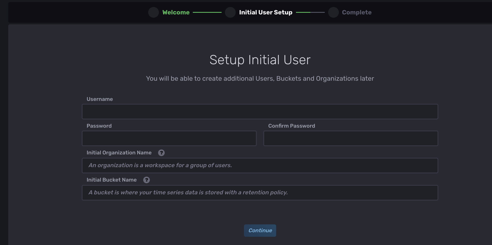
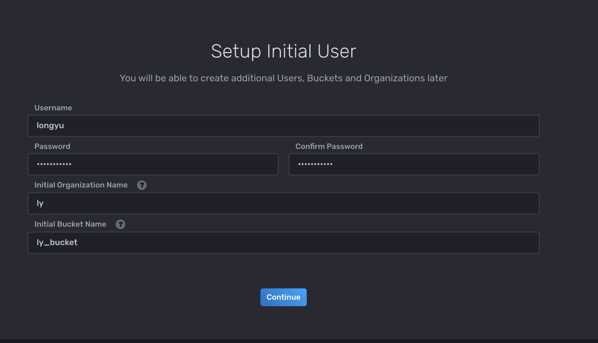

# 02-使用dokcer搭建influxdb+Grafana性能监控


监控数据的特点是采样频率高，每个数据点都带时间属性，对于写的速度和连续时间的查询速度要求高，因此传统的关系型数据库不适合，时序数据库（TSDB）就是我们的首选。InfluxDB是一个知名的时序数据库，也被广泛使用，它的单机版是免费的，企业级的集群版要收费。


Grafana是非常强大的监控数据可视化工具，而且开源。我见过各家平台对于数据采集和存储有各种不同的工具，但可视化基本上都用Grafana。


我们开始进行环境安装：

```
1、下载influxdb镜像
docker pull influxdb
  
2、下载grafana镜像
docker pull grafana
```


接下来，我们编写个Dokerfile来执行构建

```
version: "3.8"

services:
  influxdb:
    container_name: influxdb
    image: influxdb
    restart: always
    ports:
      - "8086:8086"
    volumes:
      - /mydata/monitor/influxdb:/var/lib/influxdb
    networks:
      - net-monitor

  grafana:
    container_name: grafana
    image: grafana/grafana
    restart: always
    ports:
      - "3000:3000"
    volumes:
      - /mydata/monitor/grafana:/var/lib/grafana
    networks:
      - net-monitor
    links:
      - influxdb

networks:
  net-monitor:
```

保存至linux服务器，文件名为：docker-compose-monitor.yml


设置挂载文件的目录权限：
```
 chmod 777 /mydata/monitor/influxdb
 chmod 777 /mydata/monitor/grafana
```


启动：

```
 docker-compose -f docker-compose-monitor.yml up -d
```

查看容器：docker ps


接下来测试访问：


influxdb如下：




influxdb初始化设置：

