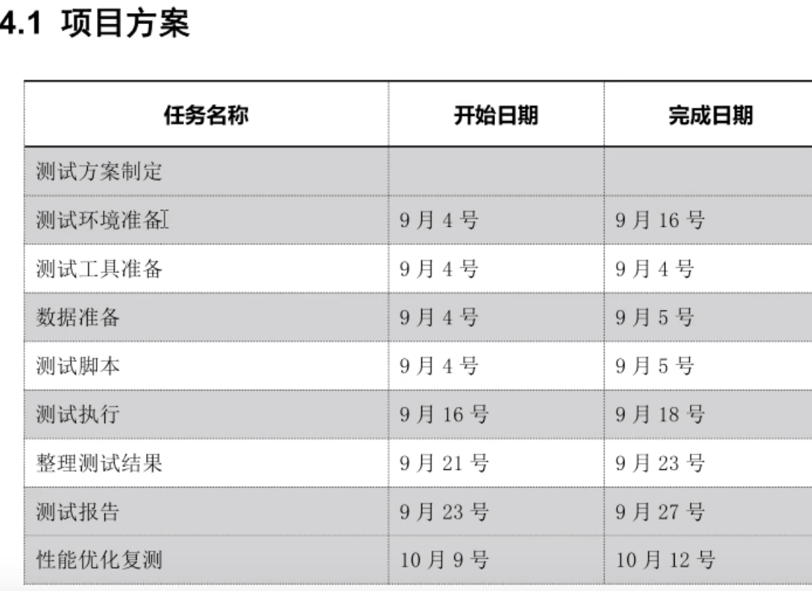

# 01-性能基础知识


## 概论


什么是性能测试？

**性能测试是指通过一系列技术手段去测试（发现）应用层或者服务层的性能问题。**

常规的技术手段包括：

-  并发测试
- 负载测试
- 压力测试
- 失效恢复测试

以上4种测试都属于性能测试的范畴，也是最常见的性能测试方法。性能测试的目的就是测试应用的性能各项指标是否满足需求！


测试应用的性能，主要测试的是应用层以及服务层。应用层包括：浏览器、客户端等，服务层包括：服务器、中间件等。


而常见的性能问题指以下问题：

- 响应时间问题
- tps问题
- 硬件资源问题
  - cpu
  - 内存
  - 磁盘
  - 网络


## 性能测试领域

性能测试领域主要包含以下4部分：

- 1、能力验证
   - 通过一系列技术手段去证明我的项目所声明的具有的能力，同时出具报告！

- 2、瓶颈分析
   - 针对能力验证过程中遇到的性能问题（响应时间、tps、硬件资源）做分析
   
- 3、性能调优
  - 针对瓶颈做有针对性的性能调优
  
- 4、容量规划


前3步是针对于既存的项目，步骤4是着眼于未来，是规划！


## 性能测试思路

1、测什么？ 

  - 确定业务场景
  - 确定测试方向
  - 确定业务（接口）范围
  - 确定业务逻辑（任何测试类型都不能脱离业务逻辑）
  - 确定测试方案
  - 整理测试用例

项目计划可以参考如下图：



以上工作都是为了明确测试目标！


2、怎么测？

- 明白性能指标含义
- 设计性能场景
- 确定并发用户数（数据库注册用户的10%做并发量）
- 设计测试脚本
  - 设计线程数
  - 设计迭代次数
  - 设计集合点
  - 设计业务逻辑
  - 设计数据监听
    - Active Threads Over Time
    - Transactions per Second - tps
    - Reponse Times Over Time 响应时间
    - Hits per Second --- rps


3、对不对？

- 分析数据结果 （找到性能瓶颈点）
- 评价性能准入（可以放宽） 258原理
- 优化性能数据 （针对已发现的性能问题做优化）
- 整理测试报告


## 性能测试指标


- 应用层
  - error（正确率需要优先保证，分析瓶颈的前提是控制错误率（准入标准可以放宽））
  - RPS （request persecond）每秒请求数  ，单线程请求是按照顺序执行的
  - TPS： transaction persecond 每秒处理数 （throughut：每秒响应完成的请求数）
  - rt： 响应时间 
    - latency: 响应时间总延迟
    - connect time： 网络连接
    - 服务处理时间（jmeter不可见）
    - latency=连接时间+服务处理时间

latency和connect差值大，表示时间消耗在了服务层
latency和connect差值很小，表示时间消耗在了网络层


- 服务层
 - CPU利用率（top -c）
   - 50% < us +sy < 80%， 小于50 cpu没有得到合理利用，大于80表示cpu可能过载
 - 内存利用率
   - free -m 查看内存使用情况
   - used + buff/cache  全部的内存使用
   - sync && echo "1"  > /proc/sys/vm/drop_caches 清除缓存


## 性能测试内型


- 并发测试

不存在绝对的并发，并发一定是有单位时间的，通常是秒
请求并发 （请求/s）
用户并发（vu/s）

- jmerter通过线程模拟并发用户
- 线程是一边启动一边调度请求
- 同步用户并发需要加集合点：Synchronizing Timer


- 负载测试

持续不断的增加压力，找到性能瓶颈点（阶梯加压线程组）
负载不断增加，tps应该持续增加，如果出现下降的趋势，表示瓶颈点已经到了
找到瓶颈点之后就可以停止测试


- 压力测试

维持一定的负载压力，持续运行一段时间（几小时或者几天）
稳定性压力测试：保持最大压力的80%，持续运行，目的是缓慢的找到内存泄露的问题
破坏性压力测试：以极限压力持续运行，目的就是让服务器快速的暴露异常


- 失效恢复测试 （服务器出现异常之后能不能迅速恢复）


关键名词：多快好省


- 响应时间
- 并发用户数
- 吞吐量
- 系统性能计数器
- 思考时间


多---并发量
快---延时、响应时间
好---稳定性（长时间运行）
省---资源使用率

思考时间


**响应时间**

对请求做出响应所需要对时间，是用户感知软件性能的主要指标。

响应时间包括：

- 1、用户客户端呈现时间
- 2、请求/响应数据网络传输时间
- 3、应用服务器处理时间
- 4、数据库系统处理时间


响应时间多少合理？

对于一个web系统，普遍接受的响应时间标准为2/5/8秒

- 2秒钟之内响应客户是非常好的
- 5秒钟之内响应客户是可以接受的
- 8秒钟是客户能接受的响应的上限


**并发用户数**

- 系统用户数

软件系统注册的用户数

- 在线用户数

某段时间内访问的用户数，这些用户数只是在线
不一定同时做某一件事情


- 并发用户数

某一个时间同时向软件系统提交请求的用户数
场景不一定是同一个


性能测试环境：
```
用户数据模拟：
如果要模拟真实的网络场景，可以在linux系统注入延时方法（tc命令）
数据库：数据库dump或数据脚本插入
```

**吞吐量**

性能测试：指单位时间内系统处理用户的请求数
从业务角度看： 吞吐量可以用：请求数/秒、页面数/秒、人数/天或处理业务数/小时等单位来衡量，用请求数/秒或页面数/秒来衡量
从网络角度看： 吞吐量可以用：字节/秒来衡量
对于交互式应用来说，吞吐量指标反映等是服务器承受等压力，他能够说明系统的负载能力

TPS：每秒事务数


吞吐率是指单位时间为秒！


**思考时间**

Think Time ：从业务角度来看，这个时间指用户进行操作时每个请求之间的时间间隔

在做性能测试时，为了模拟这样的时间间隔，引入了思考时间这个概念，来更加真实的模拟用户的操作。


