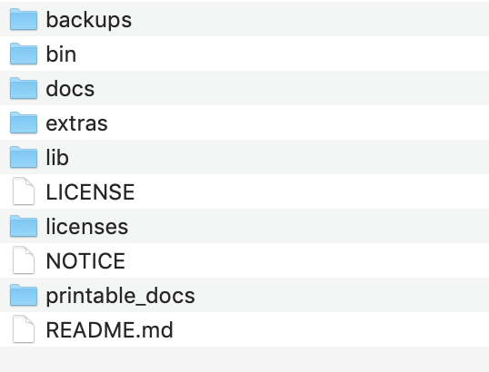
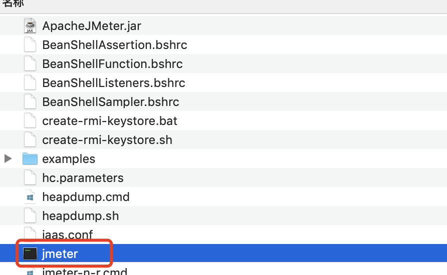
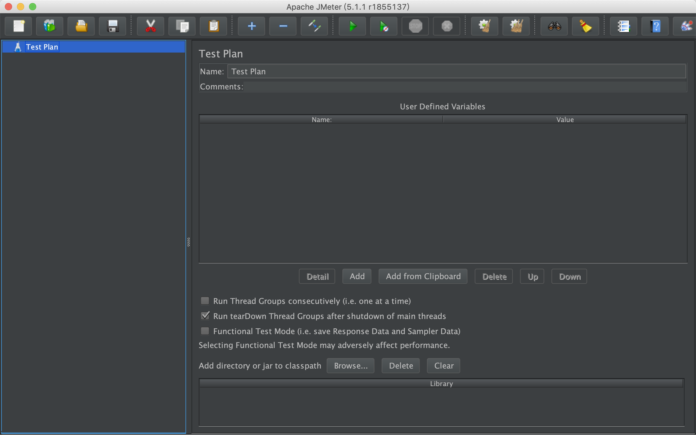
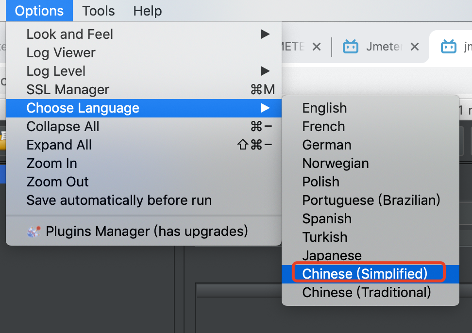
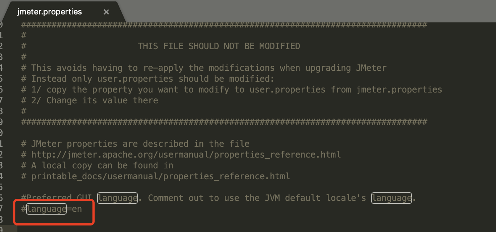
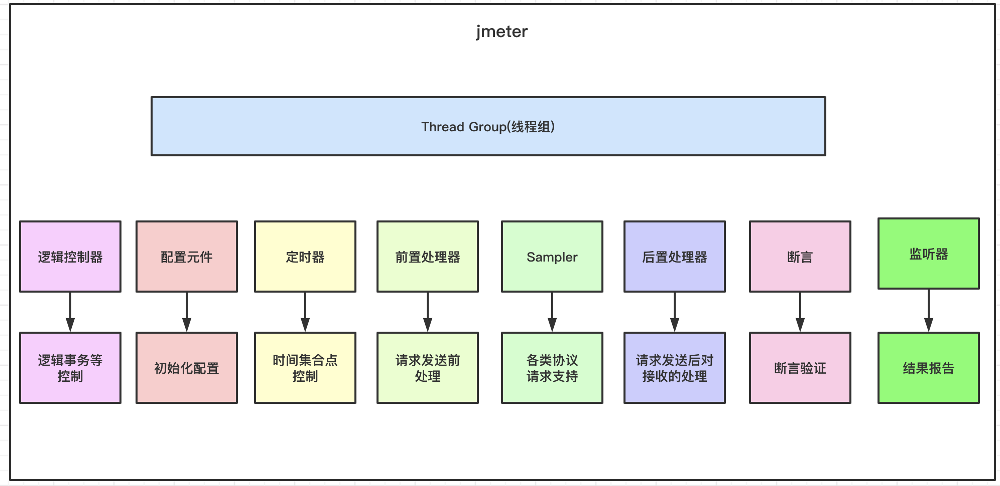

# 01-jmeter工具搭建与认知


jmeter是apache下的一款开源软件，是100%纯JAVA语言开发的，主要用于对应用的性能测试！


Jmeter功能具备如下：

- 能够加载和性能测试许多不同的应用程序/服务器/协议类型
  - WEB-HTTP，HTTPS（JAVA、NodeJS、PHP、ASP.NET）
  - SOAP/REST Webservices
  - FTP
  - Dadabase via JDBC
  - LDAP
  - JMS
  - MAIL
  - TCP
  - Native commands or shell scripts
  - Java Objects

- 功能齐全的Test IDE，可以创建测试计划，来进行构建和调试
- 支持命令模式和GUI模式，支持跨平台（linux、windows、mac）
- 完整且随时可以呈现的动态HTML报告
- 能够支持大多数流行的响应格式，HTML、JSON、XML或任何文本格式中提取数据的能力，轻松实现关联
- 完整的多线程框架，允许通过多个线程进行并发采样，并通过单独的线程同时对不同的函数进行采样
- 高度可扩展，可以自定义插件
- 可以持续集成


官网地址：https://jmeter.apache.org/


## 安装

安装非常简单，只需要2步骤：

1、首先进入官网下载：https://jmeter.apache.org/download_jmeter.cgi

2、本地解压即可

解压完成的目录如下：




我们来了解下每个目录的作用：

- bin目录：核心可执行文件，包含配置
- extras目录：插件扩展包
- lib目录： 核心的依赖包，包含jmeter用到的各种基础库和插件
- docs：官方本地文档目录
- backups： 包含jmeter对测试计划的自动备份保存
- licenses: 包含 non-ASF软件的许可证
- printtable_docs： 可打印版本文档目录


我们需要重点关注bin目录下几个文件：

- jmeter.propeties: jmeter核心配置文件，各种配置基本在这完成
- log4j.conf:    Jmeter 日志配置管理
- jmeter.log：  Jmeter 运行日志记录，什么输出信息、警告、报错都在这里进行记录
- jmeter:         mac下jmeter启动文件 ,windows下使用jmeter.bat，linux下使用jmeter.sh
- shutdown.sh:    mac和linux下关闭jmeter，windows下shutdown.cmd
- stoptest.sh:   mac和linux下jmeter测试停止文件
- jmeterserver：服务器模式启动文件，用于分布式压测

注意：每一个.cmd 文件都对应一个.sh 文件，.sh 是 linux 下的对应功能的文件，mac也可以执行！


jmeter启动：

直接双击bin目录下的执行文件jmeter即可：



启动成功界面如下：




语言设置：

菜单栏---Options----Choose Language---选择简体中文




注意：这个设置只会在当前使用生效，一旦jmeter重启就不会生效！

如果要永久生效，需要在jmeter.properties进行配置。




更改配置如下：

```
默认language=en
改为language=zh_CN
```
保存即可！


jmeter工具有很多组件，我们先总体认识以下，后续再一一学习：

